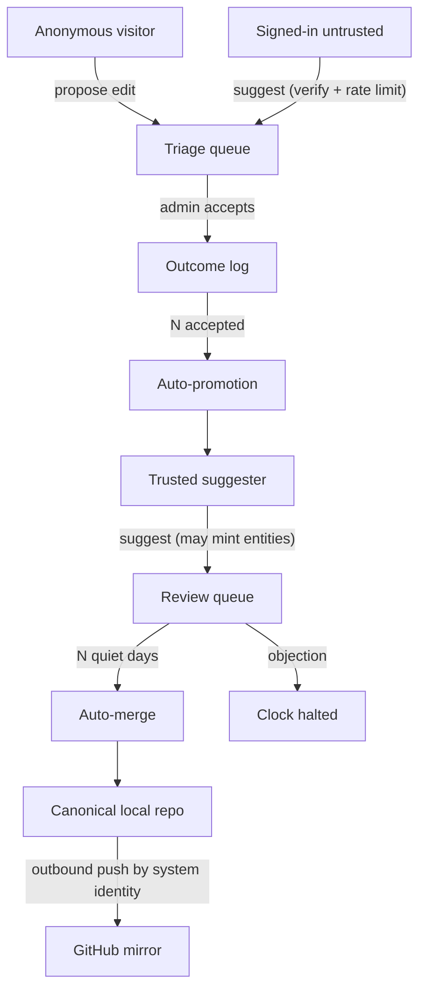
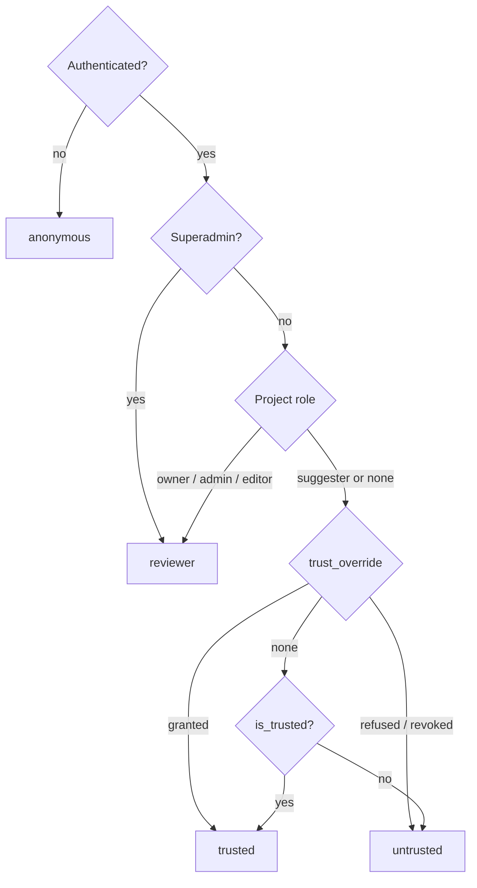
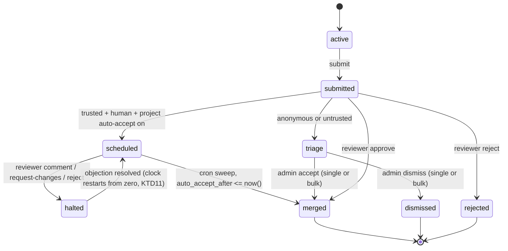
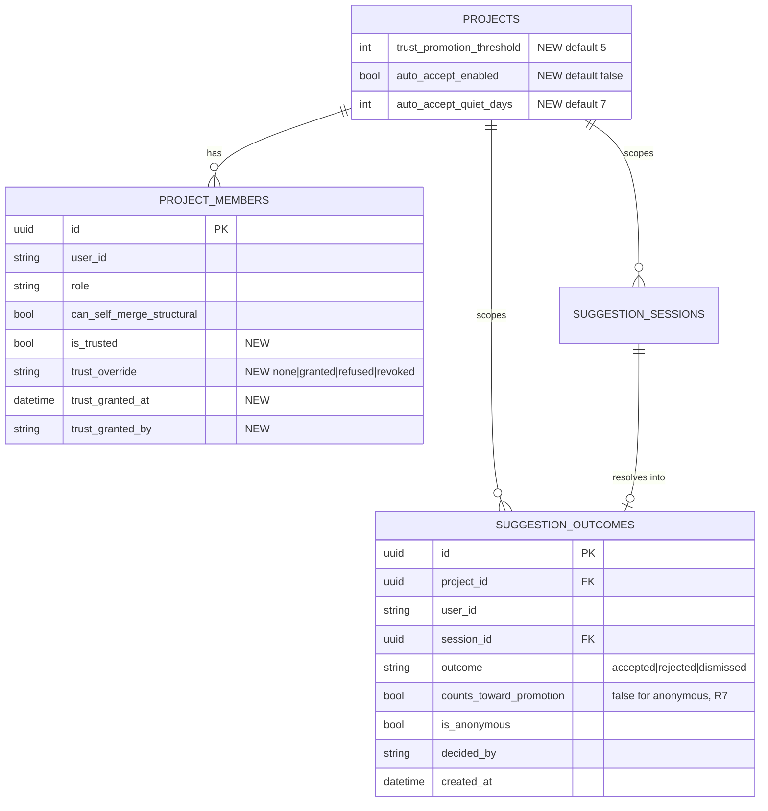
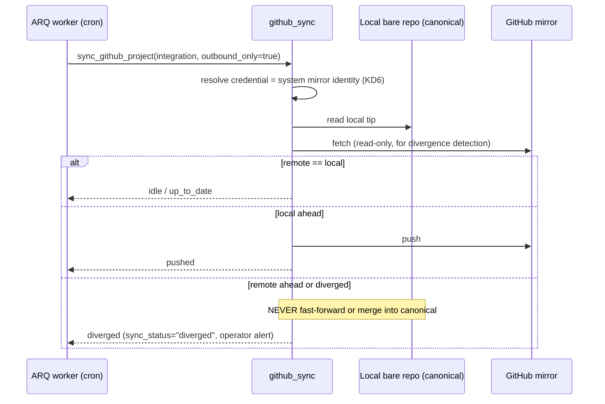

# Contribution Trust Ladder & Identity Pipeline - Plan

> **Two-repo plan.** Paths prefixed `api:` are repo-relative to **ontokit-api**; all
> other paths are repo-relative to **ontokit-web** (this repo). No absolute paths.

## Goal Capsule

- **Objective:** Let any Catholic layperson — from parish volunteer to the Holy See — suggest ontology edits with zero GitHub knowledge, while a per-project trust ladder keeps the review burden on admins bounded and a single system-owned identity keeps the GitHub mirror consistent.
- **Product authority:** Damien Riehl (fork-side build); Fr. John D'Orazio reviews upstream. The surrounding resurrection backlog (see How This Work Fits Together) is context, not active scope.
- **Open blockers:** None for planning. Two operational prerequisites before ship: a system GitHub machine identity with push rights to the mirror repos, and Zitadel admin access to configure Google/GitHub federation.

**Product Contract preservation:** Product Contract unchanged. No R/A/F/AE ID was
added, split, renumbered, or reworded. Everything below the Product Contract is new
HOW-level content added by this planning pass.

---

## Product Contract

### Summary

A three-rung trust ladder for suggesting ontology edits — anonymous, signed-in, trusted — where trust is earned per project through an append-only suggestion-outcome log, trusted suggestions auto-merge after a configurable quiet period, and the GitHub mirror is pushed outbound-only by one system-owned identity with contributors credited by display name and noreply alias.

### Problem Frame

OntoKit's suggestion pipeline already commits to a local bare git repository and treats GitHub as an optional mirror, but the mirror runs on per-user GitHub Personal Access Tokens — a credential lay contributors don't have and shouldn't need. Meanwhile the front door is wide open: any authenticated user (and, via the queued anonymous-suggestions feature, anyone at all) can suggest, so at the intended scale — 100–200 contributors initially, headroom for 10,000+ across the global Church — admins would wade through unbounded, undifferentiated submissions, and bots could reach the same queue as vetted contributors. There is no notion of earned trust, no auto-accept relief for reviewers, and mirrored commits expose contributors' real email addresses permanently.

### Key Decisions

- KD1. **Keep the anonymous rung** rather than requiring login to suggest — preserves the shipped-and-hardened anonymous-suggestions work (queued as PR-7) and the lowest possible barrier; sign-in becomes an upgrade, not a gate. Governs R1, R4.
- KD2. **Trust is per-project**, not global — matches the existing project-membership role model and stays safe if the instance ever hosts projects with different owners. Governs R4, R6.
- KD3. **Append-only outcome log over bare counters** — nearly the same effort, satisfies auto-promotion, and lets a future contributor-standing UI arrive without a schema migration or backfill. Governs R5, R6.
- KD4. **Entity minting requires trusted status** — new-concept spam is the costliest to review; edits to existing entities are self-anchoring and easy to judge. Resolves the open ledger question about anonymous-mode entity-minting affordances (docs/UPSTREAM-TRACKING.md). Governs R8.
- KD5. **Auto-accept applies to trusted human suggesters only** — LLM-generated suggestions remain always-human-reviewed, preserving the standing non-goal in the v0.4.0 GSD requirements ("human curation is the entire point"). Governs R11, R12, R13.
- KD6. **One system-owned mirror identity; per-user PATs retire; mirror is outbound-only** — per-user attribution survives via git author-email matching on GitHub, push history becomes consistent, and outbound-only closes the review-bypass hole where changes merged on GitHub would sync back around the suggestion pipeline. Governs R3, R15, R16.
- KD7. **Zitadel remains the sole auth layer; Google and GitHub sign-in arrive as federated IdPs inside Zitadel** — configuration, not new NextAuth providers; one token-validation path stays intact. Governs R2.

### Actors

- A1. **Anonymous visitor** — browses freely; may propose edits without an account.
- A2. **Signed-in contributor (untrusted)** — has an account via Zitadel/Google/GitHub sign-in; persistent, promotable identity.
- A3. **Trusted suggester** — per-project grant; full suggestion powers and auto-accept eligibility.
- A4. **Project admin / reviewer** — grants and revokes trust, works the queues; Fr. John's role upstream.
- A5. **System mirror identity** — machine account (e.g. `catholicos_commits`) that pushes the GitHub mirror.
- A6. **LLM suggestion pipeline** — existing generator; its output always requires human review (unchanged).

### Requirements

**Identity & sign-in**

- R1. Anyone can browse public projects and propose edits to existing entities without an account, within the existing anonymous protections (public projects only, per-IP session rate limit, honeypot).
- R2. Users sign in through Zitadel, with Google and GitHub offered as federated identity providers; no contributor is ever required to hold a GitHub account.
- R3. Per-user GitHub PAT storage and its settings UI are retired; all GitHub mirror operations authenticate as the system mirror identity (A5).

**Trust ladder & promotion**

- R4. Suggestion privileges follow three rungs — anonymous (A1), signed-in untrusted (A2), trusted (A3) — with trusted recorded as a per-project grant on the project membership.
- R5. Every suggestion outcome (accepted, rejected, dismissed) is recorded in an append-only per-user, per-project outcome log.
- R6. A signed-in contributor is auto-promoted to trusted after N accepted suggestions on that project (N configurable per project); admins can grant, refuse, or revoke trusted status at any time, and admin action overrides auto-promotion.
- R7. Anonymous contributions are credited but never counted toward promotion; promotion requires an account.

**Suggestion powers & triage**

- R8. Anonymous and untrusted contributors can propose edits to existing entities only; creating new entities or classes requires trusted status.
- R9. Suggestions from anonymous and untrusted contributors land in a triage queue, separate from the trusted review queue, with bulk skim, dismiss, and accept actions.
- R10. An untrusted contributor's first suggestion requires passing a human-verification challenge, and untrusted submissions are rate-limited per account.

**Auto-accept**

- R11. A trusted suggester's suggestion PR merges automatically after N days with no objection (N configurable per project); anonymous and untrusted suggestions never auto-accept.
- R12. Any reviewer comment or rejection halts the auto-accept clock until the objection is resolved.
- R13. LLM-generated suggestions are never auto-accepted, regardless of the submitting user's tier.

**Attribution & mirror**

- R14. Commits are authored with the contributor's display name and a synthetic noreply alias by default; real identity stays joinable server-side.
- R15. A contributor may opt in to authoring commits with a verified email address (e.g. their GitHub noreply address) so mirrored commits attribute natively to their GitHub account.
- R16. The GitHub mirror is outbound-only: the system identity pushes canonical history out, and GitHub-side changes never enter the canonical repository.

**Scale & abuse controls**

- R17. Rate limiting, promotion counting, and queue state function correctly at 10,000+ registered users across multiple app instances (shared infrastructure, not per-process state).

### Key Flows

- F1. **Anonymous suggestion**
  - **Trigger:** A1 proposes an edit to an existing entity on a public project.
  - **Steps:** Existing anonymous session protections apply; suggestion lands in the triage queue; admin accepts or dismisses; outcome recorded; commit authored with the credit info the contributor supplied, or the anonymous fallback.
  - **Covers:** R1, R7, R8, R9.
- F2. **Climbing the ladder**
  - **Trigger:** A2 signs in with Google and submits a first suggestion.
  - **Steps:** Human-verification challenge on first suggestion; suggestion enters triage; each accepted outcome appends to the log; on the Nth acceptance the contributor is auto-promoted to trusted and notified; an admin could equally have granted trust directly at any point.
  - **Covers:** R2, R5, R6, R9, R10.
- F3. **Trusted suggestion and auto-accept**
  - **Trigger:** A3 submits a suggestion (including a new entity) on a project with auto-accept configured at N days.
  - **Steps:** Suggestion PR enters the trusted review queue; with no reviewer action for N days it auto-merges; any comment or rejection halts the clock until resolved.
  - **Covers:** R8, R11, R12.
- F4. **Mirror push**
  - **Trigger:** Any merge to the canonical local repository of a GitHub-connected project.
  - **Steps:** The system identity pushes outbound; GitHub attributes each commit by author email — noreply alias for default contributors, native account attribution for opted-in power users.
  - **Covers:** R3, R14, R15, R16.

### Acceptance Examples

- AE1. **Covers R11, R12.** Given a trusted suggester's PR at day 3 of a 7-day window, when a reviewer comments, then auto-merge is halted; when the objection is later resolved, the quiet-period clock restarts.
- AE2. **Covers R8.** Given an untrusted contributor in the editor, when they attempt to create a new class, then the action is unavailable with an explanation of how trust is earned, and propose-edit remains available.
- AE3. **Covers R5, R6.** Given a project with promotion threshold N=5 and a contributor with 4 accepted suggestions, when their 5th suggestion is accepted, then they are promoted to trusted and notified.
- AE4. **Covers R7, R11.** Given an anonymous suggestion sitting unreviewed for longer than any project's auto-accept window, then it never merges without explicit admin action.
- AE5. **Covers R13.** Given a trusted suggester who submits an LLM-generated suggestion, then that suggestion requires human review regardless of the N-day window.
- AE6. **Covers R14, R15.** Given a default contributor and an opted-in power user each with a merged suggestion, when the mirror pushes, then GitHub shows the first as "Display Name <noreply-alias>" with no real email exposed, and attributes the second to the power user's GitHub account.

### Success Criteria

- A lay contributor with no technical background goes from landing page to a submitted suggestion unaided, with no GitHub concept ever surfaced.
- Fr. John reviews and merges an upstream batch without needing to ask who a contributor is — identity, tier, and provenance are self-evident on each suggestion.
- Triage effort stays bounded: junk is dismissible in seconds per item via bulk actions, and trusted contributors' work drains automatically after the quiet period.
- The design holds at 100–200 contributors and degrades gracefully toward 10,000+.

### Scope Boundaries

**Deferred for later (named follow-on plans — capture, do not lose):**

- **Contributor standing UI** — contributor-facing progress ("3 accepted — 2 more to trusted") and public credit pages, built on the R5 outcome log.
- **Reviewer cockpit** — bulk-review tooling beyond the basic triage queue, absorbing the shard/reviewer subsystem design (docs/plans/2026-07-10-008-feat-shard-review-subsystem-design.md), whose five backing endpoints remain unbuilt.
- **GitHub-side contributions** — power users and their LLM agents opening PRs against the GitHub mirror, ingested back as suggestions mapped to an OntoKit user and routed through this same trust pipeline (never merged directly).

**Non-goals:**

- No change to the local-PR model or the mirror's best-effort architecture — only the mirror's credential and direction change.
- No auto-accept of LLM-generated suggestions, at any tier, ever (standing v0.4.0 non-goal preserved).
- No removal or weakening of the existing anonymous protections shipped in PR-7.

### Dependencies & Assumptions

- Builds atop the anonymous-suggestions machinery and the 8-PR upstream queue; assumes those PRs land in whatever base branch this feature builds on before or alongside it.
- Zitadel administrative access is available to add Google and GitHub as federated IdPs (configuration, no code).
- A GitHub machine account (e.g. `catholicos_commits`) can be created with push rights to the mirror repos; for CatholicOS org repos this needs Fr. John or an org owner.
- Redis (already present for the background worker) is available as the shared store for rate limits and clocks.
- The existing manual `can_self_merge_structural` membership flag is the closest current trust primitive; the trusted tier generalizes it rather than conflicting with it.

### Outstanding Questions

All seven planning-deferred questions are now **resolved** — see Key Technical Decisions
KTD8–KTD14. No product blockers remain.

<!-- ce-section: work-relationships -->
### How This Work Fits Together

This plan owns the contribution trust ladder and identity pipeline only. The breakdown below is the current understanding of the surrounding resurrected backlog, not a committed roadmap; later plans may revise, split, merge, or discard items.

- **Follow-on plans seeded by this work:**
  - Contributor standing UI — depends on this plan's outcome log (R5).
  - Reviewer cockpit / shard-review subsystem — shares the triage queue as its seed; still to decide: revival scope of docs/plans/2026-07-10-008-feat-shard-review-subsystem-design.md's five unbuilt endpoints.
  - GitHub-side contributions ingestion — depends on the outbound-only mirror decision (KD6); enables power users and LLM agents.
- **Resurrected backlog (independent of this plan unless noted):**
  - 8-PR upstream queue retarget to CatholicOS — blocked on Fr. John's availability; this plan depends on those PRs' contents being in its base branch.
  - Phase 17 (graph as entity-scoped tab) — planned under GSD, never executed; converts to a CE plan (improving the plan where warranted) before execution. All new work runs on CE; GSD is retired for new plans.
  - Housekeeping fixes (4) — startup async-safety, lint hardening, worker Redis-auth password bug, web lockfile reconcile; can proceed independently, any time.
  - Ontology atomization — blocked awaiting colleague review since 2026-03-04; unrelated to this plan.
  - Human UAT checklist (16 items, v0.4.0) and blocked authed-E2E / paid-LLM-eval verifications — can proceed independently once the DEV environment has working OIDC and a seeded project.
  - `feat/bcp47-language-picker` branch, api issue #99 consolidation branch, and review of Fr. John's fork branches — independent, unscheduled.

### Sources

- docs/UPSTREAM-TRACKING.md — PR queue state, hardening-pass ledger, the open anonymous-affordances question resolved by KD4.
- docs/plans/2026-07-10-008-feat-shard-review-subsystem-design.md — deferred reviewer-tools design absorbed into the follow-on cockpit plan.
- `dev:.planning/REQUIREMENTS.md` (line 143) — the standing no-auto-accept-of-LLM-suggestions non-goal preserved by KD5/R13.
- ontokit-web: `auth.ts` (Zitadel-only provider), `lib/hooks/useProject.ts` (implicit-suggester logic), `app/settings/page.tsx` (PAT UI to retire).
- ontokit-api: `ontokit/git/bare_repository.py` (local bare repo, commit identity), `ontokit/services/suggestion_service.py` (anonymous sessions, rate limits, auto-submit cron), `ontokit/services/github_sync.py` (mirror sync to become outbound-only), `ontokit/models/user_github_token.py` (PAT storage to retire), `ontokit/models/project.py` (membership roles, `can_self_merge_structural`).

---

## Planning Contract

### Branching & landing

- Base both repos on `upstream-queue/anonymous-suggestions` (top of the 8-PR stack) and work on `feat/trust-ladder`. This is KTD14; it keeps the stack coherent and means the trust ladder rebases with the stack rather than fighting it.
- Land as a **cross-linked web+api pair**, stacked on PR-7, following the ledger convention in docs/UPSTREAM-TRACKING.md. Nothing is pushed or retargeted to CatholicOS without Damien's explicit go-ahead.
- The api migration's `down_revision` is `t8u9v0w1x2y3` (the anonymous-suggestion-fields migration, currently the single Alembic head). Keep it a single head.

### Key Technical Decisions

- KTD1. **Trust lives on `ProjectMember` as an explicit tri-state override plus a derived tier**, not a bare boolean. `trust_override` is one of `none | granted | refused | revoked`; `is_trusted` is the materialized effective state. Auto-promotion may only flip `is_trusted` when `trust_override == "none"` — so an admin `refused` or `revoked` decision is permanently sticky and a re-earned threshold cannot silently re-promote. Instantiates KD2, governs R4, R6.
- KTD2. **The outcome log is a standalone append-only table** (`suggestion_outcomes`), never updated or deleted, with a partial index on `(project_id, user_id)` filtered to `outcome = 'accepted'` for the promotion count. Instantiates KD3, governs R5, R6. Anonymous outcomes are recorded with `counts_toward_promotion = false` so R7's "credited but not counted" is a data property, not a query-site convention that can drift.
- KTD3. **Tier is computed by one service function, `TrustService.resolve_tier()`**, returning `anonymous | untrusted | trusted | reviewer`. Every gate (entity minting, auto-accept eligibility, triage routing, rate limits) reads that one function. No route re-derives tier from roles. Governs R4, R8, R9, R10, R11.
- KTD4. **Existing project roles outrank the ladder.** `owner`, `admin`, `editor` and superadmins resolve to `reviewer`, which is above `trusted`; the ladder governs `suggester`/no-role members only. This is what keeps the feature backward-compatible with every existing project and stops the ladder from demoting Fr. John. Governs R4.
- KTD5. **`can_self_merge_structural` is generalized, not duplicated.** Trusted status implies it for suggestion PRs; the existing flag stays as an independent editor-level grant. No migration of existing flag values — a project's existing grants keep working. Honors the Dependencies note.
- KTD6. **Auto-accept is a scheduled column plus a worker cron, not a timer.** `SuggestionSession.auto_accept_after` is a nullable timestamp set at submit time; a cron sweeps for `auto_accept_after <= now()` and merges. Halting is `auto_accept_after = NULL` + `auto_accept_halted_at = now()`; resuming re-computes `now() + quiet_days`. Stateless, multi-instance-safe (atomic claim UPDATE, same pattern as `auto_submit_stale_sessions`), and survives restarts. Instantiates KD5, governs R11, R12, R17.
- KTD7. **Mirror direction is a hard service-level gate, not a caller convention.** `github_sync.sync_github_project()` gains an outbound-only path that never fast-forwards local from remote and never merges remote into local; when the remote has diverged it reports `status="diverged"` and leaves the canonical repo untouched. Instantiates KD6, governs R16.
- KTD8. **Promotion threshold default = 5 accepted; auto-accept quiet period default = 7 days; auto-accept defaults OFF per project.** Off-by-default is the conservative reading of the non-goal "no weakening of existing protections" — a project owner opts in deliberately. Resolves Outstanding Question 1; governs R6, R11.
- KTD9. **Noreply alias format: `<slug>-<8 hex>@<noreply-domain>`,** where `<slug>` is a lowercased, ASCII-folded, 32-char-capped slug of the display name, the 8 hex chars are the first 8 of `sha256(user_id + secret_key)` (stable per user, non-reversible, collision-safe across same-named contributors), and `<noreply-domain>` is the new `commit_noreply_domain` setting defaulting to `users.noreply.ontokit.local`. Resolves Outstanding Question 2; governs R14.
- KTD10. **Human verification is a provider protocol with a null default.** `VerificationProvider` has two implementations: `NullVerificationProvider` (default — always passes, so no environment is broken by this plan) and `TurnstileVerificationProvider` (Cloudflare Turnstile siteverify over the existing SSRF-hardened httpx client). Selected by the `verification_provider` setting. **No new dependency.** Resolves Outstanding Question 3; governs R10.
- KTD11. **A resolved objection restarts the quiet clock from zero.** This is AE1's stated assumption and the safer reading — a reviewer who objected gets a full fresh window to see the revision. Resolves Outstanding Question 4; governs R12.
- KTD12. **The anonymous post-submit account nudge is web-only copy plus a sign-in CTA** on the existing anonymous submit-success state. No backend surface. Resolves Outstanding Question 5; governs R7.
- KTD13. **The triage queue is a `tier` filter on the existing pending-suggestions endpoint plus a bulk-action endpoint,** rendered as a segmented control on the existing suggestions review page — not a second page. Cheapest thing that satisfies R9 and leaves the reviewer-cockpit follow-on free to replace it. Resolves Outstanding Question 6; governs R9.
- KTD14. **Build on `upstream-queue/anonymous-suggestions` in both repos** rather than waiting for retarget. Resolves Outstanding Question 7.
- KTD15. **Per-user PAT storage is retired by removing its write path first, keeping the read path for one release.** The `POST/DELETE /users/me/github-token` endpoints and the settings UI go; the model and the decrypt-on-read helper stay until a follow-up drops the table, so an in-flight deployment with stored tokens does not 500. Governs R3.

### Assumptions

- The Zitadel Google/GitHub federated-IdP configuration (R2, KD7) is **operations work, not code** — `auth.ts` already speaks Zitadel OIDC and needs no change. This plan carries it as an Operational Note and does not implement it.
- `SECRET_KEY` is set to a real value in every deployed environment (already hard-enforced by `api:ontokit/services/llm/crypto.py`), so KTD9's hash salt is safe.
- The existing anonymous per-IP rate limit (5 sessions/hour, DB-backed, fail-closed) remains the anonymous-rung control; R10's per-account limit is a *new, separate* Redis limit for the untrusted rung.

---

## High-Level Technical Design

### Tier resolution

### Suggestion lifecycle with the auto-accept clock

Every terminal transition (`merged`, `rejected`, `dismissed`) appends exactly one row
to `suggestion_outcomes`; the promotion evaluation runs immediately after an
`accepted` append.

### Outcome log and membership

### Mirror direction (outbound-only)

---

## Implementation Units

### Phase A — Trust data model and core service (api)

#### U1. Trust schema and migration

- **Goal:** Land every column and table the ladder needs, in one reversible migration, with sane defaults that leave existing deployments behaviorally unchanged.
- **Requirements:** R4, R5, R6, R11, R13; KTD1, KTD2, KTD6, KTD8.
- **Dependencies:** none.
- **Files:**
  - `api:ontokit/models/project.py` — add `Project.trust_promotion_threshold` (int, default 5), `Project.auto_accept_enabled` (bool, default false), `Project.auto_accept_quiet_days` (int, default 7); add `ProjectMember.is_trusted` (bool, default false), `trust_override` (str(20), default `"none"`), `trust_granted_at` (tz datetime, nullable), `trust_granted_by` (str(255), nullable).
  - `api:ontokit/models/suggestion_outcome.py` — **new**: `SuggestionOutcome` model and `SuggestionOutcomeType` StrEnum (`ACCEPTED`, `REJECTED`, `DISMISSED`).
  - `api:ontokit/models/suggestion_session.py` — add `is_llm_generated` (bool, default false), `auto_accept_after` (tz datetime, nullable), `auto_accept_halted_at` (tz datetime, nullable), `verification_passed` (bool, default false).
  - `api:ontokit/models/__init__.py` — export the new model.
  - `api:alembic/versions/w0x1y2z3a4b5_add_trust_ladder.py` — **new**, `down_revision = "t8u9v0w1x2y3"`.
  - `api:tests/unit/test_trust_models.py` — **new**.
- **Approach:**
  1. Every new column is nullable-or-defaulted with a `server_default`, so the migration is safe on a populated table and existing rows land on `untrusted` / auto-accept-off.
  2. `suggestion_outcomes` gets a composite index `(project_id, user_id)` and a **partial** index on the same pair `WHERE outcome = 'accepted' AND counts_toward_promotion` — the promotion count is the only hot query (KTD2).
  3. `session_id` on the outcome row is a nullable FK with `ON DELETE SET NULL`: the log is append-only and must outlive session cleanup.
  4. Do not backfill or migrate `can_self_merge_structural` (KTD5).
- **Patterns to follow:** `api:alembic/versions/t8u9v0w1x2y3_add_anonymous_suggestion_fields.py` for the additive-columns-with-server-default shape; `api:ontokit/models/suggestion_session.py` for the `StrEnum` + `Mapped[...]` model style.
- **Test scenarios:**
  - A `ProjectMember` created with no trust arguments has `is_trusted is False` and `trust_override == "none"`.
  - A `Project` created with no trust arguments has threshold 5, auto-accept disabled, quiet days 7 (pins KTD8's defaults so a later edit is a visible test change).
  - `SuggestionOutcomeType` exposes exactly `accepted`, `rejected`, `dismissed` — a fourth value is a schema change, not a typo.
  - `SuggestionOutcome` defaults `counts_toward_promotion` to `True` and `is_anonymous` to `False`.
  - The migration module declares `down_revision == "t8u9v0w1x2y3"` and both `upgrade` and `downgrade` are defined (single-head + reversibility pin).
- **Verification:** `alembic heads` still reports exactly one head; model import graph clean; mypy strict passes on the new module.

#### U2. TrustService — tier resolution, outcome log, promotion

- **Goal:** One service owning every trust question, so no route re-derives tier or promotion state.
- **Requirements:** R4, R5, R6, R7; KTD1, KTD2, KTD3, KTD4.
- **Dependencies:** U1.
- **Files:**
  - `api:ontokit/services/trust_service.py` — **new**.
  - `api:ontokit/schemas/trust.py` — **new**: `TrustTier` StrEnum, `MemberTrustResponse`, `MemberTrustUpdate`, `ProjectTrustSettings`, `TrustStatusResponse`.
  - `api:tests/unit/test_trust_service.py` — **new**.
- **Approach:**
  1. `resolve_tier(project, user)` implements the HTD tier-resolution flowchart exactly: superadmin/owner/admin/editor → `reviewer`; else the `trust_override` tri-state; else `is_trusted`; unauthenticated → `anonymous`.
  2. `record_outcome(project_id, session, outcome, decided_by)` appends one row. It sets `counts_toward_promotion = not session.is_anonymous` (R7 as a data property, KTD2) and returns the appended row.
  3. `evaluate_promotion(project_id, user_id)` counts accepted+counting rows, compares against `project.trust_promotion_threshold`, and promotes **only when `trust_override == "none"`** (KTD1). Returns a bool so callers can notify.
  4. `set_trust_override(project_id, target_user_id, override, actor)` is the admin path: `granted` sets `is_trusted=True`, `refused`/`revoked` set `is_trusted=False`, `none` clears the override and immediately re-evaluates auto-promotion. Logs a metadata-only audit line mirroring `update_member_flags`.
  5. `is_auto_accept_eligible(project, session, tier)` → `tier == trusted and project.auto_accept_enabled and not session.is_anonymous and not session.is_llm_generated` (KD5/R13 in one place).
- **Patterns to follow:** `api:ontokit/services/suggestion_service.py` for the `AsyncSession`-constructor + `get_*_service(db)` factory shape; `api:ontokit/api/routes/llm.py::update_member_flags` for the privilege-change audit log line.
- **Test scenarios:**
  - Superadmin with no membership resolves to `reviewer`.
  - `owner`, `admin`, `editor` each resolve to `reviewer` even with `is_trusted=False` (pins KTD4 — the ladder never demotes staff).
  - A `suggester` with `is_trusted=True` resolves to `trusted`; with `is_trusted=False` resolves to `untrusted`.
  - A member with `is_trusted=True` **and** `trust_override="revoked"` resolves to `untrusted` — the override wins.
  - `None` user resolves to `anonymous`.
  - **Covers AE3.** Threshold 5, four prior accepted outcomes: recording the fifth accepted outcome promotes the member and `evaluate_promotion` returns `True`.
  - Threshold 5, four accepted: recording a *rejected* outcome does not promote.
  - **Covers R7.** Five accepted outcomes from anonymous sessions never promote — each row carries `counts_toward_promotion=False`.
  - A member with `trust_override="refused"` who reaches the threshold is **not** promoted (KTD1 stickiness).
  - `set_trust_override(..., "none")` on a member who already has threshold-many accepted outcomes promotes them immediately.
  - `set_trust_override` writes `trust_granted_at` and `trust_granted_by` on grant and emits the audit log line.
  - `is_auto_accept_eligible` returns `False` for a trusted human on a project with `auto_accept_enabled=False`.
  - **Covers AE5.** `is_auto_accept_eligible` returns `False` for a trusted human when `session.is_llm_generated` is `True`.
  - **Covers AE4.** `is_auto_accept_eligible` returns `False` for an anonymous session regardless of project settings.
- **Verification:** every branch of the tier flowchart has a test; ruff + mypy strict clean.

#### U3. Wire outcome recording and promotion notification into review paths

- **Goal:** Make every existing terminal review action append to the log and, on acceptance, run promotion.
- **Requirements:** R5, R6, R7.
- **Dependencies:** U2.
- **Files:**
  - `api:ontokit/services/suggestion_service.py` — `approve()`, `reject()`, plus the new `dismiss()` from U5.
  - `api:ontokit/services/notification_service.py` — no signature change; call `create_notification` for the promoted user.
  - `api:tests/unit/test_suggestion_trust_integration.py` — **new**.
- **Approach:**
  1. `approve()` records `accepted`, then calls `evaluate_promotion`; on promotion, creates a `trust_promoted` notification addressed to the contributor.
  2. `reject()` records `rejected`. `dismiss()` (U5) records `dismissed`.
  3. Outcome recording happens in the **same transaction** as the status change — a merged suggestion that failed to log its outcome would silently break promotion counting.
  4. Anonymous sessions still record (credit, R7) but with `counts_toward_promotion=False`.
- **Execution note:** This unit crosses the service/DB seam. Prove it with integration-shaped tests that assert on the persisted outcome rows, not on mock call counts.
- **Patterns to follow:** the existing `NotificationService(self.db)` usage inside `_create_pr_for_session`.
- **Test scenarios:**
  - Approving a suggestion appends exactly one `accepted` outcome row bound to that session and project.
  - Rejecting appends exactly one `rejected` row and no promotion runs.
  - Approving an anonymous session appends a row with `counts_toward_promotion=False` and `is_anonymous=True`.
  - **Covers AE3.** Approving the Nth suggestion promotes the contributor and creates exactly one `trust_promoted` notification for them.
  - Approving the (N+1)th suggestion for an already-trusted contributor creates **no** duplicate promotion notification.
  - A failure inside outcome recording rolls back the status change (no merged-without-outcome state).
- **Verification:** existing suggestion-review tests still pass unchanged; new rows visible in the log after each terminal action.

### Phase B — Suggestion powers, triage, and abuse controls (api)

#### U4. Tier gating for entity minting

- **Goal:** Untrusted and anonymous contributors can edit existing entities but cannot mint new ones — enforced server-side, with a capability payload the UI can read so AE2's explanation is possible.
- **Requirements:** R8; KTD3, KTD4.
- **Dependencies:** U2.
- **Files:**
  - `api:ontokit/services/suggestion_service.py` — new `_assert_can_mint()` guard.
  - `api:ontokit/schemas/suggestion.py` — add `mints_entity: bool = False` to `SuggestionSaveRequest`; add `SuggestionCapabilities`.
  - `api:ontokit/api/routes/suggestions.py` — new `GET /{project_id}/suggestions/capabilities`.
  - `api:ontokit/api/routes/anonymous_suggestions.py` — the anonymous save path asserts the same guard.
  - `api:tests/unit/test_suggestion_minting_gate.py` — **new**.
- **Approach:**
  1. The client marks a save that introduces a new class/property with `mints_entity=true`. The server resolves tier and rejects with **403 and a machine-readable reason code** (`trust_required_to_mint`) when tier is below `trusted`.
  2. Server-side trust is the enforcement; the capabilities endpoint is the *affordance*, and both read `resolve_tier` (KTD3), so they can never disagree.
  3. `GET .../capabilities` returns `{tier, can_suggest, can_mint_entities, promotion_threshold, accepted_count, auto_accept_enabled, auto_accept_quiet_days}` — everything AE2's explanation and the future standing UI need, in one call.
  4. Anonymous callers get the same shape with `tier="anonymous"`, no auth required on public projects.
- **Test scenarios:**
  - **Covers AE2.** An untrusted member saving with `mints_entity=true` gets 403 with reason `trust_required_to_mint`.
  - The same member saving with `mints_entity=false` succeeds — propose-edit stays available.
  - A trusted member saving with `mints_entity=true` succeeds.
  - A `reviewer` (editor/admin/owner) saving with `mints_entity=true` succeeds — KTD4 again.
  - An anonymous session saving with `mints_entity=true` gets 403.
  - `GET capabilities` for an untrusted member returns `can_mint_entities=false` and a non-null `promotion_threshold`.
  - `GET capabilities` unauthenticated on a public project returns `tier="anonymous"`, `can_mint_entities=false`.
  - `GET capabilities` unauthenticated on a **private** project is refused (no tier disclosure for private projects).
- **Verification:** OpenAPI registers the capabilities route; the 403 reason code is present in the response body, not only the detail string.

#### U5. Triage queue — tier filter and bulk actions

- **Goal:** Split the reviewer's pending list by tier and make junk dismissible in seconds.
- **Requirements:** R9; KTD13.
- **Dependencies:** U2, U3.
- **Files:**
  - `api:ontokit/services/suggestion_service.py` — `list_pending(..., queue: str | None)`, new `dismiss()` and `bulk_review()`.
  - `api:ontokit/schemas/suggestion.py` — add `submitter_tier` to `SuggestionSessionSummary`; add `BulkReviewRequest`/`BulkReviewResponse`.
  - `api:ontokit/api/routes/suggestions.py` — `queue` query param on the pending list; new `POST /{project_id}/suggestions/bulk-review`.
  - `api:tests/unit/test_suggestion_triage.py` — **new**.
- **Approach:**
  1. `queue` accepts `triage` (anonymous + untrusted), `review` (trusted), or omitted (all) — a filter on the existing query, not a new table.
  2. `_build_summary` gains `submitter_tier` so a reviewer sees provenance without a second call (a Success Criterion: "identity, tier, and provenance are self-evident").
  3. `bulk_review(session_ids, action)` where action is `accept` or `dismiss`. It is **partial-success by design**: each session is processed independently and the response reports `succeeded` / `failed[{session_id, reason}]`, because one stale session must not abort a 40-item dismissal.
  4. Bulk accept reuses `approve()` per session (so outcome + promotion + merge all still happen); bulk dismiss uses `dismiss()`.
  5. Cap the batch at 100 ids to bound a single request's work.
- **Execution note:** Tier resolution inside the list path is N+1-prone. Resolve tiers from the already-loaded `project.members` collection rather than per-row queries.
- **Patterns to follow:** `list_pending`'s existing `_verify_reviewer_access` gate and `_build_summary` shape.
- **Test scenarios:**
  - `queue=triage` returns anonymous and untrusted sessions and excludes trusted ones.
  - `queue=review` returns only trusted-submitter sessions.
  - Omitting `queue` returns all pending sessions (backward compatible with the existing client).
  - Each returned summary carries the correct `submitter_tier`.
  - Bulk dismiss of 3 valid ids marks all 3 dismissed and appends 3 `dismissed` outcome rows.
  - Bulk accept of 2 ids where one session is already merged returns `succeeded=[1]`, `failed=[{other, reason}]` and does not roll back the successful one.
  - A non-reviewer calling bulk-review gets 403.
  - A bulk request with 101 ids is rejected with 422.
  - Bulk accept that crosses a contributor's promotion threshold promotes exactly once.
- **Verification:** reviewer-role gate holds on every new surface; no N+1 (assert query count or resolve from the loaded collection).

#### U6. Untrusted rate limiting and first-suggestion verification

- **Goal:** Bound untrusted submission volume and put one human check in front of a new account's first suggestion — without breaking any environment that has no verification provider configured.
- **Requirements:** R10, R17; KTD10.
- **Dependencies:** U2.
- **Files:**
  - `api:ontokit/services/trust_rate_limiter.py` — **new**, Redis-backed per-account daily limit.
  - `api:ontokit/services/verification.py` — **new**, `VerificationProvider` protocol + `NullVerificationProvider` + `TurnstileVerificationProvider`.
  - `api:ontokit/core/config.py` — add `verification_provider` (`Literal["none", "turnstile"]`, default `"none"`), `turnstile_secret_key` (str, default `""`), `untrusted_daily_suggestion_limit` (int, default 10).
  - `api:ontokit/api/routes/suggestions.py` — accept `X-Verification-Token` on submit.
  - `api:ontokit/services/suggestion_service.py` — call both gates in `submit()`.
  - `api:tests/unit/test_trust_rate_limiter.py`, `api:tests/unit/test_verification.py` — **new**.
- **Approach:**
  1. Rate-limit key `trust:submit:{project_id}:{user_id}:{YYYY-MM-DD}` (UTC day, matching the LLM limiter's convention). Redis is the shared store → multi-instance correct (R17).
  2. **Fail-closed** on Redis unavailability for this limiter, unlike the LLM limiter. This gate is an abuse control, not a metering convenience; degrading it open reopens exactly the hole R10 exists to close. Emit a stable alertable marker (`TRUST_LIMITER_UNAVAILABLE`) so the ops signal is greppable.
  3. Verification is required only when the contributor has **zero prior outcome rows** on that project (their first suggestion, F2) and tier is `untrusted`. Trusted and reviewer tiers skip it.
  4. `NullVerificationProvider` always passes and logs once at startup that verification is disabled — so the default environment is unchanged and the operator is told.
  5. `TurnstileVerificationProvider` POSTs to Cloudflare siteverify using the existing SSRF-hardened async client helper; a provider error is a **denial**, not a pass.
  6. `verification_passed` is persisted on the session so a retry after a network blip does not re-challenge.
- **Test scenarios:**
  - An untrusted account submitting within the daily limit succeeds.
  - The (limit+1)th submission on the same UTC day returns 429.
  - A trusted account is not rate-limited by this gate.
  - The day key rolls over: a submission "yesterday" does not consume today's budget.
  - Redis raising a connection error causes a **denial** (fail-closed) and emits `TRUST_LIMITER_UNAVAILABLE`.
  - **Covers F2.** An untrusted account with no prior outcomes and no `X-Verification-Token` is refused with reason `verification_required`.
  - The same account with a valid token succeeds and the session records `verification_passed=True`.
  - An untrusted account with prior outcomes is **not** re-challenged.
  - With `verification_provider="none"`, a missing token still succeeds (default environment unbroken).
  - `TurnstileVerificationProvider` denies on a non-200 siteverify response and on `{"success": false}`.
  - Turnstile network failure denies rather than passes.
- **Verification:** no new package in `pyproject.toml`; both gates run before any git work in `submit()`.

### Phase C — Auto-accept (api)

#### U7. Auto-accept clock — schedule, halt, resume

- **Goal:** Set, clear, and restart the quiet-period clock at exactly the right transitions.
- **Requirements:** R11, R12, R13; KTD6, KTD11.
- **Dependencies:** U2, U3.
- **Files:**
  - `api:ontokit/services/suggestion_service.py` — `submit()`, `reject()`, `request_changes()`, `resubmit()`, plus a new `add_review_comment()` hook point.
  - `api:tests/unit/test_auto_accept_clock.py` — **new**.
- **Approach:**
  1. On `submit()` / `_create_pr_for_session`, if `TrustService.is_auto_accept_eligible(...)` then `auto_accept_after = now() + timedelta(days=project.auto_accept_quiet_days)`; otherwise leave it `NULL`.
  2. Any objection — `reject()`, `request_changes()`, or a reviewer comment — sets `auto_accept_after = NULL` and `auto_accept_halted_at = now()`.
  3. `resubmit()` (the "objection resolved" path) re-evaluates eligibility and, if still eligible, sets a **fresh full window** from now (KTD11), clearing `auto_accept_halted_at`.
  4. All three predicates funnel through `TrustService.is_auto_accept_eligible` so R13's LLM exclusion cannot be bypassed by a new call site.
- **Test scenarios:**
  - **Covers AE1.** A trusted human submission on an auto-accept-enabled project gets `auto_accept_after ≈ now + quiet_days`.
  - A comment/request-changes at day 3 clears `auto_accept_after` and stamps `auto_accept_halted_at`.
  - **Covers AE1.** Resubmitting after the objection sets a fresh full `quiet_days` window (not the 4-day remainder) and clears `auto_accept_halted_at`.
  - **Covers AE5.** A trusted human's **LLM-generated** submission gets `auto_accept_after is None`.
  - **Covers AE4.** An anonymous submission gets `auto_accept_after is None` even on an auto-accept-enabled project.
  - An untrusted submission gets `auto_accept_after is None`.
  - A trusted submission on a project with `auto_accept_enabled=False` gets `auto_accept_after is None`.
  - Rejecting an already-halted session is idempotent (no crash, stays halted).
- **Verification:** every write to `auto_accept_after` in the codebase is reachable only through the eligibility predicate.

#### U8. Auto-accept worker cron

- **Goal:** Actually merge the quiet, ripe, trusted suggestions — safely across multiple worker instances.
- **Requirements:** R11, R17; KTD6.
- **Dependencies:** U7.
- **Files:**
  - `api:ontokit/services/suggestion_service.py` — new `auto_accept_ripe_sessions()`.
  - `api:ontokit/worker.py` — new `auto_accept_suggestions` task, registered in `WorkerSettings.functions` and `cron_jobs`.
  - `api:tests/unit/test_auto_accept_worker.py` — **new**.
- **Approach:**
  1. Select sessions where `status in (submitted, auto-submitted)`, `auto_accept_after <= now()`, `auto_accept_halted_at is null`, `is_anonymous is false`, `is_llm_generated is false`.
  2. **Atomically claim** each session with a conditional `UPDATE ... WHERE` carrying the full predicate and checking `rowcount == 1` — the exact pattern `auto_submit_stale_sessions` already uses, which is what makes this multi-instance safe (R17).
  3. Re-verify tier at merge time: a contributor whose trust was revoked between submit and ripening must not auto-merge. This is the belt to the clock's braces.
  4. Merge through the same `approve()` path so the outcome row, promotion evaluation, and PR merge all still happen — with `decided_by = "system:auto-accept"`.
  5. Cron every 15 minutes (`minute={0,15,30,45}`); day-granularity windows do not need finer.
  6. A merge failure reverts the claim and leaves the session for the next sweep, matching the existing revert-on-failure discipline.
- **Execution note:** The claim-then-act concurrency shape is the risk here. Mirror `auto_submit_stale_sessions` exactly rather than inventing a variant.
- **Test scenarios:**
  - A ripe trusted session is merged and records an `accepted` outcome with `decided_by="system:auto-accept"`.
  - A session whose `auto_accept_after` is in the future is untouched.
  - A halted session with a past `auto_accept_after` is untouched.
  - **Covers AE4.** An anonymous session with a past `auto_accept_after` (however it got one) is untouched.
  - **Covers AE5.** An LLM-generated session with a past `auto_accept_after` is untouched.
  - A session whose submitter's trust was revoked after submit is untouched (merge-time re-check).
  - Two concurrent sweeps over the same ripe session merge it exactly once (claim rowcount assertion).
  - A merge failure reverts the claim so the next sweep retries.
  - `auto_accept_suggestions` is registered in both `WorkerSettings.functions` and `cron_jobs`.
- **Verification:** worker settings import cleanly; the task returns a count for observability.

### Phase D — Attribution and mirror (api)

#### U9. Commit identity — noreply alias and verified-email opt-in

- **Goal:** Stop writing contributors' real email addresses into permanent git history, without losing attribution.
- **Requirements:** R14, R15; KTD9.
- **Dependencies:** U1.
- **Files:**
  - `api:ontokit/services/commit_identity.py` — **new**.
  - `api:ontokit/models/user_commit_identity.py` — **new**: opt-in `commit_email` + `commit_email_verified`.
  - `api:ontokit/core/config.py` — add `commit_noreply_domain` (default `users.noreply.ontokit.local`).
  - `api:ontokit/services/suggestion_service.py` — every `commit_to_branch` call site (`save`, `_beacon_flush`, `save_anonymous`) resolves identity through the new service instead of using `session.user_email`.
  - `api:alembic/versions/...` — folded into U1's migration (one migration for the feature).
  - `api:tests/unit/test_commit_identity.py` — **new**.
- **Approach:**
  1. `resolve_commit_identity(user_id, display_name, opt_in_row)` returns `(name, email)`. Default email is the KTD9 alias. When the user has an opted-in **verified** `commit_email`, that is used instead (R15).
  2. The hash suffix is `sha256(user_id + settings.secret_key).hexdigest()[:8]` — stable per user, non-reversible, and distinct for two contributors with identical display names.
  3. Slugging folds to ASCII, lowercases, replaces runs of non-alphanumerics with `-`, strips leading/trailing `-`, caps at 32 chars, and falls back to `contributor` when the result is empty (a display name of only CJK or emoji must not produce a malformed address).
  4. Anonymous sessions get `anonymous-<8 hex of session_id>@<domain>` — credited, unlinkable, and never a real address.
  5. **Never** fall back to the real email. If the opt-in row is missing or unverified, use the alias.
- **Test scenarios:**
  - **Covers AE6.** A contributor with no opt-in row gets `("Display Name", "display-name-<8hex>@users.noreply.ontokit.local")`.
  - **Covers AE6.** A contributor with a verified `commit_email` gets that address.
  - A contributor with an **unverified** `commit_email` gets the alias, not the unverified address.
  - Two contributors with the same display name get different aliases.
  - The same user resolves to the identical alias across calls (stability).
  - A display name of only non-ASCII characters produces a valid, parseable RFC-5322 local part.
  - A display name with spaces, dots, and `+` produces a slug with none of them.
  - An anonymous session produces an `anonymous-*` alias and never the submitter-supplied email.
  - A contributor's real email never appears in any resolved identity, for any input combination.
- **Verification:** grep the suggestion service for `user_email` at any `commit_to_branch` call site — none should remain.

#### U10. Outbound-only mirror on a system identity

- **Goal:** One credential, one direction. Close the review-bypass hole.
- **Requirements:** R3, R16; KTD6, KTD7.
- **Dependencies:** none (independent of the ladder).
- **Files:**
  - `api:ontokit/core/config.py` — add `github_mirror_token` (str, default `""`), `github_mirror_username` (str, default `""`), `github_mirror_outbound_only` (bool, default `True`).
  - `api:ontokit/services/github_sync.py` — add the outbound-only path.
  - `api:ontokit/services/mirror_credential.py` — **new**: resolve the mirror credential, preferring the system token and falling back to the connector's PAT for one release (KTD15) with a deprecation warning.
  - `api:ontokit/worker.py` — `sync_github_projects` resolves credentials through the new helper.
  - `api:tests/unit/test_github_sync_outbound.py` — **new**; extend `api:tests/unit/test_github_sync.py`.
- **Approach:**
  1. In outbound-only mode: fetch is retained **for divergence detection only**; the fast-forward-local and merge-remote branches are not reachable. Remote-ahead and diverged both terminate at `sync_status="diverged"` with an operator-facing `sync_error`, and the canonical repo is untouched.
  2. Credential resolution order: `settings.github_mirror_token` → the connector's stored PAT (deprecated, warn) → skip with a clear log line. Never raise into the cron.
  3. Setting `github_mirror_outbound_only=False` restores legacy bidirectional behavior — an escape hatch for upstream reviewers who may not want the direction change, since this is a fork-side PR.
- **Execution note:** `github_sync` has real test coverage already. Extend it rather than rewriting; the existing bidirectional tests must keep passing under `outbound_only=False`.
- **Test scenarios:**
  - **Covers R16.** Local ahead, outbound-only: pushes, returns `pushed`, local ref unchanged in identity.
  - **Covers R16.** Remote ahead, outbound-only: returns `diverged`, sets `sync_status="diverged"`, and the local ref is **not** fast-forwarded.
  - **Covers R16.** Diverged, outbound-only: returns `diverged` and creates **no** merge commit.
  - In sync, outbound-only: returns `idle`/`up_to_date`.
  - `outbound_only=False`: every existing bidirectional behavior (fast-forward, merge-and-push) is unchanged.
  - Credential resolution prefers `github_mirror_token` when both it and a stored PAT exist.
  - Credential resolution falls back to the stored PAT and emits a deprecation warning.
  - With neither credential, sync skips the project and logs — it does not raise.
- **Verification:** no code path in outbound-only mode writes to `refs/heads/*` from a remote OID.

#### U11. Retire per-user PAT write paths (api)

- **Goal:** Remove the credential lay contributors should never need, without 500-ing an in-flight deployment.
- **Requirements:** R3; KTD15.
- **Dependencies:** U10.
- **Files:**
  - `api:ontokit/api/routes/user_settings.py` — remove `POST` and `DELETE /users/me/github-token`; keep `GET` status returning `has_token` for one release so an old client renders a coherent "disconnect pending removal" state.
  - `api:ontokit/api/routes/projects.py` — `_resolve_github_pat` now consults the mirror credential first.
  - `api:tests/unit/test_user_settings_routes.py` — update.
- **Approach:** Delete write endpoints and their schemas; leave the model and `decrypt_token` read path in place (KTD15). Add a `TODO(trust-ladder/followup)` at the model marking the table for a later drop migration.
- **Test scenarios:**
  - `POST /users/me/github-token` returns 404/405 (route gone).
  - `DELETE /users/me/github-token` returns 404/405.
  - `GET /users/me/github-token` still returns a status payload for an existing stored token.
  - GitHub repo-scan endpoints still function when `github_mirror_token` is configured and **no** per-user PAT exists.
- **Verification:** OpenAPI no longer advertises a PAT write surface.

### Phase E — Web

#### U12. Retire the PAT settings UI; add commit-identity preferences

- **Goal:** The settings page stops asking for a GitHub token and starts offering the R14/R15 attribution choice.
- **Requirements:** R3, R14, R15.
- **Dependencies:** U9, U11.
- **Files:**
  - `app/settings/page.tsx` — remove the GitHub-PAT card; add a "How your contributions are credited" card.
  - `lib/api/userSettings.ts` — remove `saveGitHubToken` / `deleteGitHubToken`; add commit-identity get/update.
  - `lib/api/trust.ts` — **new**: capabilities + trust client.
  - `__tests__/settings/commit-identity.test.tsx` — **new**.
- **Approach:** The new card shows the contributor's current commit identity (display name + alias, read-only) and an opt-in control to use a verified email instead, with plain-language copy about what appears publicly on GitHub. No GitHub concept is required to understand the default state.
- **Execution note:** Front-end work — apply the `frontend-design` skill's principles; this card is the first place a lay contributor meets the attribution model, so clarity over density.
- **Test scenarios:**
  - The settings page renders with no GitHub-token input present.
  - The credit card shows the alias returned by the API.
  - Toggling the verified-email opt-in calls the update endpoint with the expected payload.
  - An unverified email shows a verification-pending state and does **not** claim it will be used.
  - API failure renders an error state rather than a blank card.

#### U13. Tier-aware editor gating and the trust explainer

- **Goal:** AE2, end to end, in the UI.
- **Requirements:** R8, R10; KTD3.
- **Dependencies:** U4.
- **Files:**
  - `lib/hooks/useTrustCapabilities.ts` — **new**.
  - `lib/hooks/useProject.ts` — `derivePermissions` gains `canMintEntities`, sourced from capabilities rather than re-derived from roles.
  - `components/editor/AddEntityDialog.tsx`, `components/editor/TreeNodeContextMenu.tsx` — disable minting affordances for non-trusted tiers with an explanation.
  - `components/editor/TrustExplainer.tsx` — **new**: "how trust is earned" popover showing accepted-count vs threshold.
  - `__tests__/editor/trust-gating.test.tsx` — **new**.
- **Approach:** The hook is the single client-side source of tier truth (mirroring KTD3 server-side). Gating is an explained-disabled affordance, never a hidden one — a contributor who cannot see the action cannot learn how to earn it.
- **Test scenarios:**
  - **Covers AE2.** With `can_mint_entities=false`, the add-class action renders disabled with the trust explanation, and propose-edit stays enabled.
  - With `can_mint_entities=true`, the add-class action is enabled and the explainer is absent.
  - The explainer shows "N of M accepted" from the capabilities payload.
  - While capabilities are loading, minting is disabled (fail-safe, not fail-open).
  - A capabilities fetch error leaves minting disabled and surfaces a retry.
  - Anonymous visitors see the explanation with a sign-in CTA rather than a trust-progress count.

#### U14. Triage queue UI and admin trust controls

- **Goal:** Give reviewers the segmented queue and bulk actions, and admins the grant/revoke control.
- **Requirements:** R6, R9; KTD13.
- **Dependencies:** U5.
- **Files:**
  - `lib/api/suggestions.ts` — `queue` param, `bulkReview`.
  - `components/pr/` + the existing suggestions review page — segmented control (Triage / Trusted / All), multi-select, bulk dismiss/accept bar, tier badges.
  - `components/project/MemberTrustControl.tsx` — **new**: grant / refuse / revoke.
  - `__tests__/suggestions/triage-queue.test.tsx` — **new**.
- **Approach:** Selection state is local; the bulk call reports partial success, so the UI must render per-item failures rather than a single toast. Tier badges make provenance self-evident (a Success Criterion).
- **Test scenarios:**
  - Switching to Triage requests `queue=triage` and renders only those items.
  - Selecting 3 items and dismissing issues one bulk call with 3 ids.
  - A partial-success response renders the failed items with their reasons and keeps them selected.
  - Tier badges render for each of anonymous / untrusted / trusted.
  - A non-reviewer never sees the bulk action bar.
  - Grant/revoke calls the trust endpoint and optimistically updates the member row.

#### U15. Anonymous post-submit account nudge

- **Goal:** Convert an anonymous contribution into an account, so future work counts toward trust.
- **Requirements:** R7; KTD12.
- **Dependencies:** none.
- **Files:** the anonymous submit-success component under `components/editor/`; `__tests__/` sibling.
- **Approach:** Copy-only addition to the existing success state: thanks, plus "create an account so your next suggestion counts toward becoming a trusted contributor", plus a sign-in CTA. No backend surface (KTD12).
- **Test scenarios:**
  - The success state renders the nudge and a working sign-in link.
  - A signed-in submitter does not see the nudge.
  - `Test expectation: none` for the copy itself beyond the two render assertions above — this unit is deliberately thin.

---

## Verification Contract

Run at the end of every phase, not only at the end of the plan:

- **api:** `pytest tests/ -q` — must be **green with the count at or above the PR-7 baseline of 1752**; `ruff check ontokit/`; `mypy ontokit/` (strict, authoritative); `alembic heads` reports exactly one head.
- **web:** `npm run test` — green at or above the PR-7 baseline of **2895**; `npm run type-check`; `npm run lint`; `npm run build` clean.
- **Cross-repo:** the api OpenAPI schema registers every new route at runtime; the web client's types match the schemas it calls.
- **Security posture:** no new dependency in `api:pyproject.toml` or `package.json`; no plaintext credential in any new code path; every new privilege-changing endpoint has an owner/admin gate and a metadata-only audit log line.

## Definition of Done

1. Every unit U1–U15 is implemented with its enumerated test scenarios passing.
2. Every acceptance example AE1–AE6 is covered by at least one test carrying its `Covers AE<N>` marker.
3. Both suites are green at or above their PR-7 baselines; lint and type checks are clean in both repos.
4. A single Alembic head; the migration upgrades and downgrades cleanly.
5. No new runtime dependency in either repo.
6. Default-configuration behavior is unchanged for an existing deployment: verification off, auto-accept off, mirror credential falling back to the stored PAT with a warning.
7. docs/UPSTREAM-TRACKING.md carries a row for this work with its branch, status, and test counts.

---

## Risks & Dependencies

| Risk | Impact | Mitigation |
|---|---|---|
| Auto-merge fires on a suggestion a reviewer meant to hold | Unreviewed content in the canonical ontology | Off by default (KTD8); merge-time tier re-check (U8); any comment halts (U7); LLM output excluded at the predicate (KTD3) |
| Trust-gate bypass via a new call site that re-derives tier | Privilege escalation | Single `resolve_tier` (KTD3); tests assert the gate on both authed and anonymous paths |
| Rate limiter fails open under Redis loss | R10 hole reopens | Fail **closed** with a stable alert marker (U6) — deliberately opposite to the LLM limiter |
| Outbound-only breaks a project that legitimately syncs inbound | Sync stalls | `github_mirror_outbound_only=False` escape hatch; `diverged` status is explicit and operator-visible, never silent |
| Real email leaks into permanent git history | Irreversible privacy failure | No fallback path to the real address (U9); an explicit test asserts it never appears |
| Promotion count drifts from the outcome log | Wrong tier | Log is append-only and is the only source; outcome write shares the transaction with the status change (U3) |
| Upstream reviewer rejects the direction change | Divergence | Escape hatch keeps legacy behavior one flag away; ledger row records the decision |

**Operational prerequisites (not code, tracked here so they don't get lost):**

1. Create the GitHub machine account (e.g. `catholicos_commits`) with push rights to the mirror repos; set `GITHUB_MIRROR_TOKEN` / `GITHUB_MIRROR_USERNAME`. Needs Fr. John or a CatholicOS org owner.
2. Configure Google and GitHub as federated IdPs inside Zitadel (R2, KD7) — console configuration, no code.
3. Choose and set `COMMIT_NOREPLY_DOMAIN` for each environment before the first suggestion commit lands (the alias is baked into history).
4. Optionally provision a Cloudflare Turnstile site + secret and set `VERIFICATION_PROVIDER=turnstile`.

## Deferred to Follow-Up Work

- Drop the `user_github_tokens` table and its model (KTD15's second half) once no environment carries stored tokens.
- Contributor standing UI on the R5 log (already a named follow-on).
- Reviewer cockpit / shard-review subsystem (already a named follow-on).
- GitHub-side contribution ingestion (already a named follow-on).
- Email verification flow for R15's opt-in address — this plan reads `commit_email_verified`; it does not build the verification round trip.

## Sources & Research

- Repo research, ontokit-api: `ontokit/services/suggestion_service.py` (session lifecycle, anonymous paths, atomic-claim cron pattern), `ontokit/services/github_sync.py` (bidirectional sync to constrain), `ontokit/services/llm/rate_limiter.py` (Redis limiter conventions + the fail-open alert marker this plan deliberately inverts), `ontokit/api/routes/llm.py::update_member_flags` (owner/admin gate + audit-log shape), `ontokit/worker.py` (ARQ cron registration; also the Redis-auth housekeeping bug).
- Repo research, ontokit-web: `app/settings/page.tsx` (PAT UI to retire), `lib/hooks/useProject.ts` (`derivePermissions`, the implicit-suggester rule the tier model must not contradict), `lib/api/userSettings.ts`.
- docs/UPSTREAM-TRACKING.md — stack state, PR-7 baselines (api 1752 / web 2895), and the hardening-pass conventions this plan's Verification Contract inherits.
- No external research was run: every decision here is constrained by existing in-repo patterns, and the one genuinely external choice (Turnstile) is isolated behind a provider protocol with a null default.
