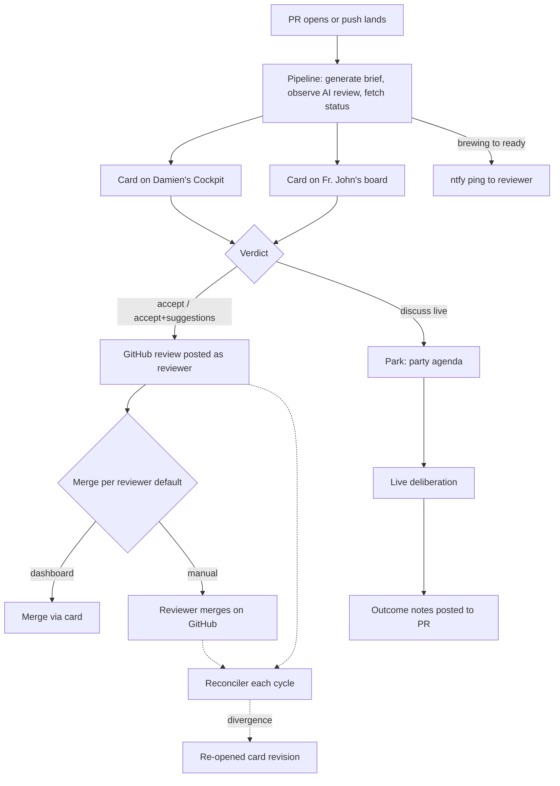
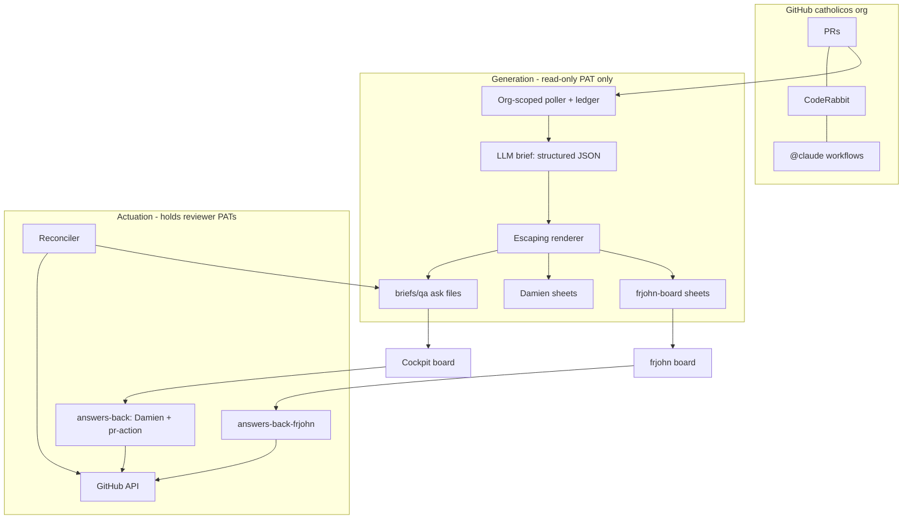
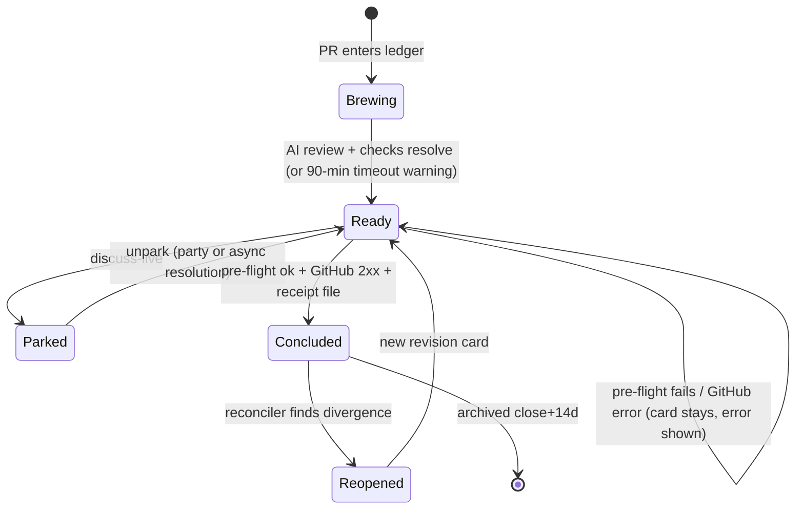

# PR Party Review Dashboard - Plan

**Target repo:** nearly all implementation lands in the Cockpit repo (the `Coding Projects` root). Paths below are prefixed `cockpit:` or `ontokit-web:`; unprefixed paths are `cockpit:`. This document lives in ontokit-web.

## Goal Capsule

- **Objective:** Build an async-first PR review pipeline for the CatholicOS repos so Damien and Fr. John decide most PRs asynchronously from their own boards, and the synchronous "PR Party" spends its time only on deliberation — never on navigation, narration, or waiting for AI review, lint, or rebase.
- **Product authority:** This plan's Product Contract. GitHub remains the system of record for reviews, merges, questions, and deliberation outcomes; the dashboards are consumption and action surfaces only.
- **Stop conditions:** Stop and surface to Damien if (a) either in-flight Cockpit plan (low-friction-login, granular-decisions) has changed in a way that invalidates KTD10's sequencing, (b) evidence shows a session-settled decision cannot work, or (c) any step would expose litigation/portfolio board content to the new Fr. John surface.
- **Open blockers:** none for implementation. Fr. John's participation (CF Access onboarding, GitHub PAT intake, UAT on real PRs) is an external gate on *adoption*, not on the build — degraded mode (R12) and synthetic-PR UAT keep every unit verifiable without him.
- **Tail ownership:** executor owns commits and pushes in the Cockpit repo (personal repo — push freely). No pushes to CatholicOS remotes are in scope except U8's org `.github` workflow, which follows the ask-before-push house rule.

---

## Product Contract

Product Contract preservation: R9 and R10 rewritten and KD9–KD13 / R17–R21 / AE6–AE7 added at plan time with user confirmation (scoping synthesis, 2026-07-26). Review round (2026-07-26): 25 accepted findings folded in — R3/R17/R19/R20 amended, R22 added, verdict-copy added to R7; one finding deferred to Outstanding Questions. All other meanings and IDs unchanged.

### Summary

When a PR opens in any catholicos org repo, machinery immediately generates an HTML brief card (what / why / decisions, mined from CE artifacts), observes the AI code review, and attaches CI/rebase status with deep GitHub links. Cards land on each reviewer's board — Damien's in the Cockpit, Fr. John's at frjohn.damienriehl.com — where the reviewer can question the AI, then tap a verdict that posts a real GitHub review, with optional merge honoring per-reviewer defaults.

### Problem Frame

PR Parties — Damien and Fr. John walking through each other's PRs — take hours. The time goes to navigating between PRs, the author narrating what the PR does and why, and above all waiting: for AI reviewers (CodeRabbit, Claude) to finish, for lint, for rebases. Synchronous time is scarce (Rome and the Twin Cities), yet most of the session is consumed by mechanics that need no human presence. The pain is not the deciding — it is that everything a machine could have finished beforehand is happening live.

### Key Decisions

- KD1. **Verdict taps post real GitHub reviews immediately, under each reviewer's own identity.** (session-settled: user-directed — chosen over agent-executes-later and record-only: GitHub stays the sole source of truth with honest attribution; a decision file lands alongside purely as audit trail.) Governs R8, R10.
- KD2. **Brief cards are LLM-generated at PR-open**, not author-written. (session-settled: user-directed — chosen over template-enforced authoring and generated-draft-with-signoff: zero author burden; CE artifacts supply real rationale.) Governs R2.
- KD3. **Intake is every PR in the catholicos org.** (session-settled: user-directed — chosen over ontokit-only and an opt-in list: one rule, nothing falls through; noise is manageable with two authors.) Governs R1.
- KD4. **Twin Cockpit-style boards under damienriehl.com** — Damien's verdicts as ordinary Cockpit asks, Fr. John's board at frjohn.damienriehl.com. (session-settled: user-directed — chosen over a page inside ontokit-web and a single shared site: cheapest symmetric build, keeps dev-tooling out of the public product; later migration to Ontokit/CatholicOS domains is recorded under Scope Boundaries.) Governs R15, R16.
- KD5. **Reviewer questions post as PR comments @-mentioning the AI agent**, with answers surfaced back on the card. (session-settled: user-approved — chosen over card-only chat: the exchange compounds on GitHub, visible to both reviewers.) Governs R13.
- KD6. **Merge is available from the card, with a per-reviewer default** (dashboard-merge vs GitHub-manual). (session-settled: user-directed — chosen over no merge affordance: each reviewer keeps their own habit.) Governs R11.
- KD7. **Deliberation capture ships in v1** — party and suggestion outcomes flow back to GitHub. (session-settled: user-directed — chosen over deferring: "compound everything" so future sessions improve.) Governs R14.
- KD8. **Per-reviewer degraded mode** for reviewers who decline credential storage. (session-settled: user-approved — proposed against requiring credentials: full round-trip if trusted, zero adoption risk if not.) Governs R12.
- KD9. **Discuss-live is a park, not a concluding verdict.** (session-settled: user-approved at plan scoping — chosen over verdict-with-decision-file: a decision file retires the card, which would destroy the agenda it is meant to feed.) Governs R9, R10.
- KD10. **Cards are readiness-gated.** (session-settled: user-approved at plan scoping — chosen over always-live verdicts: an un-gated card invites approving code nothing has reviewed yet.) Governs R17.
- KD11. **Routing covers all four author kinds** — counterpart, own, third-party, bot. (session-settled: user-approved at plan scoping — the org takes PRs from more than the two principals.) Governs R1, R18, R19.
- KD12. **A per-cycle reconciler closes the loop with GitHub.** (session-settled: user-approved at plan scoping — chosen over dashboard→GitHub one-way flow: force-pushes, external merges, and degraded-mode verdicts otherwise end in silence.) Governs R20.
- KD13. **PR-derived content is untrusted input.** (session-settled: user-approved at plan scoping — briefs render from escaped structured fields; no raw HTML on a board that holds org write access.) Governs R21.

### Actors

- A1. Damien — PR author and reviewer; reviews from the Cockpit at dashboard.damienriehl.com.
- A2. Fr. John — PR author and reviewer; reviews from frjohn.damienriehl.com; may operate in degraded mode (R12).
- A3. Generation pipeline — on PR-open and on push: writes the brief, observes AI review, refreshes status. Holds only a read-only credential (KTD5).
- A4. Review service — receives verdict/question/merge actions and performs the corresponding GitHub API calls; lands decision files.
- A5. AI review agents (CodeRabbit, Claude watcher) — produce review findings; answer @-mentioned questions on the PR.
- A6. GitHub (catholicos org) — system of record for PRs, reviews, comments, merges.

### Requirements

**Intake and brief generation**

- R1. Every PR opened in a catholicos org repo enters the review queue, tagged by author kind (counterpart, own, third-party, bot) and routed per R18/R19; counterpart-authored PRs surface on the other reviewer's board.
- R2. At PR-open, an LLM generates an HTML brief card — what the PR does, why, and what decisions were made — mining the diff, commit messages, PR description, and linked CE artifacts (plan docs, review findings, solutions) for rationale.
- R3. The pipeline observes CodeRabbit's own auto-review; its findings attach to the card when complete. A brewing card past its timeout offers a reviewer-initiated "run review" re-trigger, posted through the action endpoint with the reviewer's credential (compose-and-copy in degraded mode).
- R4. The card shows current CI, lint, and rebase/mergeability status from GitHub, including an explicit "computing" state while GitHub's mergeability is unresolved.
- R5. The card links liberally into GitHub: the PR, diff, commits, repo docs, and the CE artifacts it drew from.
- R6. New commits regenerate the brief; a card whose brief predates the head commit is marked stale and warns before a verdict is accepted.

**Verdicts and merge**

- R7. A reviewer resolves each card with one of three verdicts: accept, accept-with-suggestions, or discuss-live. Each verdict control carries a one-line plain-language description of what tapping it does on GitHub, worded identically on both boards.
- R8. For a credentialed reviewer (see R12 for the exception), accept and accept-with-suggestions post a real GitHub review immediately under the reviewer's own identity — approval, with suggestions carried in the review body (line-anchored comments are deferred; see Scope Boundaries).
- R9. Discuss-live parks the card with reason `discuss-live`; the party agenda is the rendered set of so-parked cards. Unparking — after the party, or when async pushes resolve the concern — returns the card for a concluding verdict.
- R10. A PR card retires only on a decision file recording a verified GitHub review id and head SHA (or an explicit degraded-mode acknowledgment). Generic answers files and kanban retire gestures against a PR card record intent but do not retire it.
- R11. The card offers a merge action; each reviewer's stored preference sets whether dashboard-merge or GitHub-manual is their default.
- R12. A reviewer without a stored GitHub credential operates in degraded mode: verdict taps record the decision and deep-link to the GitHub page where the reviewer performs the review or merge natively; Ask composes the comment for one-tap copy, and merge is link-only.
- R17. Verdict controls are disabled while a card is brewing — AI review pending or required checks unresolved — with a plain-language reason; discuss-live and Ask stay enabled. A "review anyway" override is submitted together with the verdict in one tap and recorded as `override: true` in the receipt. Brewing times out to ready-with-warning at 90 minutes (the worst-case CodeRabbit queue for a six-PR batch).
- R18. A reviewer's own-authored PR renders as a read-only status strip (GitHub forbids self-approval); its merge affordance appears only once the counterpart's approval exists, honoring the author's merge default.
- R19. Third-party PRs surface on both boards flagged as untrusted-author — one card per board on reviewer-scoped stems, each retiring on its own receipt; once one approval lands, the reconciler annotates the other card. Bot PRs (e.g. dependabot) render as collapsed, link-only rows with no LLM brief.
- R20. A per-cycle reconciler compares recorded verdicts against live GitHub state; on divergence — dismissed approval after force-push, external merge or close, an unconfirmed degraded-mode verdict, or a GitHub review that exists with no receipt file — it retires, re-opens as a new revision, or back-fills the receipt from the found review id, and confirms degraded verdicts when the matching review appears.

**Questions and deliberation capture**

- R13. From a card, the reviewer can ask a question; it posts as a PR comment @-mentioning the AI agent, and the answer is surfaced back onto the card.
- R14. Outcomes of live deliberation and accepted suggestions flow back to the PR as review comments or notes, so decisions persist on GitHub rather than evaporating with the session.

**Surfaces and safety**

- R15. Damien's cards ride the existing Cockpit ask machinery: valid `repo` field, per-question state, answers-back submission, ntfy ping.
- R16. Fr. John's board serves the same card content at frjohn.damienriehl.com, Cloudflare-Access-gated to his email.
- R21. PR-derived content is treated as untrusted everywhere it renders or feeds an LLM; brief content reaches board pages only as escaped structured fields, and cards from non-principal authors carry an untrusted-content banner.
- R22. When a card transitions brewing → ready, the pipeline notifies that card's reviewer once per PR revision on their own notification topic, with a deep link to the card.

### Key Flows

- F1. Async review
  - **Trigger:** A PR opens in a catholicos repo.
  - **Steps:** Pipeline generates the brief and observes AI review; card lands brewing, then ready (R17), pinging the reviewer (R22); reviewer reads the brief and findings, optionally follows deep links; taps accept or accept-with-suggestions; pre-flight re-verifies live PR state; GitHub review posts under their identity; decision file retires the card; merge fires per their default.
  - **Covers:** R1-R5, R7, R8, R10, R11, R17, R22.
- F2. Question round-trip
  - **Trigger:** Reviewer wants more than the brief offers.
  - **Steps:** Reviewer asks from the card; question posts as a PR comment @-mentioning the AI agent; the agent answers on the PR; the answer surfaces on the card; reviewer proceeds to a verdict.
  - **Covers:** R13.
- F3. Party from the agenda
  - **Trigger:** One or more cards are parked discuss-live.
  - **Steps:** The party agenda lists parked cards; the two deliberate; outcomes post back to each PR as comments; cards are unparked and concluded with verdicts.
  - **Covers:** R9, R14.
- F4. Stale card
  - **Trigger:** New commits push after a brief was generated.
  - **Steps:** Pipeline regenerates the brief (content only — question identities are fixed, per KTD8); a reviewer viewing the outdated card sees a stale warning and must confirm before any verdict is accepted; pre-flight independently rejects a verdict whose head SHA no longer matches.
  - **Covers:** R6.

### Acceptance Examples

- AE1. **Covers R7, R8, R10.** Given an open PR with a generated brief, when Damien taps accept-with-suggestions and adds two notes, then GitHub shows an approving review from damienriehl whose body carries the two notes, and the card leaves his Cockpit board on the next cycle.
- AE2. **Covers R6.** Given Fr. John pushes new commits after a brief was generated, when Damien opens the card before regeneration completes, then the card shows a stale warning and requires confirmation before his verdict is accepted.
- AE3. **Covers R12.** Given Fr. John has declined credential storage, when he taps accept, then his verdict is recorded on his board and he is deep-linked to the GitHub review page to approve natively.
- AE4. **Covers R13.** Given a card for Damien's PR, when Fr. John asks "why this approach over X?", then the question appears as a PR comment @-mentioning the AI agent, and the agent's answer appears both on the PR and on the card.
- AE5. **Covers R11.** Given Damien's default is dashboard-merge and Fr. John's is GitHub-manual, when each accepts a PR, then Damien's card offers one-tap merge while Fr. John's shows only a link to merge on GitHub.
- AE6. **Covers R17.** Given a PR opened two minutes ago with CodeRabbit still running, when Damien opens the card, then accept controls are disabled with "CodeRabbit still running", Ask and discuss-live remain enabled, and a "review anyway" tap submits his verdict with `override: true` recorded in the receipt.
- AE7. **Covers R10.** Given a PR card on the kanban, when Damien drags it to Recently Done, then the card records intent but does not retire; the next cycle re-surfaces it flagged "verdict never reached GitHub" until a real review posts or a degraded acknowledgment lands.

### Success Criteria

- Synchronous PR Party time is spent only on discuss-live deliberation — zero session time waiting on AI review, lint, or rebase.
- Most PRs reach a verdict asynchronously, before any party occurs.
- Every review, merge, question, and deliberation outcome exists on GitHub — a reader with only GitHub access sees the complete record.

### Scope Boundaries

**Deferred to Follow-Up Work**

- Org-level GitHub webhook intake (requires a dedicated path-scoped Cloudflare Access Bypass application — a documented 401 trap); v1 polls (KTD3).
- Line-anchored suggestion comments (needs a diff-viewer surface the boards don't have); v1 carries suggestions in the review body.
- Email notification channel for Fr. John (v1 uses a dedicated ntfy topic plus the board itself).

**Deferred for later**

- Migration of both review surfaces to future Ontokit and/or CatholicOS domains — the intended eventual shape, recorded as tentative context; v1 lives entirely under damienriehl.com.
- A standalone ask-the-LLM serving backend with its own repo context — v1 routes questions through PR comments to the AI agents already watching the repos (KD5).

**Outside this product's identity**

- Merge without a human tap — merging is always an explicit reviewer action.
- Replacing or duplicating GitHub as the record of review — the dashboards never become a second source of truth.
- Repos outside the catholicos org.

### Dependencies / Assumptions

- Fr. John's onboarding: CF Access assumed acceptable; GitHub credential trust uncertain — degraded mode (R12) keeps the product viable either way. He is currently unavailable and has zero open PRs to review, so UAT runs on synthetic PRs; his return is an external adoption gate.
- Both principals are assumed org owners of catholicos (fine-grained PATs then need no approval flow) — verified in U1, with the approval-request path as fallback.
- CodeRabbit free tier auto-reviews private-repo PRs at ~4 reviews/hour — sufficient for two authors; R17's 90-minute timeout and R3's re-trigger absorb a review that never arrives.
- The Cockpit machinery this extends — board generation from asks, answers-back draft/submit, artifact-kit, the 15-minute sync — works as documented (verified against source with file:line evidence).
- Two in-flight Cockpit plans own adjacent surfaces (see KTD10); their landed state is re-checked at execution start.

### Outstanding Questions

**Resolve before planning** — none.

**Deferred to implementation**

- Merge method default per repo (squash vs merge vs rebase) — read each repo's allowed methods at pre-flight; deciding a house default can wait for the first real merge.
- Exact LLM invocation for brief generation (headless `claude -p` vs API call) — pick during U4 by what the box already has authenticated.
- Whether granular-decisions U7 (wake dispatcher) has landed by execution time — re-baseline check at U6; the synchronous action endpoint works without it.
- Whether the login-plan amendments (Access-app count, answers-back boundary) land as an out-of-band prerequisite at execution start or inside U6 — settle when re-baselining the two in-flight plans (deferred from document review, 2026-07-26; KTD10's "cheapest before its pending units are built" language favors execution start).

---

## Planning Contract

### Key Technical Decisions

- KTD1. **Extend the Cockpit machinery; no new app.** PR cards are a new ask kind riding gen-board, generated per-PR sheets, and answers-back — the same queue/kanban/park/freshness machinery as every other ask. Covers R15, R16; instantiates KD4.
- KTD2. **Fine-grained PAT per reviewer, plus a read-only generation token.** Reviewer tokens: `Contents: write` (merge), `Pull requests: write` (reviews), `Issues: write` (comments), `Metadata: read` — provisioned in full on day one (any change re-triggers org approval). A third, read-only PAT (`Metadata: read`, `Contents: read`, `Pull requests: read`; `~/.secrets/pr-party-readonly.token`) belongs to the generation domain exclusively (KTD5). Max lifetime 366 days → credential store models `{user, owner_scope, token, expires_at}`; health endpoint reports validity; board banners at T-30; failures surface as a distinct `TOKEN_EXPIRED` state. Tokens live root-only on the box (`~/.secrets/` house pattern → container secret), never in the browser, never in `briefs/`. Each answers-back deployment mounts only its own reviewer's token as a single-valued secret; the acting PAT is resolved solely from the verified Access principal's email, never from a client-supplied field. Instantiates KD1, KD8; covers R8, R11, R12.
- KTD3. **Poll-first intake with a single authoritative trigger, budgeted per cycle.** One org-scoped GitHub query per sync cycle feeds an idempotency ledger keyed `(pr_node_id, head_sha)`; every downstream stage is derived from the ledger, so re-runs are no-ops. No webhook, no Actions trigger in v1 (session-settled: user-approved — chosen over webhook-now: a webhook needs its own CF Access Bypass app and adds an inbound auth surface; the PLT.5 double-trigger post-mortem mandates exactly one authoritative trigger). Per-repo serial `gh` iteration is forbidden. The brief-generation stage carries its own budget: a per-cycle cap on briefs generated (oldest ledger entries first, remainder deferred to the next cycle), a bounded worker pool with a hard per-call timeout, and at most one derailment retry per PR per cycle.
- KTD4. **Verdicts ride a synchronous action endpoint, not the submit path.** `POST /api/pr-action/{stem}` in answers-back: (a) pre-flight — PR open, head SHA matches the card, caller is not the author, mergeability for merge; (b) idempotency key `sha256(stem|qid|head_sha|verdict)` persisted server-side in a `pending` state **before** the GitHub call, updated to the receipt after, so a re-tap returns the first result; (c) GitHub call — the commit point; (d) decision file written only on 2xx, embedding `github_review_id` + `head_sha` + the `override` flag when present — the receipt; (e) failures return to the card, which stays up and offers the degraded deep link. The acting PAT resolves from the verified Access principal (KTD2); a request naming a different reviewer is rejected before any GitHub call. The "review anyway" override is part of the verdict submission — one tap records verdict and `override: true` together (R17). Reviews always set `event` (assert non-PENDING) and pin `commit_id` to the card's SHA; merges always send `sha` (409 = stale card) and serialize. Covers R8, R10, R11, R17.
- KTD5. **Generation and actuation are separate privilege domains.** The generation domain holds only KTD2's read-only token — no write scope anywhere in it; the shared GitHub client refuses review, merge, and comment calls when constructed in generation mode, with a test asserting the refusal. The brief generator treats PR content as untrusted data and emits structured JSON (`what`/`why`/`decisions`/`links` as plain strings); a deterministic renderer escapes everything and owns all markup; PR-card JavaScript lives in an external file so the CSP can forbid inline script; a tracked nginx configuration owns the `Content-Security-Policy` and `Cache-Control: no-store` headers on both docroots. A generation result with zero tool-uses or echoed instruction-like text is rejected and re-run once per cycle. No path exists where model output selects a GitHub call. Instantiates KD13; covers R21.
- KTD6. **Fr. John's stack is separate runtime, shared code.** Own docroot (`briefs/frjohn-board/`, gitignored, published to `hetzner-dev:/opt/frjohn-board/site/` by a tracked publish script that is the docroot's sole writer), own answers-back deployment (`-p answers-back-frjohn`, own volume, own Access application/AUD, own `ANSWERS_ALLOWED_EMAIL`, own ntfy topic). His board renders a PR-only index plus PR cards and nothing else — the Damien docroot carries litigation/portfolio sheets that must never be exposed (session-settled: user-approved at plan scoping). His runtime inbox is isolated; the sync driver lands his submissions into the shared `briefs/qa/` store stamped `submitted_by` his verified principal, so retirement (U2) and reconciliation (U9) see both reviewers' verdicts. Covers R16.
- KTD7. **Damien-side answers-back changes are minimal and explicit:** the new pr-action route (KTD4) plus a server-side `submitted_by` stamp from the verified Access principal. His instance stays email-pinned to him (KTD6 removes the multi-tenant need). Both changes require amending the in-flight login plan's "sole sanctioned answers-back change" boundary — recorded in KTD10.
- KTD8. **PR ask-file schema.** `kind: "pr-action"`; stem `pr-<repo>-<number>` normalized to the service grammar (lowercase; characters outside `[a-z0-9-]` map to `-`; edge dashes stripped; the original repo name stays in the ask body for display and repo resolution); third-party PRs use reviewer-scoped stems `pr-<repo>-<number>-<reviewer>` (R19); severity `review-gated`; fixed lifetime question ids `q_verdict`, `q_notes`, `q_merge` — regeneration touches brief content only, never ids. PR asks are excluded from `score_attention`'s repo rollup **and from repo-level park** (question-level parks still apply), render in their own board section, and archive after close + 14 days. Repo resolution extends `repo_allowlist()` via a tracked `briefs/repos-extra.json`. Covers R10, R15; instantiates KD11's routing surface.
- KTD9. **AI review ingestion and Q&A.** CodeRabbit findings are read from the GitHub API (reviews/comments where `user.login == "coderabbitai[bot]"`) — no findings API exists. Questions post **with the reviewer's PAT** — a hard requirement, since PAT-authored comments trigger Actions workflows while `GITHUB_TOKEN`-authored ones don't. The `@claude` answerer is `anthropics/claude-code-action@v1` distributed as an org-level reusable workflow + org secret, triggering **only** on `issue_comment` events whose `author_association` is OWNER or MEMBER, and never checking out or executing code from an untrusted PR head. A timed-out brewing card's "run review" control posts `@coderabbitai review` through the action endpoint (R3). Covers R3, R13.
- KTD10. **Sequencing against the two in-flight Cockpit plans.** (a) Granular-decisions: post-tap agent work (regeneration, reconciliation nudges) rides its U7 wake dispatcher when landed; the verdict path itself is synchronous (KTD4) and does not wait for it. (b) Low-friction-login: amend its Access-app count check (five → six, adding frjohn.damienriehl.com) and its answers-back scope boundary (adding KTD7's two sanctioned changes) — both amendments are cheapest before its pending units are built; whether they land out-of-band at execution start or inside U6 is an Outstanding Question settled at re-baseline. Re-verify both plans' landed state at execution start.

### High-Level Technical Design

Component topology — privilege domains marked:

Card lifecycle:

Prose stays authoritative: the pre-flight conditions, commit-point ordering, and receipt contents are owned by KTD4; the state names here are the vocabulary units use.

### Risks and Mitigations

| Risk | Mitigation | Owner |
|---|---|---|
| Prompt injection via PR content next to a write-scoped credential | Generation/actuation privilege split with read-only generation token, escaped structured fields, CSP via tracked nginx config, derailment detector (KTD5); injection gate blocks release | U4 |
| Token expiry a year out, when nobody remembers the design | `expires_at` metadata, health-endpoint validity, T-30 board banner, distinct `TOKEN_EXPIRED` state (KTD2) | U1 |
| Double-posting from re-taps, trigger duplication, or post/receipt crashes | Single authoritative trigger + ledger (KTD3); pending-state idempotency key (KTD4); reconciler back-fill (R20) | U3, U6, U9 |
| Stale card actuating a moved PR | Pre-flight head-SHA check; `commit_id` pin; merge `sha` param; `Cache-Control: no-store` via nginx | U4, U6 |
| Fr. John surface leaking litigation/portfolio content | Separate runtime, docroot, and Access app (KTD6); tracked sole-writer publish script with isolation test; smoke checks block release | U7 |
| CodeRabbit review never arrives (rate limits, outage) | 90-minute brewing timeout to ready-with-warning (R17) + reviewer re-trigger (R3) | U3, U4 |
| Coolify serial deploy queue wedges during U7 rollout | Known escalation ladder (`docs/solutions/2026-07-07-coolify-stuck-deploy-queue.md`); deploy U7 in a quiet window | U7 |
| In-flight plan drift (login, granular-decisions) | Re-baseline check at execution start; amendments land before their pending units build (KTD10) | U6, U7 |
| Cockpit conventions broken by a new writer | PR machinery writes only namespaced `pr-*` stems and generator-owned ledger; single-writer rules per root `CLAUDE.md` | all |

---

## Implementation Units

### U1. Reviewer credentials and GitHub client

- **Goal:** Both reviewers' fine-grained PATs plus the read-only generation token provisioned, stored, and validated; a second GitHub authoring identity for the E2E gate; one shared GitHub client module used by every GitHub-touching path.
- **Requirements:** R8, R11, R12 (per KTD2); KTD5's generation-mode refusal.
- **Dependencies:** none.
- **Files:** `tools/pr-party/github_client.py`, `tools/pr-party/README.md` (provisioning runbook), `tests/test_pr_party_github_client.py`.
- **Approach:**
  1. Verify both principals' catholicos org-owner status (determines whether PAT approval flow applies); record the answer in the runbook.
  2. Client wraps reviews (create with `event` + `commit_id`, assert non-PENDING), merge (`sha` required, serialized), comments, PR fetch with mergeability retry (null → "computing"), and credential validation; distinct `TOKEN_EXPIRED` error type. A client constructed in generation mode holds only the read-only token and refuses review, merge, and comment calls.
  3. Credential store per KTD2 (`~/.secrets/pr-party-<user>.token` + `~/.secrets/pr-party-readonly.token`, mode 600, `{user, owner_scope, expires_at}` sidecar metadata); Fr. John's slot may legitimately be absent (degraded mode).
  4. Runbook covers: reviewer-PAT provisioning and annual rotation; the read-only token; a second GitHub authoring identity (alt/machine account added to the sandbox repo — no PAT needed, it only opens E2E PRs); and Fr. John's credential intake — a one-time-secret transmission channel that leaves no copy in a message store (never email or chat), a disclosure section (exact permissions granted, that the token lives on Damien-administered infrastructure and can post reviews and merges under his identity, the one-step GitHub revoke), and degraded mode as the standing alternative.
- **Execution note:** Damien's tokens can be provisioned and smoke-tested now; Fr. John's is an intake runbook others follow later.
- **Patterns to follow:** `~/.secrets/` mode-600 house pattern; machine-to-machine secret handoff from the PLT.5 learning (`docs/solutions/2026-07-07-plt5-dual-deploy-drift.md`).
- **Test scenarios:**
  - Review posted with pinned `commit_id` returns non-PENDING state (mocked API).
  - Merge without matching head SHA surfaces the 409 as a stale-card error, not success.
  - Revoked/expired token maps to `TOKEN_EXPIRED`, not generic failure.
  - Missing credential file yields degraded-mode signal, not an exception.
  - Self-authored PR is rejected client-side before any API call.
  - Generation-mode client refuses review, merge, and comment calls.
- **Verification:** validation script passes against Damien's real tokens (read-only calls); unit tests green.

### U2. PR ask schema, repo allowlist, and retirement rule

- **Goal:** gen-board understands `kind: "pr-action"` asks end-to-end: org repos resolve, stems normalize, retirement obeys R10, attention scoring and kanban behave per KTD8.
- **Requirements:** R10, R15; KTD8.
- **Dependencies:** none.
- **Files:** `tools/gen-board.py` (`collect_asks`, `resolve_repo`/`repo_allowlist`, `score_attention`, retirement logic), `briefs/repos-extra.json`, `tests/test_pr_party_fold.py`.
- **Approach:** add the tracked `repos-extra.json` source to `repo_allowlist()`; implement KTD8's stem normalization; teach `collect_asks` that a `pr-action` stem retires only on a decision file containing `github_review_id` or `degraded_ack` (plain answers files mark the card "intent recorded — not on GitHub yet", covering AE7); exclude `pr-action` from the attention rollup; severity fixed at `review-gated`.
- **Patterns to follow:** existing fold tests in `tests/test_qa_fold.py`; single-writer conventions in the root `CLAUDE.md`.
- **Test scenarios:**
  - `pr-action` ask + generic answers file → card survives, flagged unexecuted (AE7).
  - Same ask + decision file with `github_review_id` → retires.
  - Same ask + `degraded_ack` decision file → retires.
  - Ask with `repo: "martyrology-api"` (no local clone, listed in repos-extra) → resolves, no convention-violation flag.
  - A PR in the org `.github` repo yields a valid normalized stem (dotted-repo case).
  - Existing 56 fold/park tests stay green.
- **Verification:** `python3 -m pytest tests -q` in the Cockpit repo, all green.

### U3. Org poller, idempotency ledger, status collector, and cycle wiring

- **Goal:** One org-scoped query per sync cycle discovers/refreshes every open catholicos PR into a durable ledger with author-kind routing and CI/mergeability status — and the whole pipeline is actually wired into the cycle driver.
- **Requirements:** R1, R4, R19 (routing classification), R22; KTD3.
- **Dependencies:** U1 (client, read-only token).
- **Files:** `tools/pr-party/collect.py`, `briefs/pr-party/ledger.json` (generator-owned, deliberately tracked), `tools/deploy/sync-cockpit.sh` (vendored tracked copy of the cycle driver), `tests/test_pr_party_collect.py`.
- **Approach:**
  1. Single GraphQL search (`org:CatholicOS is:pr is:open`) via the generation-mode client — never per-repo serial `gh` (KTD3).
  2. Ledger entry per PR keyed `(pr_node_id, head_sha)`: author kind (counterpart / own / third-party / bot), state, mergeability (with "computing"), check rollup, CodeRabbit findings pointer (KTD9 scrape), brief status (brewing/ready per R17's 90-minute timeout).
  3. Draft PRs enter on `ready_for_review` only; a PR converted back to draft parks its cards.
  4. Own the cycle driver: the vendored `tools/deploy/sync-cockpit.sh` runs poller + brief + render **before** `gen-board.py` (a card generated this cycle ships this cycle) and the reconciler **after** the answers pickup; the Definition of Done requires the installed `~/.local/bin/sync-cockpit.sh` to match the tracked copy.
  5. On a ledger row's brewing → ready transition, emit one ntfy message to that reviewer's topic carrying the card deep link, recorded in the ledger keyed `(pr_node_id, head_sha)` so it fires exactly once per revision (R22).
- **Test scenarios:**
  - New PR appears → ledger row created, brewing.
  - Same PR, same head SHA re-polled → no-op (idempotency).
  - Force-push → new `(id, sha)` supersedes; old row marked stale.
  - Bot author classified `bot`; unknown human classified `third-party`.
  - Mergeability null → "computing", not "not mergeable".
  - CodeRabbit review present → findings pointer recorded; absent after 90 minutes → ready-with-warning (R17).
  - Brewing→ready transition emits exactly one notification per revision; re-poll does not re-notify.
- **Verification:** run against the live org read-only; ledger matches `gh pr list` ground truth; unit tests green.

### U4. Brief generation and sheet rendering

- **Goal:** Ledger rows become escaped, header-protected HTML cards and `pr-action` ask files on both board outputs, within a per-cycle generation budget.
- **Requirements:** R2, R5, R6, R7 (verdict copy), R17, R18, R19, R21; KTD5, KTD8.
- **Dependencies:** U2, U3.
- **Files:** `tools/pr-party/brief.py` (LLM call → structured JSON), `tools/pr-party/render.py` (escaping renderer → `briefs/qa/pr-*.json` + `briefs/board/pr-*.html` + `briefs/frjohn-board/pr-*.html` + external card JS + artifact-kit copy into `briefs/frjohn-board/`), `tools/deploy/nginx-pr-cards.conf` (tracked; CSP + `Cache-Control: no-store` for `pr-*.html` on both docroots), `.gitignore` (add `briefs/frjohn-board/`), `tests/test_pr_party_render.py`.
- **Approach:** generator prompt wraps all PR-sourced text in untrusted-data delimiters and demands plain-string JSON fields; renderer HTML-escapes every field, owns all markup, emits fixed qids, stamps "as of HH:MM"; card JavaScript lives in an external file (KTD5 — the CSP forbids inline script); each verdict control carries its one-line plain-language description (R7); own-PRs render read-only strips (R18); bot PRs render link-only rows with no brief (R19); regeneration on head-SHA change rewrites content, never qids; derailment detector rejects and re-runs once per cycle; generation respects KTD3's per-cycle cap and bounded worker pool.
- **Execution note:** write the injection tests first — a hostile PR body containing `<script>` and instruction-like text is the canonical fixture.
- **Patterns to follow:** `tools/render-board-form.py` submit-assembly (L106-115) and sheet conventions (`data-ask-stem`, kit script last); dark palette tokens.
- **Test scenarios:**
  - Covers AE6. Brewing card disables verdict controls with reason; Ask/discuss-live enabled; override tap submits verdict + `override: true`.
  - Hostile PR body with `<script>` → rendered inert (escaped) in both sheets; brief JSON fields are plain strings; no inline `<script>` in the card.
  - Brief generation returning instruction-echo/zero-tool-use signature → rejected, retried once, then rendered as "brief unavailable" with links intact.
  - Own-PR → read-only strip, no verdict controls.
  - Dependabot PR → link-only row, no LLM call made.
  - Head-SHA change → content regenerated, qids unchanged (in-flight draft still folds).
  - Third-party PR → untrusted-author banner present.
  - A cycle with more new PRs than the budget → oldest generated first, remainder deferred, no cycle overrun.
  - artifact-kit.js present in `briefs/frjohn-board/` output.
- **Verification:** generated sheets pass the injection tests; a synthetic PR produces a visually-inspected card on a local render.

### U5. Board, agenda, and twin-index rendering

- **Goal:** PR cards get their own board section on Damien's Cockpit, kanban interplay per KTD8, the party agenda renders parked-discuss-live cards, and Fr. John's PR-only index renders.
- **Requirements:** R9, R15, R16 (index); KD9.
- **Dependencies:** U2, U4.
- **Files:** `tools/gen-board.py` (board section, `render_pr_card`, agenda view, park integration, `briefs/frjohn-board/index.html` render), `briefs/qa/SCHEMA.md` (§6 park-reason extension), `tests/test_pr_party_board.py`.
- **Approach:** extend the park-state schema — carry an optional `reason` through `_fold_park_batch` into `_park_entry` (sanitized, default empty) and document it in SCHEMA.md §6; discuss-live rides park semantics with reason `discuss-live`; the agenda is the park set filtered to that reason; `pr-action` asks are exempt from repo-level park (question-level parks still apply); PR card kanban identity keys on PR number, not title; render Fr. John's PR-only `index.html` from the same card data.
- **Test scenarios:**
  - Covers AE7 interplay: drag-to-done records intent, card re-surfaces flagged.
  - Discuss-live park round-trips its reason; an ordinary defer does not appear on the agenda.
  - Unpark → card returns ready for a concluding verdict.
  - A PR card survives a park of its repo.
  - PR retitle → kanban placement survives (number-keyed).
  - frjohn index renders with PR cards only — no non-PR sheets referenced.
  - `tests/test_park_fold.py` (20 tests) stays green.
- **Verification:** `python3 tools/gen-board.py` renders both boards with a synthetic PR section; pytest green.

### U6. Verdict action endpoint and receipts

- **Goal:** Taps become GitHub reviews/merges with pre-flight, durable idempotency, and receipt files, per KTD4 — with a test harness the service currently lacks.
- **Requirements:** R7, R8, R10, R11, R12, R17 (override); AE1, AE5, AE6.
- **Dependencies:** U1, U2.
- **Files:** `tools/answers-back/service/main.py` (pr-action route), `tools/answers-back/service/github_actions.py` (new), `tools/answers-back/service/auth.py` (server-side `submitted_by` stamp), `tools/answers-back/tests/conftest.py` (new harness: `require_access` dependency override, tmp data-dir fixture), `tools/answers-back/requirements-dev.txt` (pytest), plus one-paragraph amendments to `docs/plans/2026-07-26-001-feat-dashboard-low-friction-login-plan.md` (Access-app count; answers-back boundary) per KTD10.
- **Approach:** implement KTD4's contract exactly, including the pending-state idempotency write before the GitHub call and the `override` flag in the receipt; receipts land at `/data/pr-receipts/<stem>-<utc-stamp>-<review-id-or-nonce>.json` — never the shared `<stem>-answers.json` — and a dedicated sync-pickup block (U3's vendored driver) lands them under `briefs/qa/` without the exists-skip guard; the acting PAT resolves from the verified Access principal only; merge honors per-reviewer defaults stored in a small tracked config; degraded mode returns the deep-link payload; every receipt stamps `submitted_by`.
- **Execution note:** start with a failing integration test for the tap → mocked-GitHub → receipt-file contract, including the double-tap idempotency case.
- **Test scenarios:**
  - Covers AE1. Accept-with-suggestions → one approving review, body carries notes, receipt has `github_review_id` + `head_sha`.
  - Covers AE3. No credential → verdict recorded with `degraded_ack` pending, deep link returned.
  - Covers AE5. Merge defaults honored per reviewer.
  - Covers AE6. Override tap → single submission records verdict + `override: true` in the receipt.
  - Double-tap → single review, second response replays first result (pending-state key).
  - Crash simulation between GitHub 2xx and receipt write → pending key present, no receipt; U9's reconciler case covers healing.
  - A second submission for the same stem lands as its own receipt file (no strand).
  - Request naming a different reviewer than the verified principal → 403 before any GitHub call.
  - Head SHA moved between render and tap → refusal, card stays.
  - GitHub 500 → no receipt file, card stays, error surfaced.
  - Externally-merged PR → pre-flight auto-retires with "already merged", no review posted.
  - Self-authored PR tap → refused before any API call.
  - Review response PENDING → treated as failure (assert-event guard).
- **Verification:** new answers-back suite green; end-to-end synthetic tap against a sandbox repo posts a real review visible on GitHub.

### U7. Fr. John twin stack

- **Goal:** frjohn.damienriehl.com serves his PR-only board behind his own Access app, with his own answers-back instance and ntfy topic — and hard, tested isolation from Damien's content.
- **Requirements:** R16; KTD6.
- **Dependencies:** U4, U5, U6.
- **Files:** `tools/deploy/frjohn/docker-compose.yml` (new Host rule, `-p answers-back-frjohn`), `tools/publish-frjohn-board.py` (tracked sole writer of `/opt/frjohn-board/site/`, selects strictly from `briefs/frjohn-board/`, aborts on any path outside it), `tests/test_pr_party_frjohn_isolation.py`, `tools/deploy/nginx-pr-cards.conf` (shared with U4), `tools/docs/frjohn-onboarding.md` (runbook: DNS, Access app, email pin, credential intake per U1's channel/disclosure requirements, ntfy subscription).
- **Approach:** wildcard `*.damienriehl.com` covers the new host (verify the record before debugging Traefik); add domains additively via Coolify's `domains` field; first HTTPS hit provisions LE (~30s); the sync driver calls the tracked publish script rather than embedding an rsync line, and pulls his instance's inbox into `briefs/qa/` stamped with his verified principal (KTD6); his instance boots in degraded mode until a PAT lands.
- **Test scenarios:** (infrastructure unit — smoke-first)
  - Isolation test: publish script aborts when a non-`briefs/frjohn-board/` path is selected.
  - External curl: frjohn root URL serves his index only after his email authenticates; the kit script resolves; CSP and `Cache-Control` headers present.
  - Litigation/portfolio sheet filenames are absent from `/opt/frjohn-board/site/`.
  - His submit lands in the answers-back-frjohn volume, never in Damien's service inbox; the next sync lands it in `briefs/qa/` stamped `submitted_by` his principal.
  - Access app count amendment: login plan's target table accepts six apps.
- **Execution note:** mostly packaging/config — prefer install/runtime smoke verification over unit coverage. Beware the Coolify serial deploy queue (escalation ladder in `docs/solutions/2026-07-07-coolify-stuck-deploy-queue.md`).
- **Verification:** the isolation smoke checks pass from outside the tunnel; the isolation unit test is green.

### U8. Q&A round-trip and deliberation capture

- **Goal:** Card questions reach GitHub and answers return; party/suggestion outcomes post back to PRs; the org answerer is authorization-gated.
- **Requirements:** R13, R14; KTD9; AE4.
- **Dependencies:** U1, U3, U4, U6.
- **Files:** `tools/pr-party/qa.py` (question post + answer scrape into the ledger), org-level `.github` reusable workflow for `@claude` (catholicos org repo — the one CatholicOS-remote write in this plan; follows the ask-before-push house rule), extension of `tools/pr-party/render.py` (answer display, degraded compose-and-copy).
- **Approach:** questions post with the asking reviewer's PAT (PAT comments trigger workflows; `GITHUB_TOKEN` comments don't); the workflow triggers only on OWNER/MEMBER `author_association` and never checks out an untrusted PR head (KTD9); answers scraped by the poller; deliberation outcomes are a card affordance posting a structured "party outcome" comment; degraded mode composes the comment for copy + deep link; a timed-out brewing card's "run review" control posts `@coderabbitai review` through the action endpoint (R3).
- **Test scenarios:**
  - Covers AE4. Question tap → PR comment with @-mention posted as the reviewer; answer appears on the card next cycle.
  - Validation: a service-posted `@claude` comment from a principal actually starts a workflow run (the GITHUB_TOKEN trap check).
  - A third-party-authored `@claude` mention starts no workflow run (authorization gate).
  - No answer after timeout → card shows "no answer yet" state, re-ask affordance.
  - Degraded mode → compose-and-copy payload, no API call.
  - Party outcome post → comment lands on the PR and is linked from the receipt.
  - "Run review" re-trigger posts the CodeRabbit command as the reviewer.
- **Verification:** live round-trip on a sandbox repo: question → @claude answer → surfaced on card.

### U9. Reconciler

- **Goal:** Each cycle, recorded verdicts and live GitHub state converge; divergence produces visible card revisions or receipt back-fills, per R20.
- **Requirements:** R20; KD12; KTD4's receipt data.
- **Dependencies:** U3, U6.
- **Files:** `tools/pr-party/reconcile.py`, `tests/test_pr_party_reconcile.py`.
- **Approach:** compare receipts (`github_review_id`, `head_sha`), pending idempotency records, and degraded `intent` records against live PR state from the poller; dismissed approval / force-push → new `-r2` ask revision (new stem — the schema's only re-open mechanism); external merge/close → retire with outcome noted; a GitHub review that exists with only a `pending` idempotency record and no receipt → back-fill the receipt from the found review id and retire normally; degraded verdict confirmed when the matching review appears, nagged when it doesn't; closed PRs archive after 14 days.
- **Test scenarios:**
  - Approval dismissed by force-push → `-r2` ask created at `review-gated` with diff-since-approval link.
  - PR merged externally → card retires with "merged on GitHub" outcome.
  - Review exists on GitHub, pending key present, no receipt → receipt back-filled from the review id, card retires, no duplicate review posted.
  - Degraded verdict + matching review found → flipped to confirmed.
  - Degraded verdict + no review after N cycles → nag state on the card.
  - Closed 15 days → archived out of the active set.
- **Verification:** pytest green; one full sync cycle on synthetic history produces the expected revisions.

---

## Verification Contract

| Gate | Command / check | Applies to |
|---|---|---|
| Cockpit test suite | `python3 -m pytest tests -q` (Cockpit repo) — 56 pre-existing tests (`test_qa_fold.py` 36 + `test_park_fold.py` 20) stay green plus all new `test_pr_party_*` | U2-U6, U9 |
| answers-back suite | pytest in `tools/answers-back/` (suite is new in U6) | U6 |
| Injection gate | hostile-PR fixture renders inert in both sheets; brief JSON is plain strings; CSP and `Cache-Control: no-store` headers asserted on a served card | U4, U7 (blocks release) |
| Board render | `python3 tools/gen-board.py` completes; synthetic PR section + frjohn index present | U4, U5 |
| E2E credentialed | synthetic PR authored by the second identity (U1) on a sandbox catholicos repo: card → accept tap by Damien → real review visible via `gh pr view` → card retires next cycle | U6 (with U1-U5) |
| E2E degraded | same flow with no stored token: intent recorded, deep link works, reconciler confirms after manual review | U6, U9 |
| Isolation smoke | external curls per U7's scenarios; litigation-sheet absence check; publish-script abort test | U7 |
| Q&A round-trip | live sandbox: question → @claude answer → card; third-party mention starts no run | U8 |

Visual checks of rendered cards use MCP chrome-devtools per house convention.

## Definition of Done

- All nine units landed with their verification gates green; the two E2E flows (credentialed, degraded) pass on a sandbox repo.
- The installed `~/.local/bin/sync-cockpit.sh` matches the tracked `tools/deploy/sync-cockpit.sh`.
- The pre-existing board is unaffected: existing asks, kanban, park behavior, and fence/portfolio sheets render and retire exactly as before, and none of that content is reachable from the frjohn stack.
- No PR-derived text reaches any board page unescaped (injection gate), and no GitHub credential is readable from any browser-served path.
- Runbooks exist for PAT provisioning/rotation + credential intake (U1) and Fr. John onboarding (U7); the login plan carries its two amendments; `briefs/on-deck.json` reflects the remaining external gates (Fr. John PAT intake, real-PR UAT).
- Abandoned experimental code from the run is removed from the diff.
- A solutions write-up captures the new territory (GitHub webhooks deferred-decision, CF Access second-principal provisioning, LLM-authored review safety) per the corpus-gap note.

---

## Implementation Trace

All nine units were implemented on branch `feat/pr-party-dashboard` in the Cockpit repo (10 commits, pushed), each unit citing its U-ID in the commit subject. Code review found the branch **not ready to deploy**: four defects fail on first contact and one is a security containment gap.

**A fresh session picks up from `Coding Projects/docs/residual-review-findings/2026-07-26-pr-party-dashboard-review.md`** — it carries all ~33 findings with `file:line` and fixes, the recommended fix order, the worktree/branch/suite state, the human-only external gates, and two environment issues (no headless browser config, so no UI has been visually verified; the cross-model review route is unauthenticated in this sandbox).

Corrections this work forced on the plan's assumptions, recorded so they are not re-derived:

- Damien is a **member**, not an owner, of the catholicos org — his fine-grained PAT needs owner approval, which Fr. John (`jmurquidi`, an owner) can grant. The Dependencies section's org-owner assumption was wrong.
- `damienriehlfc` already exists on the box and serves as the E2E authoring identity U1 called for.
- The generation domain's containment gap is not the absence of a write token but the presence of a shell: the brief subprocess must be tool-denied (KTD5's split holds, its threat model was incomplete).

## Sources & Research

- Grounding dossier (verified `file:line` quotes): `/tmp/compound-engineering-1000/ce-brainstorm/pr-party-dashboard-0726/grounding.md`.
- Cockpit repo: `tools/gen-board.py` (collect_asks L1339, repo_allowlist L297, resolve_repo L329, score_attention L1676, render_ask_card L1866, kanban_item_id L1387), `tools/answers-back/service/{main,auth}.py` (stem grammar L52, email pin L39/L148, submit stamping L222, ntfy L185), `tools/render-board-form.py` (submit assembly L106-115), `tests/test_qa_fold.py` (36 tests), `tests/test_park_fold.py` (20 tests).
- In-flight plans this plan sequences against: `docs/plans/2026-07-26-001-feat-dashboard-low-friction-login-plan.md`, `docs/plans/2026-07-26-001-feat-cockpit-granular-decisions-plan.md` (both Cockpit repo).
- Institutional learnings applied: `docs/solutions/2026-07-07-plt5-dual-deploy-drift.md` (single-trigger, permissions, secret handoff), `2026-07-07-verify-live-state-before-acting.md` (pre-flight), `2026-07-07-upstream-queue-branch-consolidation.md` (prompt-injection, derailment signature), `2026-07-07-carving-mixed-concern-pr-slices-and-byok-secrets.md` (secret storage), `2026-07-06-wildcard-dns-coolify-parity.md` + `2026-07-07-coolify-stuck-deploy-queue.md` (deploy).
- ontokit-web precedent (reference only): `lib/api/pullRequests.ts` (GitHub mirror + webhook-integration types), `components/pr/PRActions.tsx`.
- External (authority: official docs unless noted): fine-grained PAT permissions and 366-day lifetime; reviews API (`event`, `commit_id`, PENDING trap); merge API (`sha`, 409); mergeable-null and `mergeable_state` semantics (community-established); org PAT approval policy (owner exemption); GITHUB_TOKEN cannot approve; org webhooks + CF Access Bypass caveat (community: moltworker #132); CodeRabbit commands/no-findings-API/free-tier limits; `claude-code-action@v1`. Full citation list preserved in the research transcript; load-bearing items restated here.
