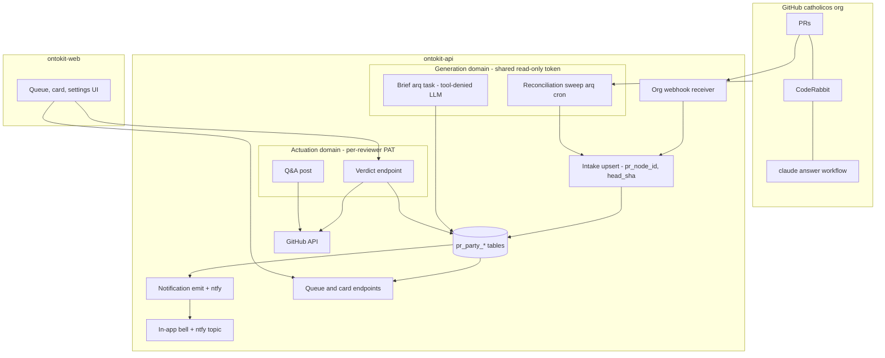
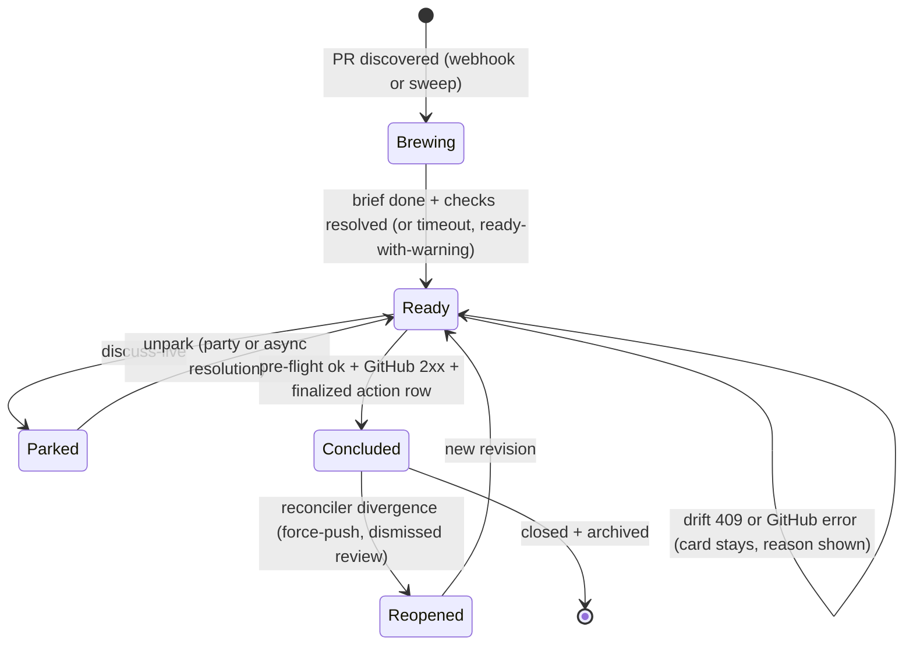
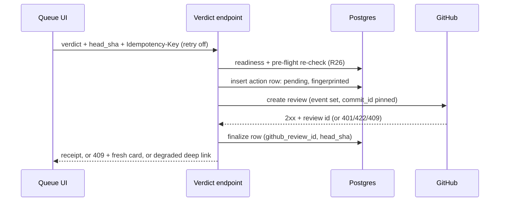

# PR Party as an OntoKit Feature - Plan

**Repos:** UI in `ontokit-web` (Next.js 16 / React 19 / TypeScript), pipeline and endpoints in `ontokit-api` (Python / FastAPI / SQLAlchemy async / Postgres 17). Work happens on the FOLIO fork (`origin` = `alea-institute/*`); CatholicOS is reached only by PR to `catholicos/dev` with a linked issue. Paths below are prefixed `api:` or `web:`.

## Goal Capsule

- **Objective:** Deliver the PR Party review experience as a first-class OntoKit product feature — async PR briefs, verdicts that post real GitHub reviews, AI Q&A, and reconciliation — replacing the Cockpit-hosted prototype. The PR Party queue is canonical for all review decisions; the Cockpit's only remaining role is notification and a link.
- **Product authority:** The Product Contract of `docs/plans/2026-07-26-010-feat-pr-party-review-dashboard-plan.md` (R1–R22, KD1–KD13, actors, flows, acceptance examples, Success Criteria) carries forward **unchanged except where this document names a reversal**. GitHub remains the system of record.
- **Execution profile:** two milestones (session-settled: user-directed at doc review — chosen over single-phase dependency order). **M1 — degraded-only review, used on real PRs:** U1, U2's registry/capability half, U3's read surfaces, U4, U5, U9, U15, U10, U11, U12's read half, and a record-intent-only verdict path — queue, briefs, status, and notifications deliver value with zero stored credentials, keeping Fr. John's PAT intake off the critical path to first use. **M2 — credentialed actuation:** U2's credential half, U6's GitHub-call path, U7's write half, U8, U13, and the live E2E gate (U14). Each unit lands as an atomic commit citing its U-ID; fork PRs target `catholicos/dev` with linked issues.
- **Stop conditions:** stop and surface if (a) evidence shows a session-settled decision cannot work, (b) the trust-ladder branch's merge state changes in a way that invalidates KTD21's sequencing, or (c) any step would store or render a reviewer credential client-side.
- **Open blockers:** none for M1 implementation. External gates: (a) Fr. John's PAT intake; (b) org-webhook creation (he is the org owner; Damien is a member); (c) the `catholicos/.github` answerer-workflow merge — until it lands, questions post and surface via the sweep but answers stay dark (R13 pre-merge state); (d) the shared generation token — resolve before U3 starts: which account issues it, whether catholicos org policy requires owner approval (Damien's reviewer PATs did in the prototype round), and what intake degrades to while approval is pending; (e) real-PR UAT. Degraded mode (R12) and sandbox-repo E2E keep every unit verifiable without Fr. John.
- **Tail ownership:** executor owns commits and pushes on the fork. Never push a `catholicos` remote; the one CatholicOS-bound artifact (U7's org `@claude` workflow) ships as a fork PR to `catholicos/.github` targeting `dev`.
- **Prototype:** the Cockpit implementation on `feat/pr-party-dashboard` (Cockpit repo, 10 commits) is the working reference. Do not delete it; it is the source of the transferable code, the interaction design, and the 33 review findings below.

---

## Product Contract

Product Contract preservation: KD14–KD19 and R23–R26 unchanged from the requirements-only revision. Added this revision with user confirmation (scoping synthesis, 2026-07-26): KD20 and R27 (Cockpit reduced to pointer/notifier). Outstanding Questions were resolved by research and rewritten in place; no other meanings or IDs changed.

### Summary

PR review becomes an authenticated OntoKit surface rather than personal dashboard tooling: OntoKit ingests PR events for the CatholicOS repos, generates a brief per PR, and presents each reviewer a queue where a verdict posts a real GitHub review under their own identity. One application serves both reviewers by role, replacing the twin single-tenant boards. The build mounts as a new top-level subsystem in both repos, reuses ontokit-api's arq worker and LLM stacks, and rebuilds the prototype's proven interaction design on ontokit-web's queue and settings patterns.

### Problem Frame

The Cockpit prototype proved the product design and surfaced its failure modes, but it delivered the feature as personal infrastructure: two single-tenant static boards, a file-based ask store, a 15-minute shell cycle, and a second deployment stack existing only to keep one reviewer away from the other's litigation documents. That shape is why several of the review's hardest findings exist — state scattered across a ledger, receipt files and ask files with no transaction; a poller that silently erased what other modules wrote; a whole isolation subsystem guarding a problem OntoKit does not have. OntoKit already has authenticated multi-user access, a database, and a GitHub webhook receiver. Building the feature there removes the class of defect rather than fixing instances of it.

### Key Decisions

KD14–KD19 **reverse** decisions in plan 010; each names what it replaces. KD20 is new this revision.

- KD14. **PR review is an OntoKit product surface, not Cockpit tooling.** (session-settled: user-directed — reverses KD4's twin Cockpit boards under damienriehl.com, and supersedes its recorded rationale that dev-tooling should stay out of the public product.) Governs R1–R22 delivery.
- KD15. **One multi-tenant application, roles not deployments.** Both reviewers use the same OntoKit instance under their own accounts; per-reviewer views come from identity and role. (session-settled: user-approved — makes KTD6's separate frjohn stack, docroot, Access app and publish-guard unnecessary. The litigation-isolation problem was an artifact of sharing Damien's Cockpit docroot and does not exist here.)
- KD16. **Authentication is OntoKit's existing OIDC**, not Cloudflare Access email pinning. (session-settled: user-approved — reverses KTD2/KTD7's Access-principal identity binding; the reviewer identity now comes from the session.)
- KD17. **Event-driven intake replaces polling** where ontokit-api's existing webhook receiver can carry it. (session-settled: user-approved — reverses KTD3's poll-first choice, which existed *only* because the Cockpit had no event infrastructure. Retain a low-frequency reconciliation sweep as the webhook-miss backstop, per the original external research. KTD14 records the org-owner constraint that makes the sweep the day-one intake path.)
- KD18. **State lives in the database**, not in ask files, ledger JSON, receipt files and park state. (session-settled: user-approved — replaces KTD8's file schema. A verdict, its GitHub review id and its head SHA become one row, which is what makes B3, C1, C2 and C8 below structurally impossible rather than individually fixed.)
- KD19. **Credentials are stored per user by the application**, not as mode-600 files on one box. (session-settled: user-approved — replaces KTD2's `~/.secrets/` model. The read-only/write privilege split of KTD5 **survives and remains mandatory**; KTD13 records its shape.)
- KD20. **The PR Party queue is canonical; the Cockpit is a pointer.** The Cockpit notifies Damien of CatholicOS activity and links to the queue; all review decisions happen in PR Party, and no verdict or ask state lives in the Cockpit again. The Cockpit board link is follow-up work — day-one entry is R27's in-app notification plus the ntfy deep link. (session-settled: user-directed at plan scoping — chosen over Cockpit-hosted ask/verdict state.) Governs R22, R27.

### Requirements

Carry forward R1–R22 from plan 010 unchanged in intent. These are the deltas this shape forces:

**Retained without change** — R1 (org-wide intake), R2 (LLM brief from diff/commits/CE artifacts), R3 (observe AI review + reviewer re-trigger), R4 (CI/mergeability with a computing state), R5 (deep links), R6 (regenerate on push, stale warning), R7 (three verdicts with plain-language descriptions), R8 (real GitHub review under the reviewer's identity), R9 (discuss-live parks; agenda is the parked set), R11 (merge with per-reviewer default), R12 (degraded mode without a stored credential), R13 (Q&A via PR comments), R14 (deliberation capture), R17 (readiness gating with timeout and override), R18 (own-PR read-only), R19 (third-party and bot routing), R20 (reconciler), R21 (untrusted PR content), R22 (ready notification).

**Restated for the new surface**

- R23. Reviewer identity comes from the authenticated OntoKit session; a request may not name a reviewer other than the caller. (Replaces R15/R16's board-specific wording and KTD2's Access-principal binding.)
- R24. Each reviewer sees a queue scoped to them by role and authorship; both reviewers may hold independent state on the same PR. (Replaces the twin-board split; subsumes R19's third-party dual-card behavior without duplicate stems.)
- R25. A verdict, its GitHub review id, and the head SHA it was cast against are recorded atomically; a card's retirement is derived from that record, never from file presence. (Replaces R10's decision-file retirement rule.)
- R26. Server-side readiness gating: the verdict endpoint re-checks brief and check status rather than trusting a client-supplied override. (Closes the prototype's client-only gate — see C12 below.)
- R27. The card-ready notification (R22) delivers via OntoKit's in-app notifications and the reviewer's ntfy topic, deep-linking to the canonical queue. (Instantiates KD20.)

### Scope Boundaries

**In scope:** the reviewer experience end to end, for the two principals, on the CatholicOS repos.

**Deferred to Follow-Up Work**

- The Cockpit board's one-line link to the PR Party queue (Cockpit repo, per KD20) — recorded in `briefs/on-deck.json`, not built here.
- Line-anchored suggestion comments (needs a diff-viewer verdict surface); v1 carries suggestions in the review body, as plan 010 deferred.
- Keyboard-shortcut queue navigation (J/K/verdict hotkeys) — the shortcut infrastructure exists (`web:lib/hooks/useKeyboardShortcuts.ts`); ship the queue without it and add on demand.

**Deferred**

- Public/multi-tenant availability beyond the two principals — the feature is authenticated OntoKit surface, but this plan does not make it a general product offering.
- Migrating the Cockpit prototype's data. There is none worth keeping: the prototype never ran against live PRs.

**Outside this product's identity**

- Merge without a human tap; replacing GitHub as the record; repos outside the catholicos org. (Unchanged from plan 010.)

---

## Migration Inventory

What actually happens to the ~11.7k lines on `feat/pr-party-dashboard`. The receiving unit is named per row.

### Transfers to `ontokit-api` (logic is sound; storage and identity change)

| Prototype file | Becomes | Unit | Notes |
|---|---|---|---|
| `tools/pr-party/github_client.py` (~640) | Extensions to `api:ontokit/services/github_service.py` + a PR Party client wrapper | U3 | ontokit-api already uses `httpx`. Keep the mode split (generation = read-only, actuation = write) — a KD19/KTD13 invariant. Keep `TokenExpiredError`, `StaleCardError`, `SelfApprovalError`, the non-PENDING assertion, and the `sha`-on-merge rule; each encodes a real GitHub behavior found in research. |
| `tools/pr-party/collect.py` (~557) | Intake service + reconciliation sweep | U4 | Poll loop → webhook handler + arq cron sweep. The `(pr_node_id, head_sha)` idempotency key survives as a uniqueness constraint. |
| `tools/pr-party/brief.py` | Brief generation arq task | U5 | **Must land with the A1 fix** (tool-denied LLM invocation as a tested invariant). Per-cycle budget becomes a job timeout + `max_tries=1`. |
| `tools/pr-party/qa.py` | Q&A service | U7 | Answer-binding logic transfers; apply the C4 fix (linkage signal, not author identity alone). |
| `tools/pr-party/reconcile.py` (~600) | Reconciliation job | U8 | Divergence cases transfer directly; most become cheaper against a database. |
| `tools/answers-back/service/github_actions.py` (~950) | Verdict endpoint | U6 | Pre-flight, idempotency and receipt semantics transfer; the file-claim mechanism becomes a transaction. |

### Rebuilt in `ontokit-web` (React, not portable)

`tools/pr-party/render.py` (1237 lines) — card sheets, verdict controls, brewing/stale/degraded states, Q&A thread, agenda → U11/U12. The **HTML is discarded; the interaction design is the specification.** Its escaping discipline becomes React's default behavior, but the untrusted-content rule (R21) still governs anything rendered as markup.

### Discarded (Cockpit-only)

`tools/gen-board.py` extensions, `tools/answers-back/` service plumbing, `tools/deploy/*` (compose, nginx, sync-cockpit.sh), `tools/pr-party/publish_frjohn.py` and its isolation tests, the `briefs/` file conventions, `briefs/repos-extra.json`. The frjohn onboarding runbook survives only as the credential-intake disclosure language (U2).

### Survives as knowledge, not code

- `tools/pr-party/README.md` — the credential runbook: org-owner status (Damien is a **member**; Fr. John `jmurquidi` is an **owner** and approves), the exact fine-grained PAT permission set, the 366-day rotation reality, the one-time-secret intake channel and disclosure language, and `damienriehlfc` as the E2E authoring identity.
- The external research in plan 010's Sources: GitHub Apps badge the avatar (so PATs are required for honest attribution), `GITHUB_TOKEN` cannot approve, self-approval 422s, `mergeable` is null until computed, CodeRabbit has no findings API and rate-limits at ~4/hour, and PAT-authored comments trigger Actions workflows while `GITHUB_TOKEN`-authored ones do not.
- **~195 tests.** The assertions transfer as behavior specifications even though the code does not.

---

## Carried Findings

The 33 findings from the prototype review (`Coding Projects/docs/residual-review-findings/2026-07-26-pr-party-dashboard-review.md`) split three ways. The first group is folded into Implementation Units — they are pre-paid bug reports; the owning unit is named per row.

### Still apply — fix in the new build

| From | Finding | Unit | Why it survives the move |
|---|---|---|---|
| A1 (P0) | Untrusted PR text reaches an LLM with tool access | U5 | Architecture-independent. Any brief generator invoking a tool-capable model needs a denied-tools boundary enforced and tested at the invocation seam, not an output filter. **Highest-priority carry.** |
| A2 | Answer workflow over-scoped (`pull-requests: write`, `id-token: write`) | U7 | The `@claude` workflow is unchanged by the move; least-privilege `permissions:` asserted by test. |
| A4 | Verdict request never binds the card's identity to the PR it approves | U6 | R23/R25 address it structurally; the endpoint derives the PR from the server-side card row, never the payload. |
| B4 | Brief generation can overrun its own budget | U5 | Becomes an explicit arq job timeout + `max_tries=1` instead of a cycle overrun. |
| C1 | A verdict cast at an old head SHA must not settle a new revision | U6, U8 | R25 makes it a constraint; keep the test. |
| C2 | A wedged in-flight claim blocks that verdict permanently | U6 | Transactions remove the file-corruption path; a bounded-age reclaim window on `pending` rows remains required. |
| C3 | Credential slot vs GitHub login mismatch | U2, U8 | Same class of bug wherever an internal id is compared to a GitHub login. KTD12's explicit `github_login` field, independent of PAT presence, removes the class. |
| C4 | Any bot comment binds as "the answer" | U7 | Pure logic; answer binding requires a linkage signal. |
| C5 | Card reports success when a merge was skipped or failed | U12 | Carries to the React UI; the verdict response's merge outcome renders distinctly. |
| C6 | Merge omitted from the idempotency key, so a failed merge cannot be retried | U6 | The merge gets its own claim keyed by action kind. |
| C7 | Merged bot PRs never leave the queue | U4, U8 | The sweep stamps rows missing from the org search; the reconciler retires them. |
| C12 | **The readiness gate is client-side only** | U6 | Now R26. |
| E | No CI workflow — the highest-leverage gap | — | Both target repos have enforcing CI (lint, types, tests, Semgrep); the Verification Contract rides it. |

### Resolved by the new architecture — do not re-implement

B1 (CSRF header) and B2 (kit source path) are prototype-specific. A3 (per-file CSP scoping) is superseded by R21's JSX-text-node-only rendering plus U11's baseline CSP; C10 (own-PR strip generated but never linked) is superseded by the single queue's own-PR strip in U11. B3 (poller erasing folded state), C8 (nag written to one store, read from another), C9 and C11 dissolve with KD18's single record — **but the DB form of B3 recurs as upsert-from-source clobbering columns owned by another writer; KTD15's column-ownership rule and its test guard it.** The entire D group is prototype debt that should not be recreated. KTD6's isolation subsystem and its tests are moot under KD15.

### Newly relevant

- The prototype never ran against a live PR. **Nothing in the product design has been validated against real GitHub behavior** — only against fakes. First live E2E is the highest-value verification in the new build (U14).
- The client-side retry loop in `web:lib/api/client.ts` retries any 5xx up to 3 attempts — a **new** double-actuation vector the prototype didn't have. Verdict/merge/Q&A mutations must opt out and carry an idempotency key (KTD16).
- Fine-grained PATs return an empty `x-oauth-scopes` header, so the deleted token validator's scope check would reject every correctly-provisioned reviewer credential. Validation must probe capabilities, not read that header (KTD13).

---

## Planning Contract

### Key Technical Decisions

Numbering continues the doc pair's namespace (plan 010 used KTD1–KTD10; those are superseded Cockpit delivery decisions).

**Surface and identity**

- KTD11. **New top-level subsystem in both repos; no synthetic projects.** (session-settled: user-approved at plan scoping — chosen over attaching to the project model, which hard-blocks: `GitHubIntegration.project_id` is unique 1:1, project creation requires parsing an ontology file and cloning the repo bare, and `PullRequest`/`Notification` carry NOT NULL project FKs.) API: a `pr_party` router mounted at root (`api:ontokit/api/routes/__init__.py` already mounts `search`, `notifications`, `generation` this way) with its own tables. Web: a top-level route with a nav entry. Resolves the plan's former biggest open question.
- KTD12. **Reviewer registry table, provisioned from config.** `pr_party_reviewer` rows keyed by Zitadel user id, carrying `github_login`, the resolved GitHub user **node id**, the R11 `merge_default`, and a nullable `ntfy_topic` (a secret — omitted from the capability payload; readable only via the reviewer's own settings route). Rows reconcile at startup from a `PR_PARTY_REVIEWERS` setting (`zitadel_id:github_login` pairs, following the `SUPERADMIN_USER_IDS` precedent) — reviewer identity is environment data, not schema; no seed migration, no mutation endpoint (session-settled: user-directed at doc review — chosen over a hardcoded seed migration, correct in exactly one environment, and over an admin endpoint with no consumer). At reconcile the login resolves to its GitHub node id via `GET /users/{login}`; own-PR detection (R18), counterpart routing (R24), and degraded-verdict confirmation key on the node id (rename-proof), so all three work in degraded mode with no PAT to derive a login from. A config login change invalidates any stored credential for that reviewer pending re-validation; a stored PAT must match the registered login (400 on mismatch). Removes the C3 slot-vs-login class.
- KTD13. **Credential shape: one write PAT per reviewer in a new table; one shared read-only generation token in server config.** (session-settled: user-approved at plan scoping — chosen over two stored credentials per reviewer: the generation credential is a domain credential, and one copy halves the 366-day rotation surface. The KD19/KTD5 privilege split is preserved by *domain*.) New `pr_party_credential` table — MultiFernet with previous-key rotation mirroring `api:ontokit/services/llm/crypto.py`, never the bare-Fernet `core/encryption.py`; `expires_at` parsed from GitHub's `github-authentication-token-expiration` response header; `last_validated_at` / `last_error` for the health surface and T-30 warning. Validation calls `GET /user` plus a capability probe against one org repo — never `x-oauth-scopes`, which fine-grained PATs leave empty. Rotation validates the *newly typed* key through the same ephemeral path before overwriting (the BYOK learning's trap). Delete in OntoKit links to GitHub's revoke page — the app cannot revoke server-side. The deprecated `user_github_tokens` table stays untouched and dies as trust-ladder planned; the PAT intake UI lives on the PR Party settings surface, not `/settings`, so trust-ladder's "a lay contributor is never asked for a GitHub credential" decision and its guarding test stand verbatim. The shared generation token gets the same lifecycle treatment: its `expires_at` (same response header) and `last_validated_at` recorded at startup and on each sweep, the T-30 warning surfaced on the settings health panel, and the rotation runbook covers it alongside reviewer PATs — org-wide intake otherwise stops at day 366 on a date nobody is watching.
- KTD14. **Sweep-first intake; the org webhook is a latency upgrade.** (session-settled: user-approved at plan scoping — adjusts KD17's emphasis: an org-level webhook can only be created by an org owner, and Fr. John is unavailable.) The reconciliation sweep (arq cron, modeled on `sync_github_projects`) runs two stages through the generation-domain client: one org-scoped search for discovery (which PRs exist, and their `updated_at`), then per-PR detail + check-runs fetches only for rows whose `updated_at` moved since the last successful sweep — GitHub's search returns issue-shaped items with no head SHA, mergeability, or checks, so the detail stage is what populates them; per-cycle call budget ≈ 1 + 3×changed-PRs, sized against the 5000/hr limit. Blanket per-repo serial iteration stays forbidden. The org webhook receiver (`POST /api/v1/pr-party/webhooks/github`, single global secret in config, HMAC-verified, `X-GitHub-Delivery` deduped) ships in v1 and takes over freshness the day the hook is created; the sweep drops to backstop frequency then. Subscribed events: `pull_request`, `pull_request_review`, `issue_comment`, `check_suite`, `push`. Draft PRs enter on `ready_for_review`. One authoritative trigger per fact: webhook events and sweep results converge on the same upsert path keyed `(repo_full_name, pr_number)` — present identically in search items and webhook payloads; the PR node id is a nullable enrichment column (search returns the Issue-flavored id, so it can never be the key) — with `head_sha` scoping revision facts, so double-delivery is a no-op.
- KTD15. **State model: PR row + per-reviewer action rows, with explicit column ownership.** `pr_party_pr` — one row per PR keyed `(repo_full_name, pr_number)` (unique; `pr_node_id` nullable enrichment), carrying author kind (counterpart/own/third-party/bot), state, `head_sha`, mergeability (with "computing"), check rollup, brief status and structured-JSON brief content with a `truncated` flag, and `missing_since` (C7). `pr_party_action` — per-reviewer verdict/merge records per KTD16, satisfying R25's atomic row with real uniqueness constraints (the existing `PullRequestReview.github_review_id` is neither unique nor indexed — not reused). Writers own disjoint columns: the sweep/webhook path owns PR-facts columns; the brief worker owns brief columns; verdict and Q&A modules own theirs. A test exercises sweep-after-fold to prove refresh does not clobber (the DB form of prototype finding B3).
- KTD16. **Verdict endpoint contract.** One route: (a) server-side readiness re-check — brief status, required checks, and the stored card row decide; `override` is honored only as an explicit flag recorded in the action row (R26, C12); (b) pre-flight — PR open, request `head_sha` matches the row, and for review actions the caller's GitHub node id is not the author's (R18); merge is exempt from the author check and permitted for the author once a counterpart approval exists on the row (R18/R11), with mergeability checked for merge; (c) idempotency — insert the action row in `pending` state **before** the GitHub call, fingerprinted on `(reviewer, pr, head_sha, action_kind)` with the client's `Idempotency-Key`; a partial unique index allows at most one non-failed row per fingerprint; a same-key replay of a `succeeded` row returns its stored receipt; a same-key request against a terminal `failed` row re-opens that row (back to `pending`, error cleared, one fresh GitHub call) so a failed merge is retryable (C6); a request matching an in-flight `pending` row inside the reclaim window returns 409 "action in flight" with no GitHub call; a `pending` row older than the bounded reclaim window is reclaimable (C2); (d) GitHub call — reviews always set a non-PENDING `event` and pin `commit_id`; merges always send `sha` (409 = stale); (e) finalize the row with `github_review_id` on 2xx only. Drift returns 409 with the fresh card; the UI re-renders and requires a second tap — never auto-resubmit. Client-side: the shared client gains a `retryOn5xx` opt-out (default true) threaded through `request()`; every PR Party actuation mutation passes `retryOn5xx: false` — React Query's `retry: false` cannot reach the client's internal three-attempt 5xx loop, which is the actual double-actuation vector. GitHub 401 maps to `TokenExpiredError` → the verdict degrades to recorded-intent + deep link (R12's mechanism reused as the failure mode), and the credential row is marked expired.
- KTD17. **Brief generation is an arq task with tool-denial as a tested invariant.** Job id `brief:{pr_node_id}:{head_sha}` (dedupes webhook redelivery), explicit timeout, `max_tries=1` (a failed brief renders "brief unavailable" with links intact — never burns LLM budget on auto-retry). The LLM call rides the existing `services/llm` provider stack, which threads no tools today; a test asserts no tool/function-calling parameter ever reaches the provider from the brief path, making A1's containment an invariant rather than an accident. Prompt wraps all PR-sourced text in untrusted-data delimiters and demands plain-string JSON fields; every `links` entry is validated server-side against an allowlist — https URLs on `github.com` paths belonging to the card's own repo, or the OntoKit origin — with non-conforming entries dropped before storage; a zero-content or instruction-echo result is rejected and re-run once. PR Party LLM config is instance-level (`PR_PARTY_LLM_*` settings: provider, model, key, `base_url` where the provider needs one, daily budget) — `ProjectLLMConfig` is project-keyed and not applicable. Brief payloads are confidential private-repo source: only providers under no-training / zero-retention terms may be configured, and a startup check refuses to enqueue briefs when the configured provider is off the approved list; budget and rate guards follow the fail-closed `trust_rate_limiter` pattern, not the fail-open LLM one; audit rides `LLMAuditLog` with a nullable project.
- KTD18. **Q&A rides PR comments with the reviewer's PAT; answers bind by linkage.** Questions post through the actuation domain as the asking reviewer (PAT-authored comments trigger Actions workflows; `GITHUB_TOKEN`-authored ones do not). Answers arrive via the `issue_comment` webhook event and the sweep; a comment binds as the answer only with a linkage signal — a reply reference or an @-mention of the asker — never author identity alone (C4). The `@claude` answerer is an org-level reusable workflow (fork PR to `catholicos/.github` targeting `dev`) triggering only on OWNER/MEMBER `author_association`, never checking out the PR head, with a least-privilege `permissions:` block asserted by test (A2; naming any scope zeroes the rest — re-declare `contents: read`). The workflow's agent is containment-bounded, not just permission-bounded: an explicit allowed-tools list restricted to posting one issue comment (no file writes, no push, no dispatch, no shell), PR-sourced text wrapped in untrusted-data delimiters, and the U7 yml test asserts the allowed-tools list alongside the permissions and no-checkout assertions.
- KTD19. **UI shape: queue page on the triage-queue pattern; capabilities served, never derived.** Top-level route `web:app/pr-party/` with a nav entry gated by a `GET /api/v1/pr-party/me` capability read (`{is_reviewer, degraded, github_login}`) — the first role-filtered nav item, following the fail-closed `useTrustCapabilities` precedent (disabled while loading and on error). The queue reuses the suggestions review-queue shapes (segmented filter tabs, verdict handlers with partial-success rendering). The card surface is a detail panel on the queue route addressed by a `?card=` query param, mirroring the editor's `classIri` URL-state convention — one URL shape for deep links, back-button, and focus handling. Liveness: one list-level poll on a fixed 25s foreground-only `refetchInterval` with `refetchOnWindowFocus: true` for PR Party keys (the app defaults — 60s stale, no focus refetch — are wrong for a live queue); no per-card sockets. Non-reviewers get a plain "limited to designated reviewers" page (403 from the API, no reviewer list shipped); unauthenticated visitors get a working sign-in CTA with `callbackUrl`; when `AUTH_MODE=disabled` the API does not mount the router at all (an anonymous-user allowlist would match nobody or everybody). Session death: `SessionGuard` gains `callbackUrl` so re-auth returns to the queue, and Q&A drafts persist per card via the `draftStore` pattern before navigation.
- KTD20. **Notifications: nullable project columns, `target_url` always set, once per revision.** One migration makes `Notification.project_id` and `project_name` nullable, with the API response schema (`api:ontokit/schemas/notification.py`) and web interface (`web:lib/api/notifications.ts`) making both fields optional — the required-field schemas would otherwise 500 the entire bell on the first null-project row; new type `pr_party_ready` added to the closed client union and both exhaustive icon/color maps. The shared `notifications` table is reused rather than a PR-Party-owned one: one bell endpoint and one unread count beat KTD11's own-tables rule here. The server always sets `target_url` to the card deep link (`?card=` per KTD19) so the null-project URL path is never exercised, and the bell validates `target_url` as a same-origin relative path before navigating (R21 — it derives from repo/PR data). Once-per-revision (R22): `pr_party_ready` rows set `target_id` to `{repo_full_name}#{pr_number}:{head_sha}` and a partial unique index on `(user_id, type, target_id)` where `type = 'pr_party_ready'` enforces it. Delivery is in-app plus an ntfy publish to the reviewer's registered topic (R27/KD20) via `PR_PARTY_NTFY_BASE_URL`; the payload carries only a fixed title and the card deep link — no repo name, PR title, or brief text; a reviewer with no topic gets in-app only; the ntfy call is fire-and-forget with failure logged at WARNING.
- KTD21. **Sequencing and contribution route.** Branch from `feat/trust-ladder` in both repos (session-settled: user-approved at plan scoping — chosen over branching from `catholicos/dev`: the settings-card, queue, and capability-gating patterns this plan builds on live there), making trust-ladder's merge to `dev` a prerequisite for PR Party's own upstream PRs. All PRs go fork → `catholicos/dev` with a linked issue; the fork and upstream default branches differ, so PRs must explicitly target `dev`. Semgrep is enforcing in both repos: new outbound GitHub calls need `# nosemgrep` justifications and the `_enc()` encoder for user-controlled path segments; an unsanitized HTML sink in web hard-fails CI.

### High-Level Technical Design

Component topology — privilege domains marked:

Card lifecycle (state names are the vocabulary units use; KTD16 owns the verdict protocol):

Verdict tap protocol (prose authority: KTD16):

### Risks and Mitigations

| Risk | Mitigation | Owner |
|---|---|---|
| Prompt injection via PR content on a surface holding write credentials | Domain split (KTD13); tool-denial invariant test (KTD17); structured plain-string briefs rendered as JSX text nodes only (R21); injection fixtures gate release | U5, U11 |
| Trust-ladder policy collision (PAT retirement vs reviewer credentials) | KTD13's separate table + PR-Party-owned settings surface; `user_settings` docstring updated to name the reviewer carve-out; the "drop the table" follow-up proceeds untouched | U2 |
| arq worker not running in production | Verified at execution start by checking the host process manager for a running `arq ontokit.worker.WorkerSettings` — `compose.prod.yaml` is infrastructure-only by design; adding a worker service there would double-fire every cron. Host supervision added if absent | U4 |
| Double actuation via client 5xx retry or webhook redelivery | `retry: false` + Idempotency-Key on mutations (KTD16); job-id dedupe on brief tasks (KTD17); delivery-id dedupe on webhooks (KTD14) | U4–U6, U10 |
| PAT expiry a year out, when nobody remembers the design | `expires_at` from GitHub's header, health surface, T-30 banner, `TokenExpiredError` → degraded fallback (KTD13, KTD16) | U2, U13 |
| Stale card actuating a moved PR | Server pre-flight head-SHA check; `commit_id` pin; merge `sha`; 409-with-fresh-card drift UX | U6, U11 |
| CodeRabbit review never arrives (rate limits ~4/hr, outage) | 90-minute brewing timeout to ready-with-warning (R17) + reviewer re-trigger (R3) | U4, U6 |
| Sweep clobbering other writers' columns (DB form of B3) | KTD15 column ownership + sweep-after-fold test | U4 |
| Unit-green, integration-dead (the prototype's own history) | Fixtures written from real API response shapes; live E2E gate is a release blocker (U14); per-seam WARNING-level degradation, never silent | U14, all |
| Org webhook never created (external gate) | Sweep is complete intake on its own (KTD14); webhook is additive | U4 |

---

## Implementation Units

Unit index:

| U-ID | Title | Repo | Key files | Depends on |
|---|---|---|---|---|
| U1 | Data model and migrations | api | `ontokit/models/pr_party.py`, alembic | — |
| U2 | Reviewer registry and credentials | api | `ontokit/api/routes/pr_party_settings.py`, credential service | U1 |
| U3 | GitHub client extensions | api | `ontokit/services/pr_party_github.py` | — |
| U4 | Intake: webhook, sweep, cycle wiring | api | intake service, `ontokit/worker.py` | U1, U2, U3 |
| U5 | Brief generation worker | api | brief task, prompt | U1, U3, U4 |
| U6 | Verdict endpoint | api | `ontokit/api/routes/pr_party.py`, action service | U1, U2, U3 |
| U7 | Q&A service and org workflow | api (+ org `.github`) | qa service, workflow yml | U2, U3, U4 |
| U8 | Reconciler | api | reconcile logic in sweep | U4, U6 |
| U9 | Notifications | api | notification emit, migration (in U1) | U1, U4 |
| U15 | Queue and card read API | api | read routes, `ontokit/schemas/pr_party.py` | U1, U2 |
| U10 | Web API client and hooks | web | `lib/api/prParty.ts`, `lib/api/client.ts`, hooks | U2, U6, U15 (contracts) |
| U11 | Queue page and card UI | web | `app/pr-party/`, `components/pr-party/` | U10 |
| U12 | Card detail: brief, Q&A, merge, bell | web | card components, notification-bell | U10, U11 |
| U13 | PR Party settings surface | web | `app/pr-party/settings/` | U10 |
| U14 | Live E2E gate | both | sandbox-repo run | U1–U13, U15 |

### U1. Data model and migrations

- **Goal:** All PR Party tables exist with the constraints that make the carried findings structurally impossible, plus the notification nullability change.
- **Requirements:** R24, R25 (per KTD15); KTD12, KTD13, KTD20 storage.
- **Dependencies:** none.
- **Files:** `api:ontokit/models/pr_party.py`, `api:ontokit/models/__init__.py`, `api:ontokit/models/notification.py`, `api:ontokit/models/llm_config.py`, `api:ontokit/services/llm/audit.py`, one new alembic version (down_revision = current single head), `api:tests/unit/test_pr_party_models.py`.
- **Approach:**
  1. Tables: `pr_party_reviewer` (Zitadel id unique, `github_login`, GitHub node id, `merge_default`, `ntfy_topic` nullable secret), `pr_party_credential` (reviewer FK, encrypted token, `expires_at`, `last_validated_at`, `last_error`), `pr_party_pr` (`(repo_full_name, pr_number)` unique; `pr_node_id` nullable enrichment, author kind, state, `head_sha`, mergeability, check rollup, brief fields incl. `truncated`, `missing_since`), `pr_party_action` (reviewer, PR FK, `head_sha`, action kind, verdict, `override`, status, `github_review_id`, `idempotency_key`, timestamps).
  2. Uniqueness per KTD15/KTD16: `(repo_full_name, pr_number)` on PRs; a partial unique index allowing one non-failed action row per `(reviewer, PR, head_sha, action_kind)`; the `pr_party_ready` partial unique index on `(user_id, type, target_id)`.
  3. `Notification.project_id`/`project_name` and `LLMAuditLog.project_id` become nullable in the same migration; model annotations and `log_llm_call()` accept null.
  4. Follow migration conventions exactly: String columns + Python StrEnum (no PG enums), `server_default` on every non-nullable column, timezone-aware timestamps, full `downgrade()`, section comments citing R/KTD IDs.
- **Patterns to follow:** `api:ontokit/models/suggestion_outcome.py` (newest model style); `api:alembic/versions/w0x1y2z3a4b5_add_trust_ladder.py` (migration template). Do not infer the migration chain from filenames — read the head.
- **Test scenarios:**
  - Second non-failed action with the same fingerprint rejected by the partial index; a `failed` row and a fresh `pending` row cannot coexist (re-open, not insert).
  - Two reviewers hold independent action rows on the same PR (R24).
  - An audit-log row with null project persists and is excluded from project budget queries.
  - Notification row with null project_id valid; second `pr_party_ready` for same user + PR revision rejected.
  - Migration upgrade + downgrade round-trips clean.
- **Verification:** `alembic upgrade head` then `downgrade -1` clean on a scratch DB; `make typecheck` and model tests green.

### U2. Reviewer registry and credentials

- **Goal:** Reviewers are named, their GitHub logins mapped, and per-reviewer write PATs stored encrypted with validation, expiry tracking, and rotation — reconciled in writing with trust-ladder's PAT retirement.
- **Requirements:** R8, R11, R12, R23 (per KTD12, KTD13).
- **Dependencies:** U1.
- **Files:** `api:ontokit/services/pr_party_credentials.py`, `api:ontokit/api/routes/pr_party_settings.py` (`/pr-party/me`, credential CRUD, ntfy-topic save), `api:ontokit/core/config.py` (`PR_PARTY_REVIEWERS`, `PR_PARTY_READONLY_TOKEN`, `PR_PARTY_NTFY_BASE_URL`, …), `api:ontokit/api/routes/user_settings.py` (docstring amendment only), `api:tests/unit/test_pr_party_credentials.py`.
- **Approach:**
  1. Startup reconcile of `PR_PARTY_REVIEWERS` (`zitadel_id:github_login` pairs) into the registry per KTD12, resolving each login to its GitHub node id; a config login change invalidates that reviewer's stored credential. No seed migration, no mutation endpoint — the only reusable gate helper is `user.is_superadmin` (the `routes/llm.py` role helpers are project-scoped).
  2. Credential save: validate the *submitted* token — `GET /user` login must equal the registered `github_login`, plus a capability probe; parse `github-authentication-token-expiration` into `expires_at`. Never read `x-oauth-scopes`.
  3. Encryption via MultiFernet with previous-key support (mirror `api:ontokit/services/llm/crypto.py`), hard-fail on missing/default key in deployed envs.
  4. `GET /pr-party/me` returns `{is_reviewer, degraded, github_login, credential: {expires_at, last_error} | null}` — the single capability source the UI consumes.
  5. Amend the `user_settings.py` module docstring: the contributor-facing retirement stands; PR Party reviewers are the named carve-out with their own table and surface.
  6. Record the shared generation token's `expires_at`/`last_validated_at` at startup and per sweep (KTD13); surface both on the same health payload the settings page reads.
- **Execution note:** Damien's credential can be provisioned and smoke-tested immediately; Fr. John's is an intake runbook (one-time-secret channel, disclosure language, degraded mode as standing alternative — carried from the prototype README).
- **Patterns to follow:** `api:ontokit/services/llm/crypto.py` (rotation); the BYOK learning `Coding Projects/docs/solutions/2026-07-07-carving-mixed-concern-pr-slices-and-byok-secrets.md` (validate-the-typed-key, hard-fail defaults).
- **Test scenarios:**
  - Fine-grained PAT with empty `x-oauth-scopes` header validates successfully (the trap that broke the deleted validator).
  - PAT whose login mismatches the registered `github_login` → 400, nothing stored.
  - Rotation: new token validated before old is overwritten; invalid new token leaves old intact.
  - Missing credential → `/pr-party/me` reports degraded, not an error.
  - Non-reviewer calling any pr-party settings route → 403.
  - Encryption round-trip after simulated key rotation (previous-key decrypt).
  - Expired `expires_at` surfaces in the me-payload for the T-30 banner.
  - Config login change invalidates the stored credential; re-validation required before actuation.
  - Startup reconcile resolves node ids; own-PR gating works with no credential stored (node-id keyed).
  - ntfy topic saves via settings and is absent from the capability payload.
- **Verification:** suite green; a real fine-grained PAT for Damien validates against the live API (read-only calls).

### U3. GitHub client extensions

- **Goal:** One PR Party GitHub client layer with the error taxonomy, mode split, and the API surfaces ontokit-api has never touched (checks, mergeability, org search).
- **Requirements:** R3, R4, R8, R11 plumbing; KTD13's domain split.
- **Dependencies:** none.
- **Files:** `api:ontokit/services/pr_party_github.py` (wrapping/extending `services/github_service.py`), `api:tests/unit/test_pr_party_github.py`.
- **Approach:** reviews (create with non-PENDING `event` + pinned `commit_id`), merge (`sha` required; 409 → `StaleCardError`), comments, PR fetch with mergeability retry (null → "computing"), check-runs rollup, single org-scoped search; error mapping 401 → `TokenExpiredError`, 403+rate-limit → `RateLimitedError` (surface reset time), 422 on review-create → `SelfApprovalError`. A client constructed in generation mode holds only the config read-only token and refuses review, merge, and comment calls (tested). Timeouts on every call (the existing `_request` has none). `# nosemgrep` justifications + `_enc()` for path segments per repo convention.
- **Patterns to follow:** `api:ontokit/services/github_service.py` (`_request`, `_enc`, mock style in `tests/unit/test_github_service.py` — hand-rolled httpx mocks, not respx). Fixtures copied from real GitHub response shapes, with the source noted in the fixture docstring (the unit-green-integration-dead learning).
- **Test scenarios:**
  - Review posted with pinned `commit_id`; PENDING response treated as failure.
  - Merge without matching head SHA surfaces 409 as `StaleCardError`, not success.
  - Revoked token → `TokenExpiredError`, not generic 500.
  - Self-review 422 → `SelfApprovalError`.
  - Generation-mode client refuses review/merge/comment calls.
  - Mergeability null → "computing", not "not mergeable".
  - Rate-limit 403 with `x-ratelimit-remaining: 0` → `RateLimitedError` with reset surfaced.
- **Verification:** unit tests green; smoke read against the live org with the read-only token.

### U4. Intake: webhook receiver, reconciliation sweep, cycle wiring

- **Goal:** Every open CatholicOS PR exists as a current `pr_party_pr` row — via the sweep from day one, via the org webhook when it exists — with author-kind routing, status, and brewing/ready transitions; and the pipeline is actually wired into arq.
- **Requirements:** R1, R4, R17 (timeout), R19 (classification), R20 (sweep half); KTD14, KTD15.
- **Dependencies:** U1, U2 (registry contract), U3.
- **Files:** `api:ontokit/services/pr_party_intake.py`, `api:ontokit/api/routes/pr_party_webhooks.py`, `api:ontokit/worker.py` (cron + task registration), `api:ontokit/core/config.py` (webhook secret, sweep cadence), `api:tests/unit/test_pr_party_intake.py`.
- **Approach:**
  1. **Verify arq runs in the deployed environment first** — check the host process manager for a running `arq ontokit.worker.WorkerSettings`; `compose.prod.yaml` is infrastructure-only by design, so do not add a worker service there (it would double-fire every cron). Add host supervision if absent — everything downstream depends on it.
  2. Sweep as arq cron modeled on `sync_github_projects` (per-item try/except, `{total, synced, errors}` return): KTD14's two stages — discovery search, then detail/check fetches for changed rows — upserting by `(repo_full_name, pr_number)` with `head_sha` revision scoping; stamp `missing_since` on rows absent from a successful search and act on it only after N consecutive misses (C7; search is eventually consistent); classify author kind against the registry's node ids; drive brewing→ready with the 90-minute timeout (R17).
  3. Webhook route: HMAC against the single global secret, `X-GitHub-Delivery` dedupe, then the same upsert path — handlers for `pull_request` (incl. `opened`/`synchronize` — the existing per-project receiver has no create path), `pull_request_review`, `issue_comment` (hand to U7), `check_suite`, `push`. Draft PRs enter on `ready_for_review`; converted-to-draft parks cards.
  4. Column ownership per KTD15: the upsert touches only poller-owned columns; a sweep-after-fold test proves brief/Q&A/verdict columns survive refresh.
  5. Enqueue brief jobs with `_job_id=brief:{repo_full_name}#{pr_number}:{head_sha}`; use the worker's DSN-handling Redis settings for the API-side pool (the API-side `RedisSettings.from_dsn` misses the credential/TLS handling the worker has).
- **Execution note:** the known-adjacent bug — `get_webhook_secret` returns a path that doesn't match the actual per-project route — is a trap, not this plan's scope; do not reuse that helper.
- **Test scenarios:**
  - New PR via sweep → row created, brewing; same head SHA re-swept → no-op.
  - Same PR delivered by webhook and sweep in one cycle → one row (idempotent upsert on `(repo_full_name, pr_number)` despite differing node-id flavors).
  - Only PRs whose `updated_at` moved get detail fetches (call budget respected).
  - Redelivered webhook (same delivery id) → no duplicate processing.
  - Force-push → new head supersedes; stale actions detectable (C1 input).
  - Bot author → `bot`; unknown human → `third-party`; registry logins → counterpart/own.
  - Row missing from successful org search → `missing_since` stamped; merged bot PR retires via U8.
  - Sweep after Q&A/brief fold → folded columns intact (B3 guard).
  - CodeRabbit absent after 90 minutes → ready-with-warning (R17).
  - Bad HMAC → 401, nothing processed.
- **Verification:** sweep against the live org (read-only) matches `gh pr list` ground truth on a spot-check; suite green.

### U5. Brief generation worker

- **Goal:** `pr_party_pr` rows gain structured, untrusted-safe briefs generated within budget by a tool-denied LLM call.
- **Requirements:** R2, R5, R6, R21; KTD17.
- **Dependencies:** U1, U3, U4.
- **Files:** `api:ontokit/services/pr_party_brief.py`, prompt module under `api:ontokit/services/llm/prompts/`, `api:ontokit/worker.py` (task registration with explicit timeout, `max_tries=1`), `api:ontokit/core/config.py` (`PR_PARTY_LLM_*`), `api:tests/unit/test_pr_party_brief.py`.
- **Approach:** build context from diff, commits, PR description, and linked CE artifacts — artifacts resolve only as repo-relative paths inside the PR's own repo via the GitHub contents API at the PR's ref, never by dereferencing URLs found in PR text (SSRF); context is capped by `PR_PARTY_BRIEF_MAX_DIFF_BYTES` (full per-file hunks to the cap, then remaining paths with add/del counts; `truncated` flag set on the row); wrap every PR-sourced string in untrusted-data delimiters; demand plain-string JSON (`what`/`why`/`decisions`/`links`); validate `links` per KTD17's allowlist before storage; parse defensively (`_parse_json_safe` precedent); reject zero-content or instruction-echo results, one re-run; write brief columns only (KTD15); regeneration on head-SHA change replaces content, and the old brief's actions stay bound to their old SHA. Budget: instance-level daily cap, fail-closed; audit with nullable project; startup provider check per KTD17.
- **Execution note:** write the injection tests first — a hostile PR body containing `<script>` and instruction-like text is the canonical fixture.
- **Test scenarios:**
  - Tool-denial invariant: no tools/function-calling kwarg reaches the provider from the brief path (assert at the seam).
  - Hostile PR body → brief fields are plain strings; markup arrives escaped-inert downstream (paired with U11's render test).
  - Instruction-echo/zero-content result → rejected, retried once, then "brief unavailable" with links intact.
  - Bot PR → no LLM call.
  - Job timeout → row marked failed-with-links, no arq auto-retry (max_tries=1).
  - Daily budget exhausted → generation skips with WARNING, queue still renders cards.
  - PR body containing an absolute external URL and a `../`-escaping artifact path → no outbound fetch beyond the PR's own repo.
  - Oversized diff → truncated brief with the flag set, not a failed job.
  - `javascript:` and off-allowlist `links` entries dropped before storage.
- **Verification:** suite green; one real brief generated for a synthetic PR in the sandbox repo.

### U6. Verdict endpoint

- **Goal:** A tap becomes a real GitHub review/merge with server-side gating, durable idempotency, and an atomic action row — or a degraded intent with a deep link.
- **Requirements:** R7, R8, R10 (derived retirement), R11, R12, R17 (override), R25, R26; KTD16. AE1, AE3, AE5, AE6.
- **Dependencies:** U1, U2, U3.
- **Files:** `api:ontokit/api/routes/pr_party.py`, `api:ontokit/services/pr_party_actions.py`, rate limiting on the route (fail-closed pattern), `api:tests/unit/test_pr_party_actions.py`.
- **Approach:** implement KTD16's contract exactly (readiness re-check, pre-flight, pending-insert-first with fingerprint + Idempotency-Key, merge as its own claim, bounded-age pending reclaim, 409-with-fresh-card on drift, degraded fallback on `TokenExpiredError`). The PR identity comes from the server-side row the card id names — never from client-supplied repo/number (A4). Per-reviewer merge default from the registry row.
- **Execution note:** start with a failing integration test for the tap → mocked-GitHub → action-row contract, including the double-tap replay case.
- **Test scenarios:**
  - Covers AE1: accept-with-suggestions → one approving review, body carries notes, row has `github_review_id` + `head_sha`.
  - Covers AE3: no credential → intent recorded, deep link returned.
  - Covers AE5: merge defaults honored per reviewer.
  - Covers AE6: brewing card + override tap → verdict recorded with `override: true`; brewing card without override → 409 with plain-language reason (R26 — server decides, not the client).
  - Double-tap same Idempotency-Key → single review, replayed receipt; same key different payload → rejected as distinct action.
  - Concurrent same-key taps → exactly one GitHub call; the loser gets 409 "action in flight".
  - Failed merge, same-key retry → the failed row re-opens and only the merge step re-runs (C6).
  - Crash between GitHub 2xx and finalize → pending row reclaimable after window; reconciler back-fills (with U8).
  - Head SHA moved → 409 + fresh card, no GitHub call.
  - Request whose session user isn't the row's reviewer → 403 before any GitHub call (R23).
  - Own-PR verdict (by node id, credential absent) → refused (R18 in degraded mode).
  - Author merge after counterpart approval exists on the row → permitted, honors the author's merge default.
  - GitHub 401 mid-verdict → degraded intent recorded, credential marked expired, no 500.
  - GitHub 500 → row stays pending-reclaimable, card stays, error surfaced.
  - Externally-merged PR → pre-flight retires with "already merged", no review posted.
- **Verification:** suite green; end-to-end synthetic tap against the sandbox repo posts a real review visible via `gh pr view`.

### U15. Queue and card read API

- **Goal:** The read surface the UI types against: queue list scoped by role and authorship, card detail, and the Q&A thread — with real access-control tests on the endpoints that serve private-repo content.
- **Requirements:** R5 (link data), R24; KTD19's server-supplied readiness; R21 (brief content serialized as plain strings only).
- **Dependencies:** U1, U2.
- **Files:** read routes in `api:ontokit/api/routes/pr_party.py`, `api:ontokit/schemas/pr_party.py` (response schemas), `api:tests/unit/test_pr_party_read_api.py`.
- **Approach:** `GET /pr-party/queue` (per-card state, `head_sha`, brief status, readiness with plain-language reason, per-reviewer action state, other-reviewer state per R24) and `GET /pr-party/cards/{id}` (full brief fields, Q&A thread, deep links, `truncated` flag); response schemas are the contract U10 types against; readiness is computed server-side and shipped as data — the client never re-derives it; brief fields serialize as plain strings.
- **Test scenarios:**
  - Non-reviewer session → 403 with no PR data in the body.
  - Unauthenticated request → 401.
  - A reviewer sees only cards their role and authorship route to them; both reviewers read independent state on the same PR (R24).
  - Own-PR card carries read-only flags and counterpart-approval status.
  - Brief fields arrive as plain strings; `links` only from the stored allowlisted set.
- **Verification:** suite green; queue payload for a synthetic PR matches the card row's state.

### U7. Q&A service and org workflow

- **Goal:** Card questions reach GitHub as the reviewer, answers return by linkage, and the org answerer is authorization-gated with least privilege.
- **Requirements:** R3 (re-trigger), R13, R14; KTD18. AE4.
- **Dependencies:** U2 (credential contract), U3, U4.
- **Files:** `api:ontokit/services/pr_party_qa.py`, org workflow yml (fork PR to `catholicos/.github`, targeting `dev`, with linked issue), `api:tests/unit/test_pr_party_qa.py`.
- **Approach:** question posts via actuation domain as the asker; degraded mode returns a compose-for-copy payload + deep link; answers bind only with a linkage signal (reply-to or @-mention of asker — C4); deliberation outcomes post as structured comments (R14); a timed-out brewing card's "run review" control posts `@coderabbitai review` as the reviewer (R3); workflow triggers only on OWNER/MEMBER `author_association`, never checks out the PR head, `permissions:` block is least-privilege with `contents: read` re-declared.
- **Test scenarios:**
  - Covers AE4: question → PR comment with @-mention as the reviewer; linked answer surfaces on the card next sweep.
  - Unrelated CodeRabbit walkthrough comment after a question → does not bind (C4).
  - Third-party `@claude` mention → workflow does not run (authorization gate).
  - Workflow yml test asserts the exact `permissions:` block, the allowed-tools list (single-comment posting only, per KTD18), and the absence of PR-head checkout (A2).
  - Degraded mode → compose-and-copy payload, no API call.
  - No answer after timeout → "no answer yet" state with re-ask affordance.
- **Verification:** live round-trip on the sandbox repo: question → answer → surfaced on card. Validate a service-posted principal comment actually starts a workflow run (the `GITHUB_TOKEN` trap check).

### U8. Reconciler

- **Goal:** Recorded verdicts and live GitHub state converge every sweep; divergence produces visible card revisions or back-fills, per R20.
- **Requirements:** R20; KD12 lineage; KTD16's action rows; AE7 analogue (intent recorded is not retirement until a real review lands).
- **Dependencies:** U4, U6.
- **Files:** reconcile pass inside `api:ontokit/services/pr_party_intake.py` (or sibling module), `api:tests/unit/test_pr_party_reconcile.py`.
- **Approach:** compare finalized/pending/degraded action rows against live PR state: dismissed approval or force-push → new revision (card re-opens at the new head; old actions stay bound to their SHA — C1); external merge/close → retire with outcome; a GitHub review that exists with only a pending row → back-fill `github_review_id` and finalize, no duplicate post; degraded verdict confirmed when a matching review by the reviewer's GitHub node id appears (never a credential slot or raw login — C3), nagged after N cycles when it doesn't; `missing_since` rows retire (C7); closed PRs archive after 14 days.
- **Test scenarios:**
  - Approval dismissed by force-push → new revision card at review-gated state.
  - PR merged externally → card retires with "merged on GitHub".
  - Review on GitHub + pending row, no finalize → back-filled, no duplicate review.
  - Degraded verdict + matching review by node id → confirmed (C3 regression case; survives a GitHub username rename).
  - Degraded verdict + no review after N sweeps → nag state.
  - Closed 15 days → archived.
- **Verification:** suite green; one full sweep over synthetic history produces the expected revisions.

### U9. Notifications

- **Goal:** Brewing→ready fires exactly one in-app notification and one ntfy ping per reviewer per PR revision, deep-linking to the canonical queue.
- **Requirements:** R22, R27; KTD20.
- **Dependencies:** U1, U4.
- **Files:** emit logic in `api:ontokit/services/pr_party_intake.py`, `api:ontokit/services/notification_service.py` (nullable-project tolerance), `api:ontokit/schemas/notification.py` (optional project fields), ntfy publisher, `api:tests/unit/test_pr_party_notifications.py`.
- **Approach:** on a row's brewing→ready transition, insert `pr_party_ready` notifications (null project, `target_url` set to the card deep link, `target_id = {repo_full_name}#{pr_number}:{head_sha}`) for each reviewer the card routes to, guarded by the once-per-revision partial unique index; publish to each reviewer's registered ntfy topic fire-and-forget with the KTD20 fixed payload (WARNING on failure). A reviewer registered later is still notified for revisions they haven't been pinged on (the per-reviewer key includes the reviewer).
- **Test scenarios:**
  - Transition emits one notification per routed reviewer; re-sweep does not re-emit.
  - New revision (new head SHA) → notifies again.
  - Reviewer added after a revision was notified → that reviewer still gets their first ping.
  - ntfy failure → notification row still lands; WARNING logged.
  - The list endpoint serializes a mixed page containing a null-project notification (F5 regression case).
  - Published ntfy payload contains no PR-derived text.
  - Reviewer with no topic → in-app only, no error.
- **Verification:** suite green; a synthetic transition lands in the bell and on the ntfy topic.

### U10. Web API client and hooks

- **Goal:** A typed PR Party client and React Query hooks carrying the liveness and idempotency contracts.
- **Requirements:** R23 (token threading), R24; KTD16 client half, KTD19.
- **Dependencies:** U2, U6, U15 (contract shapes).
- **Files:** `web:lib/api/prParty.ts`, `web:lib/api/client.ts` (`retryOn5xx` opt-out), `web:lib/hooks/usePRPartyQueue.ts`, `web:lib/hooks/usePRPartyCapabilities.ts`, `web:__tests__/lib/api/prParty.test.ts`, `web:__tests__/lib/hooks/usePRPartyQueue.test.tsx`.
- **Approach:** one domain client file per convention (`(…ids, data, token)` thunks, Bearer header — diff against sibling clients so the token threading isn't dropped, the port-PR learning); exported query-key factory, keys scoped by user identity (cached queue must not survive a user switch); queue query with `staleTime: 0`, `refetchOnWindowFocus: true`, fixed 25s foreground-only `refetchInterval`; capability hook on the fail-closed `useTrustCapabilities` model; verdict/merge/Q&A/unpark/run-review mutations passing `retryOn5xx: false` through the shared client's new opt-out (threaded through `request()` — React Query's `retry: false` cannot reach the client's internal 5xx loop) plus a stable per-card-action `Idempotency-Key`.
- **Test scenarios:**
  - Authorization header survives alongside other options (regression for the ported-client auth-drop).
  - Query keys change with user identity.
  - A mocked 500 on a verdict mutation produces exactly one `fetch` call (`retryOn5xx: false` reaches the shared client loop).
  - Non-PR-Party callers keep the retry behavior (opt-out defaults on).
  - 409 drift response surfaces the fresh card payload to the caller; 409 in-flight is distinguishable.
- **Verification:** `npm run test -- --run` green; `npm run type-check` clean.

### U11. Queue page and card UI

- **Goal:** The canonical queue at a top-level route: cards with brewing/ready/stale/degraded states, verdict controls with plain-language copy, the party agenda, own-PR strips, bot rows, and correct non-reviewer/unauthenticated states.
- **Requirements:** R3 (re-trigger control), R5, R7, R9, R17, R18, R19, R21, R24; KTD19. AE2, AE6.
- **Dependencies:** U10.
- **Files:** `web:app/pr-party/page.tsx` (thin), `web:components/pr-party/` (QueueTabs, PRPartyCard, VerdictControls, AgendaView, states), `web:components/layout/header.tsx` (gated nav entry), `web:next.config.ts` (baseline CSP header on PR Party routes), `web:__tests__/components/pr-party/*.test.tsx`.
- **Approach:** page composes Header + main per house pattern and stays thin (coverage excludes `app/**` — logic lives in `lib/` and `components/`); tabs on the suggestions QueueFilterTabs model (queue / agenda / done); verdict controls carry R7's one-line descriptions, disabled with plain-language reason while brewing (server-supplied readiness, never re-derived); stale warning requires confirm (AE2); discuss-live parks to the agenda tab (R9); own-PR read-only strip (R18); bot PRs collapsed link-only rows; third-party untrusted banner; drift 409 re-renders the card in place with a "changed while you were reading" strip; brief fields render exclusively as JSX text nodes (R21 — no markdown pipeline, no new deps); verdict outcomes **and drift re-renders** announce via `useAnnounce` (a silently-rejected verdict is the case assistive tech most needs told); every color ships a `dark:` variant. The card opens as the `?card=` detail panel (KTD19). The agenda carries an **unpark** control returning a card to the queue tab for its concluding verdict (R9); a brewing card past its timeout carries the **run review** re-trigger calling U7's endpoint (R3). The **done** tab shows the reviewer's concluded and retired cards from the last 14 days (matching U8's archive window), newest first, each with its verdict, GitHub review link, and any unconfirmed-degraded nag state. A `truncated` brief renders a "diff truncated — N files summarized" note. Routine states — loading, per-tab empty, fetch error, submitting-disabled — inherit the suggestions review-queue scaffold, with per-tab empty copy authored for queue, agenda, and done. Responsive commitment: single-column card stack below `sm`, verdict controls full-width with 44px minimum touch targets. A baseline `Content-Security-Policy` header ships in `next.config.ts` for the PR Party routes (the origin plan's second XSS layer, otherwise dropped with the nginx config). Non-reviewer: plain limited-access page; unauthenticated: sign-in CTA with `callbackUrl`.
- **Test scenarios:**
  - Covers AE6: brewing card disables verdicts with reason; Ask/discuss-live enabled; override tap submits verdict + override together.
  - Covers AE2: stale card demands confirmation before verdict.
  - Hostile brief fields (`<script>`, instruction text) render inert as text.
  - Own-PR → read-only strip, no verdict controls; counterpart-approval status visible; merge control appears only once approval exists (honoring the author's default).
  - Bot PR → link-only row, no brief section.
  - Unpark returns a parked card to the queue tab ready for a concluding verdict.
  - Run-review control offered only after the 90-minute brewing timeout.
  - Done tab shows a concluded card with its review link; a 15-day-old card is absent.
  - Truncated brief renders the truncation note with links intact.
  - Third-party PR → untrusted banner; both-reviewer state visible (R24).
  - 409 drift → card re-renders with change strip; verdict requires second tap.
  - Non-reviewer and unauthenticated states render their distinct pages.
  - Agenda tab lists exactly the discuss-live-parked cards.
- **Verification:** vitest green; visual verification of queue and card states via MCP chrome-devtools screenshots per house convention, both themes plus a narrow viewport; CSP header asserted on a served PR Party route.

### U12. Card detail: brief, Q&A, merge, and the bell

- **Goal:** The full card interaction: brief with deep links, Q&A thread with draft persistence, merge honoring the per-reviewer default with honest failure states, and notification click-through.
- **Requirements:** R5, R11, R12, R13, R14, R22/R27 click-through; KTD19, KTD20. AE4, AE5 UI half.
- **Dependencies:** U10, U11.
- **Files:** `web:components/pr-party/CardDetail.tsx`, `web:components/pr-party/QAThread.tsx`, `web:components/layout/notification-bell.tsx` (type union + icon/color maps + `target_url` same-origin validation), `web:lib/api/notifications.ts` (optional project fields), `web:components/auth/SessionGuard.tsx` (`callbackUrl` fix), `web:__tests__/components/pr-party/*.test.tsx`.
- **Approach:** deep links throughout (R5); Q&A input persists per card via the draftStore pattern so session re-auth doesn't eat text; degraded mode renders compose-for-copy + deep links (R12); merge result renders skipped/failed distinctly — never "merged" unless the response says so (C5); bell union + exhaustive maps gain `pr_party_ready`; `target_url` validated as same-origin relative before `router.push` (R21); a retired/regenerated card resolves to a "concluded / regenerated" state, never a dead end; SessionGuard passes `callbackUrl: window.location.href` (all other sign-in call sites already do).
- **Test scenarios:**
  - Covers AE4 (UI half): question submit renders pending; linked answer renders on refresh.
  - Covers AE5 (UI half): dashboard-merge default shows one-tap merge; manual default shows link only.
  - Merge skipped/failed → distinct states with deep link, not success (C5).
  - Degraded verdict → intent recorded UI + GitHub deep link.
  - Notification with `pr_party_ready` → icon/color mapped, click lands on the card.
  - Malicious `target_url` (absolute/external) → not navigated.
  - Bell renders a mixed list containing a null-project notification.
  - Draft text survives simulated session re-auth navigation.
- **Verification:** vitest green; click-through from a real bell notification to a card verified in the browser.

### U13. PR Party settings surface

- **Goal:** Reviewer-only settings: PAT intake with disclosure, credential health with T-30 warning, rotation, and the merge default — leaving `/settings` and its guarding test untouched.
- **Requirements:** R11 (default), R12 (degraded standing choice); KTD13 UI half.
- **Dependencies:** U10.
- **Files:** `web:app/pr-party/settings/page.tsx`, `web:components/pr-party/CredentialCard.tsx`, `web:__tests__/components/pr-party/credential-card.test.tsx`; remove the dangling "Connect your GitHub account → Settings" pointer in `web:app/projects/[id]/settings/page.tsx`.
- **Approach:** CredentialCard on the presentational CommitIdentityCard model (fetch/save and status banners stay on the page); PAT field uses `autoComplete="off"`, non-guessable name, never persisted client-side; intake shows the disclosure language (what the token can do, where it lives, one-step GitHub revoke) and degraded mode as a standing alternative; health shows `expires_at` with T-30 amber and expired red — for the reviewer PAT and the shared generation token both; rotation submits the new token for validation before replacing; a **remove-credential** control confirms, calls U2's delete endpoint, drops the card to the degraded/intake state, and links to GitHub's revoke page (KTD13 — the disclosure's one-step-revoke promise needs the UI half); an **ntfy topic** field saves to the registry row (the topic never rides the capability payload); merge default toggle writes the registry row.
- **Test scenarios:**
  - Reviewer sees intake; non-reviewer never reaches the page (capability-gated).
  - Save with mismatched login → error surfaced, form retains state.
  - Rotation failure leaves existing credential intact (UI reflects server behavior).
  - T-30 and expired banners render from `expires_at`.
  - No credential → degraded explanation + intake, not an error.
  - Credential removal returns the card to the degraded state and surfaces the revoke link.
  - ntfy topic saves and re-renders; it never appears in the capability payload.
  - The `/settings` no-token-input test stays green (unchanged file).
- **Verification:** vitest green; visual check of the settings card in both themes.

### U14. Live E2E gate

- **Goal:** The first-ever validation of the product design against real GitHub: both flows (credentialed, degraded) end to end on a sandbox catholicos repo.
- **Requirements:** all AEs; the unit-green-integration-dead learning as a release gate.
- **Dependencies:** U1–U13, U15.
- **Files:** runbook section in the plan-adjacent docs or repo README-NOTE; no product code expected.
- **Approach:** synthetic PR authored by `damienriehlfc` (exists on the box; self-approval 422 makes a second identity mandatory) on a sandbox repo; run: intake discovers → brief generates → card ready → notification lands → Damien's credentialed accept posts a real review → row finalizes → card concludes; then the degraded flow (intent + deep link + reconciler confirmation after a manual review); then a Q&A round trip. Fix the box's chrome-devtools MCP `--headless` config first so UI verification is possible per house convention.
- **Test scenarios:** (live gate — the scenarios are the two E2E flows plus Q&A above; each observed on GitHub itself via `gh pr view`.)
- **Verification:** both flows and the Q&A round trip observed on GitHub; screenshots of the queue captured and inspected.

---

## Verification Contract

| Gate | Command / check | Applies to |
|---|---|---|
| api suite | `make test` (pytest, 1994 pre-existing green) + all new `test_pr_party_*` | U1–U9, U15 |
| Read API authz | non-reviewer 403 with no PR data; unauthenticated 401; R24 scoping | U15 |
| api types/lint | `make typecheck` (mypy strict — authoritative) + `make lint` (ruff) | U1–U9 |
| api migrations | `alembic upgrade head` / `downgrade -1` round-trip | U1 |
| web suite | `npm run test -- --run` (2974 pre-existing green) | U10–U13 |
| web types/lint/build | `npm run type-check` + `npm run lint` + `npm run build` (lint errors and any TS error block build) | U10–U13 |
| Semgrep | local run per each repo's AGENTS.md before push; enforcing in CI both repos | all |
| Injection gate | hostile-PR fixture: brief fields plain strings (U5) and rendered inert (U11) | U5, U11 (blocks release) |
| Column ownership | sweep-after-fold test proves no clobber | U4 |
| E2E credentialed | sandbox PR → card → accept tap → real review via `gh pr view` → card concludes | U14 |
| E2E degraded | same flow, no credential: intent + deep link + reconciler confirmation | U14 |
| Q&A round-trip | live sandbox: question → answer → card; third-party mention starts no workflow run | U7, U14 |
| CSP baseline | `Content-Security-Policy` header present on a served PR Party route (`web:next.config.ts`) | U11 |
| Visual | MCP chrome-devtools screenshots of queue, card states, settings (both themes + narrow viewport) | U11–U13 |

CI: both repos gate PRs on lint + types + tests + build/Semgrep; PRs from the fork target `catholicos/dev` (the target guard rejects anything else into `main`).

## Definition of Done

- All fifteen units landed with their gates green, M1 before M2 per the Goal Capsule's milestones; both E2E flows and the Q&A round trip pass on the sandbox repo.
- No PR-derived text reaches any rendered surface except as JSX text nodes; no GitHub credential is readable from any client-served path or response.
- The trust-ladder reconciliation is recorded in `api:ontokit/api/routes/user_settings.py`'s docstring; the deprecated table's planned removal proceeds untouched.
- Runbooks exist: reviewer PAT provisioning/rotation + generation-token rotation + Fr. John's credential intake channel and disclosure (U2), and org-webhook creation for the org owner (U4).
- The Cockpit follow-up (board link to the canonical queue) is recorded in `briefs/on-deck.json`; external adoption gates (Fr. John PAT, org webhook, real-PR UAT) are listed there too.
- Existing behavior is unaffected: both repos' pre-existing suites stay green; `/settings` carries no credential UI and its guarding test is unchanged.
- Abandoned experimental code from the run is removed from the diff.
- A solutions write-up lands in `web:docs/solutions/` (first entry — the directory doesn't exist yet) capturing the new territory: reviewer-scoped credential reintroduction against a standing retirement, org-webhook-vs-sweep intake, and the tool-denial invariant pattern.

---

## Open Questions

**Deferred to implementation** — none block the build.

- Whether arq runs on the production host — verified as U4's first step against the host process manager; host supervision work if absent.
- Brief LLM provider/model and daily budget values — constrained to no-training / zero-retention providers (KTD17); the concrete pick is a config decision at execution.
- Trust-ladder merge timing relative to PR Party's first upstream PR — re-baselined at execution start (KTD21 assumes trust-ladder merges first).
- Org webhook creation date — external gate on Fr. John; the sweep carries intake indefinitely if needed (KTD14).
- Merge-method default per repo (squash vs merge vs rebase) — read each repo's allowed methods at pre-flight; a house default can wait for the first real merge (carried from plan 010).

---

## Sources & Research

- Originating Product Contract, actors, flows, acceptance examples, and external GitHub/CodeRabbit research: `docs/plans/2026-07-26-010-feat-pr-party-review-dashboard-plan.md` (this repo).
- Prototype and its full review: branch `feat/pr-party-dashboard` in the Cockpit repo (`damienriehl/coding-projects`); findings at `Coding Projects/docs/residual-review-findings/2026-07-26-pr-party-dashboard-review.md`.
- ontokit-api grounding (read during planning): `ontokit/api/routes/pull_requests.py` (webhook receiver, no create path), `ontokit/services/pull_request_service.py` (`create_review` — the closest verdict analogue, currently posting under the connector's identity), `ontokit/services/github_service.py` (`_request`, `_enc`, `create_repo_hook` subscribing `push` only), `ontokit/services/mirror_credential.py`, `ontokit/models/pull_request.py` (`GitHubIntegration.project_id` unique), `ontokit/models/user_github_token.py` + `ontokit/api/routes/user_settings.py` (the PAT retirement and its docstring), `ontokit/services/llm/` (provider stack, crypto rotation, fail-open vs fail-closed limiters), `ontokit/worker.py` (arq settings, cron precedent `sync_github_projects`), `ontokit/core/auth.py` (Zitadel validation, superadmin), `alembic/versions/w0x1y2z3a4b5_add_trust_ladder.py` (migration conventions).
- ontokit-web grounding: `lib/api/client.ts` (retry loop — the double-actuation vector), `lib/api/pullRequests.ts`, `components/pr/PRActions.tsx` (client-only role gating — the anti-pattern R26 replaces), `app/projects/[id]/suggestions/review/page.tsx` + `components/suggestions/QueueFilterTabs.tsx` (queue template), `lib/hooks/useTrustCapabilities.ts` (fail-closed capability pattern), `components/settings/CommitIdentityCard.tsx` (credential-card template), `components/auth/SessionGuard.tsx` (missing callbackUrl), `components/layout/notification-bell.tsx` + `lib/hooks/useNotifications.ts`, `lib/stores/draftStore.ts`, `__tests__/settings/commit-identity.test.tsx` (the no-token-input guard that must stay green).
- Institutional learnings applied: `Coding Projects/docs/solutions/2026-07-07-carving-mixed-concern-pr-slices-and-byok-secrets.md` (BYOK/PAT handling in this exact codebase), `Coding Projects/bayless-aerials/docs/solutions/2026-07-19-cf-access-git-writeback-editor.md` (idempotency fingerprinting, replay verification), `Coding Projects/alea-intake/docs/solutions/live-validation-unit-green-integration-dead.md` (fixtures-from-source, live gate), `Coding Projects/docs/solutions/2026-07-07-port-pr-orphaned-tests-and-dropped-auth.md` (port-PR traps), `Coding Projects/docs/solutions/2026-07-07-plt5-dual-deploy-drift.md` (permissions blast radius, single trigger), `Coding Projects/railway-to-hetzner/docs/solutions/zitadel-dev-bootstrap.md` (JWT accessTokenType constraint).
- Contribution route: FOLIO fork (`origin` = `alea-institute/*`) → PR to `catholicos/dev` with a linked issue. Never push to a `catholicos` remote.
