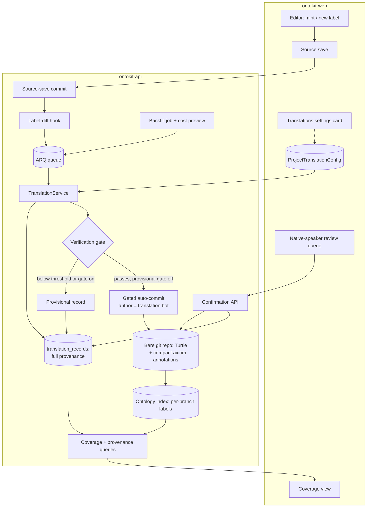
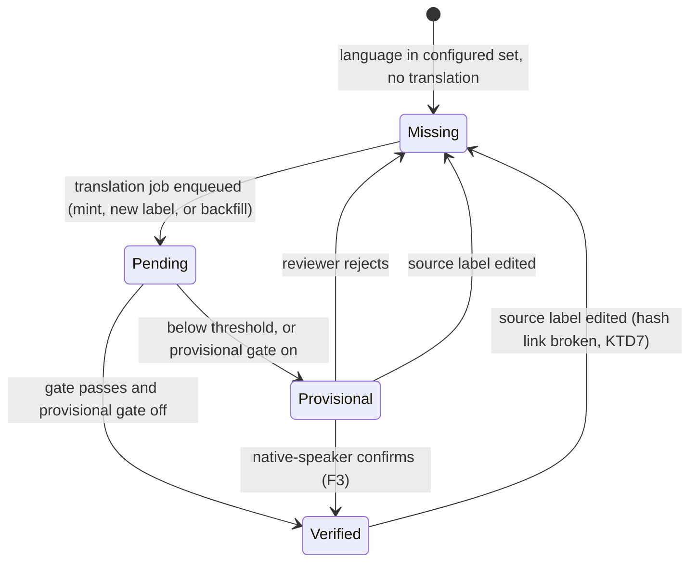

# Multilingual Translation Annotations - Plan

**Target repos:** `ontokit-api` and `ontokit-web`, both at branch `feat/pr-party`. File paths below are repo-relative, prefixed `api:` or `web:`.

## Goal Capsule

- **Objective:** Make LLM-proposed translation a built-in part of authoring any OntoKit ontology — minting a concept proposes translations of its labels into each instance's configured languages, verifies them by machine, records provenance (in-file and in-database), and commits them automatically under an admin-chosen trust gate; a coverage view and cost-previewed admin backfill drive an ontology to multilingual completeness.
- **Authority:** Product behavior is owned by the Product Contract (R1-R14, KD1-KD8). Implementation mechanism is owned by the Planning Contract (KTD1-KTD10). A conflict between them stops work and surfaces to the user; a detail neither owns is implementer judgment.
- **Stop conditions:** Stop and surface if (a) the gated auto-commit path cannot be built without weakening the existing "LLM output never auto-accepts" guard in `api:ontokit/services/trust_service.py`, (b) in-graph provenance annotations cannot round-trip through the web editor without data loss, or (c) `feat/pr-party` moves in a way that invalidates the trust/commit-identity seams this plan extends.
- **Execution profile:** Two-repo feature. Work branches off `feat/pr-party` in each repo (see KTD4). CatholicOS convention: every push gets a PR and a linked issue; PRs are peer-reviewed, never self-merged.

---

## Product Contract

### Summary

Translation becomes a first-class, automatic part of authoring: minting a concept proposes translations of its labels (prefLabel + altLabel) into the instance's configured languages, verifies them by machine, records how each was produced, and commits them under an admin-chosen trust gate — with a coverage view and a cost-previewed bulk job to hydrate existing concepts.

The plan builds this as a dedicated translation subsystem in ontokit-api (engine, gate, provenance, jobs, reviewer role) plus four web surfaces (settings, editor indicators, coverage view, review queue), extending the existing embedding-job, quality-job, review-queue, and LLM-settings patterns.

### Problem Frame

OntoKit already stores language-tagged literals — a Spanish label can sit alongside an English one — but nothing *produces* them, *checks* them, or *tracks* their completeness. In practice FOLIO and the Catholic Semantic Canon are translated only at `rdfs:prefLabel`, and only where a bilingual contributor happened to add a value by hand. The people authoring an ontology are subject-matter experts, not polyglots: the person minting a concept generally cannot supply — or even validate — a Tagalog or Swahili label. So the multilingual surface that would make these ontologies usable across jurisdictions never gets built, and there is no way to see how far from complete it is. The value is concrete for the anchor tenants (FOLIO's worldwide legal reach, the Canon's evangelistic reach) and general for any ontology OntoKit hosts.

### Key Decisions

- KD1. **LLM auto-proposes translations as part of the mint act**, not as a separate user action (session-settled: user-directed — chosen over a distinct "translate" flow: translation rides the authoring the contributor is already doing). Governs R1, R2.
- KD2. **Labels-only by default; long-form fields on-demand.** prefLabel + altLabel auto-translate into all configured languages; `skos:definition`/`skos:example` translate only on explicit request (session-settled: user-directed — chosen over translating everything: bounds graph growth to the short, queryable surface). Governs R2, R3.
- KD3. **The verification mechanism is the commit gate; human PR review is not in the translation path** (session-settled: user-directed — chosen over routing each translation through the Phase A suggestion→PR flow: a human reviewer cannot validate a language they don't read, and per-translation review would flood the queue). Governs R6, R7.
- KD4. **Trust rigor is an admin choice, budget-driven.** Default is multi-model consensus + back-translation; a lower-cost confidence-scored path is selectable; an independent "provisional until a native speaker confirms" gate can layer on either (session-settled: user-directed — chosen over one fixed mechanism: token cost varies by an order of magnitude and the org paying picks its accuracy/cost point). Governs R4, R5, R7.
- KD5. **Per-instance, admin-defined language sets** seeded from a top-N-by-speakers palette (session-settled: user-directed — chosen over a fixed global set: each ontology's stakeholders differ — FOLIO wants the populous long tail, the Canon wants Christian-population-weighted). Governs R2, R10.
- KD6. **Every translation carries its provenance** — producing model/version, method, trust level, verified-vs-provisional, timestamp — so a future era can re-translate a targeted subset (e.g., "replace all machine translations produced by 2026-era models") (session-settled: user-directed). Governs R8, R9, R12.
- KD7. **Backfill is an admin bulk job with a cost preview, defaulting to low-cost async batch**, with a per-org speed-vs-cost choice (session-settled: user-directed — chosen over silent continuous translation: full-ontology translation is a large paid batch and must not surprise the org's bill). Governs R10, R11, R12.
- KD8. **Native-speaker reviewer is a role tag, multi-assignable** — one person may hold several roles (e.g., Admin + Native-Speaker-Reviewer for Spanish) (session-settled: user-directed). Governs R14, R7.

### Actors

- A1. **Contributor** — mints/edits concepts; triggers auto-translation implicitly by authoring new labels. Generally cannot supply or validate non-native translations.
- A2. **Admin (org)** — configures the language set, trust mechanism, translated-field scope, and cost/speed mode; launches bulk backfills; assigns roles.
- A3. **Native-speaker reviewer** — a role tag scoped to one or more languages; confirms provisional translations to promote them to verified. Optional to the common path (only needed when the provisional gate is on).
- A4. **Translation engine (LLM + bot)** — produces, back-translates, scores, and commits translations under the configured gate, attributing commits per the Phase A commit-identity mechanics.

### Requirements

**Generation & scope**

- R1. Minting a concept proposes translations of its labels into every language in the instance's configured set, without the contributor initiating a separate action.
- R2. Translation covers all label types — `rdfs:label`/prefLabel and `skos:altLabel` synonyms — not only the preferred label. The configured set (R10) is the target.
- R3. `skos:definition` and `skos:example` are not auto-translated by default; they translate only on explicit per-entity request or when an admin turns the field on instance-wide.

**Trust & verification**

- R4. An admin selects the instance's verification mechanism: (default) multi-model consensus with back-translation to the source language and agreement scoring, or a lower-cost single-model confidence-scored path.
- R5. An admin may independently require that machine translations stay provisional until a native-speaker reviewer confirms them; when off, sufficiently-verified translations are usable immediately.
- R6. A translation that fails its verification threshold is not committed as verified — it is withheld or marked provisional per the configured gate, never silently accepted.
- R7. Verified translations commit automatically under the trust gate without passing through the human suggestion→PR review flow; the only human touchpoint is the optional native-speaker confirmation of provisional translations.

**Provenance**

- R8. Every translation records its provenance: producing model and version, method (consensus/back-translation/single-model), trust level/score, verified-or-provisional state, and creation timestamp.
- R9. Provenance is queryable well enough to scope a future backfill by it — e.g., "all machine (non-native-confirmed) translations produced by models older than X."

**Coverage & backfill**

- R10. An admin defines the instance's language set, seeded from a top-N-by-speakers palette and freely adjustable; the set is the target for R1/R2 and the coverage view.
- R11. A coverage view shows, per language, what is translated, what is provisional, and what is missing across the ontology, so an ontology can be driven to completeness.
- R12. An admin can launch a bulk backfill that translates existing concepts (or fills a newly-added language) across the ontology, shown an estimated scope and token cost before confirming, and defaulting to a low-cost asynchronous batch mode with a faster higher-cost mode selectable.

**Cost, config & roles**

- R13. Translation token cost is borne by the org running the instance (BYOK), consistent with OntoKit's existing LLM cost model; the trust mechanism, language set, translated-field scope, and speed/cost mode are all per-instance admin settings.
- R14. "Native-speaker reviewer" is a role tag scoped to one or more languages and assignable alongside a person's other roles; only holders of the tag for a language can confirm that language's provisional translations.

### Key Flows

- F1. **Auto-translate at mint.** **Trigger:** a contributor mints a concept and supplies at least a prefLabel. **Covers R1, R2, R4, R7, R8.** The engine proposes translations of the concept's labels into each configured language; verifies each per the configured mechanism; records provenance; commits verified ones automatically (attributed per Phase A commit identity) and marks the rest provisional per R5/R6. Under async batch mode the translations arrive after the mint (F4).
- F2. **Bulk backfill.** **Trigger:** an admin starts a backfill (whole ontology, or a newly-added language). **Covers R10, R11, R12.** The system estimates scope + token cost and shows it; on confirm it translates the missing set under the configured mechanism and cost/speed mode; the coverage view reflects progress and remaining gaps.
- F3. **Native-speaker confirmation.** **Trigger:** the provisional gate is on and a reviewer holds the language's role tag. **Covers R5, R7, R14.** The reviewer confirms (or rejects) provisional translations for their language(s); confirmation promotes provisional → verified and updates provenance.
- F4. **Eventual consistency under batch.** **Covers R12.** When the org chooses async batch, a concept's translations are pending immediately after mint and land later; the coverage view surfaces the pending state so the delay is visible rather than silent.

### Acceptance Examples

- AE1. **Covers R1, R2.** A contributor mints "Bailment" with an English prefLabel and one altLabel; with three configured languages, the system proposes prefLabel + altLabel translations in all three — not the definition, and not only the prefLabel.
- AE2. **Covers R4, R6.** Under consensus mode, two models agree on a French prefLabel and the back-translation matches the source: it commits verified. A third language where the models disagree does not commit verified — it is withheld or marked provisional per the gate.
- AE3. **Covers R5, R7, R14.** With the provisional gate on, a machine Swahili translation is usable but visibly provisional; it becomes verified only when a person holding the Swahili native-speaker role confirms it. A person who is Admin but lacks that language tag cannot confirm it.
- AE4. **Covers R9.** In 2028 an admin scopes a backfill to "machine translations produced by 2026-era models, never native-confirmed"; provenance is sufficient to select exactly that set and leave native-confirmed translations untouched.
- AE5. **Covers R12.** An admin adds a new language to a large ontology; before any tokens are spent they see an estimated count and cost; choosing batch mode runs it asynchronously and the coverage view shows the language filling in over time.

<!-- ce-section: work-relationships -->
### How This Work Fits Together

This plan owns **translations** only — one of five intents recovered from the 2026-08-08 roundup consolidation (`web:docs/residual-review-findings/u6-lens2.md`) that Damien chose to pull back through the full brainstorm→plan process, in sequence. The breakdown below is the current understanding, not a committed roadmap; a later brainstorm may revise it.

- Translations (this plan)
  - **Shares** the LLM cost/BYOK model and the "bot commits under a trust gate" pattern with the other AI-assisted features.
  - **Shares** the Phase A trust-ladder + role model with intent #3 (contributor-credential metadata) and with the native-speaker role tag here.
  - **Can proceed independently of** intent #1 (user-configurable N-day auto-accept), intent #3 (contributor-credential metadata on bot submissions), intent #2 (SSO evaluation — a `ce-pov` verdict), and intent #4 (Generative-FOLIO / folio-python / folio-api / OWL tooling evaluation — a `ce-pov` verdict).
  - **Still to decide:** intents #2 and #4 are adopt-vs-evaluate verdicts better suited to `ce-pov` than to a build brainstorm.

### Scope Boundaries

**Deferred (in the feature's spirit, later):**
- Auto-translating `skos:definition`/`skos:example` by default (on-demand only for now — R3).
- Continuous/background gap-filling beyond the admin bulk job (R12 is admin-triggered; a capped background filler is possible future work).
- Auto-retranslation when a source label is edited. An edited source label orphans its translations (KTD7); the coverage view shows those languages as missing again, and the admin backfill re-fills them. A retranslate-on-edit trigger is follow-up work.

**Outside this plan's identity:**
- Human PR review of individual translations (KD3 — the trust gate replaces it).
- Building or hosting translation models (uses LLM providers via BYOK).
- The other four consolidation-recovered intents — each is its own brainstorm/plan (see How This Work Fits Together).

### Assumptions

- OntoKit's existing language-tagged-literal storage and the ~44-property annotation set (including `rdfs:label`, `skos:altLabel`, `skos:definition`) are the substrate translations attach to; the source label may be authored in any language, with the rest derived from it.
- The Phase A trust ladder + commit-identity mechanics (attributed bot commits) are the basis the native-speaker role tag and translation commits extend.
- Async batch translation is acceptable for the low-cost path because translations hydrate an ontology over time rather than blocking authoring.

---

## Planning Contract

**Product Contract preservation:** meaning unchanged. Edits in this enrichment: implementation-approach sentence added to Summary; label-edit orphaning added to Scope Boundaries as a deferred item (surfaced and approved at the scoping gate); the two planning-deferred Outstanding Questions resolved into KTD1 and KTD2/KTD5 and removed; Sources extended with research anchors.

### Key Technical Decisions

- KTD1. **Hybrid provenance representation** (session-settled: user-directed — chosen over DB-only and over full-in-OWL: the user wants published ontology files to carry their translation provenance, while full detail in-graph would add heavy triple bloat). Governs the mechanism for KD6/R8, R9, R11. Two linked layers:
  - **In the OWL file:** one compact `owl:Axiom` annotation block per machine-translated literal, carrying method, verified-or-provisional state, creation date, and a record digest linking it to its `translation_records` row (KTD7). Vocabulary: reuse PROV-O/DCTerms where a term fits; mint a small `ontokit:` annotation vocabulary for the rest (exact IRIs are implementer's choice, published at a stable namespace). A published ontology is self-describing about which labels are machine translations.
  - **In the database:** a `translation_records` table holding the full operational record — producing model + version, method, scores, back-translation evidence, state, reviewer confirmation, timestamps. Powers the coverage view, review queue, and era-scoped backfill selection (AE4). Closest existing analog: `api:ontokit/models/embedding.py` (`EntityEmbedding`).
  - Native-confirmed human edits carry no axiom block; absence of annotation means human-authored.
- KTD2. **Translations get a dedicated gated commit path — suggestion sessions are not involved** (session-settled: user-approved — chosen over modeling translations as auto-approved suggestion sessions: the existing guard that LLM-generated sessions never auto-accept, `api:ontokit/services/trust_service.py`, stays fully intact and untouched). The engine writes literals and axiom annotations into the branch's Turtle via the bare repository service and commits directly when the verification gate passes. Instantiates KD3; governs R6, R7.
- KTD3. **Server-side trigger: translation work starts when a commit lands, not from the browser** (session-settled: user-approved — chosen over a client-initiated call: covers raw-source-view edits, survives tab close, and keeps the gate server-authoritative). The source-save route and the suggestion-merge paths enqueue a label-diff job after commit; the job determines which entity labels are newly added and enqueues translation work per configured language. An edited label orphans its existing translations per KTD7 and does not retranslate (Scope Boundaries). Governs R1.
- KTD4. **Build atop `feat/pr-party` in both repos** (session-settled: user-approved — chosen over waiting for pr-party to merge: the trust ladder and commit-identity mechanics this plan extends exist only there). Work branches (e.g. `feat/translations`) are cut from `feat/pr-party`; do not rebase `feat/pr-party` itself (stable-hash constraint from the roundup).
- KTD5. **Per-instance translation settings live in a new one-to-one `ProjectTranslationConfig` table** — language set, verification mechanism, thresholds, translated-field scope, speed/cost mode, and the verifier provider/model with its own encrypted key slot (falling back to the project's primary LLM key). Modeled on `api:ontokit/models/embedding.py` (`ProjectEmbeddingConfig`). The engine resolves its own models from this config — deliberately decoupled from `ProjectLLMConfig.model` and its unresolved tier→model gap. Instantiates KD5/KD4 config surface; governs R10, R13.
- KTD6. **A new `TranslationService` orchestrates verification above the provider layer.** Nothing multi-provider exists today (single-provider calls only: `api:ontokit/services/suggestion_generation_service.py`). Consensus mode: primary model proposes, second model independently proposes, back-translation to source language, agreement scoring across the three signals. Confidence mode: primary model proposes with self-reported confidence plus back-translation check. Thresholds come from KTD5 config; admin-adjustable with shipped defaults. Two contracts bound the mechanism: **scoring** — each signal has a defined normalized range, an explicit composition into the final score, hard-failure semantics (a failed signal never silently passes), and threshold semantics from KTD5, validated against a multilingual calibration fixture of known-good and known-bad translations with stated false-accept/false-reject bounds before auto-commit is enabled; **egress** — every provider receiving ontology content is admin-visible in config, prompts carry only the target literal plus strictly necessary context (never secrets or unrelated graph data), and prompt/back-translation content is redacted from application and audit logs. Instantiates KD4; governs R4, R6.
- KTD7. **Provenance links to its literal by content hash and is branch-agnostic.** A `translation_records` row is keyed by (project, entity IRI, predicate, language, source-value hash, translated-value hash) — no branch column. A branch inherits a record's provenance only when both hold: the branch contains that exact literal (hash match) and the literal carries the in-graph provenance annotation (KTD1) whose record digest resolves to that row — textual coincidence alone never marks a human-authored label machine-verified. Merges need no bookkeeping (the annotation travels with the literal). Coverage is computed per-branch by joining the branch's indexed labels (`api:ontokit/models/ontology_index.py`, `IndexedLabel` — already language-aware) against translation records under that annotation-plus-hash rule. Editing a source label breaks the hash link: translations of the old value become orphaned and their languages show as missing again (session-settled: user-approved as a scope boundary). Governs R9, R11.
- KTD8. **Native-speaker reviewer is a separate association, not a role value.** The scalar `role` column on `ProjectMember` (`api:ontokit/models/project.py`) stays untouched; a new member↔language association table carries the per-language reviewer tags, multi-assignable per KD8. Confirmation endpoints authorize against it. Governs R14.
- KTD9. **Translation commits split author from committer.** The bare repository commit seam (`api:ontokit/git/bare_repository.py`, today one signature for both) gains an optional distinct author: author = the translation-engine bot persona (model attribution per KD6), committer = the OntoKit bot identity (`api:ontokit/core/constants.py`), following the commit-identity conventions in `api:ontokit/services/commit_identity.py`. This is the same seam the Phase A author≠committer proof needs; build it minimally here.
- KTD10. **Backfill mirrors the embedding-job lifecycle; batch mode uses provider batch APIs.** Durable job row (status, totals, progress, error) + one-active-job-per-project partial unique index + commit-before-enqueue, per `api:ontokit/models/embedding.py` (`EmbeddingJob`) and `api:ontokit/api/routes/embeddings.py`. The low-cost batch mode submits work through the configured provider's discounted asynchronous batch API where one exists (OpenAI Batch, Anthropic Message Batches — ~50% discount); where none exists it falls back to throttled standard calls and the preview shows no discount. Fast mode uses standard calls at higher concurrency. The cost preview prices each call individually — prompt/context input tokens and bounded output tokens for every translate/verify/back-translate call, at the model's separate input/output rates via `api:ontokit/services/llm/base.py` `estimate_tokens` and `api:ontokit/services/llm/pricing.py` (fails loudly on unknown models), with the batch discount applied when batch mode is selected — returning an expected figure plus a conservative upper bound. Instantiates KD7; governs R12.

### High-Level Technical Design

Pipeline and components (both repos):

Translation lifecycle per (entity, predicate, language):

Diagrams are directional guidance; prose and KTDs are authoritative on disagreement.

### Sequencing

Four phases, each independently landable: **Phase 1** api foundation (U1-U5), **Phase 2** api jobs & roles (U6-U9), **Phase 3** web surfaces (U10-U13), **Phase 4** cross-layer proof (U14). Phase 3 units can start against Phase 1/2 API contracts before Phase 2 fully lands.

### Planning Assumptions

- The pr-party review's P0 fixes proceed on their own track; this plan avoids depending on the broken seams (KTD5 decouples from the model-config gap; KTD2 avoids suggestion sessions entirely).
- Prompt-injection hardening for translation prompts follows the existing centralized prompt hardening (`api:ontokit/services/llm/prompts/__init__.py`); translated output is written as escaped literals via RDFLib server-side, so the RDF-injection surface of the suggestion path does not apply.
- Concurrency: all three commit paths (source save, suggestion merge, translation) hold the shared branch write lock introduced by U5 — today only the suggestion path locks, so the seam must be extracted, not merely reused. The known cross-process (multi-worker) lock gap remains tracked by the review and is not widened by this plan.

---

## Implementation Units

| U-ID | Title | Key files | Depends on |
|---|---|---|---|
| U1 | Provenance store | api: models/migration for `translation_records` | — |
| U2 | Translation settings & palette | api: config model, routes | — |
| U3 | Translation engine | api: `TranslationService`, prompts | U2 |
| U4 | In-graph provenance annotations | api: RDF annotation writer/reader | U1 |
| U5 | Gated auto-commit path | api: commit path, author/committer split | U1, U3, U4 |
| U6 | Mint trigger & translation jobs | api: label-diff hook, ARQ jobs | U3, U5 |
| U7 | Backfill & cost preview | api: job + preview endpoint | U6, U8 |
| U8 | Coverage & provenance queries | api: coverage endpoints | U1 |
| U9 | Reviewer role & confirmation API | api: association table, endpoints | U1, U5 |
| U10 | Web client & settings card | web: api client, settings UI | U2 |
| U11 | Web editor surfaces | web: language flags, badges, axiom preservation | U8 |
| U12 | Web coverage view & backfill launch | web: coverage page | U7, U8 |
| U13 | Web review queue | web: queue page, notifications | U9 |
| U14 | Cross-layer integration proof | api: integration test | U6, U7, U8, U9 |

### U1. Provenance store

- **Goal:** Durable full-detail provenance for every machine translation.
- **Requirements:** R8, R9 (KD6, KTD1, KTD7).
- **Files:** `api:ontokit/models/translation.py` (new), `api:alembic/versions/<new>_add_translation_tables.py`, `api:tests/unit/test_translation_models.py`.
- **Approach:**
  - `translation_records` table per KTD7 key shape, plus: model, model version, method, score, state (verified/provisional/rejected), created/confirmed timestamps, confirming member id.
  - Value-hash helper shared with U4/U8 (normalize then hash literal value).
  - Declare constraints on the model so `create_all` test schemas match migrations (review lesson: absent CHECK constraints in test schemas hid a P0).
- **Patterns to follow:** `api:ontokit/models/embedding.py` (`EntityEmbedding` keys, partial unique indexes); alembic conventions per existing versions.
- **Test scenarios:**
  - Insert and re-query a record by (project, IRI, predicate, lang, hashes); uniqueness violation on exact duplicate rejected.
  - Query "machine records for models older than X, never confirmed" returns exactly the era-scoped set (AE4 shape).
  - State transition provisional→verified stamps confirmer and timestamp.
- **Verification:** Unit tests green; migration up/down clean on a scratch database.

### U2. Translation settings & palette

- **Goal:** Per-instance admin configuration for everything translation.
- **Requirements:** R10, R13 (KD4, KD5, KTD5).
- **Files:** `api:ontokit/models/translation.py` (config model), `api:ontokit/schemas/translation.py` (new), `api:ontokit/api/routes/translation.py` (new: config CRUD), `api:ontokit/services/language_palette.py` (new), `api:tests/unit/test_translation_config.py`.
- **Approach:**
  - `ProjectTranslationConfig` per KTD5: language set (JSON list of BCP 47 tags), mechanism, thresholds, field scope, speed mode, verifier provider/model, encrypted verifier key (crypto per existing `api:ontokit/services/llm/crypto.py` usage).
  - Palette: static top-N-languages-by-speakers constant with tags + display names, served by an endpoint for the web picker seed.
  - Owner/admin gate mirrors `api:ontokit/api/routes/llm.py` config routes; key never echoed back.
- **Patterns to follow:** `ProjectEmbeddingConfig`; `api:ontokit/api/routes/llm.py` (gating, schema split, test-connection shape).
- **Test scenarios:**
  - Non-admin config write rejected; admin write persists and round-trips without exposing the key.
  - Invalid language tag (over-length, empty) rejected; duplicate tags deduplicated.
  - Config read for a project without a row returns defaults (consensus mode, empty language set).
- **Verification:** Unit tests green; OpenAPI schema shows no key leakage.

### U3. Translation engine

- **Goal:** Produce and machine-verify translations under both configured mechanisms.
- **Requirements:** R4, R6 (KD4, KTD6).
- **Files:** `api:ontokit/services/translation_service.py` (new), `api:ontokit/services/llm/prompts/translation.py` (new), `api:tests/unit/test_translation_service.py`, `api:tests/fixtures/translation_calibration/` (new — multilingual known-good/known-bad corpus).
- **Approach:**
  - `TranslationService` per KTD6, provider-agnostic via the existing registry (`api:ontokit/services/llm/registry.py`); per-call token/cost accounting through `log_llm_call` and `check_budget` so translation spend is metered from day one (review lesson: unmetered embedding spend).
  - Prompt builders: translate (source label + context labels, delimited as untrusted), back-translate, and verify — through the central hardening in `api:ontokit/services/llm/prompts/__init__.py`.
  - Deterministic scoring output: per-language result carries proposed value, score, method inputs.
- **Execution note:** Build test-first against fake providers; every gate branch (agree/disagree/low-confidence) asserted without patching the scorer itself.
- **Test scenarios:**
  - Consensus: models agree + back-translation matches → score above default threshold.
  - Consensus: models disagree → below threshold; result flagged, never silently passed (R6).
  - Confidence mode: low self-reported confidence → below threshold.
  - Provider error on the verifier model → the language's result is marked failed, other languages unaffected.
  - Budget exhausted → no provider call is made; audit row absent, error typed.
  - Prompt inputs containing injection-style label text are delimited; output parsed strictly (no greedy JSON salvage).
  - Calibration fixture: known-good and known-bad translations across at least three languages score inside the stated false-accept/false-reject bounds (KTD6 scoring contract).
  - Outbound payload contains only the target literal plus allowed context; prompt and back-translation text absent from application/audit logs (KTD6 egress contract).
- **Verification:** Unit tests green; an audit row exists for every provider call in tests; calibration fixture passes before auto-commit is enabled anywhere.

### U4. In-graph provenance annotations

- **Goal:** Compact standards-based provenance inside the OWL file per KTD1.
- **Requirements:** R8 (KD6).
- **Files:** `api:ontokit/services/translation_annotations.py` (new), `api:tests/unit/test_translation_annotations.py`.
- **Approach:**
  - RDFLib writer that attaches one `owl:Axiom` annotation block (annotatedSource/Property/Target + method, state, date terms) to a given lang-tagged label literal; reader that finds and updates/removes the block for a literal.
  - Idempotent: re-annotating the same literal replaces, never duplicates; serialization stays deterministic through the existing isomorphic-graph serializer (`api:ontokit/git/bare_repository.py`).
- **Test scenarios:**
  - Annotate a Spanish prefLabel → serialized Turtle contains exactly one axiom block with the three terms; round-trip parse recovers them.
  - Promote provisional→verified updates the state term in place.
  - Removing the literal's annotation leaves no orphan axiom triples.
  - A human-authored label (no annotation) is untouched by reader/writer passes.
- **Verification:** Unit tests green; serialized fixture diff reviewed for compactness (single-digit triples per translation).

### U5. Gated auto-commit path

- **Goal:** Verified translations land in the branch's Turtle automatically; provisional ones are recorded without weakening any existing guard.
- **Requirements:** R6, R7 (KD3, KTD2, KTD9).
- **Files:** `api:ontokit/services/translation_service.py` (commit stage), `api:ontokit/services/branch_lock.py` (new — shared write-lock seam), `api:ontokit/git/bare_repository.py` (optional distinct author), the source-save and suggestion-merge call sites (adopt the shared lock), `api:tests/unit/test_translation_commit.py`.
- **Approach:**
  - Apply-stage per KTD2: parse branch Turtle, add verified literals + axiom blocks (U4), serialize, commit through `commit_changes` with its real signature (never a mocked-into-existence method — review P0 lesson).
  - Author/committer split per KTD9; commit message names languages and method.
  - Provisional results write `translation_records` only (plus axiom block marked provisional if admin chose to surface provisional values in-file — default: provisional values live only in the record until confirmed; U8 list endpoints expose them for display).
  - **Shared branch write lock (prerequisite):** extract the branch write lock into a shared service held by source saves, suggestion merges, and translation commits across their full read-modify-write — today only the suggestion path locks and the source-save route commits unlocked, so reusing the suggestion lock alone cannot make this safe. `trust_service` untouched.
  - **Apply-time revalidation:** under the write lock, re-read the branch and verify the source literal still matches the job's source-value hash and the target slot is still eligible; on mismatch, discard the result without committing — a stale in-flight job never lands.
  - **Coalesced commits + index refresh:** batch all verified languages for an entity into one commit where they arrive together; after each translation/confirmation commit, enqueue the ontology-index rebuild for (project, branch, commit), deduplicated per (project, branch) like the embedding jobs' active-job guard — a burst of translation commits produces one rebuild, not one per language.
- **Test scenarios:**
  - Verified French label → commit exists on the branch with author=translation bot, committer=OntoKit bot; Turtle contains literal + axiom block.
  - Below-threshold language → no commit for it; record row state provisional.
  - Concurrent user save + translation commit on one branch → both commits land, neither lost (both paths hold the shared lock).
  - In-flight edit race: the source label changes after the job snapshots it → apply-stage discards; nothing committed.
  - Burst of verified languages for one entity → coalesced commit(s) and exactly one index-rebuild job enqueued; coverage reflects the literals after indexing.
  - `git log` diff for a translation commit touches only the target entity's block.
- **Verification:** Unit tests green including one test committing through the real git service against a temp bare repo (existing conftest fixtures).

### U6. Mint trigger & translation jobs

- **Goal:** Translation work starts server-side whenever labels land, per KTD3.
- **Requirements:** R1, R2, R3 (KD1, KD2).
- **Files:** `api:ontokit/worker.py` (register jobs), `api:ontokit/services/translation_jobs.py` (new), source-save route hook in `api:ontokit/api/routes/` (existing source route), `api:tests/unit/test_translation_jobs.py`.
- **Approach:**
  - Post-commit hook on source-save and suggestion-merge paths: enqueue a label-diff job (commit-before-enqueue per KTD10 pattern).
  - Label-diff job compares the commit's parent tree to identify newly added `rdfs:label`/prefLabel/altLabel values (an edited value orphans its old translations per KTD7 and is not retranslated); skips languages already covered by a matching hash; enqueues per-entity translation work honoring field scope (R3: definitions/examples only when configured or explicitly requested via an on-demand endpoint).
  - Speed mode from config selects the execution route per KTD10 (provider batch API vs standard calls) and throttles standard-call fan-out.
  - Every trigger carries the authenticated initiating actor into the job; existing role and rate limits are enforced before any paid enqueue (mint hook and on-demand endpoint alike); per-project queued-translation fan-out is capped.
- **Test scenarios:**
  - Mint with prefLabel + altLabel and three configured languages → six translation tasks (AE1 shape).
  - Repeated label churn by one contributor hits the rate limit → enqueues stop, attributed to the actor; other contributors unaffected.
  - Repeated on-demand requests throttle per the same limiter.
  - Editing an unrelated annotation (not a label) → no translation tasks.
  - Re-saving an unchanged label → no tasks (hash short-circuit).
  - Definition present but field scope off → not translated; on-demand endpoint enqueues it for one entity (R3).
  - Config with empty language set → hook is a no-op.
- **Verification:** Unit tests green; job registered in the ARQ worker function list.

### U7. Backfill & cost preview

- **Goal:** Admin drives an existing ontology to completeness with cost known up front.
- **Requirements:** R12 (KD7, KTD10).
- **Files:** `api:ontokit/models/translation.py` (`TranslationJob` row), `api:ontokit/api/routes/translation.py` (preview + launch + status), `api:ontokit/services/translation_jobs.py` (backfill job), `api:tests/unit/test_translation_backfill.py`.
- **Approach:**
  - Preview endpoint computes the missing set (U8's coverage query) and prices it per KTD10's per-call model — input/context and bounded output tokens for every translate/verify/back-translate call at the model's separate input/output rates, batch discount applied when batch mode is selected; returns counts, expected cost, and a conservative upper bound; spends nothing.
  - Launch per KTD10 lifecycle: durable row, one active job per project, progress updates, resumable on failure; batch mode routes through the provider batch API (throttled standard calls as fallback where unsupported); era-scoped launch accepts a provenance filter (AE4) passed to the record query from U1.
- **Test scenarios:**
  - Preview on a project with known gaps returns exact literal count and a nonzero cost; zero provider calls made (AE5 first half).
  - Preview with unequal input/output prices and non-empty context labels sums per-call correctly; batch mode shows the discounted figure, and no discount when the provider lacks a batch API.
  - Second launch while one active → conflict response (mirrors embeddings 409 guard).
  - Backfill for one newly-added language translates only that language's gaps.
  - Era-scoped backfill selects only never-confirmed machine records older than the cutoff; native-confirmed rows untouched (AE4).
  - Job failure mid-run leaves progress recorded; relaunch completes the remainder without duplicating verified work.
- **Verification:** Unit tests green; preview endpoint provably side-effect-free (no audit rows in test).

### U8. Coverage & provenance queries

- **Goal:** Per-language completeness and provenance are queryable per branch.
- **Requirements:** R9, R11 (KTD7).
- **Files:** `api:ontokit/api/routes/translation.py` (coverage + list endpoints), `api:ontokit/services/translation_coverage.py` (new), `api:tests/unit/test_translation_coverage.py`.
- **Approach:**
  - Coverage per KTD7: join branch's `IndexedLabel` rows against `translation_records` under the annotation-plus-hash rule; classify each (entity, predicate, language) into verified / provisional / pending / missing; aggregate per language.
  - List endpoints power the review queue (provisional rows for languages X) and provenance inspection for a literal, and return provisional record values so the editor can display them (AE3, U11).
  - Read access mirrors project view permissions; no unauthenticated paid calls (these endpoints never hit providers).
- **Test scenarios:**
  - Ontology with 2 entities × 3 languages, one verified + one provisional + rest missing → coverage matrix matches exactly.
  - Orphaned record (source label edited, hash mismatch) counts as missing, not verified (KTD7).
  - Branch A verified literal (with its annotation) also present on branch B → both branches report it verified (annotation travels with the literal).
  - Identical human-authored label with no in-graph annotation → stays human-authored, never machine-verified (KTD7).
  - Provisional record values returned by the list endpoint for editor display.
  - Pending state visible while a job row is active for that scope (F4).
- **Verification:** Unit tests green.

### U9. Reviewer role & confirmation API

- **Goal:** Per-language native-speaker confirmation, correctly authorized.
- **Requirements:** R5, R14 (KD8, KTD8).
- **Files:** `api:ontokit/models/translation.py` (member↔language association), `api:alembic/versions/<new>` (same migration as U1 or follow-on), `api:ontokit/api/routes/translation.py` (assign/list/confirm/reject), `api:tests/unit/test_native_reviewer.py`.
- **Approach:**
  - Association table per KTD8; admin assigns/removes tags via member endpoints extension.
  - Confirm: provisional→verified — updates record (U1), rewrites the axiom state term via U4, commits via U5's path attributed to the confirming human per commit-identity conventions. Reject: transitions the record to `rejected` — retained for provenance per R8 — and removes any surfaced provisional literal and its axiom annotation.
  - Object-scope authorization: assign/confirm/reject/bulk operations load records through the path project and verify each record's project + language binding and the actor's membership before acting — no cross-project or cross-language record IDs are honored.
- **Test scenarios:**
  - Reviewer with Swahili tag confirms a Swahili provisional → verified, provenance updated, commit authored by the reviewer (AE3).
  - Bulk confirm containing another project's record id → rejected with nothing committed; mixed-language bulk succeeds only for the caller's tagged languages, failures itemized.
  - Admin without the Swahili tag → confirmation rejected (AE3 second half).
  - One person holding Admin + reviewer tags for two languages can confirm both languages (KD8).
  - Reject marks the record `rejected` (row retained); coverage flips that cell to missing.
- **Verification:** Unit tests green; authorization matrix asserted per role×tag combination.

### U10. Web client & settings card

- **Goal:** Admin configures translations from project settings.
- **Requirements:** R10, R13 (KD4, KD5).
- **Files:** `web:lib/api/translations.ts` (new), `web:lib/hooks/useTranslationConfig.ts` (new), `web:components/projects/TranslationSettingsSection.tsx` (new), `web:app/projects/[id]/settings/page.tsx` (mount card), `web:__tests__/` mirrors per repo convention.
- **Approach:**
  - API client + hooks per repo conventions (`web:lib/api/client.ts` delegation, React Query keys, mutation invalidation).
  - Settings card in the admin AI area mirroring `web:components/projects/LLMSettingsSection.tsx`: language set editor seeded from the palette endpoint using the existing `web:components/editor/LanguagePicker.tsx`; mechanism radio; provisional-gate checkbox; field-scope toggles; speed mode; verifier provider/model + key input (never echoed).
  - Actuation calls set `retryOn5xx: false` (review lesson: default retry re-bills).
  - Full save-state lifecycle: loading, load-error, dirty, saving, saved, and field-level validation states; Save disabled until valid changes exist; entered values preserved after a failed save.
  - A11y per repo conventions (announcer/ARIA live already in the app): labeled and grouped controls, keyboard operation with visible focus, status never conveyed by color alone.
- **Test scenarios:**
  - Card renders config; save round-trips and invalidates the query.
  - Language add via palette and via custom BCP 47 tag both persist; remove updates the set.
  - Failed save preserves entered values and shows a field-level error; Save disabled while pristine or invalid.
  - Keyboard-only pass: all controls reachable and operable.
  - Non-admin sees no card (mirrors existing admin gating).
- **Verification:** `npm run test`, `lint`, `type-check` green; visual check of the card per repo convention.

### U11. Web editor surfaces

- **Goal:** Per-language display with provisional/verified state in the editor — without the editor destroying in-graph provenance.
- **Requirements:** R3, R5 (KD2), plus the read-only-label language gap.
- **Files:** `web:components/editor/ClassDetailPanel.tsx`, `web:lib/ontology/turtleClassUpdater.ts`, `web:lib/ontology/turtleUtils.ts`, `web:lib/api/translations.ts` (state fetch), `web:__tests__/` for the updater.
- **Approach:**
  - Read-only labels gain `LanguageFlag` (parity with definitions/comments) plus a provisional/verified/pending badge from U8's per-entity state.
  - **Axiom-block preservation:** `turtleClassUpdater` regenerates an entity's block wholesale today; teach it to carry the entity's `owl:Axiom` annotation blocks through regeneration untouched, and to drop a block whose annotated literal was deleted in the edit. This is load-bearing for KTD1 — without it, any web edit destroys in-file provenance.
  - On-demand translation per R3: one inline per-field action on `skos:definition`/`skos:example` — visible when the field has a source value and languages are configured, role-gated like other LLM actions; confirm → loading/disabled → success or typed-error feedback; an in-flight async request reads clearly as pending, never as done.
  - Provisional display: provisional values from U8 render as labels with a calm, low-key provisional marker (subtle badge/tint — informative, not alarming: machine translations are expected to be good) and are never written to the source buffer; post-mint pending indicator keyed by entity IRI (F4), fed by U8 state.
  - A11y: flags and badges carry text equivalents; badge/state changes announced via the existing live-region conventions.
- **Execution note:** Add characterization tests around `turtleClassUpdater`'s current block regeneration before modifying it — legacy, historically fragile (`findBlock` continuation-line lesson).
- **Test scenarios:**
  - Editing an unrelated annotation on an entity with translated labels → serialized Turtle retains every axiom block byte-for-byte semantics.
  - Deleting a translated altLabel → its axiom block is dropped, others retained.
  - Labels render language flags; provisional badge appears for provisional state and clears after confirmation (AE3 visibility).
  - Pending indicator shows for a freshly minted entity under async mode and clears when translations arrive (F4).
  - On-demand action lifecycle: click → confirm → pending → arrived value displays; error path shows a retryable message.
  - Provisional value renders with its marker, is announced to screen readers, and never lands in the source buffer.
- **Verification:** Web suite green; visual check of badges and flags.

### U12. Web coverage view & backfill launch

- **Goal:** Coverage matrix plus safe backfill launch with the cost preview in front.
- **Requirements:** R11, R12 (KD7).
- **Files:** `web:app/projects/[id]/translations/page.tsx` (new), `web:lib/hooks/useTranslationCoverage.ts` (new), `web:lib/api/translations.ts` (coverage/backfill methods), project navigation (mount role-aware link), tests per convention.
- **Approach:**
  - Per-language matrix (verified/provisional/pending/missing) built on the analytics page's hand-rolled Tailwind patterns; per-language drill-down lists gaps.
  - Backfill: preview-then-run mirroring the normalization bulk-op lifecycle in settings (preview card → confirm → job status → history); job status via poll (quality-job pattern).
  - Launch is admin-gated; preview cost displayed before any confirm is possible (AE5).
  - Role-aware project-nav entry ("Translation Coverage") mounted in the project navigation.
  - A11y: the matrix renders as an accessible table (proper headers/scope), keyboard navigable; cell states carry text, not color alone; job progress announced politely.
- **Test scenarios:**
  - Matrix renders API coverage shape correctly, including a pending language mid-backfill (F4/AE5).
  - Nav entry visible and routes correctly for project members.
  - Confirm button disabled until preview loads; launching twice surfaces the active-job conflict cleanly.
  - Era-scoped filter (model-era + never-confirmed) is expressible in the launch form (AE4 admin surface).
- **Verification:** Web suite green; visual check of matrix and preview modal.

### U13. Web review queue

- **Goal:** Native-speaker reviewers confirm/reject provisional translations per language.
- **Requirements:** R5, R14 (KD8).
- **Files:** `web:app/projects/[id]/translations/review/page.tsx` (new), `web:lib/api/translations.ts` (queue methods), project navigation (mount role-aware link), tests per convention.
- **Approach:**
  - Queue mirrors the suggestion review page shape: language/status filters replace trust-tier filters; rows show source literal, proposed translation, provenance (model, method, score, date); bulk confirm with per-item partial-failure retention.
  - Access: only members holding a reviewer tag (or admins for viewing); confirm actions enabled per the caller's tagged languages. Role-aware project-nav entry ("Translation Review") visible to reviewers/admins is the entry point.
  - Per-row reject: confirmation step, pending and error feedback; a rejected row leaves the confirmable set immediately.
  - A11y: queue rows, filters, and bulk actions keyboard-operable; per-item results and partial failures announced via live region.
- **Test scenarios:**
  - Reviewer tagged for Swahili sees only confirmable Swahili rows enabled (AE3).
  - Reject flow: confirm → row transitions to rejected and cannot subsequently be confirmed from the same queue state; a server error keeps the row visible with its error.
  - Bulk confirm with one server-side failure keeps the failed row visible with its error.
  - Empty state renders when no provisional rows exist for the reviewer's languages.
- **Verification:** Web suite green; visual check of the queue.

### U14. Cross-layer integration proof

- **Goal:** The advertised loop provably works against real seams — no mocked-into-existence behavior.
- **Requirements:** F1, F2, F3 end-to-end; AE1-AE5.
- **Files:** `api:tests/integration/test_translation_lifecycle.py` (new).
- **Approach:** One real-Postgres + real-git integration test module (existing integration fixtures; fake LLM providers only at the HTTP-provider boundary): configure languages → mint via source-save → jobs run inline → verified commit lands with split author/committer and axiom annotations → coverage reflects it → provisional row confirmed via API promotes state and commits → era-scoped backfill selects exactly the right set.
- **Execution note:** This unit is the plan's proof; the roundup's core lesson is that unit tests mocking every seam prove nothing. Do not substitute mocks for Postgres or git here.
- **Test scenarios:**
  - Full mint→translate→commit→coverage pass (AE1, AE2).
  - Provisional-gate-on path with confirmation (AE3).
  - Cost preview then backfill for an added language (AE5).
  - Era-scoped selection precision (AE4).
  - In-flight edit race: label edited while its translation runs → stale result discarded, no commit (U5 revalidation).
- **Verification:** `pytest -m integration` green with `DATABASE_URL`/`REDIS_URL` set.

---

## Verification Contract

| Gate | Command | Applies to |
|---|---|---|
| api unit tests | `pytest` (repo root, ontokit-api) | U1-U9 |
| api integration tests | `pytest -m integration` with `DATABASE_URL`/`REDIS_URL` | U5, U14 |
| web tests | `npm run test` | U10-U13 |
| web lint + types | `npm run lint` && `npm run type-check` | U10-U13 |
| Visual verification | Chrome DevTools MCP screenshots of settings card, editor badges, coverage view, review queue | U10-U13 |

Quality gates: every provider call in translation code paths produces an audit row (assert in tests); no endpoint added by this plan makes an unauthenticated provider call; the trust-service auto-accept guard file is byte-identical unless a test proves the change safe.

---

## Definition of Done

- All units U1-U14 implemented with their test scenarios passing; both repos' full suites green.
- AE1-AE5 each demonstrated by a named test in U14 (or earlier units).
- A published/exported ontology file containing machine translations carries compact per-translation provenance annotations readable by a plain RDF parser (KTD1 proof).
- Web edits round-trip in-graph provenance without loss (U11 preservation tests).
- Translation spend is metered: audit rows and budget checks cover every translation provider call; paid enqueues are rate-limited and actor-attributed.
- Verification gate calibrated: the multilingual fixture passes within its stated false-accept/false-reject bounds before auto-commit is enabled (KTD6).
- No abandoned experimental code in the diff; PRs opened per CatholicOS convention (PR + linked issue, peer review, no self-merge).

---

## Risks & Dependencies

- **`feat/pr-party` is unmerged and under active fix-up** (P0/P1 review findings). This plan's seams (trust ladder, commit identity, provider registry, budget) live there; a large refactor there would ripple. Mitigation: KTD4 branches from it without rebasing; U14 pins behavior with integration tests.
- **Editor round-trip destruction of axiom blocks** is the highest-blast-radius risk of KTD1's in-file half. U11 owns it with characterization-first tests; stop condition (b) applies if preservation proves infeasible.
- **Consensus cost multiplier:** consensus mode ≈ 3 provider calls per literal per language. Bounded by labels-only default (KD2), cost preview (KD7), and per-call budget metering (U3). Admins can select confidence mode.
- **Provisional-value surfacing:** provisional values stay out of the committed file until confirmed (U5); U8's list endpoints plus U11's low-key provisional display give editors visibility without committing them.
- **Provider batch-API variance:** batch-mode discounts and turnaround differ per provider, and some providers offer no batch API; KTD10's fallback (throttled standard calls, honest preview) keeps behavior defined everywhere, but per-provider batch adapters are real engine work to scope in U7.
- **Known pre-existing gaps not widened here:** multi-worker branch-lock gap and prompt-injection hardening depth are tracked by the 2026-08-08 LLM subsystem review (`web:docs/residual-review-findings/2026-08-08-llm-subsystem-review.md`); translation units follow the stricter patterns (typed errors, no greedy JSON salvage, metered calls) regardless.

---

## Open Questions

- **Deferred to implementation (non-blocking):** exact `ontokit:` annotation vocabulary IRIs and namespace document (KTD1 gives the shape); shipped default thresholds for consensus agreement and confidence scores (KTD6 makes them admin-adjustable, so defaults are tunable after real-world calibration).

---

## Sources / Research

- `web:lib/ontology/annotationProperties.ts` — the annotation property set (`rdfs:label`, `skos:altLabel`, `skos:definition`, `dc:language`, `dcterms:language`) translations attach to.
- `web:components/editor/ClassDetailPanel.tsx`, `web:lib/ontology/turtleClassUpdater.ts` — existing per-value language-tag handling and label/comment serialization; read-only labels currently omit language flags.
- `web:lib/ontology/suggestionProvenance.ts`, `web:lib/ontology/turtleSnippetGenerator.ts` — existing entity-level PROV-O provenance; code comments reject reusing it for statement level, motivating KTD1.
- `api:ontokit/services/llm/registry.py`, `api:ontokit/services/suggestion_generation_service.py` — provider registry and the single-provider generation precedent KTD6 extends.
- `api:ontokit/models/embedding.py`, `api:ontokit/api/routes/embeddings.py` — the config-table and durable-job lifecycle patterns for KTD5/KTD10.
- `api:ontokit/services/trust_service.py`, `api:ontokit/services/commit_identity.py`, `api:ontokit/git/bare_repository.py` — trust guard, identity conventions, and the commit seam KTD2/KTD9 build on.
- `api:ontokit/services/llm/pricing.py`, `api:ontokit/services/llm/budget.py`, `api:ontokit/services/llm/audit.py` — pricing/budget/audit infrastructure the cost preview and metering reuse.
- `web:docs/residual-review-findings/2026-08-08-llm-subsystem-review.md` — cross-cutting review whose lessons (real-seam tests, metered spend, no retry-on-actuation, constraint parity between models and migrations) shaped U1, U3, U5, U10, U14.
- `web:docs/residual-review-findings/u6-lens2.md` — where this intent was found dropped in the 2026-08-08 consolidation.
- `web:docs/plans/2026-08-08-001-feat-ontokit-roundup-execution-plan.md` — the roundup plan; Phase A trust ladder + commit-identity this feature extends.
