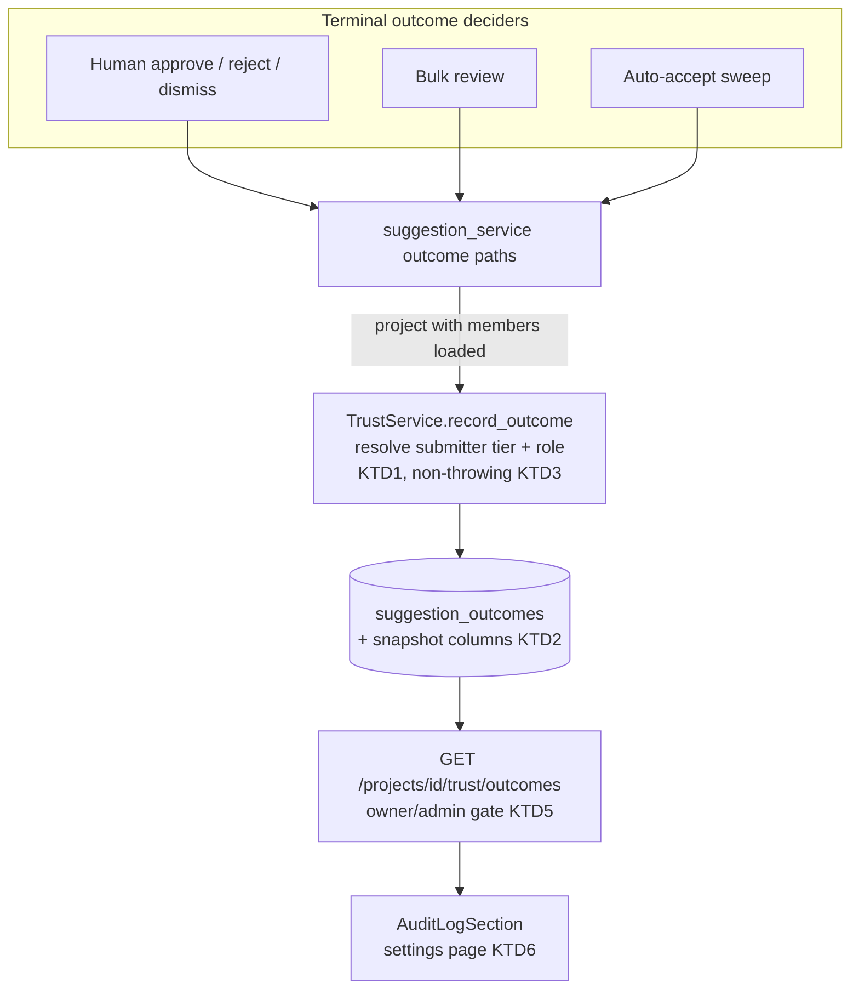

# Submission Audit Snapshot - Plan

**Target repos:** ontokit-api (backend, units U1–U4) and ontokit-web (frontend, units U5–U6). Both branch from `feat/translations` — the trust-ladder code this plan extends exists only there (KTD4). This plan document lives in ontokit-web; all paths below are repo-relative and prefixed with the owning repo.

## Goal Capsule

- **Objective:** Capture an audit snapshot of each suggestion submitter's standing — trust tier, project role, attribution — at the moment each terminal suggestion outcome is decided, and give project owners an in-app audit view.
- **Product authority:** The Product Contract below (R1–R8) owns product behavior; the Planning Contract owns implementation mechanism within those constraints. This plan owns only the audit-snapshot capability; sibling intents are context (see How This Work Fits Together).
- **Execution profile:** Backend first (U1→U4), frontend after the endpoint exists (U5→U6). U4 (real-seam proof) is a verification gate, not optional coverage.
- **Stop conditions:** If `feat/translations` (PR alea-institute/ontokit-api#12) is reshaped by peer review in a way that moves or renames the outcome log or trust services, stop and re-check KTD1/KTD2 before continuing. If `feat/translations` gains any new alembic revision after planning, re-confirm `alembic heads` before U1 lands. If snapshot capture is found to require a change to trust-promotion behavior, stop — that is a product-scope change this plan does not authorize.
- **Open blockers:** None.

---

## Product Contract

**Preservation note:** changed: R1 — "changes-requested" removed from snapshot scope (user-approved 2026-08-09): request-changes is non-terminal by design and writes no outcome row; recording one would silently change the trust-promotion outcome count. Outstanding Questions resolved in place (audit view location → KTD6; decider-role capture → rejected, see Scope Boundaries). Doc-review round (user-approved 2026-08-10): R5 gained the decision-time definition (pre-promotion, in-transaction); R8 now requires human-readable identity; R9 added (PII erasure exception to R3); AE6/AE7 added. Core scope unchanged.

### Summary

Every terminal suggestion outcome — accepted (by a human reviewer or the auto-accept sweep), rejected, or dismissed — records what the submitter *was* at that moment: their trust tier, project role, and attribution. Project owners and admins view this audit trail in the app. Capture starts at ship date; history is not backfilled.

### Problem Frame

The original 2026-07 outline asked that submissions carry "metadata related to the username, the person's identity, the then-current credentials, Etc." (`docs/roundup-2026-08/outlines/2026-07-24-feature-build.md`). Consolidation dropped the "then-current credentials" element, and the 2026-08-08 U6 lens-2 review flagged it as never carried forward (`docs/residual-review-findings/u6-lens2.md`).

Today the codebase derives a submitter's trust tier and project role live from current database state every time they are needed; nothing records what they were at the moment a suggestion was decided. The append-only outcome log records *who decided* an outcome but not the submitter's standing when it was decided. If a contributor's role or tier changes later, the historical context of their past submissions is unrecoverable. The driver is general audit/compliance recordkeeping, not any single dispute scenario.

### Key Decisions

- **"Then-current credentials" means role/trust standing, not auth secrets.** (session-settled: user-directed — chosen over literal auth-session/token capture: a snapshot of what the submitter *was* is the audit need; storing authentication material would add security risk with no audit value.) Governs R5, R6.
- **Snapshot every terminal outcome, not only accepted ones.** (session-settled: user-directed — chosen over accepted/merged-only: rejected and dismissed decisions are themselves auditable events.) Governs R1.
- **Changes-requested is excluded from snapshot scope.** (session-settled: user-approved — chosen over adding a non-terminal outcome type: request-changes writes no outcome row by design, and the outcome count gates the first-suggestion trust-verification check, so new rows there would silently change trust behavior.) Governs R1.
- **One snapshot per outcome event, at decision time only.** (session-settled: user-approved — chosen over also snapshotting at session start: the audit question is "what were they entitled to when this became real.") Governs R2.
- **Extend the existing append-only outcome log rather than build a standalone role-change history subsystem.** (session-settled: user-approved — chosen over a general point-in-time reconstruction log: the outcome log already exists for exactly this purpose with never-update-never-delete semantics.) Governs R3.
- **Forward-only capture; no backfill.** (session-settled: user-approved — chosen over reconstructing historical snapshots: the data was never recorded, so backfill would be invention.) Governs R4.
- **Project owners get an in-app audit view.** (session-settled: user-directed — chosen over backend-only/DB-queryable capture.) Governs R7, R8.

### Requirements

**Capture**

- R1. The system records an audit snapshot on every terminal suggestion outcome event — accepted (human or auto-accept), rejected, and dismissed. Changes-requested is non-terminal and records no outcome.
- R2. The snapshot is taken once, at the moment the outcome is decided.
- R3. Snapshot records are append-only: never updated, never deleted, matching the semantics of the existing outcome log they extend.
- R4. Capture applies to outcomes decided from ship date forward; pre-existing outcomes carry no snapshot and are presented as such rather than with reconstructed values.

**Snapshot content**

- R5. Each snapshot captures the submitter's trust tier and project role as they stood immediately before this outcome's promotion evaluation, read within the outcome transaction, plus the decision timestamp.
- R6. Each snapshot carries the submission's anonymity/attribution facts: whether it was anonymous and, if so, the self-reported submitter name/email; for anonymous submissions the trust-tier and role fields are recorded as not-applicable rather than invented.

**Visibility**

- R7. Project owners and admins can view the audit trail for their project's suggestions in the app; other roles cannot.
- R8. The audit view shows, per outcome: the submitter identity (or anonymous attribution), the snapshotted tier and role, the outcome and its timestamp, and who decided it — as human-readable names, not raw account identifiers.

**Data protection**

- R9. The display fields (`submitter_name`, `submitter_email`, `decided_by_name`) are the sole exception to R3: they may be set to NULL to satisfy a data-erasure or abuse-takedown request; every other snapshot field is immutable.

### Key Flows

- F1. Snapshot on decision
  - **Trigger:** A terminal suggestion outcome is decided — by a human reviewer or by the auto-accept sweep.
  - **Steps:** The system resolves the submitter's current trust tier and project role at that instant; writes the snapshot with the outcome record; the outcome proceeds unchanged.
  - **Outcome:** The outcome's audit record permanently holds the submitter's standing at decision time.
  - **Covers:** R1, R2, R3, R5.
- F2. Owner reviews the trail
  - **Trigger:** A project owner or admin opens the project's audit view.
  - **Steps:** The view lists outcome events with submitter, snapshotted standing, outcome, timestamp, and decider; pre-feature outcomes appear without snapshot values.
  - **Outcome:** The owner can answer "who submitted this, and what were they at the time?" without reconstructing state.
  - **Covers:** R4, R7, R8.

### Acceptance Examples

- AE1. **Covers R1, R5.** Given a TRUSTED suggester submits a change and a reviewer rejects it, when the rejection is recorded, then the outcome's snapshot shows tier TRUSTED and role suggester at that moment.
- AE2. **Covers R2, R5.** Given a submitter is demoted after their suggestion is accepted, when the audit trail is read later, then the snapshot still shows the tier and role they held at acceptance time, not their current standing.
- AE3. **Covers R1, R2.** Given the auto-accept sweep merges a ripe trusted suggestion, when the merge outcome is recorded, then a snapshot of the *submitter* is captured exactly as for a human decision, with `system:auto-accept` as decider.
- AE4. **Covers R6.** Given an anonymous submission is decided, when its snapshot is recorded, then anonymity and self-reported attribution are captured and tier/role are marked not-applicable.
- AE5. **Covers R4.** Given outcomes that predate this feature (`snapshot_captured_at` NULL), when the audit view renders them, then they appear with their existing outcome data and an explicit no-snapshot indication rather than inferred values.
- AE6. **Covers R5.** Given an acceptance that itself crosses the submitter's promotion threshold, when the snapshot is recorded, then it holds the pre-promotion tier while the member row shows the promoted tier after commit.
- AE7. **Covers R2.** Given the snapshot resolve fails for a post-ship outcome, when the row is rendered, then it shows an explicit capture-failed state — distinguishable from both the pre-feature marker and the anonymous chip.

### Scope Boundaries

- **No backfill** of snapshots for outcomes decided before ship (R4).
- **No standalone role-change history subsystem** — general "what was true at time T" reconstruction beyond these snapshots is out.
- **No decider-role snapshot.** The auto-accept sweep's system actor has no member row (role is structurally absent), so decider-role capture is not the cheap symmetry it appeared; the existing `decided_by` field already distinguishes `system:auto-accept` from human reviewer IDs.
- **No changes-requested recording** (per the Key Decision governing R1).
- **No GitHub push-identity or PR-creation work.** Resolved as a false alarm during the brainstorm: approved changes already reach GitHub via the existing system-owned push identity, confirmed sufficient.
- **Translation review pipeline untouched** — this covers the general suggestion workflow only, consistent with intent #2's scope ruling.

<!-- ce-section: work-relationships -->
### How This Work Fits Together

This plan owns the audit-snapshot capability only — intent #3 of the five consolidation-recovered intents tracked in `docs/residual-review-findings/u6-lens2.md`. The broader breakdown is the current understanding, not a committed roadmap.

- Intent #1 (translations) — shipped to PRs 2026-08-09; **shares** the trust-ladder codebase this extends.
- Intent #2 (N-day auto-accept) — closed as already built (`docs/plans/2026-08-09-002-audit-intent2-auto-accept-closure.md`). **Shares** the suggestion-outcome path: the auto-accept sweep is one of the deciders this plan snapshots (AE3). No shared fields.
- Intents #4 (FOLIO tooling evaluation) and #5 (SSO evaluation) — **can proceed independently**; routed to ce-pov.
- The audit view (U6) **shares** the project-settings surface where trust-ladder admin controls live.

### Dependencies / Assumptions

- All backend code this extends lives on ontokit-api `feat/translations` (PR alea-institute/ontokit-api#12, open); the web trust UI lives on ontokit-web `feat/translations`. Both target branches are unmerged — see Risks.
- The auto-accept sweep loads the project with members and can resolve the *submitter's* tier/role (verified: `auto_accept_ripe_sessions` already calls `resolve_tier` for its re-check). The snapshot resolves from `session.user_id`, never from the acting `user` (which is the synthetic system actor).
- Per repo convention (`docs/solutions/conventions/real-seam-integration-proof.md`), the plan carries a real-seam proof unit (U4) as a verification gate — mocked-seam suites alone are insufficient.

---

## Planning Contract

### Key Technical Decisions

- KTD1. **Single capture seam: extend `TrustService.record_outcome`.** (session-settled: user-approved — chosen over per-call-site capture: `record_outcome` is the only `SuggestionOutcome` constructor site, so one change covers every path — human approve, reject, dismiss, bulk review, and the sweep — with no second code path to drift.) Governs the mechanism for R1, R2, R5. Add an optional `project: Project | None` parameter; resolve tier via `TrustService.resolve_tier` and role via the loaded `project.members` inside `record_outcome`, keyed on the *submitter's* `user_id`. Resolution runs immediately before the outcome's promotion evaluation, inside the outcome transaction — that read is R5's decision-time linearization point, including under concurrent role changes.
- KTD2. **Snapshot columns are nullable with no server default; any constraint is declared on both migration and model.** New columns on `suggestion_outcomes`: `snapshot_tier` (String(20), storing the lowercase wire tiers the trust API already serves), `snapshot_role` (String(20)), `submitter_name` (String(255)), `submitter_email` (String(255)), `decided_by_name` (String(255)), and `snapshot_captured_at` (DateTime with timezone) — all nullable, no server_default (one would fabricate history, violating R4). `snapshot_captured_at` is the state discriminator: written unconditionally by the new seam — including the degraded and anonymous paths — so NULL means pre-feature, full stop; a row with `snapshot_captured_at` set but NULL tier and `is_anonymous` false is a failed capture. `submitter_name`/`submitter_email` are populated for **every** submitter (self-reported values when anonymous, account values otherwise) so the row is self-sufficient for R8 after session cleanup severs the `session_id` FK. The model-and-migration pairing rule exists because a prior P0 (`ontokit-api docs/residual-review-findings/2026-08-08-llm-subsystem-review.md` P0-2) shipped a CHECK constraint only in the migration; mocked tests never saw it and the sweep hit `IntegrityError` in a loop.
- KTD3. **Snapshot resolution never throws.** A failed resolve degrades to NULL tier/role — with `snapshot_captured_at` still written, so the failure is detectable (AE7) — and the outcome write and the merge it rides on proceed. The degradation warning log carries identifiers only, never submitter name or email. Rationale: `auto_accept_ripe_sessions` commits its claim before merging and reverts it on failure — an exception raised inside outcome recording would drag the merge into that revert path, sweep-amplified.
- KTD4. **Branch both repos from `feat/translations`.** (session-settled: user-approved — chosen over waiting for PR #12 to merge: the trust ladder exists nowhere else; waiting serializes on an external review with no date.) Re-check gate: if review reshapes the outcome log or trust services, revisit KTD1/KTD2 — and if `feat/translations` gains **any new alembic revision**, re-confirm `alembic heads` before U1 lands (the stated head went stale twice during planning alone; see Goal Capsule stop conditions).
- KTD5. **Audit endpoint: `GET /{project_id}/trust/outcomes`, keyset pagination, `{items, total, next_cursor}` response.** Lives in ontokit-api `ontokit/api/routes/trust.py`, reusing `_load_project` + `_require_owner_or_admin` (satisfies R7 with the same gate the trust-settings endpoints use). Pagination is a keyset cursor on `(created_at, id)` descending — offset pagination duplicates or skips rows when new outcomes land on this append-only, newest-first list between pages — with `limit` (ge=1, le=100) and `total` retained for display; `{items, total}` shape follows `ontokit/schemas/join_request.py` `JoinRequestListResponse`. The query filters on the path `project_id` explicitly — tenant isolation is asserted at the query, not inherited from the route gate. Snapshot values are returned as stored — never re-derived at read time; they are historical facts.
- KTD6. **Audit view is a project-settings section.** New `AuditLogSection.tsx` shaped like `TrustLadderSection.tsx` (`canManage` prop, `return null` when false), mounted beside it on the settings page; reuses `TierBadge` for the snapshotted tier. No table/pagination primitive exists in the repo, so the list is hand-rolled rows with a cursor-driven "Load more" control (contract in U6), mirroring the suggestions review page's list idiom.

### High-Level Technical Design

Capture funnels through one seam; read path is a separate role-gated route.

The diagram is directional; unit Approach fields below are authoritative for file-level detail.

---

## Implementation Units

### U1. Snapshot columns: migration + model

- **Goal:** `suggestion_outcomes` can store the snapshot; historical rows read as NULL; rollback cannot destroy audit data.
- **Requirements:** R3, R4, R5, R6, R9 (storage). KTD2.
- **Dependencies:** None.
- **Files:** ontokit-api `alembic/versions/<new>_add_outcome_snapshot_columns.py` (down_revision = current head `a0b1c2d3e4f5`; verify with `alembic heads` at implementation time), `ontokit/models/suggestion_outcome.py`, tests in `tests/unit/test_trust_models.py`.
- **Approach:** Add the six nullable columns per KTD2 with no server_default; add index on `(project_id, created_at, id)` (descending, backing the KTD5 keyset cursor). Mirror columns on the model. `downgrade()` drops the index but **refuses to drop the snapshot columns** — it raises with a message naming the manual, data-preserving procedure, because a rollback that erases captured snapshots violates R3. Migration docstring states why it is safe on populated tables (purely additive, nullable).
- **Patterns to follow:** ontokit-api `alembic/versions/w0x1y2z3a4b5_add_trust_ladder.py` (adding columns to an existing table; nullable-no-default posture for actor/timestamp-like fields).
- **Test scenarios:**
  - Model declares the new columns nullable with no defaults (schema introspection test alongside existing model tests).
  - Constructing a `SuggestionOutcome` without snapshot values succeeds (pre-feature shape still valid).
  - `downgrade()` raises rather than dropping the snapshot columns.
- **Verification:** `make test` green; U4's migrated-Postgres fixture proves migration/model parity (the drift class from the prior P0).

### U2. Capture at the single seam

- **Goal:** Every terminal outcome write carries the submitter's snapshot.
- **Requirements:** R1, R2, R5, R6, R8 (identity self-sufficiency). KTD1, KTD3. Covers F1.
- **Dependencies:** U1.
- **Files:** ontokit-api `ontokit/services/trust_service.py` (`record_outcome`), `ontokit/services/suggestion_service.py` (`_record_terminal_outcome` and its callers), tests in `tests/unit/test_trust_service.py`, `tests/unit/test_auto_accept_worker.py`, `tests/unit/test_suggestion_service.py`.
- **Approach:**
  1. Extend `record_outcome` with an optional `project` parameter; when present, resolve `snapshot_tier` via `resolve_tier` and `snapshot_role` from the loaded members, keyed on the submitter's `user_id` (per KTD1) — never on the acting user, which for the sweep is the synthetic `system:auto-accept` actor. Resolution runs before `evaluate_promotion` in the same transaction (R5).
  2. Write `snapshot_captured_at` unconditionally on every new-seam row — captured, anonymous, and degraded paths alike (KTD2's discriminator).
  3. Copy `submitter_name`/`submitter_email` for **every** submitter: the session's self-reported values when anonymous, its account `user_name`/`user_email` otherwise (mirrors the identity resolution in the review-list path). Copy `decided_by_name` from the acting reviewer's display name; leave it NULL for the sweep (the `decided_by` sentinel identifies it). Tier/role stay NULL for anonymous submitters (R6).
  4. Thread the already-loaded project — `_verify_reviewer_access` returns it in `reject`/`dismiss`/approve paths, and the sweep holds one before `_approve_unchecked` — through `_record_terminal_outcome` into `record_outcome`. **No new project load anywhere** (the existing no-second-fetch pattern documented on `_verify_reviewer_access`).
  5. Wrap resolution per KTD3: any exception degrades to NULL tier/role with `snapshot_captured_at` still set, logged at warning with identifiers only (no name/email in the log line).
  6. Snapshot assignment happens before each caller's single commit — outcome row and session status already share one transaction; no lock changes (outcome writes are outside `branch_write_lock` today and stay there).
- **Patterns to follow:** `TrustService.resolve_tier` / `get_member` (pure, no DB, members eagerly loaded); the sweep's own `resolve_tier` re-check in `auto_accept_ripe_sessions`; identity fallback shape from the suggestion review-list serializer.
- **Test scenarios:**
  - Covers AE1: rejected outcome snapshots tier TRUSTED + role suggester for a trusted member.
  - Covers AE2: snapshot reflects standing at decision time; changing the member's role after the write does not change the stored row.
  - Covers AE3: sweep-decided acceptance snapshots the submitter's tier/role, `decided_by="system:auto-accept"`, `decided_by_name` NULL; the synthetic actor is never resolved.
  - Covers AE4: anonymous submission → `is_anonymous` true, self-reported name/email copied, tier/role NULL, `snapshot_captured_at` set.
  - Authenticated submission → account `user_name`/`user_email` copied into the snapshot (R8 self-sufficiency).
  - Covers AE7: resolve failure (e.g. members not loaded) → outcome row written with NULL tier/role but `snapshot_captured_at` set; no exception propagates (KTD3).
  - Dismiss and bulk-review paths both produce snapshots (all call sites funnel through the seam).
  - `request_changes` still writes no outcome row (R1 boundary).
- **Verification:** `make test` green; `make typecheck` green (mypy strict gates CI).

### U3. Audit endpoint

- **Goal:** Owners/admins can list a project's outcome audit trail over HTTP.
- **Requirements:** R7, R8. KTD5. Covers F2.
- **Dependencies:** U1.
- **Files:** ontokit-api `ontokit/api/routes/trust.py`, `ontokit/schemas/trust.py`, tests in `tests/unit/test_trust_routes.py` (or the existing trust route test file found at implementation time).
- **Approach:** `GET /{project_id}/trust/outcomes` with keyset cursor + `limit` per KTD5, ordered by `(created_at, id)` descending on U1's index, filtered on the path `project_id` explicitly (KTD5 tenant isolation). Response schema `SuggestionOutcomeListResponse { items: [...], total: int, next_cursor: str | null }`. Item schema is enumerated, no more and no less: `user_id`, `is_anonymous`, `submitter_name`, `submitter_email`, `snapshot_tier`, `snapshot_role`, `snapshot_captured_at`, `outcome`, `decided_by`, `decided_by_name`, `created_at`. Reuse `_load_project` + `_require_owner_or_admin`. Display identity comes from the stored columns only — no user-directory lookup in the endpoint (KTD5's never-re-derive rule).
- **Patterns to follow:** ontokit-api `ontokit/api/routes/trust.py` existing settings endpoints (gating, DI style); `ontokit/schemas/join_request.py` `JoinRequestListResponse` for the `{items, total}` shape.
- **Test scenarios:**
  - Owner and admin get 200 with items; member and suggester get 403; unauthenticated 401.
  - Pagination: cursor pages are stable under concurrent inserts (a row appended between pages neither duplicates nor skips); `total` is the unpaginated count; `limit` capped at 100.
  - Tenant isolation: a second project's outcome rows never appear in the response.
  - Rows with NULL snapshots serialize as nulls, not defaults (R4/AE5 shape at the API layer).
  - Ordering is newest-first with `id` as the tie-breaker for equal timestamps.
- **Verification:** `make test`, `make lint`, `make typecheck` green.

### U4. Real-seam integration proof

- **Goal:** Prove AE1–AE7 against migrated Postgres with real services — the gate that mocked suites cannot provide.
- **Requirements:** AE1–AE7; the real-seam convention in Dependencies / Assumptions.
- **Dependencies:** U1, U2, U3.
- **Files:** ontokit-api `tests/integration/test_outcome_audit.py`.
- **Approach:** Follow `tests/integration/test_translation_lifecycle.py`: `pytestmark = pytest.mark.integration`, `real_db_session` fixture, session-scoped `alembic upgrade head` conftest (never `create_all`), real service objects; fake only external boundaries. Scope the claim precisely in the module docstring: real Postgres + real services; git/PR seams faked where the scenario doesn't require them.
- **Execution note:** Write these scenarios first for U2/U3's riskiest paths — the sweep (AE3) and anonymous (AE4) cases have no mocked-suite analogue, and AE5 needs rows inserted directly (raw insert with NULL snapshots), not seeded through the new service path.
- **Test scenarios:**
  - Covers AE1: live reject → row holds tier/role snapshot.
  - Covers AE2: role change after acceptance; stored snapshot unchanged on re-read.
  - Covers AE3: `auto_accept_ripe_sessions` run end-to-end; snapshot is the submitter's, decider is the system sentinel.
  - Covers AE4: anonymous submission decided; attribution copied, tier/role NULL.
  - Covers AE5: pre-feature row (direct insert, `snapshot_captured_at` NULL) served by the endpoint as nulls alongside snapshotted rows.
  - Covers AE6: acceptance crossing the promotion threshold snapshots the pre-promotion tier; the member row shows the promoted tier after commit.
  - Covers AE7: forced resolve failure → row served with `snapshot_captured_at` set and NULL tier (capture-failed shape at the API layer).
  - Endpoint authz against real DB: non-admin member gets 403; cross-project isolation holds against real rows in two projects.
- **Verification:** Integration suite green against live Postgres (`TEST_DATABASE_URL`, default port 5433) — a named gate in the Verification Contract.

### U5. Web API client + hook

- **Goal:** Typed client access to the audit endpoint.
- **Requirements:** R7 (client-side gate mirroring), R8. KTD6 (data layer).
- **Dependencies:** U3 (endpoint contract).
- **Files:** ontokit-web `lib/api/trust.ts`, `lib/hooks/useSuggestionOutcomes.ts`, tests `__tests__/lib/api/trust.test.ts` (extend), `__tests__/lib/hooks/useSuggestionOutcomes.test.ts`.
- **Approach:** Add `listOutcomes(projectId, {cursor, limit}, token)` to the exported `trustApi` object with TS interfaces mirroring the pydantic schemas 1:1. `snapshot_tier` is typed `TrustTier | null` (the exported union, matching `SuggestionSessionSummary.submitter_tier`) — a bare `string` would let vocabulary drift render `TierBadge` silently blank; other nullable snapshot fields are `string | null`. Hook follows `useMemberTrust.ts`: exported query keys, `enabled` mirrors the owner/admin condition, `staleTime: 30_000`, and exposes `next_cursor` for U6's load-more.
- **Patterns to follow:** ontokit-web (branch `feat/translations`) `lib/api/trust.ts`, `lib/hooks/useMemberTrust.ts`.
- **Test scenarios:**
  - Client builds the correct URL with cursor/limit and auth header.
  - Hook is disabled without `canManage`/token (mirrors R7).
  - Null snapshot fields pass through untransformed.
  - `snapshot_tier` type rejects non-tier strings at compile time (type-level test or assignment check).
- **Verification:** `npm run test`, `npm run type-check` green.

### U6. Audit view section

- **Goal:** Owners/admins see the audit trail on the project settings page.
- **Requirements:** R7, R8, R4 (no-snapshot rendering). KTD6. Covers F2, AE5, AE7.
- **Dependencies:** U5.
- **Files:** ontokit-web `components/projects/AuditLogSection.tsx`, `app/projects/[id]/settings/page.tsx` (mount), tests `__tests__/components/projects/audit-log-section.test.tsx`.
- **Approach:**
  1. Section component shaped like `TrustLadderSection.tsx`: `{projectId, accessToken?, canManage}` props, `return null` when not `canManage`, explicit loading, error, and **empty** branches, same card styling. The empty branch (total 0 — the universal launch state under R4) uses the review page's empty-state idiom (icon + heading + one line) with copy naming the forward-only rule, e.g. "No decided outcomes yet — the audit trail records from today forward."
  2. Rows show submitter as name-then-email fallback (or anonymous attribution), snapshotted tier via `TierBadge`, role, outcome, decider, relative timestamp. Deciders render `decided_by_name`; the `system:auto-accept` sentinel renders as the label "Auto-accepted", never the raw string.
  3. Three distinct null-tier renderings, keyed per KTD2's discriminator: anonymous rows (`is_anonymous`) show the review page's "Anonymous" chip in place of the tier badge; pre-feature rows (`snapshot_captured_at` null) show a "—" no-snapshot marker titled "Recorded before audit snapshots were captured"; capture-failed rows (`snapshot_captured_at` set, tier null, not anonymous) show an explicit "capture failed" state (AE7).
  4. Load-more contract: fixed page size 25 via U5's cursor; the control is hidden once loaded rows reach `total`, and disabled showing "Loading…" while a page is in flight (TrustLadderSection's pending-button idiom).
  5. Accessibility and layout: `sr-only` field labels on role, outcome, and decider (TierBadge's own `sr-only`-prefix convention); rows stack to two lines below the `sm` breakpoint — identity and tier first line, outcome/decider/timestamp second.
- **Patterns to follow:** ontokit-web (branch `feat/translations`) `components/projects/TrustLadderSection.tsx`; list + empty-state idiom from `app/projects/[id]/suggestions/review/page.tsx`; `components/suggestions/TierBadge.tsx`.
- **Test scenarios:**
  - Covers AE5: pre-feature row renders the no-snapshot marker.
  - Covers AE7: capture-failed row renders its own state — the anonymous chip, the no-snapshot marker, and the capture-failed state are three distinct elements.
  - Empty response renders the no-outcomes empty state, not a bare card.
  - Renders nothing for non-managers; renders rows for owner/admin.
  - Anonymous row shows attribution name/email and the Anonymous chip, no tier badge.
  - Authenticated row shows the submitter's name (email fallback), never a raw user id.
  - Sweep-decided row shows "Auto-accepted", not the sentinel string.
  - Load-more appends the next page and disappears when all rows are loaded.
- **Verification:** `npm run test`, `npm run type-check`, `npm run lint` green; visual check of the settings page section.

---

## Verification Contract

| Gate | Command | Applies to | Done signal |
|---|---|---|---|
| API unit suite | `make test` (ontokit-api) | U1, U2, U3 | Green incl. new scenarios; coverage unchanged or better |
| API types/lint | `make typecheck` && `make lint` (ontokit-api) | U1–U4 | mypy strict + ruff clean |
| **Real-seam proof (gate)** | `uv run pytest tests/integration/test_outcome_audit.py -m integration` with live Postgres (`TEST_DATABASE_URL`, port 5433) | U4 | All AE1–AE7 scenarios green against `alembic upgrade head` schema |
| Web suite | `npm run test` && `npm run type-check` && `npm run lint` (ontokit-web) | U5, U6 | Green; pre-existing lint warnings excepted |

The real-seam row is the plan's proof obligation per `docs/solutions/conventions/real-seam-integration-proof.md` — mocked-suite green alone does not satisfy Definition of Done.

---

## Definition of Done

- All six units landed on branches based on `feat/translations` in their respective repos, with the Verification Contract green including the U4 gate.
- AE1–AE7 each proven by a named U4 scenario.
- The audit view renders for owner/admin only; pre-feature, anonymous, and capture-failed rows are visually distinct (R4, AE7).
- Trust-promotion behavior unchanged: no new outcome rows from non-terminal events, and `count_outcomes`-gated checks behave identically (R1 boundary).
- No abandoned experimental code in the final diffs.

---

## Risks & Dependencies

- **Unmerged base branches.** Both repos build on `feat/translations` under open peer review (PR #12 pair). A review-driven reshape of the trust ladder triggers the Goal Capsule stop condition. Mitigation: KTD1 confines capture to one seam, minimizing rebase surface.
- **Sweep rollback path.** The sweep commits a claim, then merges, and reverts on failure. KTD3 (non-throwing resolve) exists to keep snapshot capture from ever triggering that path; U2's failure-degradation scenario tests it.
- **No manual baseline for the sweep.** No UAT has exercised the quiet-period clock end-to-end (noted at intent #2 closure), so U4's AE3 scenario is the first real proof of that path — treat unexpected sweep behavior there as a finding about the sweep, not necessarily this feature.
- **Index growth.** The `(project_id, created_at, id)` index in U1 is on an append-only table; standard non-concurrent creation is acceptable at current table size. If the table is large in a deployment, create the index with `CONCURRENTLY` outside the transaction-bound migration (known hazard from `ontokit-api docs/residual-review-findings/2026-07-28-pr-party-code-review.md` A5/A6).

---

## Sources / Research

- Original ask: `docs/roundup-2026-08/outlines/2026-07-24-feature-build.md` (O1 §2.2); consolidation-loss finding: `docs/residual-review-findings/u6-lens2.md`.
- Current-state grounding (ontokit-api, `feat/translations`): the single outcome constructor site is `TrustService.record_outcome` (`ontokit/services/trust_service.py`); outcome write sites funnel via `suggestion_service.py` (`_record_terminal_outcome`, `_approve_unchecked`, `dismiss`, `reject`, `bulk_review`, `auto_accept_ripe_sessions`); tier/role resolution is pure over eagerly-loaded members (`resolve_tier`, `_get_user_role`); outcome rows share the caller's transaction and sit outside `branch_write_lock`; `request_changes` records no outcome by design; `mirror_credential.py`'s "credential" is the system push token — a different concept from this plan's subject.
- Prior-failure evidence shaping KTD2/KTD3: `ontokit-api docs/residual-review-findings/2026-08-08-llm-subsystem-review.md` (P0-2 constraint drift, P0-4 sweep merge failures); migration review rules: `ontokit-api docs/residual-review-findings/2026-07-28-pr-party-code-review.md` (A5/A6).
- Real-seam convention: `docs/solutions/conventions/real-seam-integration-proof.md`; reference integration suite: `ontokit-api tests/integration/test_translation_lifecycle.py` + `tests/integration/conftest.py`.
- Web patterns (branch `feat/translations`): `components/projects/TrustLadderSection.tsx`, `lib/api/trust.ts`, `lib/hooks/useMemberTrust.ts`, `components/suggestions/TierBadge.tsx`, settings mount at `app/projects/[id]/settings/page.tsx`.
