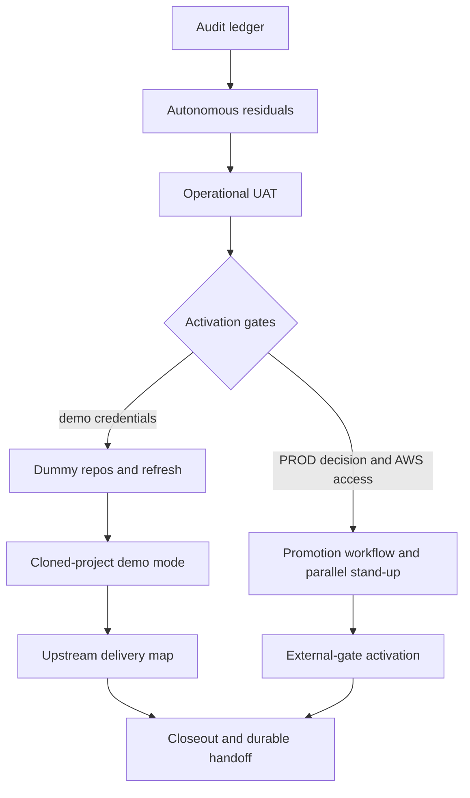

# Recent Plan Completion - Plan

**Target repos:** `ontokit-web` and `ontokit-api`, with deployment infrastructure and GitHub repositories only where a unit explicitly names them.

## Goal Capsule

- **Objective:** Every incomplete task from the last 21 days of OntoKit plans is either completed with evidence or held in one durable queue with an exact activation condition.
- **Means:** Execute autonomous residuals in dependency order, preserve the formal plans as immutable decision artifacts, and route human/external gates through `docs/decision-sheets/2026-08-20-recent-plan-decisions.md` (D1–D7).
- **Authority:** The original plan’s R/KD/KTD contracts govern behavior. This reconciliation plan governs ordering, evidence, and handoff only.
- **Stop conditions:** Do not mutate CatholicOS without tranche-specific approval. Do not create broad demo credentials. Do not touch AWS until access and the PROD rollout mechanism are settled.
- **Execution profile:** Use `ce-work` on the owning integration branch. Characterize behavior before each bug fix and retain real-seam proof where the source plan requires it.

---

## Product Contract

### Summary

Close the autonomous residuals, then advance the gated units as their activation conditions become true. The durable audit and decision sheet prevent completed work from being rebuilt and prevent blocked work from disappearing.

### Problem Frame

Recent plans were distributed across a documentation branch, merged feature history, a sibling API repo, live UAT logs, and external decision sheets. Branch topology made completed code look absent, while several genuinely missing roundup units were described only in old handoffs. Current external facts also drifted: the upstream gap is 277 commits rather than ~690, and some old decision premises are stale.

### Requirements

**Reconciliation**

- R1. Every formal plan unit in the 2026-07-30 through 2026-08-20 window has an evidence-backed disposition in `docs/audits/2026-08-20-recent-plan-completion-audit.md`.
- R2. Completed units are not reimplemented unless verification finds a real regression.
- R3. Every incomplete unit has one owner, dependency chain, activation condition, and verification signal.

**Autonomous work**

- R4. All unblocked web and API residuals are implemented on their owning integration baseline with focused tests.
- R5. Operational claims use real seams: current Git refs, live Postgres/git paths where required, running-container evidence, DNS, or deployed HTTP behavior.
- R6. User-owned dirty files and documentation-branch commits remain outside implementation commits.

**Human and external gates**

- R7. Human choices are presented in one decision sheet with a recommendation, consequences, and a short answer format.
- R8. External gates remain parked without workaround until the named condition is true.
- R9. CatholicOS receives nothing without explicit tranche authorization.

### Scope Boundaries

**In scope:** the 13 incomplete formal units, the five execution/review follow-ups named by the audit, operational UAT owed by the auto-accept closure, and the final reconciliation handoff.

### Deferred to Follow-Up Work

- New product features not present in a reviewed plan.
- The old ontology atomization plans, whose latest plan activity predates this audit window.
- Upstream refactors that are not required to deliver a mapped tranche.

---

## Planning Contract

### Key Technical Decisions

- KTD1. **Git evidence owns completion.** A unit is complete only when its owning commit, merged PR, test, UAT, or deployed receipt satisfies the source plan. Plan prose and issue state are supporting evidence, not the completion source.
- KTD2. **Execution is split into autonomous, activation-ready, and externally blocked lanes.** This prevents `ce-work` from stopping the whole queue on a credential or purchase gate.
- KTD3. **Code residuals execute from writable branches created from refreshed `origin/feat/pr-party`, not `feat/roundup-brainstorm` or a detached remote-tracking ref.** The documentation branch is 442 commits behind the integration branch and does not contain several target files. Before U1–U6, create or attach isolated web and API worktrees on named residual-work branches, record their intended merge target, and leave the existing documentation checkout and any stale local integration worktree untouched. Implementation must preserve unrelated commits and untracked files.
- KTD4. **Fix correctness and test-signal debt before building new demo/PROD surfaces.** The residual bug queue is bounded and reduces false-green risk before the larger infrastructure units.
- KTD5. **Roundup U8/U9 preserve credential separation.** The source credential remains read-only; the destination token is restricted to exactly the two demo repos. No temporary broad-token implementation counts as proof.
- KTD6. **PROD work uses the mechanism selected in D1.** U10 may prepare reusable rollout-neutral gates, but no rollout-specific workflow or box mutation assumes an unanswered branch of D1.

### High-Level Technical Design

### Sequencing

1. Execute U1–U6 on the owning writable integration branches. Run U7 as soon as the deployed trust/audit stack is healthy; rerun it only if a later residual changes the auto-accept path.
2. Execute U8/U9 when D3’s credential condition is satisfied.
3. Execute U10 when D1 and D2 clear its rollout and access gates.
4. Draft and scratch-validate U11 against current cutoff SHAs now; append U9/U10 deltas and freeze exact accounting before any authorized send.
5. Activate U12–U15 only when their explicit trigger is true.
6. Finish U16 after every unit is either evidenced complete or still parked with a current gate.

---

## Implementation Units

| U-ID | Title | Primary files or target | Depends on |
|---|---|---|---|
| U1 | Audit UI residuals | web audit component, trust client, shared utils | — |
| U2 | Deterministic Node test storage | web test setup and configuration | — |
| U3 | Zitadel issuer fail-fast | web auth configuration | D7 |
| U4 | Turtle serialization stability | web Turtle updater | — |
| U5 | Audit API hardening | API audit integration and route tests | — |
| U6 | Full annotation-path parity | API ontology detail services | — |
| U7 | Auto-accept live UAT | DEV + UAT log | deployed trust/audit stack healthy |
| U8 | Demo repositories and refresh | ALEA repos + API deploy assets | D3 credentials |
| U9 | Cloned-project demo mode | both repos | U8 |
| U10 | PROD promotion workflow and AWS activation | API deploy assets + GitHub Actions | rollout-neutral prework now; activation on D1, D2 |
| U11 | Upstream delivery map | roundup docs + scratch cherry-pick proof | current-cutoff draft now; final freeze after U9/U10 |
| U12 | PR Party external gate | both repos + CatholicOS org | D4/D5 and org gates |
| U13 | Picker activation | static site + hosting | D6 registration |
| U14 | Google federation activation | Zitadel config + docs | login-friction trigger + OAuth credentials |
| U15 | FOLIO dependency change | API dependencies | verified secure `folio-python` release on PyPI |
| U16 | Reconciliation closeout | audit, decision sheet, handoff | U1–U15 dispositioned |

### U1. Close audit UI review residuals

- **Goal:** Complete the cheap tail from the U7 sweep-fix plan and CatholicOS web #348.
- **Requirements:** R2, R4, R6.
- **Dependencies:** None.
- **Files:** `lib/utils.ts`, `components/projects/AuditLogSection.tsx`, the other web call sites that own duplicate relative-time helpers, `lib/api/trust.ts`, and their existing tests.
- **Approach:** Consolidate the relative-time helper, add the two erasure fallback cases, align `user_id` with the non-null API contract, and remove the runtime-empty type-only test.
- **Execution note:** Characterize the five helper variants before consolidating so the shared function does not silently change edge behavior.
- **Test scenarios:**
  - A missing submitter name and email renders `Unknown submitter`.
  - A human decider with a missing display name renders `Unknown decider`.
  - Anonymous rows retain a non-null `user_id` while still rendering anonymous attribution.
  - Every migrated relative-time caller preserves its boundary behavior.
- **Verification:** Focused tests, full web test suite, type-check, and lint pass on the integration branch.

### U2. Make Node test storage deterministic

- **Goal:** A plain test command passes on Node 25 instead of inheriting its incomplete experimental `localStorage`.
- **Requirements:** R4, R6.
- **Dependencies:** None.
- **Files:** web test setup/configuration, `package.json`, and storage-related tests.
- **Approach:** Install a complete storage shim unconditionally in the test environment. Keep the experimental-webstorage disable flag only if a clean-process test proves it adds necessary protection.
- **Execution note:** Reproduce web #359 before changing the harness.
- **Test scenarios:**
  - Node exposes an incomplete storage object; the test setup replaces it with the complete contract.
  - Draft and editor-mode stores support set, get, remove, and clear.
  - A plain full-suite invocation passes without caller-supplied environment flags.
- **Verification:** The exact previously failing autosave/draft tests and the full web suite pass under the current Node runtime.

### U3. Fail fast on a missing server-side Zitadel issuer

- **Goal:** Auth-enabled deployments cannot silently point NextAuth at localhost.
- **Requirements:** R4, R5.
- **Dependencies:** None.
- **Files:** `auth.ts` and auth configuration tests.
- **Approach:** Apply D7. If optional-without-Zitadel remains supported, remove the localhost fallback while keeping the provider list empty when Zitadel is unconfigured. If D7 makes Zitadel mandatory for optional mode, validate the issuer and companion OIDC settings at startup. Preserve the disabled-auth path without inventing an issuer.
- **Execution note:** Start with a configuration-matrix regression test for web #360.
- **Test scenarios:**
  - Required and optional auth without an issuer fail during configuration.
  - Disabled auth without an issuer initializes without a localhost provider fallback.
  - A configured issuer is passed through exactly.
- **Verification:** Auth tests, type-check, lint, and production build configuration checks pass.

### U4. Reduce Turtle serialization churn

- **Goal:** Complete the annotation-data-loss plan’s U4 without weakening its preservation fix.
- **Requirements:** R2, R4.
- **Dependencies:** None.
- **Files:** `lib/ontology/turtleClassUpdater.ts`, `__tests__/lib/ontology/turtleClassUpdater.test.ts`.
- **Approach:** Preserve the subject’s original serialization form and keep labels untagged unless the user supplied a language tag.
- **Execution note:** Add characterization coverage around the post-#361 writer before changing output.
- **Test scenarios:**
  - `<Rxxx>` and prefixed subjects keep their original form.
  - An untagged label stays untagged; a tagged label keeps its tag.
  - The 13-altLabel preservation regression remains green.
  - Editing one comment changes only the intended predicate lines.
- **Verification:** Focused Turtle tests and the full web quality gates pass; a representative diff contains no unrelated serialization change.

### U5. Harden the audit API proof

- **Goal:** Close the test gaps in CatholicOS API #208 without changing accepted product semantics.
- **Requirements:** R2, R4, R5.
- **Dependencies:** None.
- **Files:** API audit integration tests, trust route tests, and model-index reflection tests.
- **Approach:** Complete the terminal cursor walk, assert ordinary-human decider names, cover cursor decode failures and cross-project replay, and reflect the live Postgres index against the model declaration.
- **Test scenarios:**
  - A three-page cursor walk ends with no cursor and neither skips nor duplicates rows.
  - Invalid base64 and invalid UTF-8 cursors fail with the typed client error.
  - A cursor minted for project A cannot page project B.
  - Live Postgres exposes the declared audit cursor index.
- **Verification:** Focused unit tests and the real-Postgres audit integration module pass.

### U6. Unify full annotation-path parity

- **Goal:** The same class returns the same annotation predicate set whether the index is warm or cold.
- **Requirements:** R2, R4, R5.
- **Dependencies:** None.
- **Files:** API ontology detail services and their parity tests.
- **Approach:** Derive indexed and fallback behavior from one declaration-aware classifier: built-in annotation predicates plus predicates declared `owl:AnnotationProperty`. Preserve exclusions for values returned through dedicated label/comment fields; do not classify ordinary object or data properties as annotations.
- **Execution note:** Restore `skos:related` to the parity fixture before implementation.
- **Test scenarios:**
  - `skos:related`, `skos:broader`, and `skos:narrower` match across both paths.
  - Dedicated label and comment values do not duplicate into annotations.
  - An unknown predicate declared `owl:AnnotationProperty` round-trips and appears in both responses; an undeclared object/data predicate does not.
- **Verification:** The parity test fails before the change, passes after it, and the full API gates remain green.

### U7. Prove auto-accept on live DEV

- **Goal:** Close the closure audit’s operational evidence gap without changing its product scope.
- **Requirements:** R2, R5.
- **Dependencies:** The deployed trust/audit stack is healthy.
- **Files:** `docs/roundup-2026-08/DEV-UAT-LOG.md`; fixes only if UAT finds a real defect.
- **Approach:** Use a throwaway project and short test interval to prove eligible trusted submission, halt on objection, restart, auto-merge, outcome snapshot, and trust effects. Snapshot and restore the project’s trust/quiet-period configuration, confirm no non-test session is eligible before shortening the interval, and remove only state created by this UAT.
- **Test scenarios:**
  - An eligible trusted human session auto-accepts after the configured quiet period.
  - An explicit reviewer objection halts the clock; resolution restarts it from zero.
  - Anonymous, LLM, and non-trusted sessions never auto-accept.
  - The audit outcome records the submitter snapshot and `system:auto-accept` decider.
- **Verification:** Dated UAT evidence names the project, branch/PR, outcome row, and observed timing; throwaway state is removed.

### U8. Create and refresh the two demo repositories

- **Goal:** Complete roundup U8 with credential separation intact.
- **Requirements:** R3, R5, R8; KTD5.
- **Dependencies:** D3 selects the secure credential path and the two scoped credentials exist.
- **Files:** two private ALEA GitHub repositories and the API-owned refresh/deploy assets.
- **Approach:** Seed FOLIO and Semantic Canon snapshots, refresh only default branches, preserve demo-authored branches, and serialize the repo refresh with demo-project resync.
- **Test scenarios:**
  - Both repos are private and importable by OntoKit.
  - The destination token can push only to the two demo repos.
  - The source credential cannot push to either source.
  - Refresh advances the default snapshot without changing a demo branch.
- **Verification:** A manual refresh receipt proves separate credentials, target scope, and read-only source behavior.

### U9. Build cloned-project demo mode

- **Goal:** Complete roundup U9 with server-enforced isolation.
- **Requirements:** R3, R4, R5.
- **Dependencies:** U8.
- **Files:** both repos’ project model/provisioning, GitHub mutation authorization, demo navigation/banner, and tests.
- **Approach:** Follow the source roundup plan’s KTD3/KTD3-a/KTD3-b. One project-aware authorizer must cover every outbound GitHub mutation. The web flow includes entry from the originating live project, a blocking provisioning/loading state, an actionable unavailable state, a persistent banner naming the demo repository, and an exit control returning to the originating live project.
- **Test scenarios:** Use every refusal, provisioning-idempotence, server-truth banner, and live-isolation scenario from the source plan.
- **Verification:** Both suites pass and live DEV writes only to the selected dummy repository. Browser proof includes keyboard-only entry/exit, visible focus, semantic status/banner announcements, non-color-only state, and responsive touch targets.

### U10. Build the gated PROD promotion path

- **Goal:** Complete roundup U13 and prepare U15 without touching the box prematurely.
- **Requirements:** R3, R5, R8; KTD6.
- **Dependencies:** Stage A is autonomous and rollout-neutral. Stage B begins only after D1 settles rollout shape and D2 clears access for installation and live proof.
- **Files:** API deployment assets, GitHub Actions workflows, release manifest, and runbook.
- **Approach:**
  - **Stage A — prepare now:** Port the verified U12 forced-command/environment pattern, bind immutable matched web/API revisions, and rehearse the write-path smoke against DEV.
  - **Stage B — activate when D1/D2 clear:** Execute the selected stand-up or rebuild, verify the running revisions, activate the protected promotion gate, and disposition the original roundup U15 demo-gibberish cleanup. Choose reseed-from-scratch versus migrate-and-purge at activation and keep cleanup as a separately reported gate until verified complete.
  - **Authority-chain checklist:** Before enabling PROD, require reviewed branch protection, a deploy-branch-restricted GitHub Environment for PROD secrets, CODEOWNERS approval for `.github/workflows/**`, explicit least-privilege workflow permissions, and proof that the forced-command deploy key cannot execute arbitrary shell.
- **Test scenarios:**
  - A green matched revision passes smoke and reaches the gated promotion step.
  - A failed write-path smoke blocks promotion.
  - A mismatched or mutable revision is refused.
  - The PROD gate stays disabled until its environment and host prerequisites exist.
- **Verification:** Stage A ends with workflow validation and a DEV rehearsal. Stage B ends with the live installation/rebuild receipt, running-revision proof, promotion-gate proof, and a complete or explicitly gated cleanup disposition.

### U11. Produce the upstream delivery map

- **Goal:** Complete roundup U14 with current numbers and stable tranche boundaries.
- **Requirements:** R1, R3, R9.
- **Dependencies:** The initial map can start now. Exact final accounting depends on U9 and the last code-producing unit that belongs in the map.
- **Files:** `docs/roundup-2026-08/UPSTREAM-DELIVERY-MAP.md` and tranche draft artifacts.
- **Approach:** Record current cutoff SHAs, map feature seams rather than raw commit slices, treat existing upstream AUTH_MODE PRs as prefixes, and scratch-validate tranche 1 on refreshed CatholicOS `dev`. Mark future U9/U10 deltas provisional; append and revalidate them before any send.
- **Test scenarios:** Test expectation: none — documentation deliverable; proof is the scratch cherry-pick and exact commit accounting.
- **Verification:** The map accounts for every cutoff commit once, labels later tranches provisional, and sends nothing without D4 authorization.

### U12. Activate the PR Party external gate

- **Goal:** Complete roundup U16 and the remaining PR Party shipping decisions when the org is ready.
- **Requirements:** R3, R8, R9.
- **Dependencies:** Draft preparation begins after U9. Live activation requires D4/D5 plus PAT intake, org webhook, answerer workflow, and generation token.
- **Files:** both repos and approved CatholicOS issue/PR artifacts.
- **Approach:** After U9, autonomously prepare and hold the outreach and answerer-workflow drafts without sending them. For live activation, revalidate the org answerer premise, execute the selected rotation and shipping choices, and never self-merge CatholicOS PRs. Before accepting live E2E, compare the merged `catholicos/.github` answerer workflow with the reviewed local asset and record an integrity hash receipt.
- **Test scenarios:** Use the original PR Party live E2E plan’s final gate; include real review posting, answerer response, webhook delivery, and credential rotation if selected.
- **Verification:** Live E2E receipts and peer-reviewed upstream PRs satisfy the source plan.

### U13. Build the ontokit.org picker when registered

- **Goal:** Complete roundup U17.
- **Requirements:** R3, R8.
- **Dependencies:** D6 and registered DNS control.
- **Files:** static picker site and Hetzner Traefik configuration.
- **Approach:** Use the original KTD7 static-page shape and preserve direct instance URLs. Each choice shows its plain-language name, ontology/purpose, intended audience, destination hostname, and current availability; unavailable choices remain visible with an explanation but cannot be activated.
- **Test scenarios:** Test expectation: none — static hosting; prove all links, TLS, redirect behavior, and mobile layout live.
- **Verification:** Public DNS, TLS, and link checks pass. Browser proof covers keyboard operation, visible focus, descriptive link names, non-color-only availability, logical focus order, mobile layout, and responsive touch targets to WCAG 2.2 AA expectations.

### U14. Activate Google federation only on trigger

- **Goal:** Execute the trigger-gated federation plan without creating a second issuer.
- **Requirements:** R3, R8.
- **Dependencies:** A documented login-friction trigger and Google OAuth credentials.
- **Files:** the owning API provisioning/runbook files and optional web copy from the source plan.
- **Approach:** Execute U1–U3 of the source federation plan unchanged.
- **Test scenarios:** First-time Google user, same-email link, password login, and stable Zitadel identity.
- **Verification:** Full DEV round-trip and UAT log evidence.

### U15. Apply the approved FOLIO dependency change after release

- **Goal:** Close CatholicOS API #209 without pinning a vulnerable release.
- **Requirements:** R2, R8.
- **Dependencies:** A `folio-python` release containing the required security fixes is published to PyPI; re-check the current safe version at activation rather than assuming it will be 0.3.7.
- **Files:** API dependency manifest, lockfile, and existing duplicate-check integration tests.
- **Approach:** Pin the safe release, remove unused `owlready2`, preserve graceful degradation, and regenerate the lock.
- **Test scenarios:**
  - Clean install resolves the pinned safe version without `owlready2`.
  - FOLIO normalization paths use the dependency and retain graceful fallback.
  - Dependency/security scanning reports no regression.
- **Verification:** Full API suite, type/lint gates, and lock verification pass.

### U16. Reconcile and hand off the final state

- **Goal:** Leave no plan task untracked after this march-through.
- **Requirements:** R1–R9.
- **Dependencies:** U1–U15 each complete or held on a current activation condition.
- **Files:** `docs/audits/2026-08-20-recent-plan-completion-audit.md`, `docs/decision-sheets/2026-08-20-recent-plan-decisions.md`, and `docs/handoffs/`.
- **Approach:** Refresh GitHub, DNS, access, PyPI, tests, and deployed evidence. Retire superseded handoffs and write one durable continuation artifact.
- **Test scenarios:** Test expectation: none — reconciliation deliverable; proof is one-to-one task accounting and clean links.
- **Verification:** Every source-plan unit appears exactly once as complete, queued, or gated; the handoff reports commit, push, and merge state.

---

## Verification Contract

| Gate | Applies to | Done signal |
|---|---|---|
| `npm run test`, `npm run type-check`, `npm run lint` | U1–U4, U9 | Green on the owning integration baseline; no new lint warnings. |
| API unit, integration, type, and lint gates from the source repo | U5, U6, U8–U10, U12, U14, U15 | Green with real Postgres/git where the source plan requires it. |
| Live DEV browser/API UAT | U7–U10, U14 | Dated evidence after the deployed revision; running container revision verified. |
| Git/DNS/GitHub/PyPI refresh | U11–U16 | Current receipts replace stale estimates and gates. |
| Secret and target-scope checks | U8–U10, U12 | No secret in Git; least-privilege credentials proven against allowed and refused targets. |

---

## Definition of Done

- Every unit in the audit is complete or has a current, named activation condition.
- U1–U7 are implemented and verified unless runtime evidence exposes a genuine blocker.
- The answers to D1–D7 are folded into the owning units without re-asking settled choices.
- No user-owned dirty file is committed or published.
- No CatholicOS mutation occurs without explicit tranche authorization.
- No secret or broad demo credential enters Git history.
- Abandoned implementation attempts and temporary UAT state are removed.
- One durable handoff under `docs/handoffs/` records the remaining queue plus commit, push, and merge state.
