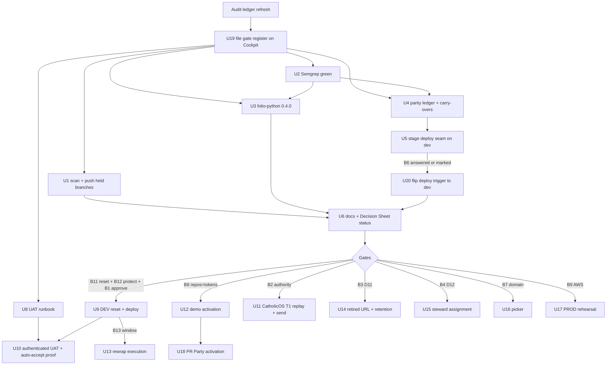

# Recent Plan March-Through - Plan

**Target repos:** `ontokit-web` and `ontokit-api` (ALEA forks), plus the Cockpit decision surface.
Paths under `api:` are relative to the `ontokit-api` repository root.

## Goal Capsule

- **Objective:** Every task from every OntoKit plan dated 2026-08-15 through 2026-09-05 is either finished with Git or live evidence, or sits in one queue whose next step is either an agent unit in this plan or one Cockpit decision Damien can answer from a phone.
- **Means:** Audit the seven in-window plans and their closeout against current Git, CI, DEV, PyPI, DNS, and GitHub state (KTD1); file every gate first (U19); execute the unblocked lane with Codex workers (KTD4); execute each gated unit when its gate clears (KTD6).
- **Authority:** The source plans' R/KTD contracts govern product behavior. The 2026-08-20 Decision Sheet's D1-D10 answers are settled and are not re-asked. This plan governs ordering, evidence, and handoff.
- **Stop conditions:** No CatholicOS, DEV, PROD, AWS, DNS, credential, demo-repository, or cron mutation without the named gate in Appendix B. No PyPI dependency lands unless its resolved graph scans clean and installs (KTD5). An unblocked unit that fails is recorded as failed with its receipt; it is never re-labeled as queued.
- **Execution profile:** `ce-work` on isolated branches per repo; Codex workers edit files; the orchestrator runs every network-bound step, verifies with the repo gates, and merges ALEA PRs only after green CI and a quiet review window.

---

## Product Contract

### Summary

File the gate register on the Cockpit first, then close the four newly found gaps and the one cleared external gate on ALEA `dev`, publish every held delivery branch for citable durability, refresh the ledger and handoff, and leave twelve human calls on one Decision Sheet.
Gated units then execute one by one as each answer or external receipt arrives.

### Problem Frame

The 2026-08-29 closeout reported all 52 formal units accounted for.
Re-verification on 2026-09-05 found that state drifted in four ways the closeout could not see: ALEA `dev` (the validated line) is not a content superset of `feat/pr-party` (the line DEV runs); the DEV deploy workflow watches only the frozen `feat/pr-party`; the T2 and T3 API delivery candidates named in the held CatholicOS manifest exist only on this machine and the private twin, so their manifest SHAs are not citable; and every push to `dev` fails the Semgrep scan on both forks (a condition that predates the window but that no closeout recorded).
Re-verification also found that the two lines' Alembic chains diverged, so DEV's database cannot upgrade to `dev` in place.
Two external gates moved: `folio-python` 0.4.0 reached PyPI on 2026-08-18 (the audit had recorded 0.3.6 as latest), and CatholicOS `dev` advanced by 12 web and 17 API commits since the batch was frozen.
Two Cockpit asks still showed eight pending questions that Damien had already answered on the repository Decision Sheet.

### Requirements

**Reconciliation**

- R1. Every formal unit from the in-window plans has one evidence-backed disposition in Appendix A, verified against current Git, CI, DEV, PyPI, DNS, and GitHub state rather than prose.
- R2. Every row of the full name-status diff between `feat/pr-party` and `dev`, in either repo, and every exported symbol removed between them, receives a written disposition: carried into `dev`, superseded by `dev`, or intentionally dropped with the replacement named.
- R3. Completed units are not reimplemented unless verification shows a regression.

**Autonomous lane**

- R4. Every locally-held branch that a durable document cites as a delivery candidate exists on the ALEA remote at its current tip, and each manifest-cited SHA is an ancestor of that tip.
- R5. `dev` on both forks passes the same CI matrix on push that it passes on pull request, including Semgrep.
- R6. The DEV deploy, release-manifest, write-smoke, and dormant PROD-promotion assets live on `dev` and their local harnesses pass, without any deploy firing.
- R7. `ontokit-api` declares `folio-python` pinned to 0.4.0 and no longer declares `owlready2`, with a clean dependency-security scan and a passing install, import, and regression run on the resolved graph.

**Gates and decisions**

- R8. Every remaining human decision or task appears exactly once on a Cockpit Decision Sheet, with a recommendation, the consequence of not answering, and a one-tap answer.
- R9. No gated subject action (Appendix B) executes before its gate's recorded answer or receipt; unanswered taste and judgment questions proceed on the recommendation with a provisional mark.
- R10. The Cockpit board carries no question about work that is finished.

**Durability**

- R11. One audit addendum, one Decision Sheet update, one handoff, and the on-deck queue record the post-march state on the documentation branch.
- R12. Both canonical local checkouts end at or ahead of their `origin/dev` with no divergence, and every local commit they held is preserved in the reflog and the handoff.

### Key Decisions

- **`dev` is the single ALEA integration and deploy line; `feat/pr-party` is frozen history.** Rationale: `dev` carries the validated closeout stack and matches the CatholicOS default branch name. Governs R2, R5, R6. Recommended; the deploy-trigger flip (U20) waits for gate B6's recorded answer or provisional mark.
- **The pre-approved dependency change executes now.** Damien approved "folio-python required, pinned; owlready2 removed" on 2026-08-10, gated only on a safe release. Governs R7.
- **D1-D10 stay settled.** They are cited, never re-asked. Governs R8, R9.
- **DEV's application database is reset, not remapped, before the first `dev` deploy.** DEV holds one project, eight suggestion sessions, and seven pull requests of throwaway UAT state; a stamp-and-remap script would have to reconcile two migration chains that reuse revision ids with different content. Governs R9 through gate B11.

### Scope Boundaries

**In scope:** the gaps and cleared gates above, the durability pushes, the ledger and handoff refresh, the Decision Sheet, checkout hygiene, and the gated units that become executable when their gate clears during a session.

### Deferred to Follow-Up Work

- Product features not present in a reviewed plan.
- The `.planning/` GSD milestone state (frozen; outside the window).
- The `ontokit-api.dev` hostname returning 503; the API is served under the web hostname and nothing depends on the API hostname.
- Full symbol-level refactor of the `dev` line beyond what R2 dispositions require.
- Authentication hardening of the Cockpit answers-back channel itself; it is pre-existing shared infrastructure outside this plan.

---

## Planning Contract

### Key Technical Decisions

- KTD1. **Git and live receipts own completion, and every receipt is bound to a commit, ref, and environment.** A unit is complete only when its owning commit, merged PR, passing gate, UAT log entry, or live probe satisfies the source plan. A receipt taken on one SHA does not close a unit on another SHA; when the target moves, the gate re-runs.
- KTD2. **Parity is settled by a written ledger, not a merge.** U4 produces a table of every `feat/pr-party`-to-`dev` name-status row (added, deleted, modified, renamed) and every removed export, each marked `carry`, `dev supersedes`, or `drop` with the replacement or exclusion pointer; `drop` without a pointer is not allowed. Only `carry` rows become code changes. Rationale: the re-synthesis onto CatholicOS cutoffs was deliberate, so a blind merge would resurrect excluded scratch and stale review reports, while a deletions-only enumeration would miss most of the divergence.
- KTD3. **The deploy workflow moves to `dev` in two steps, with a manifest-declared pair and an unchanged approval gate.** U5 stages the T2 deploy assets and workflow on `dev` with the push trigger still naming `feat/pr-party`; U20 flips the trigger to `dev`, restricted to changes of `deploy/release-manifest.json`, after gate B6. The workflow reads both SHAs from the manifest; `workflow_dispatch` re-runs the manifest pair and consumes no inputs. The `dev-deploy` environment with Damien as required reviewer stays the only path to a host mutation. Rationale: no run parks on Damien's approval unless a matched pair was pinned on purpose.
- KTD4. **Codex workers edit files; the orchestrator runs every network-bound step and ships.** `worker_route=codex` per `agents/tier.json`. Each code unit runs as one worker on an isolated branch. The orchestrator performs and attaches to the unit receipt: `git push` (U1), the Semgrep full scan through the official container image with the workflow's fallback rule packs (U2), `uv lock` resolution and the OSV scan through the official container image (U3), `actionlint` through its container image (U5), pull-request creation and merge, and every Cockpit `briefs/` write (U6, U19). No scanner is installed on the host; container images satisfy the tooling without a new host dependency.
- KTD5. **"Verified safe" is a scan receipt plus a working install.** The dependency unit lands only if the OSV scan on the exported lock reports no known vulnerability in `folio-python` 0.4.0 or its transitive additions, and a clean install imports the package and passes the FOLIO regression tests. Otherwise the unit parks with the receipt.
- KTD6. **All human gates route through `cockpit-decide`, filed before any unit that depends on them.** Four batches on one chain: DEV hard-blocks, repository and upstream hard-blocks, judgment, and tasks. Taste and judgment questions get a `cockpit-provisional mark` before dependent work.
- KTD7. **Held CatholicOS tranches are replayed against refreshed upstream heads before any send.** The manifest already requires this; the receipt now records the 2026-09 heads, because both upstream branches moved after the freeze.
- KTD8. **ALEA self-merge stays allowed; CatholicOS self-merge stays prohibited.** ALEA PRs merge after green CI (including the push-event Semgrep run once U2 lands), a clean structured review, and a five-minute quiet window, matching the closeout practice.
- KTD9. **Every secret this plan touches lives outside Git under the private path, is scoped to one purpose, and is redacted from every receipt.** Demo source and destination credentials, the reviewer-PAT encryption keys, DEV persona logins, and any AWS identity are stored under the `~/.config/<project>/` convention with owner-only permissions, injected into workers or cron through environment files the host owns, rotated or revoked when their unit closes, and never written to `DEV-UAT-LOG.md`, screenshots, or browser state that persists.
- KTD10. **Nothing leaves this machine for a public remote without a content scan.** Every push in U1 and U7 runs the installed cockpit perimeter pre-push scanner over the commits not yet on the remote; a hit parks that branch with the scan receipt and no remote ref is created. Rationale: both ALEA forks are public and have GitHub secret scanning disabled, and the cockpit already retired one push lane for exactly this leak.

### Assumptions

- The 2026-08-24 to 2026-08-29 test receipts on `dev` describe the SHAs they were taken on; U4 re-runs the full suites on the current `dev` before any carry-over merges (KTD1).
- Damien wants the autonomous lane executed in this session and the gated lane in this or later sessions, per the invocation.
- `feat/pr-party` receives no further commits; DEV keeps running the 2026-08-15 revision until U9.
- The push-mode Semgrep findings have never been triaged on any line; `feat/pr-party` never ran a full scan, and the only source-level suppressions exist on `dev`.
- DEV's shared Postgres hosts the `ontokit`, `zitadel`, and `postgres` databases; only `ontokit` is in scope for the reset in U9.

### High-Level Technical Design

### Sequencing

1. U19 files the full gate register through `cockpit-decide` before any other unit starts, so long-lead external gates and hard-blocks reach Damien on day one.
2. U1 and U2 run next, in parallel with each other. U1 unblocks nothing; U2 gates every later merge because the Verification Contract requires the push-event Semgrep run to be green on every merge that follows it.
3. U3 and U4 may be developed in parallel with U2, but their PRs merge only after U2 has landed on both forks and the push-event Semgrep run on `dev` is green. U4 runs a path-overlap preflight against U3's branch; when they share `pyproject.toml` or `uv.lock`, U4 rebases onto U3 and merges after it.
4. U5 waits for U4's ledger. U5 is the sole code owner of the deploy, workflow, infrastructure, migration-check, and deploy-test paths; U4 records their dispositions as `dev supersedes` or `superseded by U5` and carries none of them.
5. U20 flips the deploy trigger after U5 merges and after gate B6 has a recorded answer or a provisional mark.
6. U6 and U7 run after U1-U5 and U20 land; U8 runs anytime after U19.
7. U9-U18 start only when the named gate in Appendix B has a recorded answer or receipt; they do not block one another except as drawn above.

---

## Implementation Units

| U-ID | Title | Key files | Depends on |
|---|---|---|---|
| U19 | File the gate register on the Cockpit | Cockpit `briefs/qa/` through `cockpit-decide` | - |
| U1 | Scan and push held local branches to ALEA | branch refs only | U19 |
| U2 | Semgrep push scans green on `dev` | `.github/dependabot.yml`, three web source files, one tool-memory file | U19 |
| U3 | Adopt `folio-python` 0.4.0, drop `owlready2` | `api:pyproject.toml`, `api:uv.lock`, `api:ontokit/services/structural_similarity_service.py` | U2 for merge |
| U4 | Parity ledger `feat/pr-party` to `dev` | `docs/audits/2026-09-05-pr-party-dev-parity-ledger.md`, carried files per ledger | U2 for merge; U3 when paths overlap |
| U5 | Stage the deploy and CI seam on `dev` | `api:.github/workflows/deploy-dev.yml`, `api:deploy/**`, `api:.github/workflows/promote-prod.yml` | U4 |
| U20 | Flip the deploy trigger to `dev` | `api:.github/workflows/deploy-dev.yml` | U5; gate B6 |
| U6 | Ledger, Decision Sheet status, handoff, on-deck refresh | `docs/audits/**`, `docs/decision-sheets/**`, `docs/handoffs/**`, Cockpit `briefs/on-deck.json` | U1-U5, U20 |
| U7 | Local checkout hygiene | canonical `dev` checkouts | U1 |
| U8 | Authenticated UAT runbook (no execution) | `docs/roundup-2026-08/DEV-UAT-RUNBOOK-web27.md` | U19 |
| U9 | Reset DEV's application database and deploy `dev` heads | `api:deploy/release-manifest.json`; DEV host | U20; gates B11, B12, B1 |
| U10 | Authenticated DEV acceptance and auto-accept proof | `docs/roundup-2026-08/DEV-UAT-LOG.md` | U8, U9; gate B5 |
| U11 | CatholicOS T1 replay and issue-first send | `docs/roundup-2026-08/tranche-drafts/**` | gate B2 |
| U12 | Demo repositories, scoped credentials, atomic refresh | `api:deploy/refresh_demo_repositories.py`, `api:deploy/demo-mirrors.json` | U9; gate B8 |
| U13 | Reviewer-PAT ciphertext rewrap execution | `api:scripts/rewrap_pr_party_credentials.py` | U9; gate B13 |
| U14 | Retired demo URL behavior and retention | API demo routes, web project routing | gate B3 |
| U15 | Activation-queue steward assignment | GitHub issue assignees | gate B4 |
| U16 | `ontokit.org` picker | static site + DEV Traefik | gate B7 |
| U17 | Parallel PROD rehearsal | `api:deploy/**`, `api:.github/workflows/promote-prod.yml` | U5; gate B9 |
| U18 | PR Party external activation | `docs/roundup-2026-08/pr-party/HELD-ACTIVATION-PACKAGE.md` | U12; external receipts E1-E3 |

### U19. File the gate register on the Cockpit

- **Goal:** Every Appendix B gate is on a Decision Sheet before any dependent unit starts, so Damien's long-lead actions begin on day one.
- **Requirements:** R8, R9; KTD6.
- **Dependencies:** None.
- **Files:** Cockpit `briefs/qa/` through `cockpit-decide file`; no hand-written ask JSON.
- **Approach:** File four batches on one chain: DEV hard-blocks (B11, B1, B13), repository and upstream hard-blocks (B12, B2), judgment (B3, B4, B5, B6), and tasks (B7, B8, B9). Each question carries the recommended option first, a one-line consequence of not answering, and the plan reference. Record a `cockpit-provisional mark` for B6 before U20 starts if B6 is still unanswered.
- **Test scenarios:** Test expectation: none -- pipeline filing; proof is the returned sheet URLs and `briefs/qa-state.json` rows keyed by stem and qid.
- **Verification:** Four live sheet URLs exist; each B-item appears exactly once across them; the notification ping fired.

### U1. Scan and push held local branches to ALEA

- **Goal:** Every branch a durable document cites as a delivery candidate is published on the ALEA remote at its current tip, so the held manifest's SHAs are citable and recoverable off the twin.
- **Requirements:** R4; KTD10.
- **Dependencies:** U19.
- **Files:** none; branch refs only. API: `upstream-queue/t2-api-synthesis` (56800cda), `upstream-queue/t3-api-synthesis` (tip 6692f0f4; the manifest's reviewed ancestor 1b8bde28), `feat/demo-project-isolation` (b5b13d8f), `feat/demo-refresh-scaffold` (e894f20f), `fix/pr-party-credential-rewrap` (f3c4251d), `fix/api-final-review-residuals` (6305087f), `docs/stalled-cli-recovery-2026-08-28` (8d0d8ea6). Web: `upstream-queue/t1-web-auth-synthesis` (f44592a8), `upstream-queue/t2-web-synthesis` (256d2344).
- **Approach:**
  1. For each branch, run the installed perimeter pre-push scanner over the commits not on `origin`; a hit parks the branch and records the scan output in the U6 addendum.
  2. Push each clean branch to `origin` at its current tip as an archival ref, matching the 2026-08-24 T4-T8 publication. Do not merge, rebase, or open PRs.
  3. Confirm the remote SHA equals the local tip and that each manifest-cited SHA is an ancestor of it; U6 records the T3 advance from 1b8bde28 to 6692f0f4 in the manifest.
- **Test scenarios:** Test expectation: none -- archival push; proof is a per-branch scan receipt and a remote ref listing whose SHAs match the local tips.
- **Verification:** `git ls-remote origin` shows every branch above at its local tip; every branch has a scan receipt; no parked branch was pushed.

### U2. Semgrep push scans green on `dev`

- **Goal:** A push to `dev` produces the same green Semgrep result as a pull request.
- **Requirements:** R5.
- **Dependencies:** U19.
- **Files:** web `.github/dependabot.yml`, `lib/editor/indexWorker.ts`, `lib/ontology/turtleUtils.ts`, `lib/sitemap.ts`, `.serena/memories/suggested_commands.md`, `README.md`, and the WebSocket clients `lib/api/lint.ts`, `lib/api/indexStatus.ts`, `lib/api/quality.ts`; API `.github/dependabot.yml`.
- **Approach:**
  1. Add a `cooldown` block to every Dependabot ecosystem entry in both repos.
  2. Triage each of the seven web findings and two API findings in a per-finding table in the PR body: rule id, file and line, fix-or-suppress, one-line reason, owner. Prefer a code change wherever the escaping helper is not already applied at the site; a `nosemgrep` suppression must name the rule id and the exploit-specific reason.
  3. The insecure-WebSocket hit is a sample build command in tool memory, not application code: remove that sample line and change the README example to a `wss://` public hostname. Because `NEXT_PUBLIC_WS_URL` is inlined into the browser bundle and the lint, index-status, and quality clients open it with the access token in the query string, derive the client fallback scheme from the API URL's scheme (https gives wss) and keep a plain `ws://localhost` default only behind a local-development guard; never suppress this rule as "internal".
  4. Re-run the full non-diff scan through the official Semgrep container image with the workflow's fallback rule packs before pushing.
- **Execution note:** Reproduce the push-mode failure locally first; a PR-mode run is diff-aware and will not show it.
- **Test scenarios:**
  - A full-repo Semgrep run with the workflow's rule packs reports zero blocking findings on both repos.
  - The existing unit tests for the touched web modules still pass, and a new test proves the WebSocket fallback is `wss` when the API URL is `https`.
  - A Dependabot config lint accepts the new `cooldown` block.
- **Verification:** The push-event Semgrep run on `dev` completes with success on both forks; the PR body carries the triage table.

### U3. Adopt `folio-python` 0.4.0 and drop `owlready2`

- **Goal:** Close CatholicOS API #209 and ALEA API #29 on `dev`.
- **Requirements:** R7; KTD5.
- **Dependencies:** U2 for merge.
- **Files:** `api:pyproject.toml`, `api:uv.lock`, `api:ontokit/services/structural_similarity_service.py`, `api:tests/unit/test_structural_similarity_service.py`.
- **Approach:** Replay local commit `a990b231` (`chore(deps): adopt folio-python 0.4.0`) onto a branch from `dev`; the orchestrator resolves the lock against current `dev`; remove the `owlready2` declaration; export the lock to a requirements file and run the OSV scan on it; run a clean install and import.
- **Patterns to follow:** The `mypy` override for `folio.*` already exists in `pyproject.toml`.
- **Test scenarios:**
  - A clean install resolves `folio-python==0.4.0` and `owlready2` is absent from the resolved graph.
  - Importing the FOLIO client from a fresh environment succeeds.
  - The structural-similarity tests from `a990b231` pass against the installed package.
  - FOLIO normalization degrades gracefully when the package raises.
  - The OSV scan reports no known vulnerability for the added packages.
- **Verification:** Full API suite, Ruff, mypy (authoritative), Pyright (advisory), single Alembic head, scan receipt, and green CI on the PR; issues API #29 and CatholicOS #209 receive the merge receipt with the scan and install evidence.

### U4. Parity ledger `feat/pr-party` to `dev`

- **Goal:** Nothing that shipped on the DEV-deployed line is silently missing from the validated line.
- **Requirements:** R2, R3; KTD2.
- **Dependencies:** U2 for merge; U3 when the carry set touches `pyproject.toml` or `uv.lock`.
- **Files:** new `docs/audits/2026-09-05-pr-party-dev-parity-ledger.md`; carried files as the ledger decides. Known carry candidates: API `alembic/versions/y2z3a4b5c6d7_widen_suggestion_session_status_check.py` (expected `dev supersedes` by `e3f4g5h6i7j8`, verified value by value), `tests/unit/test_llm_pricing.py`, `tests/unit/test_llm_prompt_safety.py`, `tests/integration/test_llm_review_regressions.py`; web `lib/ontology/suggestionProvenance.ts`, `components/pr-party/QAThread.tsx`, the three `__tests__` files, and the removed exports listed in the ledger. Rows for `api:.github/workflows/deploy-dev.yml`, `api:deploy/compose.dev.yaml`, `api:deploy/ontokit-deploy.sh`, `api:deploy/firewall/**`, `api:deploy/traefik/ontokit-dev.yaml`, and `api:deploy/init-db.dev.sh` are marked `superseded by U5`.
- **Approach:**
  1. Enumerate the full name-status diff between the two lines per repo (added, deleted, modified, renamed) plus every exported symbol removed between them.
  2. For each row, find the `dev` replacement by behavior (not name); record `carry`, `dev supersedes`, or `drop` with the pointer.
  3. Open one carry-over PR per repo containing only `carry` rows, excluding dependency manifests and every U5-owned path, with the ledger linked.
  4. Check the migration lineage: every revision DEV has applied must either be reachable in `dev`'s tree with identical content or be listed in the ledger as superseded; the reset in U9 is mandatory because two shared revision ids carry different content on each line.
- **Execution note:** Start from the name-status list, then diff behavior with the existing tests as the oracle; a test file that exists only on `feat/pr-party` and fails on `dev` is a carry.
- **Test scenarios:**
  - Every carried test file passes on `dev` after the carry.
  - The suggestion-session status constraint on `dev` accepts every status value the `feat/pr-party` migration widened it to.
  - Full web and API suites stay green after the carry-over PRs.
  - The ledger has no `drop` row without a replacement pointer or an explicit exclusion reason, and no name-status row without a disposition.
- **Verification:** Ledger committed; carry-over PRs green and merged; every row of the name-status diff and every removed export has a ledger disposition; a symbol-level export comparison after the carry lists only rows marked `drop` or `dev supersedes`.

### U5. Stage the deploy and CI seam on `dev`

- **Goal:** Current code is deployable to DEV through the existing approval gate, and the dormant PROD promotion path is reviewable, without firing any deploy.
- **Requirements:** R6; KTD3.
- **Dependencies:** U4.
- **Files:** `api:.github/workflows/deploy-dev.yml`, `api:.github/workflows/promote-prod.yml`, `api:deploy/release-manifest.json`, `api:deploy/validate_release_manifest.py`, `api:deploy/smoke-release.sh`, `api:deploy/ontokit-deploy.sh`, `api:deploy/compose.dev.yaml`, `api:deploy/firewall/**`, `api:deploy/traefik/ontokit-dev.yaml`, `api:deploy/init-db.dev.sh`, `api:deploy/tests/ontokit-deploy-test.sh`, `api:deploy/tests/prod-promotion-test.sh`, `api:deploy/RUNBOOK.md`.
- **Approach:** Take the T2 API synthesis (`upstream-queue/t2-api-synthesis`, 56800cda) as the single source; replay its deploy and workflow seam onto `dev`. Keep the push trigger naming `feat/pr-party` in this unit so the merge starts no run. Set `deploy/release-manifest.json` to the pair DEV runs today (API 435dc393, web 83b62b0b) so the first manifest-driven run is a no-op redeploy. Record in the runbook that the DEV host has no database-reset verb, that required status checks and rulesets on `dev` are repository settings (gate B12), and that `feat/pr-party` keeps its own armed workflow until B12 locks the branch.
- **Test scenarios:**
  - `deploy/tests/ontokit-deploy-test.sh` passes all cases, including validation-before-checkout and truthful running-revision status.
  - `deploy/tests/prod-promotion-test.sh` passes with promotion dormant.
  - `deploy/smoke-release.sh` runs its write-path assertion against a disposable target and reports the expected result.
  - `validate_release_manifest.py` accepts a matched pair and rejects a mismatched or mutable revision.
  - `actionlint` accepts both workflow files.
  - Merging this unit to `dev` starts no `deploy-dev` run.
- **Verification:** PR green and merged; the deploy assets and workflow appear on `dev`; the smoke receipt is dated; no `deploy-dev` run was started, approved, or executed.

### U20. Flip the deploy trigger to `dev`

- **Goal:** `dev` becomes the line DEV deploys from, with runs appearing only when a matched pair is pinned.
- **Requirements:** R6; KTD3.
- **Dependencies:** U5; gate B6 answered or provisionally marked.
- **Files:** `api:.github/workflows/deploy-dev.yml`.
- **Approach:** Change the push trigger to `dev` with `paths: [deploy/release-manifest.json]`; keep `workflow_dispatch` and `environment: dev-deploy`. Update KTD3's runbook text to say the pair is manifest-declared and dispatch inputs are not consumed.
- **Test scenarios:**
  - A push to `dev` that does not change the release manifest starts no deploy run.
  - A push that changes the release manifest starts one run that parks at the environment approval.
  - `actionlint` accepts the workflow.
- **Verification:** PR green and merged; no run was approved; B6's answer or provisional mark is recorded before the merge.

### U6. Ledger, Decision Sheet status, handoff, and on-deck refresh

- **Goal:** The documentation branch and the Cockpit describe the post-march state with no stale question.
- **Requirements:** R1, R8, R10, R11.
- **Dependencies:** U1-U5, U20.
- **Files:** `docs/audits/2026-08-20-recent-plan-completion-audit.md` (dated addendum), `docs/decision-sheets/2026-08-20-recent-plan-decisions.md` (status lines for D11/D12 and the B-items), `docs/roundup-2026-08/tranche-drafts/FINAL-BATCH-MANIFEST.md` (T3 head update), `docs/handoffs/2026-09-05-march-through-handoff.md`, Cockpit `briefs/on-deck.json`.
- **Approach:** Append, do not rewrite, the 2026-08 documents. Remove the stale OntoKit cards from the on-deck queue and add new cards for the Appendix B gate rows; never retitle a card in place, because Damien's kanban moves are keyed by title. Retire the superseded 2026-08-29 handoff in the same commit that lands the new one. Verify that every B-item on the Cockpit carries its recommendation, consequence, and one-tap options exactly once.
- **Test scenarios:** Test expectation: none -- documentation deliverable; proof is one-to-one accounting between Appendix A, the addendum, and the open ALEA issues.
- **Verification:** PR to `feat/roundup-brainstorm` merged; the board shows no OntoKit question about finished work; `briefs/qa-state.json` holds every B-item once.

### U7. Local checkout hygiene

- **Goal:** The canonical checkouts match the remotes with nothing lost.
- **Requirements:** R12; KTD10.
- **Dependencies:** U1.
- **Files:** none in the tree; Git metadata for both repositories.
- **Approach:** Confirm no prunable worktree entry remains (the two vanished `/tmp` entries were pruned on 2026-09-05). Rebase the four `.planning` auto-save commits on local web `dev` onto `origin/dev`, fast-forward local API `dev`, and record the before and after SHAs in the handoff. No reset, no discard; the pre-rebase SHA stays in the reflog. If any of those commits is later pushed, KTD10's scan applies first.
- **Test scenarios:** Test expectation: none -- repository housekeeping; proof is `git status -sb` showing both canonical `dev` checkouts at or ahead of `origin/dev` with no divergence and the recorded SHAs.
- **Verification:** Both checkouts report zero commits behind; the handoff lists the before and after SHAs.

### U8. Authenticated UAT runbook

- **Goal:** U10 is a single-sitting execution once B1 and B5 answer.
- **Requirements:** R8; KTD9.
- **Dependencies:** U19.
- **Files:** `docs/roundup-2026-08/DEV-UAT-RUNBOOK-web27.md`.
- **Approach:** Turn the web #27 acceptance matrix into ordered steps per persona, naming the throwaway project convention, the quiet-period shortening and restore steps from the completion plan's U7, the cleanup receipt format, and the evidence fields. Reference the disposable DEV persona accounts by role only and point to the private handoff location as the only place their logins live; require that screenshots, browser profiles, and the UAT log carry no credential, token, or session cookie; prohibit a personal or persistent administrator identity.
- **Test scenarios:** Test expectation: none -- runbook; proof is a dry read-through that finds no step requiring a credential in the document and a named cleanup step for every state the run creates.
- **Verification:** Runbook committed with the U6 PR.

### U9. Reset DEV's application database and deploy `dev` heads

- **Goal:** DEV runs the validated `dev` revisions on a database migrated by the `dev` chain, so U10, U12, and U13 have a live target.
- **Requirements:** R9; KTD1, KTD3.
- **Dependencies:** U20; gates B11, B12, B1.
- **Files:** `api:deploy/release-manifest.json`; DEV host state; `docs/roundup-2026-08/DEV-UAT-LOG.md`.
- **Approach:**
  1. Pre-flight on the DEV host: record the current `alembic_version` (b1c2d3e4f5g6 on 2026-09-05) and row counts for the tables the UAT state lives in; confirm that Zitadel's database is separate.
  2. After B11: drop and recreate only the `ontokit` database on DEV's shared Postgres, leaving `zitadel` and `postgres` untouched; record the reset in the UAT log.
  3. Open a one-line PR on `dev` updating `deploy/release-manifest.json` to the target API and web pair; the merge-triggered run parks at the `dev-deploy` approval, which is gate B1.
  4. After approval: the entrypoint migrates the empty database to the `dev` head; re-import the public FOLIO project; verify running containers by image creation time and the deploy script's status verb, never Git HEAD alone.
- **Test scenarios:**
  - After approval, `docker ps` on DEV shows API, worker, and web restarted with images created after the run started.
  - The `alembic_version` row equals the `dev` head and the distinct-entity-decisions and sync-receipt tables exist.
  - The web hostname's health and projects endpoints return 200 and the re-imported project lists.
  - A rollback dry-run lists the previous pair from `.deploy-previous`.
- **Verification:** Dated entry in `DEV-UAT-LOG.md` with the reset receipt, both SHAs, container timestamps, the migration head, and health receipts.

### U10. Authenticated DEV acceptance and auto-accept proof

- **Goal:** Close web #27 and the auto-accept operational gap.
- **Requirements:** R1, R9; KTD9.
- **Dependencies:** U8, U9; gate B5.
- **Files:** `docs/roundup-2026-08/DEV-UAT-LOG.md`; fixes only if a defect is found.
- **Approach:** Execute the U8 runbook with the MCP Chrome DevTools browser; record dated receipts; remove throwaway state; file defect issues on the ALEA fork; revoke any persona session created for the run.
- **Test scenarios:** Use the web #27 acceptance matrix verbatim: auto-save, translation and audit, trust personas, auto-accept lifecycle, and accessibility.
- **Verification:** Web #27 closed with the log entry and cleanup receipt.

### U11. CatholicOS T1 replay and issue-first send

- **Goal:** Begin upstream delivery without treating ALEA completion as CatholicOS delivery.
- **Requirements:** R9; KTD7, KTD8.
- **Dependencies:** Gate B2.
- **Files:** `docs/roundup-2026-08/tranche-drafts/T1-ISSUES.md`, `T1-PRS.md`, `FINAL-BATCH-MANIFEST.md` (publication journal).
- **Approach:** Refresh both CatholicOS `dev` heads; replay the T1 candidates onto them; run full gates; create or update the owning issues; open the linked PRs; record URLs in the journal; never self-merge.
- **Test scenarios:**
  - The replayed T1 branches pass the full web and API gates on the refreshed base.
  - Optional mode with all Zitadel values absent still builds and serves.
  - Each PR body links exactly one owning issue.
- **Verification:** Journal rows for T1 show live URLs; web #30 records the receipt.

### U12. Demo repositories, scoped credentials, and atomic refresh

- **Goal:** Close API #31 with credential separation intact.
- **Requirements:** R9; KTD9.
- **Dependencies:** U9; gate B8.
- **Files:** `api:deploy/refresh_demo_repositories.py`, `api:deploy/demo-mirrors.json`, `api:deploy/demo-refresh.cron.example`, `api:deploy/resync_demo_projects.py`.
- **Approach:** Follow the completion plan's U8 contract: source-owner release manifest, clean scans, read-only source credential, destination token scoped to the two repositories, one manual refresh receipt, then cron. Credentials enter through a one-line prompt command that validates length and stores each value under the private path; the cron unit reads them from a host-owned environment file.
- **Test scenarios:** Use the completion plan's U8 scenarios verbatim; add one: a second manual refresh with an unchanged manifest is a no-op that leaves exactly one active generation.
- **Verification:** API #31 closed with the activation and rollback receipt.

### U13. Reviewer-PAT ciphertext rewrap execution

- **Goal:** Close API #30.
- **Requirements:** R9; KTD9.
- **Dependencies:** U9; gate B13.
- **Files:** `api:scripts/rewrap_pr_party_credentials.py`, `api:docs/PR_PARTY_CREDENTIAL_REWRAP.md`.
- **Approach:** Within the window B13 names: dry run, confirm the stable job ID, apply, verify every credential decrypts under the current key, retire the previous key last.
- **Test scenarios:** Use the API #30 acceptance checklist verbatim.
- **Verification:** Counts-and-UUIDs receipt attached to API #30; no PAT appears in any log.

### U14. Retired demo URL behavior and retention

- **Goal:** Implement D11 and close API #32 and web #34.
- **Requirements:** R9.
- **Dependencies:** Gate B3.
- **Files:** API demo project lookup and redirect routes; web project route handling; retention job under `api:deploy/` or the worker.
- **Approach:** Implement the chosen option; retention deletes nothing the chosen behavior needs; one integration test spans a generation replacement.
- **Test scenarios:**
  - A retired project ID resolves to the current generation per the chosen option and never exposes preparing, failed, or retired content.
  - Cleanup after the retention window preserves the lookup mapping and removes the old bare repository and index.
  - Interrupted cleanup re-run is idempotent.
- **Verification:** Both issues closed with the integration test named.

### U15. Activation-queue steward assignment

- **Goal:** Close web #38 per D12.
- **Requirements:** R8.
- **Dependencies:** Gate B4.
- **Files:** GitHub issue assignees on the open ALEA activation issues.
- **Approach:** Assign the chosen steward to each open activation or retention issue; record the 30-day sweep owner in the handoff.
- **Test scenarios:** Test expectation: none -- tracker metadata; proof is the assignee list.
- **Verification:** Every open ALEA activation issue has an assignee.

### U16. `ontokit.org` picker

- **Goal:** Close web #28.
- **Requirements:** R9.
- **Dependencies:** Gate B7 (registration observable in RDAP and NS records).
- **Files:** static picker site; DEV Traefik configuration.
- **Approach:** Per the completion plan's U13; unchanged.
- **Test scenarios:** Per web #28 product contract; live DNS, TLS, links, keyboard, focus, and mobile checks.
- **Verification:** Public checks pass; web #28 closed.

### U17. Parallel PROD rehearsal

- **Goal:** Close API #27 on the settled D1 path.
- **Requirements:** R9; KTD9.
- **Dependencies:** U5; gate B9 (AWS or scoped IAM access).
- **Files:** `api:deploy/**`, `api:.github/workflows/promote-prod.yml`.
- **Approach:** Per API #27's activation conditions and the completion plan's U10 Stage B; unchanged.
- **Test scenarios:** Per API #27 acceptance criteria.
- **Verification:** Parallel-host deploy, scan, smoke, rollback, and UAT receipt.

### U18. PR Party external activation

- **Goal:** Close API #26.
- **Requirements:** R9.
- **Dependencies:** U12; external receipts E1-E3 in Appendix B.
- **Files:** `docs/roundup-2026-08/pr-party/HELD-ACTIVATION-PACKAGE.md`.
- **Approach:** Per the held package; unchanged. Compare the merged answerer workflow with the reviewed asset and record the integrity hash before accepting live E2E.
- **Test scenarios:** Per API #26 acceptance criteria.
- **Verification:** Controlled activation receipt linked from API #26 naming E1-E3.

---

## Verification Contract

| Gate | Applies to | Done signal |
|---|---|---|
| `npm run test`, `npm run type-check`, `npm run lint`, optional-auth production build | U2, U4 (web) | Green on `dev`; no new lint warnings. |
| `uv run pytest` with real PostgreSQL and Redis where a test requires them; `uv run ruff check`; `uv run ruff format --check`; `uv run mypy ontokit/` (authoritative, matches the `Distribution` lint job); `uv run pyright` (advisory); single Alembic head | U3, U4, U5, U20 (API) | Green on `dev`. |
| `deploy/tests/ontokit-deploy-test.sh`, `deploy/tests/prod-promotion-test.sh`, `deploy/smoke-release.sh`, `actionlint` via its container image | U5, U20, U17 | All cases pass; no deploy run started. |
| OSV scan via its container image on the exported lock, plus clean install and import | U3 | No known vulnerability in added packages; import succeeds. |
| Push-event Semgrep on `dev` | U2 and every later merge | Success on both forks. |
| Perimeter pre-push scan receipt | U1, U7 | Clean receipt per pushed branch. |
| Remote ref listing | U1 | SHAs match the local tips; manifest SHAs are ancestors. |
| Live DEV probes: `alembic_version`, container image timestamps, health and projects endpoints, `DEV-UAT-LOG.md` | U9, U10, U12, U13 | Dated receipts after the deployed revision. |
| Cockpit: `briefs/qa-state.json` by `(stem, qid)`; board shows no finished-work question | U19, U6 | Every B-item filed once; answered, parked, or provisional. |

---

## Definition of Done

- Appendix A has one disposition per formal unit, and every non-complete row names a U-ID in this plan.
- U19, U1-U8, and U20 are complete with passing evidence, or recorded as failed with their receipt; queue status is reserved for named gates and verified external blockers.
- Every Appendix B gate exists on the Cockpit Decision Sheet exactly once, with a provisional mark on each unanswered taste or judgment question that has dependent work.
- No CatholicOS, DEV, PROD, AWS, DNS, credential, demo-repository, or cron mutation occurred without its recorded gate answer.
- No abandoned branch, temporary worktree, or UAT state remains from this march.
- One handoff under `docs/handoffs/` records commit, push, merge, and gate state, and the superseded 2026-08-29 handoff is retired in the same change.

---

## Appendix

### Appendix A. 21-day plan and unit catalog (verified 2026-09-05)

Window: 2026-08-15 through 2026-09-05. Plans listed by creation date; execution of the 2026-08-08 to 2026-08-13 plans ran inside the window and is included. Per-unit evidence for rows marked "complete" lives in the 2026-08-20 audit ledger's formal-plan tables; this catalog re-verified each against current state.

| Plan | Unit | Status on 2026-09-05 | Evidence or next step |
|---|---|---|---|
| Recent Plan Completion (2026-08-20) | U1 audit UI residuals | Complete | Merged in ALEA web #25 (T8 head). |
| Recent Plan Completion | U2 deterministic Node storage | Complete | Merged in web #25. |
| Recent Plan Completion | U3 Zitadel issuer fail-fast | Complete | Merged in web #25. |
| Recent Plan Completion | U4 Turtle serialization | Complete | Merged in web #25. |
| Recent Plan Completion | U5 audit API hardening | Complete | Merged in API #24 (T8 head). |
| Recent Plan Completion | U6 annotation-path parity | Complete | Merged in API #24 (T7 head). |
| Recent Plan Completion | U7 auto-accept live UAT | Open | U10 here; needs U9 and gate B5. |
| Recent Plan Completion | U8 demo repositories | Code complete; activation open | API #35 merged atomic refresh; U12 here; gate B8. |
| Recent Plan Completion | U9 cloned demo mode | Code complete; live acceptance open | Web #25 merged; U10 covers acceptance. |
| Recent Plan Completion | U10 PROD promotion Stage A | **Not on `dev`; local and twin only** | T2 synthesis 56800cda; U1 and U5 here. |
| Recent Plan Completion | U10 Stage B | Blocked | Mike/AWS; U17 here; gate B9. |
| Recent Plan Completion | U11 upstream delivery map | Complete; refresh before send | Upstream moved +12 web / +17 API; U11 here; gate B2. |
| Recent Plan Completion | U12 PR Party external gate | Held | U18 here; receipts E1-E3. |
| Recent Plan Completion | U13 picker | Blocked | `ontokit.org` unregistered (RDAP 404 on 2026-09-05); gate B7. |
| Recent Plan Completion | U14 Google federation | Parked | API #28; domain contract first. |
| Recent Plan Completion | U15 `folio-python` | **Gate cleared, work undone** | 0.4.0 published 2026-08-18; U3 here. |
| Recent Plan Completion | U16 closeout | Complete on 2026-08-29; superseded by this plan | U6 rolls it forward. |
| Roundup Execution (2026-08-08) | U1 F3 mint validation | Complete | Ledger row unchanged. |
| Roundup Execution | U2 default-branch reads | Complete | Ledger row unchanged. |
| Roundup Execution | U3 public projects list | Complete | Ledger row unchanged. |
| Roundup Execution | U4 browser UAT sweep | Complete | Ledger row unchanged. |
| Roundup Execution | U5 suggestion lifecycle UAT | Complete | Ledger row unchanged. |
| Roundup Execution | U6 retrospective review | Complete | Ledger row unchanged. |
| Roundup Execution | U7 Zitadel persona pass | Complete | Ledger row unchanged. |
| Roundup Execution | U8 dummy repositories | Code complete; activation open | Same as completion-plan U8; U12 here. |
| Roundup Execution | U9 demo mode | Code complete; live acceptance open | Same as completion-plan U9; U10 here. |
| Roundup Execution | U10 auto-save preference | Complete | Web #17 merged. |
| Roundup Execution | U11 fork CI strict proof | Open | No branch protection or required checks on `dev` (both forks, verified); gate B12. |
| Roundup Execution | U12 DEV deploy and IaC | Partially complete | Deploy assets not on `dev`; U5, U20 here; strict proof after U9. |
| Roundup Execution | U13 PROD promotion gate | Local only | Same as completion-plan U10 Stage A; U5 here. |
| Roundup Execution | U14 upstream delivery map | Complete; refresh before send | U11 here. |
| Roundup Execution | U15 AWS PROD rebuild | Blocked | U17 here; gate B9. |
| Roundup Execution | U16 PR Party live E2E | Held | U18 here. |
| Roundup Execution | U17 picker | Blocked | U16 here; gate B7. |
| Roundup Execution | U18 closeout | Complete; superseded | U6 here. |
| Translations (2026-08-09) | U1-U14 | Complete, each unit | ALEA #12 pair merged; per-unit evidence in the 2026-08-20 ledger; UAT tail in U10. |
| Auto-accept closure audit (2026-08-09) | scope audit | Complete | Live proof in U10. |
| Audit snapshot (2026-08-09) | U1-U6 | Complete, each unit | ALEA #13 pair merged; per-unit evidence in the 2026-08-20 ledger; residual hardening in T8 heads. |
| Google federation (2026-08-10) | U1-U3 | Parked by design, each unit | API #28. |
| U7 sweep bugs (2026-08-13) | U1-U2 federated logout | Complete on ALEA; upstream held | CatholicOS #344 waits for U11. |
| U7 sweep bugs | U3-U5 suggester save | Complete on ALEA; upstream held | CatholicOS #345 waits for U11. |
| U7 sweep bugs | U6 audit residuals | Complete on ALEA; upstream held | Web #25; U11. |
| Annotation data loss (2026-08-13) | U1 indexed label fix | Complete | API #22 merged. |
| Annotation data loss | U2 parity proof | Complete for the scoped allowlist | Broader parity landed as completion-plan U6. |
| Annotation data loss | U3 round-trip-safe writer | Complete | Web #19 merged. |
| Annotation data loss | U4 serialization churn | Complete on ALEA; upstream held | CatholicOS #361 waits for U11. |
| Decision Sheet (2026-08-20, updated 2026-08-29) | D1-D10 | Settled | Not re-asked. |
| Decision Sheet | D11, D12 | Open | Gates B3, B4. |
| T4/T5 synthesis handoff (2026-08-23) | queue items 1-7 | Complete except publication of T2/T3 API heads | U1 here. |
| Session closeout handoff (2026-08-29) | resume instructions | Superseded by this plan | U6 retires it. |
| Cockpit asks `…-08-15-1500-prod-gate-and-next`, `…-07-28-pr-party-ship-gates` | 8 questions | Retired 2026-09-05 | Whole answers files written with executed notes. |

New findings not present in any prior audit:

| Finding | Disposition |
|---|---|
| ALEA `dev` lacks 19 API and 20 web paths present on `feat/pr-party`, with 157 and 124 modified files respectively, including the DEV deploy workflow and IaC, one migration, and PR Party Q&A components | U4, U5 |
| The Alembic chains diverged: `x1y2z3a4b5c6` and `z3a4b5c6d7e8` carry different content on each line; DEV's database sits at the `feat/pr-party` head `b1c2d3e4f5g6` and would skip four `dev`-only migrations | U9 (reset); gate B11 |
| DEV deploy workflow triggers only on the frozen `feat/pr-party` and resolves its pair from the release manifest, not dispatch inputs | U5, U20 (KTD3), U9 |
| T2 and T3 API synthesis heads, web T1/T2 heads, and four API feature branches exist only locally and on the private twin; the manifest cites T3 at an ancestor of its tip | U1, U6 |
| Push-event Semgrep fails on `dev` in both forks (2 API, 7 web blocking findings, never triaged on any line) | U2 |
| Both ALEA forks are public with GitHub secret scanning and push protection disabled and no branch protection on `dev` | KTD10; gate B12 |
| Two API recovery worktrees under `/tmp` vanished after reboot; their patches are preserved on `docs/stalled-cli-recovery-2026-08-28` and their content is present on `dev` | U1, U7 |
| Canonical checkouts stale: web `dev` +4 auto-save commits and 164 behind; API `dev` 2 behind | U7 |

### Appendix B. Gate register for the Decision Sheet

| Gate | Kind | Subject action | Recommendation | Unblocks |
|---|---|---|---|---|
| B11 | hard-block (data deletion) | Drop and recreate the `ontokit` database on DEV before the first `dev` deploy | Yes; the UAT state is throwaway and the chains cannot be remapped safely | U9 |
| B1 | hard-block (live service) | Approve the manifest-driven `dev-deploy` run in the GitHub environment | Yes, after U20 merges and B11 and B12 are done | U9, U10, U12, U13 |
| B13 | hard-block (credential change) | Name the operator window for the reviewer-PAT ciphertext rewrap and authorize apply plus previous-key retirement | First quiet hour after U9's UAT-log entry | U13 |
| B12 | hard-block (security change) | Enable rulesets on `dev` for both forks (PR-only, required checks including Semgrep, no force-push), lock `feat/pr-party`, and turn on GitHub secret scanning and push protection | Yes, once U2 is green | U9 precondition; R5 strict proof |
| B2 | hard-block (standing gate) | Renew CatholicOS-side authority for the T1 issue-first send | Yes, T1 only, after replay | U11 |
| B3 | taste (D11) | Retired demo URL behavior | Redirect to current generation with a notice | U14 |
| B4 | taste (D12) | Activation-queue steward | Damien as umbrella steward | U15 |
| B5 | judgment | Authorize agent-driven authenticated UAT with throwaway state on DEV | Yes, after B1 | U10 |
| B6 | judgment | Make `dev` the single ALEA integration and deploy line | Yes; provisional mark if unanswered when U20 is ready | U20 |
| B7 | task | Register `ontokit.org` (D6 already chose registration) | This week | U16 |
| B8 | task | Provision two private demo repositories and two scoped credentials via the private secret path | When ready | U12, U18 |
| B9 | judgment | Mike/AWS: nudge again, wait, or request scoped IAM instead | Nudge once with the IAM ask | U17 |

External receipts that are not Damien's decisions but gate U18:

| Receipt | Source | Unblocks |
|---|---|---|
| E1 | Organization-owner approval to install the webhook, answerer workflow, and shared generation token (API #26) | U18 |
| E2 | Reviewer identities and PATs installed through the approved private path (API #26) | U18 |
| E3 | Demo mode live and accepted (U12 receipt) and reviewer outreach sent (API #26) | U18 |
