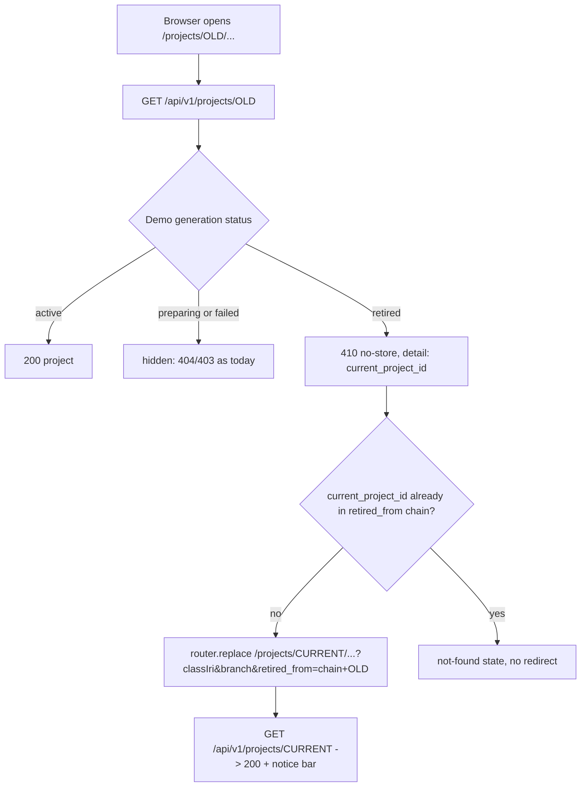
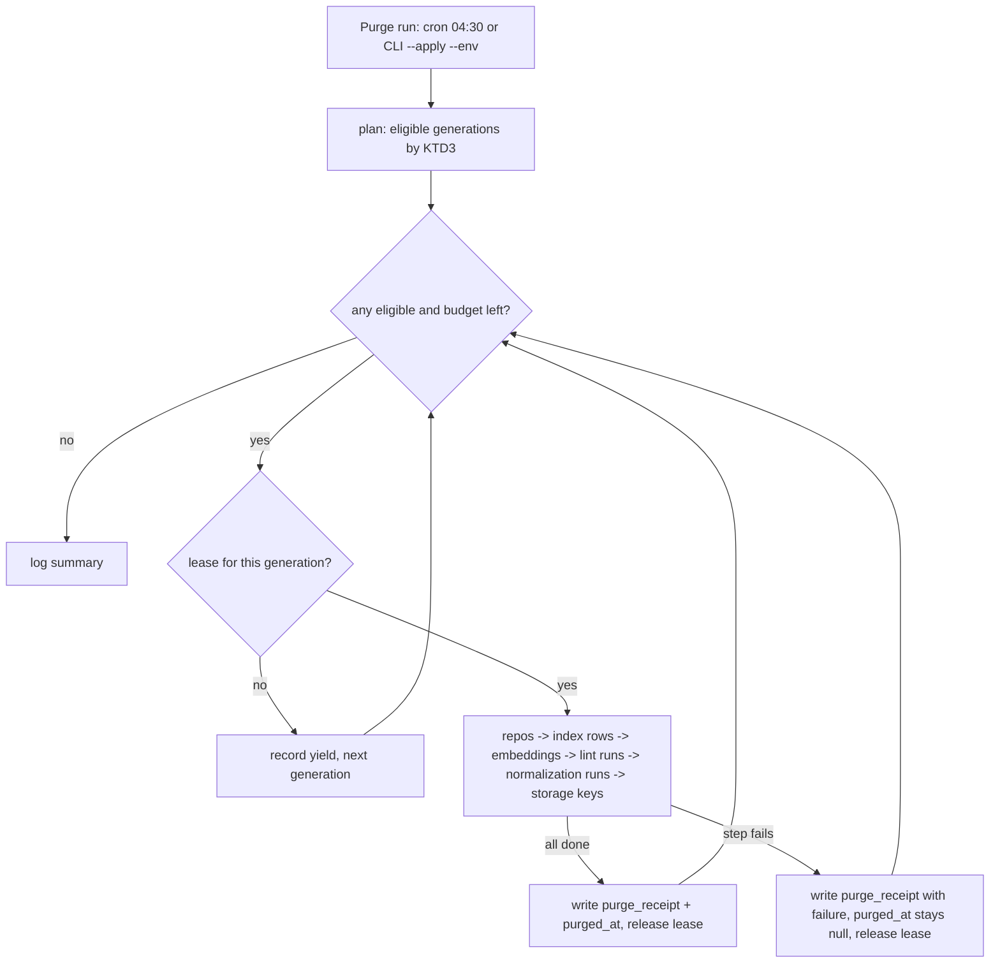

# Retired Demo URL Redirect and Bounded Retention - Plan

**Target repos:** `ontokit-api` (alea-institute fork, `dev` line) and `ontokit-web` (alea-institute fork, `dev` line). Paths below are repo-relative and prefixed `api:` or `web:`.

**Parent plan:** `docs/plans/2026-09-05-1153-chore-recent-plan-march-through-plan.md` (the march-through plan). This plan is its unit U14. References below to "march U9" and "march U10" mean that plan's DEV deploy unit and its authenticated DEV acceptance unit; they are not units of this document.

## Goal Capsule

- **Objective:** A saved or shared demo link keeps working after the public demo is refreshed, and DEV's disk and database stop growing with every refresh. Visitors who follow an old demo link land on the current demo and are told why; operators can see how many generations are retained and whether the last cleanup succeeded.
- **Means:** The API answers a retired demo project ID with a structured 410 that names the current project; the web client follows it and shows a notice (KD1, KTD1, KTD6). A retention job purges old generation content while keeping the small rows the lookup needs (KTD2, KTD3, KTD4).
- **Authority:** Decision D11 (Cockpit B3, 2026-09-07) fixes the product behavior. `alea-institute/ontokit-web#34` and `alea-institute/ontokit-api#32` own the acceptance criteria. This plan governs mechanism, sequencing, and evidence. The existing atomic-generation contract in `api:ontokit/services/demo_project_provisioning.py` is not reopened.
- **Stop conditions:** No DEV, PROD, credential, or cron mutation happens from this plan; the worker cron is code that ships with the deploy, and the operator CLI's `--apply` runs on DEV only inside the march U10 acceptance pass, under its recorded receipt. Never delete an `active` or `preparing` generation's content. Never delete a demo `projects` row. Never delete an object named by a project's `source_file_path`. A failing Verification Contract gate stops the unit; the unit is blocked until the gate is green.
- **Execution profile:** `ce-work` on isolated branches per repo. Codex workers edit files. The orchestrator runs every network-bound step, runs the repo gates, and merges ALEA PRs only after green CI and a quiet review window. Both PRs land on `dev`; the API PR merges first because the web unit consumes its response contract.

---

## Product Contract

### Summary

Resolve a retired demo project ID to the current generation's project through the stable live-source identity, tell the visitor the link was retired, and prune old generation content on a configurable age-and-count policy without ever removing the rows that resolution depends on.

### Problem Frame

Atomic demo refresh creates a new project ID per generation and hides the old one (`api:ontokit/services/demo_project_provisioning.py`, `finalize_demo_publication`). A bookmark to the old ID stops identifying the public demo, and today it gets the same not-found answer as a project that never existed. Every refresh also leaves behind a bare repository, hundreds of thousands of index rows, embeddings, and lint and normalization runs that nothing reclaims. D11 chose redirect-with-notice over a retirement page or a 404, and API #32 requires that cleanup never destroy the mapping that redirect needs.

### Key Decisions

- KD1. **A retired demo project ID redirects to the current generation and shows a clear notice** (session-settled: user-directed — chosen over a retirement page with a link and over a 404 after the retention window: it preserves shared links and lands visitors on live data). Governs R1, R3, R4, R5.
- KD2. **Demo project rows are permanent; only generation content is bounded.** The row is the tombstone the redirect needs, and it is tiny. Governs R7, R8.
- KD3. **One rollback generation is always retained.** The retained-retired count has a floor of one; a smaller value is refused at startup. Chosen over a fully free setting because the plan's rollback promise would otherwise be one configuration change from false. Governs R6, R7.

### Requirements

**Retired-link resolution**

- R1. A single-project read of a demo project whose generation is `retired` is answered with a machine-readable "retired" response that names the current active project for the same live source, and never returns the retired project's content.
- R2. Every other route and helper that decides demo visibility keeps today's fail-closed behavior; a demo project whose generation is `preparing` or `failed`, and every retired project reached through any path other than the single-project read, is hidden exactly as today with no pointer disclosed.
- R3. The web client follows the retired response to the current project, preserving the requested sub-route and the navigation query parameters, and shows a notice that the link followed was retired.
- R4. Resolution follows a retirement chain, not a flag: the client follows a pointer whose target is new to the chain, and shows the unavailable state only when the pointer would revisit an ID already in the chain or the target is unavailable.
- R5. The retired response contract is documented for API clients in the generated OpenAPI schema and is marked not cacheable.

**Bounded retention**

- R6. Retention policy is configurable by a retained-retired-generation count and a minimum age; the count has a floor of one, both have safe defaults, and both are read from settings.
- R7. The `active` generation, any `preparing` generation, and the most recent retained retired generations are never selectable for purge; `failed` generations never consume a retained slot.
- R8. Purging a generation removes its bare repositories, index rows, embeddings, lint runs, normalization runs, and any object-storage keys under the demo project's own prefix, and marks the generation purged; it keeps the `demo_generations` row, every demo `projects` row, and the GitHub integration rows, and never touches an object named by `source_file_path`.
- R9. Purge is idempotent and restart-safe: an interrupted purge finishes on the next run, a run with nothing eligible is a no-op, and a purged generation that is republished under the same key becomes eligible again.
- R10. Every purge run writes a durable receipt per touched generation, on success and on failure, naming what was retained and removed by identifier and count, with no credentials, tokens, or ontology content.
- R11. Purge never overlaps a demo refresh: it holds the refresh lease only while purging one generation, releases it between generations, and stops starting new generations past a run budget.
- R12. An operator can read the retained generation count, last purge time, and last purge failure from persisted receipts without querying the database by hand.
- R13. The destructive CLI path refuses to run unless the operator names the environment it is about to mutate and that name matches the running configuration.

### Success Criteria

- A visitor with a pre-refresh bookmark reaches the current demo in one navigation and sees the notice; a visitor with a fresh link sees no notice.
- On DEV, a retention run taken under a recorded temporary age-floor override removes the oldest retired generation's content, leaves the active and one rollback generation intact, and lowers the git-volume size and `indexed_*` row counts, with before and after numbers in the UAT log.

### Scope Boundaries

- Cleanup targets demo generations only. Ordinary project deletion (`api:ontokit/services/project_service.py`, `delete`) is unchanged.
- Rollback to a retired generation is not implemented here; retention guarantees that one retired generation's content survives for it (KD3).
- The sitemap is not touched: `finalize_demo_publication` does not notify the sitemap today and retired IDs now resolve, so stale sitemap entries are harmless.

#### Deferred to Follow-Up Work

- Sitemap removal of retired demo IDs at publication time (`api:ontokit/services/sitemap_notifier.py`).
- A persisted run-level receipt table and a metrics or dashboard surface for retention beyond per-generation receipts, logs, and the CLI status report.
- Deleting `failed` generation rows outright after a long age; this plan purges their content and keeps the rows for consistency.
- Carrying generation-scoped query parameters (`resumeSession`, pull-request numbers, suggestion review IDs) across a redirect; this plan carries only the navigation parameters named in KTD6.

### Acceptance Examples

- AE1. **Covers R1, R3.** Given generation G1 was active and G2 is now active for the FOLIO source, when a browser opens `/projects/<G1 folio id>/editor?classIri=x`, then the API answers 410 with the G2 FOLIO project ID, the browser lands on `/projects/<G2 folio id>/editor?classIri=x&retired_from=<G1 folio id>` without first showing a not-found page, and a notice says the link was retired.
- AE2. **Covers R2.** Given generation G3 is `preparing`, when an anonymous request asks for a G3 project, then the answer is the same not-found response as before this plan and carries no pointer.
- AE3. **Covers R4.** Given the 410 names project Q and Q returns 410 naming a project already in the chain, or 404, when the client follows the pointer once, then it shows the not-found state and issues no second redirect.
- AE4. **Covers R7, R8, R9.** Given generations G1 (retired, oldest), G2 (retired), G3 (active), a keep count of 1 and an age floor already passed, when purge runs twice, then G1's content is removed and marked purged on the first run, G2 and G3 are untouched with their repositories, index rows, and embeddings unchanged, and the second run reports zero eligible generations and changes nothing.
- AE5. **Covers R1, R8.** Given G1 was purged in AE4, when a browser opens a G1 project URL, then resolution to G3 still succeeds because the G1 project row and its live-source link survived.
- AE6. **Covers R9, R10.** Given a purge is interrupted after the bare repository is removed but before index rows are deleted, when purge runs again, then it deletes the remaining index rows, marks the generation purged, and the generation's receipt shows the earlier failure followed by the completed run.
- AE7. **Covers R4.** Given a visitor copied the post-redirect URL `/projects/<G2 id>/…?retired_from=<G1 id>` and G2 is later retired in favor of G3, when the visitor opens that URL, then the client follows the pointer to G3 because G3 is new to the chain.

### Sources

- `api:ontokit/models/demo_generation.py` — `DemoGenerationStatus` lifecycle (`preparing`, `active`, `failed`, `retired`), `retired_at`, `last_failed_at`, and the single-active partial index.
- `api:ontokit/services/demo_project_provisioning.py` — `finalize_demo_publication` retires the previous generation and flips `is_public`; `ensure_demo_projects` reuses a `failed` generation's rows when its key recurs; `demo_generation_attempt_lease` is a `pg_try_advisory_lock` that raises `DemoProvisioningRefused` on contention.
- `api:ontokit/services/project_access_policy.py` — `require_visible_project`, `load_visible_project`, and `visible_project_clause` are the shared hidden-demo gate used by generation, translation, LLM, suggestion, pull-request, and join-request paths; `ProjectService._can_view` duplicates the check.
- `api:ontokit/models/project.py` — `demo_source_project_id` is the stable live-source identity across generations; `demo_generation_id` binds a project to its generation; `source_file_path` on a demo project is copied from its live source.
- `api:ontokit/services/project_service.py` — uploads live under key `projects/{project id}/ontology.ttl` in `settings.minio_bucket`.
- `api:ontokit/services/ontology_index.py` (`OntologyIndexService`, with `_delete_index_data` and `delete_branch_index`), `api:ontokit/services/storage.py` (`StorageService`, single-object `delete_file`), `api:ontokit/git/bare_repository.py` (`delete_repository(project_id)`), `api:ontokit/services/embedding_service.py` (`clear_embeddings`) — existing removal primitives.
- `api:deploy/demo-refresh.cron.example` — the host refresh runs at 03:17 daily.
- `api:ontokit/api/routes/pr_party.py` — the `Cache-Control: no-store` response pattern.
- `api:tests/unit/test_demo_project_route_visibility.py` — fail-closed proofs for the route-local authorizers.
- `web:lib/hooks/useProject.ts` — `ProjectErrorKind` maps 403 and 404; the retry predicate disables retries only for those two statuses.
- `web:components/projects/demo-project-banner.tsx` — defines `DemoProjectShell` (rendered by `web:app/projects/[id]/layout.tsx`), with the early return for non-demo projects; its test is `web:__tests__/components/projects/demo-project-banner.test.tsx`.
- `web:lib/api/client.ts` — `ApiError` and the `getSourceRevisionConflict` typed-detail guard pattern.

---

## Planning Contract

### Key Technical Decisions

- KTD1. **The API signals retirement with `410 Gone` and a structured detail, not an HTTP redirect, and only on the single-project read.** Detail carries `code: "demo_generation_retired"`, `current_project_id`, and `retired_at` taken from `demo_generations.retired_at`; the response sets `Cache-Control: no-store`. Browsers follow 3xx inside `fetch` transparently, so the SPA could never show the notice, and a JSON status keeps the retired content hidden. The branch lives in `ProjectService.get` behind the `GET /api/v1/projects/{project_id}` route; `require_visible_project`, `load_visible_project`, `visible_project_clause`, and every route-local authorizer are unchanged (R2). Cites KD1.
- KTD2. **The tombstone is the existing demo `projects` row plus purge fields on `demo_generations`.** Resolution finds the current project by matching `demo_source_project_id` to a project that is a demo, is public, and whose generation is `active`; no alias table is needed. Purge adds `purged_at` and `purge_receipt` to `demo_generations` and removes no rows. Chosen over a separate alias table because the identity already exists and a second copy would drift. Cites KD2.
- KTD3. **Eligibility is count-and-age over retired generations, with failed generations handled separately.** Age is measured from `retired_at` for `retired` and from `last_failed_at` for `failed`. A `retired` generation is eligible when it is not among the newest `demo_retention_keep_retired` retired generations and is older than `demo_retention_min_age_days`. A `failed` generation is eligible when older than the age floor; it never occupies a retained slot. `active` and `preparing` are never eligible. A generation with `purged_at` set is skipped; when `ensure_demo_projects` returns a `failed` generation to `preparing`, it clears `purged_at` and `purge_receipt` so a republished generation is eligible again (R9). Settings live in `api:ontokit/core/config.py`: `demo_retention_keep_retired` (default 1, minimum 1 per KD3) and `demo_retention_min_age_days` (default 7, minimum 0).
- KTD4. **Retention runs as an arq cron job in the worker, with a thin operator CLI guarded by an environment name.** The worker already holds database, object-storage, and git-base-path access and registers cron jobs in `api:ontokit/worker.py`; the job runs daily at 04:30, one hour after the 03:17 host refresh. The CLI `api:deploy/purge_demo_generations.py` wraps the same service with `--dry-run`, `--status`, and `--apply --env <name>`, where `--env` must equal `settings.app_env` or the CLI refuses (R13), following the `refuse()` pattern in `api:deploy/resync_demo_projects.py`. Both paths acquire `demo_generation_attempt_lease` per generation, release it between generations, and stop starting new generations after `demo_retention_run_budget_seconds` (default 600), so a refresh is refused for at most one generation's purge (R11).
- KTD5. **Purge order is content-first, marker-last, per generation, and every outcome is persisted.** Bare repositories, index rows, embeddings, lint runs, normalization runs, then object-storage keys; `purged_at` is written only after every step reports done or already-absent. A failing step writes the failure into `purge_receipt` with the completed steps, counts, and a redacted reason, and leaves `purged_at` unset, so the next run retries and `--status` can report the failure (R10, R12). Each step tolerates absence, so a rerun after interruption completes the remainder (AE6).
- KTD6. **The web client resolves retirement once, in the project shell, and guards on the retirement chain.** `useProject` stops retrying on 410, maps a 410 carrying the retired code to a `retiredRedirect` result, and exposes an `isRetiredRedirecting` state; a 410 whose target is already in the chain maps to the existing `not-found` error kind. `DemoProjectShell`, defined in `web:components/projects/demo-project-banner.tsx`, performs `router.replace` before its non-demo early return, to the current ID with the same sub-path, the navigation parameters `classIri` and `branch` only, and `retired_from` set to the chain (the requested ID appended to any existing `retired_from`). It follows a pointer when `current_project_id` is not in the chain and shows the not-found state otherwise (R4, AE7). `retired_from` is honored only when every value parses as a UUID distinct from the current project; a malformed value is stripped and renders no notice. Every project sub-route page renders its loading state, not its not-found page, while `isRetiredRedirecting` is set. The notice is a separate dismissible bar above the demo-workspace banner with `role="status"`; dismissing it removes `retired_from` from the URL.

### High-Level Technical Design

### Assumptions

- The live source project (`demo_source_project_id`) is present for every demo project of every generation; `finalize_demo_publication` already refuses publication otherwise, so resolution can rely on it.
- Demo projects normally own no object-storage keys of their own (resync loads from git and reindexes), so the storage step usually reports zero deletions; zero is not a failure. Keys, when present, live under `projects/{project id}/` in `settings.minio_bucket`; the storage helper takes a project UUID and builds that prefix itself.
- Stacking the retired notice above the demo-workspace banner is acceptable for the first arrival; combining them into one bar is left to a later design pass.
- Persisted per-generation receipts plus the CLI `--status` report satisfy R12 at DEV scale; a run-level receipt table is deferred.
- A 7-day age floor and one retained retired generation are acceptable defaults for DEV; production values are an operator setting, not a code change.
- The DEV retention receipt requires a temporary age-floor override recorded in the UAT log; it is taken inside the march U10 pass, which Cockpit B5 authorized, and reverted in the same sitting.

### Sequencing

1. U1 (API schema and settings) has no dependencies.
2. U2 (API retired resolution) and U3 (retention service) depend on U1 and are independent of each other.
3. U4 (worker cron and CLI) depends on U3.
4. U5 (web) depends on U2's response contract being merged to `dev`.
5. U6 (cross-unit integration proof) depends on U2, U3, and U4.

---

## Implementation Units

### U1. Purge marker columns and retention settings

- **Goal:** Give purge a durable marker and give the policy its knobs.
- **Requirements:** R6, R8, R10; KD3, KTD2, KTD3.
- **Dependencies:** none.
- **Files:** `api:alembic/versions/<new>_add_demo_generation_purge_marker.py`; `api:ontokit/models/demo_generation.py`; `api:ontokit/core/config.py`; `api:tests/unit/test_demo_generation_migration_contract.py`; `api:tests/unit/test_config.py`.
- **Approach:**
  1. Add nullable `purged_at` (timestamp with time zone) and `purge_receipt` (text holding JSON) to `demo_generations`; parent the migration on the current `dev` head.
  2. Mirror both columns on the model.
  3. Add `demo_retention_keep_retired: int = 1` (minimum 1), `demo_retention_min_age_days: int = 7` (minimum 0), and `demo_retention_run_budget_seconds: int = 600` (minimum 1) to settings.
- **Patterns to follow:** `api:alembic/versions/h6i7j8k9l0m1_add_atomic_demo_generations.py` for column shape and naming; `api:tests/unit/test_demo_generation_migration_contract.py` for the contract test style.
- **Test scenarios:**
  - Migration upgrade then downgrade round-trips on an empty database and leaves a single head.
  - Model and migration agree on column names and nullability (contract test).
  - Default settings expose keep 1, age 7, budget 600; environment overrides are read; keep 0 and a negative age are rejected at startup.
- **Verification:** Single Alembic head; contract test green; settings tests green.

### U2. Retired demo project resolution response

- **Goal:** Answer a retired demo project ID with the current project on the single-project read, and nothing else anywhere.
- **Requirements:** R1, R2, R5; KD1, KTD1, KTD2.
- **Dependencies:** U1.
- **Files:** `api:ontokit/services/project_service.py` (`get` and `_can_view`); `api:ontokit/services/project_access_policy.py` (read only, to confirm it is unchanged); `api:ontokit/services/demo_project_provisioning.py` (a resolver helper next to the lease that returns the current active project for a retired project's source); `api:ontokit/schemas/project.py` (retired detail schema); `api:ontokit/api/routes/projects.py` (OpenAPI `responses` entry for 410 and the `no-store` header); `api:tests/unit/test_demo_project_route_visibility.py`; `api:tests/unit/test_project_service.py`.
- **Approach:**
  1. In `ProjectService.get`, before the hidden-demo denial, detect a demo project whose generation is `retired`; resolve the current project via the KTD2 match; raise the 410 with the KTD1 detail and `retired_at` from the generation; when no active counterpart exists (publication in flight), fall through to today's hidden response.
  2. Leave `require_visible_project`, `load_visible_project`, `visible_project_clause`, and the route-local `_require_project_member` authorizers in `generation.py`, `llm.py`, and `translation.py` untouched; the 410 is reachable only from the single-project GET.
  3. Declare the 410 schema on the route and set `Cache-Control: no-store` on that response.
- **Execution note:** Start from a failing test in the route-visibility module that opens a retired project anonymously and asserts the 410 detail, then make it pass.
- **Patterns to follow:** existing tests in `api:tests/unit/test_demo_project_route_visibility.py`; the `no-store` header in `api:ontokit/api/routes/pr_party.py`; error-detail conventions in `api:ontokit/api/routes/projects.py`.
- **Test scenarios:**
  - Covers AE1. Retired project, anonymous caller, single-project GET: 410 with `code`, `current_project_id` equal to the active public demo project for the same source, `retired_at` equal to the generation's `retired_at`, and `Cache-Control: no-store`.
  - Covers AE2. Preparing project and failed project: unchanged not-found/forbidden behavior, no pointer in the body.
  - Retired project whose source has no active counterpart: hidden response, no 410.
  - Retired project requested by its retained owner: 410, not the content.
  - Retired project reached through the generation, LLM, and translation route-local authorizers, and through `require_visible_project`: denied exactly as before with no pointer in the body.
  - Non-demo project that is private: 403 behavior unchanged.
  - OpenAPI document lists 410 on `GET /api/v1/projects/{project_id}` with the detail schema.
- **Verification:** New and existing visibility tests green; `uv run mypy ontokit/` clean; the OpenAPI JSON contains the 410 entry.

### U3. Retention service: plan, purge, receipt

- **Goal:** Purge eligible generations safely, repeatably, and with a durable record of every outcome.
- **Requirements:** R7, R8, R9, R10, R11; KD2, KD3, KTD3, KTD5.
- **Dependencies:** U1.
- **Files:** `api:ontokit/services/demo_retention.py` (new); `api:ontokit/services/ontology_index.py` (reuse `_delete_index_data`, adding a project-wide delete if no branch-agnostic entry point exists); `api:ontokit/services/storage.py` (a delete-by-project helper that takes a UUID and lists and deletes keys under `projects/{uuid}/` only); `api:ontokit/services/demo_project_provisioning.py` (clear `purged_at` and `purge_receipt` when a failed generation returns to `preparing`); `api:tests/unit/test_demo_retention.py` (new); `api:tests/unit/test_demo_project_provisioning.py`.
- **Approach:**
  1. `plan()` lists generations with status, age per KTD3, and reasons, and returns eligible and retained sets.
  2. `purge(generation)` runs the KTD5 order with the existing primitives: `delete_repository(project_id)`, index rows by project, `clear_embeddings(project_id)`, lint runs and normalization runs by project ID, then the storage helper by project UUID; it never reads `source_file_path`. Each step is absence-tolerant and returns a count.
  3. `apply()` iterates eligible generations oldest first within the run budget; per generation it takes `demo_generation_attempt_lease`, purges, writes `purge_receipt` (success or failure per KTD5), sets `purged_at` on success only, and releases the lease; on lease contention it records a yield for that generation and continues to the next; it returns a run summary that names retained generations with reasons.
  4. Receipts name generation keys, project IDs, step counts, completed steps, and a redacted failure class only.
- **Execution note:** Implement test-first against fakes for git, index, embeddings, storage, and the lease; the real-database proof lives in U6.
- **Patterns to follow:** lease usage in `api:deploy/resync_demo_projects.py`; `delete_repository` in `api:ontokit/git/bare_repository.py` for the UUID-in, path-built-internally shape; fake-based tests in `api:tests/unit/test_demo_resync.py`.
- **Test scenarios:**
  - Covers AE4. Three generations with keep 1 and age passed: only the oldest retired generation is eligible; a second run finds nothing; the active generation's repository, index rows, embeddings, and storage keys are unchanged.
  - Age floor not yet passed: an otherwise-eligible generation is retained with reason "age".
  - Keep count 2: the two newest retired generations are retained; older ones are eligible.
  - A recent `failed` generation does not occupy a retained slot; an old `failed` generation is eligible and its purge succeeds with zero counts when nothing exists.
  - `active` and `preparing` generations are never in the eligible set regardless of age.
  - Covers AE6. Purge with the repository already absent completes the remaining steps and marks purged; the receipt shows the earlier failure and the completed run.
  - A step that raises writes a failure receipt with the completed steps and counts, leaves `purged_at` unset, and the next run retries that generation.
  - Lease held for one generation: that generation is recorded as yielded, the run continues to the next eligible generation, and nothing is deleted for the yielded one.
  - Run budget exhausted after the first generation: the second eligible generation is left for the next run and named in the summary.
  - Republish: a purged `failed` generation whose key recurs has `purged_at` and `purge_receipt` cleared when it returns to `preparing`, and is eligible again once retired and aged.
  - The storage helper refuses a non-UUID argument, lists only the target project's keys, and never deletes a key equal to any project's `source_file_path`.
  - Receipt contains no token, URL with credentials, or ontology text (assert on the serialized receipt).
- **Verification:** Unit tests green; `uv run ruff check ontokit/` and `uv run mypy ontokit/` clean.

### U4. Worker cron and operator CLI

- **Goal:** Run retention on a schedule and on demand, with a readable status and an environment guard on the destructive path.
- **Requirements:** R11, R12, R13; KTD4.
- **Dependencies:** U3.
- **Files:** `api:ontokit/worker.py` (task function and `cron_jobs` entry); `api:deploy/purge_demo_generations.py` (new); `api:deploy/RUNBOOK.md` (retention section); `api:tests/unit/test_demo_retention_cli.py` (new); the existing worker test module.
- **Approach:**
  1. Add a worker task that opens its own connection for the lease, calls `apply()`, and logs the summary as one structured line; register it in `cron_jobs` daily at 04:30.
  2. The CLI supports `--dry-run` (prints the plan with reasons), `--status` (prints retained count, purged count, last `purged_at`, and the last failure read from the newest failure `purge_receipt`), and `--apply --env <name>` (refuses unless `<name>` equals `settings.app_env`, then runs `apply()` and prints the receipts).
  3. Document the schedule, the settings, the environment guard, and the CLI in the runbook.
- **Patterns to follow:** existing `cron(...)` entries and task shape in `api:ontokit/worker.py`; `refuse`, argument parsing, and exit codes in `api:deploy/resync_demo_projects.py`.
- **Test scenarios:**
  - The cron entry is registered daily at 04:30.
  - `--dry-run` prints eligible and retained generations with reasons and changes nothing.
  - `--status` reports counts and last purge time from seeded receipts, including a last failure read from a persisted failure receipt.
  - `--apply` without `--env`, or with a name that does not match `settings.app_env`, exits non-zero and deletes nothing.
  - `--apply --env <matching>` with the lease held for a generation reports that generation as yielded and exits zero.
- **Verification:** Tests green; the runbook section names the settings, the schedule, the guard, and the commands.

### U5. Web: follow the retired pointer and show the notice

- **Goal:** Old demo links land on the current demo with a visible explanation and no intermediate not-found flash.
- **Requirements:** R3, R4; KD1, KTD6.
- **Dependencies:** U2 merged to `dev`.
- **Files:** `web:lib/hooks/useProject.ts`; `web:lib/api/client.ts` (retired detail type guard next to `getSourceRevisionConflict`); `web:components/projects/demo-project-banner.tsx` (`DemoProjectShell`); `web:components/projects/retired-demo-notice.tsx` (new); the eight project sub-route pages under `web:app/projects/[id]/` (viewer, dashboard, editor, settings, suggestions, suggestions review, translations, pull requests) for their error branches; `web:__tests__/lib/hooks/useProject.test.ts`; `web:__tests__/components/projects/demo-project-banner.test.tsx`; `web:__tests__/components/projects/retired-demo-notice.test.tsx` (new); `web:__tests__/app/projects/project-shell-redirect.test.tsx` (new).
- **Approach:**
  1. In `useProject`, stop retrying on 410; derive `retiredRedirect` from a 410 whose detail carries the retired code; expose `isRetiredRedirecting`; map a 410 whose target is already in the chain to the `not-found` error kind; keep other mappings.
  2. In `DemoProjectShell`, before the non-demo early return, when `retiredRedirect` names an ID not in the chain, replace the URL per KTD6 (same sub-path, `classIri` and `branch` only, `retired_from` chain appended); validate `retired_from` values as UUIDs distinct from the current project and strip malformed ones.
  3. Change each sub-route page's error-or-no-project branch to render its loading state while `isRetiredRedirecting` is set.
  4. Add the notice bar above the demo-workspace banner with `role="status"` and a dismiss control that removes `retired_from`.
- **Patterns to follow:** `web:components/projects/demo-project-banner.tsx` and its test for bar structure; `web:lib/hooks/useProject.ts` for query-key and error mapping; `getSourceRevisionConflict` in `web:lib/api/client.ts` for the typed-detail guard.
- **Test scenarios:**
  - Covers AE1. A 410 with the detail on `/projects/OLD/editor?classIri=x&foo=1` replaces the URL with `/projects/NEW/editor?classIri=x&retired_from=OLD` on the first response, with no retry and with the editor page showing its loading state, not its not-found page, until the replace fires.
  - Covers AE3. A 410 whose `current_project_id` is already in `retired_from` renders the not-found state and calls no navigation.
  - Covers AE7. A URL carrying `retired_from=G1` whose project answers 410 naming G3 replaces to G3 with `retired_from=G1,G2`.
  - The notice renders when `retired_from` is valid, has `role="status"`, sits above the demo banner, and dismissing removes the flag without reloading the project.
  - A `retired_from` value that is not a UUID, or equals the current project ID, is stripped and renders no notice.
  - A 410 whose detail lacks the code is treated as a generic error.
  - 403 and 404 mappings are unchanged.
- **Verification:** `npm run test -- --run`, `npm run type-check`, `npm run lint` green with no new warnings; the optional-auth production build succeeds.

### U6. Integration proof across a generation replacement

- **Goal:** Prove redirect and retention together on a real database with real git and storage fixtures.
- **Requirements:** R1, R7, R8, R9; AE4, AE5.
- **Dependencies:** U2, U3, U4.
- **Files:** `api:tests/integration/test_demo_retired_redirect_and_retention.py` (new); `api:tests/integration/conftest.py` (git base path and storage fixtures if needed).
- **Approach:**
  1. Seed three generations for both demo sources using the provisioning service, activating each in turn so two are retired, with a temporary git base path and a fake or local storage backend holding one key per demo project.
  2. Assert the oldest generation's projects resolve to the active generation's via the service.
  3. Run `apply()` with an age floor of zero and the default keep count of one; assert the oldest generation's repository directory, index rows, embeddings, lint and normalization runs, and storage keys are gone, that the middle and active generations' counterparts are unchanged, and that resolution still works afterward.
  4. Run `apply()` again and assert a no-op summary.
- **Patterns to follow:** `api:tests/integration/test_demo_project_provisioning.py` for real-database generation setup.
- **Test scenarios:**
  - Covers AE4 and AE5 end to end on PostgreSQL with pgvector and Redis, including the retained-generation survivor assertions.
  - After purge, `demo_generations` and `projects` rows for the purged generation still exist, `purged_at` is set, and the receipt names every step with counts.
- **Verification:** Integration test green under the repo's PostgreSQL and Redis test settings.

---

## Verification Contract

| Gate | Applies to | Done signal |
|---|---|---|
| `uv run pytest tests/` with real PostgreSQL 17 (pgvector) and Redis; `uv run ruff check ontokit/`; `uv run ruff format --check ontokit/`; `uv run mypy ontokit/`; `uv run pyright ontokit/`; `uv run alembic heads` shows one head | U1, U2, U3, U4, U6 | Green on the API branch and on `dev` after merge. |
| `npm run test -- --run`; `npm run type-check`; `npm run lint`; `AUTH_MODE=optional npm run build` with no Zitadel values | U5 | Green; lint warning count equals the `dev` baseline. |
| Push-event Semgrep on `dev` | every merge | Success on both forks. |
| OpenAPI document contains the 410 response on the project GET route | U2 | Present in the generated schema. |
| Browser receipt of AE1 on DEV | after U5 deploys | Recorded in `docs/roundup-2026-08/DEV-UAT-LOG.md` during the march U10 pass. |
| DEV retention receipt: `--dry-run`, then `--apply --env staging` under a recorded temporary `demo_retention_min_age_days=0` override, with git-volume size and `indexed_*` row counts before and after, override reverted | after U4 deploys | Recorded in `docs/roundup-2026-08/DEV-UAT-LOG.md` during the march U10 pass. |

---

## Definition of Done

- U1 through U6 are complete with the gates above green; a unit whose gate is red is blocked, not done, and its receipt is kept for the rerun.
- `alea-institute/ontokit-api#32` and `alea-institute/ontokit-web#34` are closed naming the integration test, the browser receipt, and the DEV retention receipt.
- No demo `projects` row, `demo_generations` row, or `source_file_path` object is deleted by any code path this plan adds.
- The runbook documents the settings, the schedule, the environment guard, and the CLI.
- Dead-end or experimental code from abandoned approaches is removed from both diffs before review.
