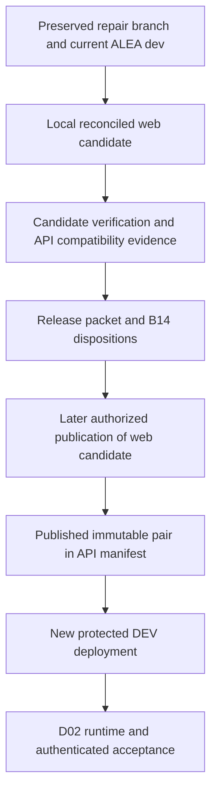

# Prepare the repaired DEV release baseline - Plan

## Goal Capsule

- **Objective:** Maintainers can identify exactly what remains before the repaired OntoKit release can safely reach DEV.
- **Means:** Prepare a local integration candidate and a revision-specific release evidence packet (KTD1–KTD4).
- **Authority:** User instructions govern; R1–R6 define this deliverable. The catalog preserves the broader B01/B02/B14 obligations.
- **Execution profile:** Local preparation, existing regression verification, read-only upstream inspection, and delivery documentation. The executing agent finishes local preparation; an authorized publisher/operator performs later publication and deployment.
- **Stop conditions:** Preserve unrelated work. Do not push, open a PR, merge into `dev`/`main`, approve a deployment, mutate a live environment, or reset a database as part of this plan. The standing publication restriction is recorded in `docs/handoffs/2026-09-18-codex-pickup.md`; this session authorizes preparation, not those actions.
- **Completion boundary:** A verified candidate or a precisely evidenced blocked candidate, with a concrete publication/deployment proposal. Neither closes B01 delivery nor B02/B14 acceptance.

---

## Product Contract

### Summary

Prepare the existing September repairs for integration into ALEA `dev`, preserving the retired-demo redirect already on that branch. Identify the matching API revision, verify the candidate, and assemble the remaining release prerequisites into one evidence packet.

### Problem Frame

The repair branch passed offline regressions but has not been delivered. It also contains extensive preceding test work and automatic saves, while upstream `dev` contains a change absent from the branch. The waiting DEV workflow refers to an older pair, so approving it cannot deliver these repairs.

### Key Decisions

- **Plan bounded deliverables serially, retaining the master backlog.** (session-settled: user-directed — chosen over planning all areas in detail at once: preserve thoroughness without losing later requirements.) Governs R6.

### Requirements

**Candidate identity and preservation**

- R1. Account for the complete web difference from current ALEA `dev`, including preceding tests, repair commits, and meaningful automatic-save content; preserve upstream behavior and unrelated workspace files. Advances B01.
- R2. Record a matching API/web candidate with immutable revisions, target repositories, build configuration, and the distinction between local, published, and deployed artifacts. Advances B01/B02 readiness.

**Release evidence**

- R3. Attach fresh candidate-specific verification or an explicit failure/blocker for each required gate; historical counts do not prove the new candidate. Advances B01.
- R4. Disposition each B14 seam as release-blocking, satisfied with evidence, or deferred with rationale and owner; configured-provider image fidelity must be resolved before authenticated DEV readiness is claimed.
- R5. Specify the exact later publication and DEV activation sequence, including promotion containment, rollback prerequisites, and the superseded waiting run, without executing external mutations. Advances B02 readiness.
- R6. Update D01 and B01/B02/B14 in the master roadmap with evidence and a next eligible deliverable, keeping deployment and acceptance requirements open.

### Acceptance Examples

- AE1. Covers R1: Given upstream retired-demo handling and local editor repairs, the prepared candidate retains both and excludes unrelated `.planning/` autosave churn from the proposed release diff.
- AE2. Covers R2/R5: Given run `34155698435` still waits on an older pair, the packet identifies that mismatch rather than recommending approval as delivery of the new candidate.
- AE3. Covers R3/R4: Given optional-auth tests pass but the configured-provider image cannot be proven, the packet remains blocked for authenticated DEV and names the required follow-up.
- AE4. Covers R6: Given D01 local preparation finishes, B01 remains open until publication/delivery and B02 remains open until environment acceptance.

### Scope Boundaries

D01 prepares and verifies an integration candidate. It does not rewrite the completed repair units or decide unresolved ontology permission policy by implication.

#### Deferred to Follow-Up Work

- A demonstrated build/auth fidelity defect becomes a focused prerequisite repair with its own plan, preserving B14 ownership.
- D02 covers deployment receipts and authenticated persona UAT (B02–03).
- B10–13 cover the reusable browser/full-stack harness; D01 does not invent that suite.
- Demo activation, credential rewrap, CatholicOS upstream tranches, PROD rollout, and wider Turtle grammar support retain their existing backlog IDs.

---

## Planning Contract

**Repositories:** This plan lives in `ontokit-web`. API paths below are relative to `ontokit-api` and explicitly labeled.

### Evidence baseline

Observed 2026-09-20; refresh remote facts before publication.

| Item | Evidence | Consequence |
|---|---|---|
| Local web source | `5e619336d5a5257ca0102b558337823e40238aae`; repair evidence through `16d16747` | Contains repairs, tests, documentation and automatic saves |
| Live ALEA web `dev` | `5eb9888fb84b85c3bbef1dc0aa3bfc4d9bddd075` | Preserve retired-demo redirect; merge base is `4cbe4d4c17437660b70764acb364d24b20ef20ba` |
| Local API checkout | `773c51aa0dd2959fd07c48627d86d66639cd13fb` | Stale; existing untracked handoffs must remain untouched |
| Live ALEA API `dev` | `24242ea04114ea5a757ca34462d92795a557f4a8` | Starting API candidate; includes later deployment/retention changes |
| Live API manifest | API `455f706c000d87d3d87d7939cfeab470fe78cd2b`, web `4cbe4d4c17437660b70764acb364d24b20ef20ba` | Older than current branch tips; not the repaired release |
| Live waiting run | `https://github.com/alea-institute/ontokit-api/actions/runs/34155698435`, head `6464f74c68fa942c96e5aa411b250254102c11e4`, status `waiting` | Requires deliberate replacement/cancellation disposition before later activation |
| Historical regression receipt | `docs/handoffs/2026-09-19-production-fix-results.md`: 362 files / 5,148 passing tests; no Next build or live browser proof | Reuse coverage and repair decisions; run candidate gates |

The live facts above were read through GitHub on 2026-09-20. Container state, host configuration, credentials and installed deployment scripts were not inspected.

### Key Technical Decisions

- KTD1. **Integrate on a new local candidate branch based on the verified ALEA web `dev` tip.** Apply the net substantive changes from the source branch relative to the common ancestor, reconcile overlaps, and preserve the source branch. Exclude automatic status-file churn only after inspecting its content; a WIP commit title is not grounds for dropping code. This avoids rewriting either historical branch. Governs R1.
- KTD2. **Use API `24242ea0…` as the provisional counterpart.** Inspect files from that revision rather than the stale API checkout. Any new API prerequisite changes replace this candidate and invalidate affected receipts. Governs R2.
- KTD3. **Bind verification to source trees and image configuration.** Record revision, commands/results, public API/WSS URLs, auth mode, provider-present flags, and image digest when an image is built. Credentials stay outside the packet and image layers. Governs R2–R4.
- KTD4. **Prepare a manifest proposal outside the operational manifest path.** Use `docs/releases/d01-release-readiness.md` with a proposed full-SHA pair and activation checklist. API `deploy/release-manifest.json` changes trigger runtime work after publication; do not modify or dispatch it here. Governs R5.
- KTD5. **Treat B14 as evidence-based release triage.** Report each seam below; a proven release-blocking defect creates a named prerequisite deliverable instead of expanding D01 into an unreviewed auth or policy change. Governs R4/R6.

### High-Level Technical Design

The boundary after the release packet separates D01 preparation from later external actions (R5).

### Readiness seams

| Seam | Grounding | Required disposition evidence |
|---|---|---|
| Auth-disabled access | `lib/hooks/useProject.ts`, `lib/hooks/useProjectViewer.ts`, parity ledger F1 | Compare server capabilities, route access and role behavior; unresolved policy stays explicit |
| Configured-provider image | `Dockerfile`, `next.config.ts`, `lib/env.ts`, `__tests__/config/docker-release-fidelity.test.ts`; API `deploy/compose.dev.yaml` | Build-time provider flags must agree with runtime provider configuration without storing secrets in layers |
| Namespace ownership | API parity ledger VALID-04 and current entity-creation paths | Identify enforcement and policy conflict before declaring parity |
| Review/self-merge authority | API permission and suggestion-review paths, current web review UI | Reconcile editor/reviewer permissions and trust policy |
| Entity-kind mint gates | `lib/hooks/useTrustCapabilities.ts` and API mint checks | Class, property and individual creation enforce the intended capability |
| Submit budget/unavailability | API suggestion submit and error handling | Verify current 402/503 handling against web error surfaces |
| Production required secrets | API root `compose.prod.yaml` | Flag insecure defaults as PROD blockers without activating PROD |
| Installed deploy-script drift | API `deploy/ontokit-deploy.sh`, `deploy/RUNBOOK.md` | Host script identity/permissions require operator receipt; local source alone cannot satisfy this |
| Operational credential readiness | API DEV Compose initialization expiry dated 2026-09-15 | Distinguish a past initialization timestamp from proof of actual live credential expiry |
| Automatic PROD promotion | API `.github/workflows/promote-prod.yml` | Verify effective `PROD_ENABLED` gate before any later manifest merge; absent evidence blocks activation |

### Assumptions and execution-time unknowns

The current integration destination remains ALEA `dev`; CatholicOS delivery belongs to B08. Candidate construction is locally authorized. D01 may finish with a blocked readiness verdict, but cannot label that candidate ready to deploy. Live host access and credentialed acceptance are execution-time prerequisites for D02, not facts inferred from GitHub.

---

## Implementation Units

### U1. Freeze and classify the release inputs

**Goal:** Give reviewers a complete, reproducible scope for integration.

**Requirements:** R1/R2; AE1/AE2. **Dependencies:** None.

**Files:** Create `docs/releases/d01-release-readiness.md`; read the existing repair plan, results, parity ledger, Git history, and API deployment files at KTD2's revision.

**Approach:** Record source/base/target SHAs and current GitHub evidence. Classify every changed path as production, test, supporting documentation, or excluded status churn. Inspect net differences and overlapping upstream edits. Record publication authority and preserve all source refs.

**Test expectation:** No new behavioral tests; this unit inventories existing work.

**Verification:** Every changed path has a disposition; the retained set includes all repair regressions and meaningful WIP content. No secret, private roster, or transient environment file enters the packet.

### U2. Prepare the local web integration candidate

**Goal:** Reconcile the retained changes onto ALEA `dev` without losing the upstream redirect.

**Requirements:** R1/R2; AE1. **Dependencies:** U1.

**Files:** Retained paths from U1; `app/projects/[id]/layout.tsx`, retired-demo tests under `__tests__/app/`, and any overlap identified by the inventory. Update the release packet with the exact diff and candidate SHA.

**Approach:** Follow KTD1 in an isolated local checkout/branch. Resolve conflicts by behavior and callers, preserving the September save/session/Turtle fixes and the upstream retired-demo handling. Keep recovered backlog documents reachable; they need not inflate the release code diff. Record excluded-path rationale.

**Test scenarios:**

1. Candidate retains redirected retired-demo navigation and allowed query parameters from upstream.
2. Candidate retains repair tests for concurrent draft saves, credential renewal, Turtle serialization, and review error recovery.
3. Net diff against both inputs reveals no unexplained removal of either side's product behavior.

**Patterns:** `docs/audits/2026-09-05-pr-party-dev-parity-ledger.md` behavior-level reconciliation.

**Verification:** Candidate is committed locally, upstream remains unchanged, source branch and unrelated workspace contents are preserved.

### U3. Verify candidate and disposition readiness seams

**Goal:** Produce a defensible readiness verdict for the exact pair.

**Requirements:** R2–R4; AE3. **Dependencies:** U2.

**Files:** Existing `__tests__/` suite, especially `__tests__/config/docker-release-fidelity.test.ts`, `__tests__/config/next-config-env.test.ts`; `Dockerfile`, `next.config.ts`, `lib/env.ts`, `.github/workflows/release.yml`; API files in the readiness table. Write results in the release packet.

**Approach:** Run the Verification Contract. Inspect the current API revision and classify every readiness seam under KTD5. Use synthetic build configuration for local build checks and record the distinction from authenticated runtime proof. If a build fails or a behavioral defect is demonstrated, preserve its error and nominate a bounded prerequisite repair; do not silently weaken validation or change policy.

**Test scenarios:**

1. Existing regression suite, lint, and types pass on the integrated tree.
2. Credential-free optional-auth Next build and Docker image match existing CI expectations.
3. Configured-provider build inputs reach browser auth flags; no provider secret or session secret is retained in browser assets or image metadata.
4. The same configured-provider image can start with runtime credentials, or the packet names the precise unproven boundary without claiming success.
5. Missing build tooling or network access is distinguished from a demonstrated product defect.

**Verification:** Each gate has dated evidence and an exact scope. Any unproven auth build, host-script parity, or promotion gate prevents a ready-to-deploy verdict.

### U4. Prepare the activation proposal and continuation record

**Goal:** Make the next authorized action concrete and keep remaining requirements visible.

**Requirements:** R5/R6; AE2/AE4. **Dependencies:** U3.

**Files:** `docs/releases/d01-release-readiness.md`; `docs/plans/2026-09-20-0649-requirements-delivery-roadmap.md`.

**Approach:** Record the proposed API/local-web pair, publication target, required checks, and how to replace the local web SHA if upstream squash/rebase changes it. Specify later manifest publication, stale-run disposition, effective PROD gate evidence, installed script parity, known-good previous pair/database backup, and explicit rollback action. No successful deployment implies automatic rollback; the operator must own that action. Select the first unresolved prerequisite as the next deliverable, otherwise D02; if external activation alone blocks, select B10's test foundation.

**Test expectation:** No new tests for documentation; validate SHA provenance, links, and requirement coverage.

**Verification:** D01's preparation outcome is distinct from B01/B02 delivery. All 75 IDs remain tracked, with one concrete next action and each blocker assigned an owner/action and recheck condition.

---

## Verification Contract

Execution uses the candidate checkout, not the untouched source branch. Record results before any later candidate changes; rerun affected gates when its source tree changes.

| Gate | Existing mechanism | Evidence required |
|---|---|---|
| Regression | `npm run test -- --run` or installed Vitest non-watch equivalent | Entire suite pass/fail and count; no silent skips |
| Types | `npm run type-check` | Candidate-specific result |
| Lint | `npm run lint` | Errors and retained warning baseline |
| Production build | `npm run build` | Explicit non-secret configuration; no implicit loading of private `.env` files |
| Container fidelity | `.github/workflows/release.yml` and config tests | Existing optional/no-provider expectation plus separate configured-provider assessment |
| Diff integrity | Git ancestry/diff and whitespace checks | Every included/excluded path accounted for |
| API readiness | Revision-pinned inspection of deployment, permission, and submit seams | Source evidence distinguished from unrun API tests and live host checks |

No new packages, private credentials, or live writes are required to produce a blocked-but-actionable readiness packet. Docker unavailability does not count as passing image verification. Full backend CI, browser OIDC, WebSocket reconnect, and live authenticated write/rollback evidence remain later gates. The repository has no `release:validate` script; use its actual checks above.

---

## Definition of Done

- U1's path inventory is complete and U2's local candidate preserves both inputs.
- U3 records fresh verification results and dispositions for every listed seam, including explicit blockers.
- U4 produces a concrete publication/deployment proposal and updates the roadmap.
- No temporary configs, experimental changes, credentials, or unrelated files enter the candidate.
- The final report identifies candidate SHA, evidence packet, next deliverable, and whether anything was pushed, merged or deployed.
- B01, B02 and B14 remain open wherever their full delivery/acceptance obligations are unsatisfied.
