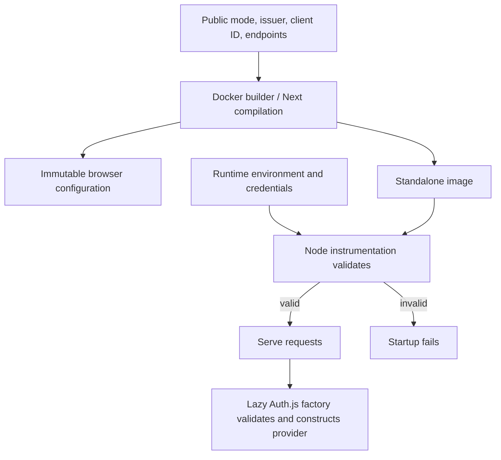

# Configured-provider image fidelity - Plan

## Goal Capsule

- **Objective:** Operators can build and start the authenticated OntoKit web image with the intended public configuration and runtime credentials.
- **Means:** Separate build-time public configuration from runtime authentication initialization (KTD1–KTD3).
- **Authority:** Current user instructions and `AGENTS.md`, this Product Contract, then the Planning Contract. This is D03 under `docs/plans/2026-09-20-0649-requirements-delivery-roadmap.md`, advancing B14.
- **Execution:** Three dependent implementation units. The delivery orchestrator owns review, publication and subsequent release coordination under standing authorization.
- **Stop conditions:** A proposed fix weakens runtime authentication validation, embeds secrets in an image, or requires changing provider/role policy. Report that conflict instead of widening scope.

---

## Product Contract

### Summary

Repair the configured-provider Docker build and prove that its browser settings agree with server authentication. Keep runtime credential validation and existing authentication modes intact.

### Problem Frame

D01's optional-auth Docker image passed, but its required-auth reproduction failed while collecting the authentication route. Server modules validate runtime credentials during build, and the Dockerfile ignores the public provider arguments already supplied by DEV Compose. Consequently, a passing generic image does not establish authenticated release readiness.

### Requirements

**Image configuration**

- R1. Required-auth and optional-auth configured-provider images build using public issuer, client ID and public API/WebSocket endpoints, without provider or session secrets.
- R2. Browser assets retain the build's authentication mode, issuer, provider availability and API/WebSocket settings; deployed runtime settings must match that public configuration.
- R3. Secrets and private environment files remain excluded from Docker build inputs, image layers, browser assets and verification artifacts.

**Runtime behavior**

- R4. Required mode and optional mode with an active provider reject missing or invalid required runtime configuration before serving application requests; validation also protects direct Auth.js entry points.
- R5. Preserve current provider selection, anonymous fallback eligibility, refresh behavior and session behavior across required, optional and disabled modes.

**Delivery evidence**

- R6. Repeatable configured-image build and startup checks join existing CI image gates, with durable evidence distinguishing packaging readiness from live OIDC acceptance.

### Acceptance Examples

- AE1. Covers R1–R3. A required-auth build with synthetic public HTTPS/WSS endpoints and no secrets succeeds, and its compiled public configuration matches those inputs.
- AE2. Covers R4. Starting that image without either runtime secret exits unsuccessfully and does not serve a successful application response. Supplying structurally valid synthetic runtime credentials starts the server and exposes the expected Zitadel provider without contacting a real identity service.
- AE3. Covers R4–R5. Optional mode with configured Zitadel rejects missing secrets; optional mode without a provider keeps anonymous operation. Disabled mode keeps an empty provider list and the existing relaxed validation policy.

### Scope Boundaries

D03 changes web packaging, initialization and their regression gates. It does not establish actual login, provider reachability, credential validity or DEV acceptance.

#### Deferred to Follow-Up Work

D04 handles API individual mint enforcement; D05 handles API submit errors; D02 handles immutable release pairing, activation and live persona/OIDC acceptance. Runtime-switchable browser configuration, provider/role policy changes and generic authentication redesign remain outside D03.

---

## Planning Contract

### Key Technical Decisions

- KTD1. **Use Auth.js lazy initialization.** Construct validated configuration when an authentication operation runs, preserving callbacks in `auth.ts`. Remove import-time server validation from `lib/env.ts`; retain lazy `serverEnv` access with successful production-value caching and current test revalidation behavior. This implements R1, R4 and R5 without a build-only validation bypass. The installed Auth.js implementation supports the documented [lazy initializer](https://authjs.dev/reference/nextjs).
- KTD2. **Validate at server initialization as well as auth entry.** Add root `instrumentation.ts` with Node-runtime-only dynamic import of environment validation. Next's runtime initialization awaits registration; installed Next 16.3.1 skips registration during production build. This preserves R4's startup rejection while allowing build imports. Do not depend on the printed “Ready” line: installed Next prints it before initialization completes. See [Next instrumentation](https://nextjs.org/docs/app/api-reference/file-conventions/instrumentation).
- KTD3. **Keep public settings as build inputs.** Declare issuer/client ID arguments in the Docker builder stage alongside existing public endpoint arguments. Keep private credentials runtime-only. `next.config.ts` already derives the public provider predicate from issuer plus client ID. Because [Next freezes public variables at build](https://nextjs.org/docs/app/guides/environment-variables), operators rebuild when public settings change (R2–R3).
- KTD4. **Keep generic publication and add a configured-image gate.** Preserve existing optional/no-provider publication arguments and their fidelity test. Add a non-publishing configured-provider image check, including startup rejection and provider discovery, as a dependency of image publication (R6). Reuse the same smoke harness locally and in CI.

### High-Level Technical Design

| Runtime mode | Issuer and client ID | Strict server validation | Provider list | Anonymous fallback eligibility |
|---|---|---|---|---|
| required | present | yes | Zitadel | no |
| required | missing | yes; fails | no usable runtime | no relaxation |
| optional | present | yes | Zitadel | no |
| optional | missing | no | empty | existing no-provider rule |
| disabled | present | no | empty | retain existing behavior; no policy expansion |
| disabled | missing | no | empty | existing no-provider rule |

The matrix projects R4–R5; partial/invalid supplied values still follow the existing schema. No secret is generated while importing build modules. Runtime fallback generation follows validation and is reused within a process.

### Assumptions

The D01 candidate is the implementation baseline. Synthetic container credentials prove initialization, not successful identity-provider authentication. The existing deployment contract supplies matching public build settings and runtime settings; D02 verifies the actual environment. These are implementation assumptions, not evidence of live readiness.

### System-Wide Impact and Risks

`auth.ts` exports are used by the authentication route, while its eager `authConfig` export is consumed by tests. Replace those test consumers with the runtime factory without losing their real Auth.js callback/session coverage. Avoid importing Node-only authentication modules into an Edge instrumentation bundle.

A validation cache must store only successful results. A failed first access must remain retryable, and valid production snapshots must not silently change after initialization. Container smoke checks must poll actual HTTP availability and process exit rather than treating a startup log as proof.

### Sources

- `docs/releases/d01-release-readiness.md`: observed configured-build failure and D03 boundary.
- `auth.ts`, `lib/env.ts`, `lib/auth-mode.ts`, `next.config.ts`, `Dockerfile`: current initialization and public configuration contracts.
- Installed Next 16.3.1 instrumentation registration and server initialization; installed Auth.js 5.0.0-beta.32 lazy initialization implementation. These versions come from the candidate dependencies, not the older architecture summary.
- OntoKit API revision `24242ea04114ea5a757ca34462d92795a557f4a8`, `deploy/compose.dev.yaml`: public provider build arguments and separate runtime environment. No API edit is needed for D03.

---

## Implementation Units

### U1. Separate build imports from validated runtime auth

**Goal:** Satisfy R1, R4 and R5 at the build/runtime boundary.

**Dependencies:** None.

**Files:** `auth.ts`, `lib/env.ts`, new `instrumentation.ts`; `__tests__/lib/env.test.ts`, `__tests__/config/auth-bootstrap.test.ts`, `__tests__/config/auth-session.integration.test.ts`, new `__tests__/config/instrumentation.test.ts`.

**Approach:** Apply KTD1–KTD2. Preserve existing callbacks and fallback eligibility. Replace tests expecting import-time validation with equivalent runtime initialization/access assertions, and retain their negative cases. Keep client public-value validation behavior unless the build contract requires a focused adjustment.

**Patterns:** Existing Zod schema, `isAuthRequired`/`isAuthActive`, current Auth.js session integration tests.

**Execution note:** Add failing boundary regressions before changing initialization; do not discard eager-validation tests without equivalent runtime coverage.

**Test scenarios:**

1. Import auth and environment modules with required mode and no credentials: import succeeds without creating a fallback secret; invoking the configuration factory rejects.
2. Node instrumentation rejects missing issuer, ID, provider secret or session secret in required mode, and either missing secret in configured optional mode.
3. Non-Node instrumentation does not import Node-only validation; valid Node startup validates successfully.
4. Covers AE3. Exercise no-provider optional and disabled modes, plus disabled mode with provider variables, preserving validation/provider/fallback policy.
5. Failed server validation is not cached; first successful production access captures a stable snapshot. Test-mode reads continue to revalidate.
6. Preserve successful sign-in mapping, refresh-token rotation/failure and session propagation through existing real Auth.js integration cases.

**Verification:** Focused environment/auth/instrumentation tests pass, types remain valid, and no eager server credential read survives the build import path.

### U2. Build the intended public provider configuration

**Goal:** Satisfy R1–R3 across Docker and browser configuration.

**Dependencies:** U1.

**Files:** `Dockerfile`; `next.config.ts` only if a demonstrated consistency issue requires adjustment; `__tests__/config/docker-release-fidelity.test.ts`, `__tests__/config/next-config-env.test.ts`, `__tests__/lib/auth-mode.test.ts`.

**Approach:** Apply KTD3. Retain the existing no-secret argument and environment-file exclusion guards. Do not substitute dummy private credentials to make compilation succeed.

**Test scenarios:**

1. Covers AE1. Required and configured optional builds accept synthetic public issuer/client ID/API/WS inputs and no secret build arguments.
2. Browser configuration sets the provider flag only when both issuer and client ID exist; disabled mode continues to suppress authentication UI.
3. Existing generic optional/no-provider image remains buildable and its publication arguments stay matched to its build gate.
4. Image metadata/history and compiled client assets contain no private build credentials; synthetic runtime canary secrets do not appear in client responses/assets.

**Verification:** Both configured-provider and generic optional images build successfully; inspection confirms the public values and existing exclusion rules.

### U3. Gate configured images on runtime smoke evidence

**Goal:** Satisfy R2, R4 and R6 with repeatable container verification.

**Dependencies:** U1, U2.

**Files:** New `scripts/verify-auth-image.sh` or equivalent focused repository smoke harness; `.github/workflows/release.yml`; `__tests__/config/docker-release-fidelity.test.ts`; new `docs/releases/d03-image-readiness.md`; update `docs/releases/d01-release-readiness.md` and `docs/plans/2026-09-20-0649-requirements-delivery-roadmap.md` with outcomes.

**Approach:** Apply KTD4. Use synthetic public configuration and runtime-only synthetic secrets, isolated loopback ports, bounded polling and guaranteed cleanup. Load the non-pushed image for runtime checks. Record full source revision, image digest, exact nonsecret settings, outcomes and remaining D04/D05/D02 prerequisites.

**Test scenarios:**

1. Covers AE2. Required image fails startup without each required runtime secret independently, then starts with complete synthetic settings and returns the expected provider from its authentication provider endpoint.
2. Configured optional image follows the same secret rejection contract. Generic optional image starts without provider credentials and returns no providers.
3. Served client assets reflect configured mode/issuer/API/WS and provider availability; server provider configuration agrees with the build inputs.
4. Smoke failure returns nonzero and still removes its containers. CI prevents image publication when the configured check fails.

**Verification:** Local smoke and CI use the same behavior checks. Durable evidence makes no claim of live OIDC success, deployment or completion of the remaining B14 seams.

---

## Verification Contract

| Gate | Applies to | Required outcome |
|---|---|---|
| Focused Vitest run of named test files | U1–U2 | Auth modes, startup validation, cache semantics and callback/session regressions pass |
| `npm run type-check` | U1–U3 | No TypeScript errors |
| `npm run lint` | U1–U3 | No new lint errors |
| `npm run test -- --run` | Integrated change | Full regression suite passes; use an environment-isolated configuration as in D01 |
| Docker production builds | U2–U3 | Generic optional, required configured and optional configured images build without private credentials |
| Repository image smoke harness | U3 | Runtime negative/positive cases and public configuration inspection pass |
| Reviewed diff and CI checks | Publication | Required repository protections remain satisfied |

No repository `release:validate` command exists. Actual provider login, token refresh against Zitadel, persona authorization and live deployment belong to D02.

---

## Definition of Done

U1 preserves strict runtime rejection and existing auth behavior while permitting credential-free build imports. U2 proves configured public image fidelity. U3 records reproducible build/startup evidence and gates publication on it.

All verification gates pass, the changes receive code review, and the delivery orchestrator publishes through the repository's protected workflow. The roadmap links the completed D03 evidence and selects the next eligible prerequisite without closing unrelated B14 work. Remove temporary experiments, abandoned approaches, temporary environment files and test containers from the deliverable.
