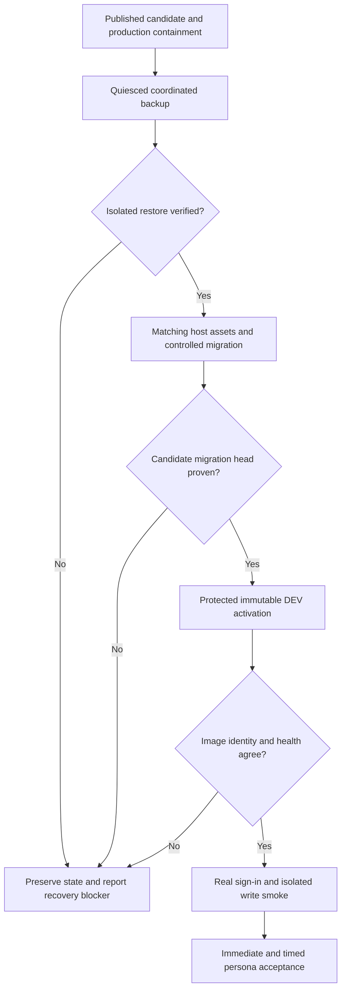
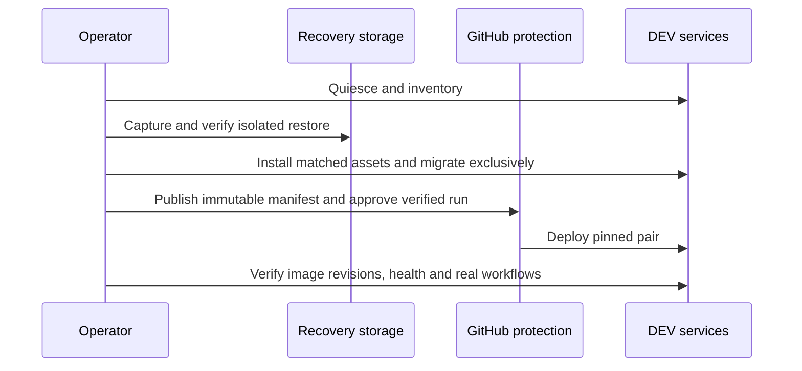
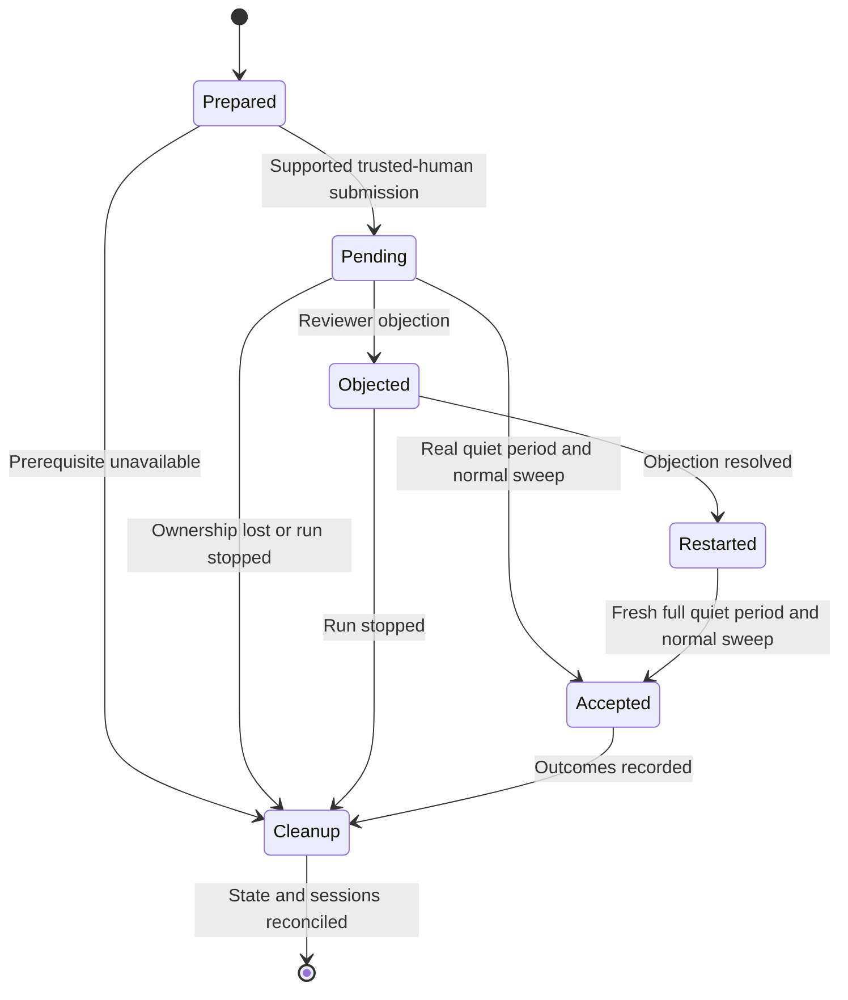

# Restore DEV and verify the matched release - Plan

## Goal Capsule

- **Objective:** Contributors can use the repaired OntoKit workflow on DEV, with evidence that its permissions, editing and review lifecycle work.
- **Means:** Restore the existing environment, activate one immutable API/web pair, and run isolated authenticated acceptance (KTD1–KTD7).
- **Authority:** User instructions and standing authorization in `AGENTS.md` govern delivery; R1–R12 preserve B02–03's acceptance boundary.
- **Execution profile:** Operational recovery, reviewed manifest publication, protected deployment and live acceptance. The executing agent owns publication, normal approval, observation and cleanup.
- **Stop conditions:** No destructive reset, unbacked restore, protection bypass, secret disclosure or fabricated acceptance. A failed prerequisite stops only dependent mutations; independent backlog work continues.
- **Completion boundary:** B02 requires runtime and recovery proof. B03 remains open until all required immediate and natural-time observations and cleanup pass.

---

## Product Contract

### Summary

Recover the unhealthy DEV services and activate the repaired API/web release through the existing protected deployment workflow. Verify the historical persona acceptance matrix against that running pair and retain unresolved observations explicitly.

### Problem Frame

The repairs are merged but DEV still runs an older pair. API and worker restart on a file-permission error, login is unhealthy, and installed deployment assets differ from reviewed source. Offline tests cannot prove real sign-in, deployed write paths or the multi-day auto-accept lifecycle.

### Key Decisions

- **Deliver bounded plans in sequence while preserving the complete backlog.** (session-settled: user-directed — chosen over one exhaustive implementation plan: thorough delivery without forgetting later areas.) Governs R12.

### Requirements

**Release identity and recovery**

- R1. Activate a fetchable full-SHA API/web pair containing D03–05 and preserve the protected DEV deployment process. Advances B02.
- R2. Prove production promotion is disabled for this DEV activation; B09 remains separate.
- R3. Preserve existing DEV data, identity configuration and unrelated operator state with a verified recovery set before migration or service replacement.
- R4. Record matching installed deployment assets, actual API/worker/web image revisions, database migration head and required service health.
- R5. Establish real identity-service readiness and authenticated isolated write smoke without recording credentials or using personal accounts as disposable fixtures.

**Authenticated acceptance**

- R6. Execute the archived B03 matrix's 26 acceptance items, mapped to 31 feature steps and seven setup/cleanup steps, preserving its five persona contexts and two isolated projects.
- R7. Prove autosave/manual-save/recovery/stale-tab behavior, translation preservation/backfill/review/audit pagination, project-local trust and actual save/submit/review/merge behavior using supported interfaces.
- R8. Observe the natural auto-accept lifecycle, including objection halt beyond the original deadline and restart from zero, with the supported one-day floor and ordinary worker execution.
- R9. Retain anonymous, untrusted and actual LLM-origin negative controls and verify submission snapshots, system decider, merged revisions and trust credit.
- R10. Preserve accessibility and cleanup acceptance; unavailable screen-reader output, origin generation, session revocation or elapsed-time evidence remains pending rather than passing.

**Evidence and continuity**

- R11. Bind every acceptance row to UTC, role, running pair, run-owned application IDs, actual result and cleanup evidence; secrets and identity/session handles remain outside durable repository artifacts.
- R12. Keep B02, B03 and the master roadmap independently accurate, continuing independent work during natural-time waits or external blockers.

### Actors and acceptance examples

- A1. Operator: deploy/recovery authority, separate from acceptance personas.
- A2. Anonymous, untrusted suggester, trusted suggester, reviewer/editor and administrator: five isolated contexts; trust promotion stays project-local.
- AE1. Covers R1–R5: a green deployment job is insufficient when any running image revision or migration/health observation disagrees.
- AE2. Covers R6–R10: a trusted human suggestion can mature after one day; an objected suggestion must remain pending past its original deadline and receive a fresh full day after resolution.
- AE3. Covers R11/R12: an unavailable live LLM-origin path leaves that scenario pending while other acceptance and roadmap work proceed.

### Scope Boundaries

D02 owns recovery and acceptance of existing behavior. It does not redefine permission policy or count one manual run as the B10–13 automated test foundation.

### Deferred to Follow-Up Work

B04–09 demo activation, retention, credential rewrap, upstream tranches and PROD rollout retain their own deliverables. B14 taxonomy reconciliation and frontend error presentation remain separately tracked. A discovered release-blocking product defect receives a bounded repair and fresh affected acceptance.

---

## Planning Contract

**Artifact home:** `ontokit-web`. Paths prefixed **API** are relative to `ontokit-api`; other paths are relative to this repository. Host/operator paths are described by role rather than portable repository paths.

### Evidence baseline

- D05 API merge: `c95991c720e49d1a36abc16803cbb5a1f052e2fe`; D03 web merge: `ab903e145e2a6ad30aefd915a83cb0bafbaa0678`. Revalidate remote reachability before freezing the pair.
- `docs/releases/d02-preflight-observations.md` records unhealthy services, installed-script drift and cancellation of obsolete workflow34155698435.
- API `deploy/ontokit-deploy.sh` restores checkout pairs, not database state, and does not install host Compose. API `scripts/entrypoint.sh` migrates by default in both API and worker containers.
- Historical UAT source: `docs/roundup-2026-08/DEV-UAT-RUNBOOK-web27.md`, Git blob `506092ac122ab70ecc13ad5041a68b3e725f628b`, indexed as S0190. Its earlier permission gates are superseded by current authorization; its acceptance requirements remain applicable.

### Key Technical Decisions

- KTD1. **Freeze the release only after prerequisite repairs.** Use the merged baseline above unless execution identifies a necessary reviewed repair; record the final full pair in API `deploy/release-manifest.json`. The manifest commit is the deployment contract, distinct from the API source SHA. Governs R1/R4.
- KTD2. **Contain promotion with repository `PROD_ENABLED=false`.** Read back the value and current remote workflow before manifest merge; prove the resulting promotion job is skipped. Repository variables override organization variables ([GitHub precedence](https://docs.github.com/en/actions/reference/workflows-and-actions/variables#configuration-variable-precedence)). Approve only the verified pending `dev-deploy` through the normal environment-review endpoint; never bypass protection. Governs R1/R2.
- KTD3. **Verify coordinated recovery before mutation.** Quiesce all writers across application, worker, identity and storage services while preserving PostgreSQL for logical dumps. Retain both databases, globals, Git, object storage, actual Redis persistence, credential/config files and image identities in restricted durable operator storage. Restore into new isolated storage with no public ingress, live integrations or running workers, checking database owners/extensions/migration state and bounded cross-store integrity. Preserve an untouched restored baseline and rehearse the observed live-to-candidate migration interval on a separate restored copy; verify affected row changes and constraints before live migration. Duplicate open PRs or unexpected job-state normalization stop the migration gate. The unhealthy baseline is a recoverable prior state, not a known-good service rollback. Governs R3.
- KTD4. **Use one controlled migration before normal startup.** Under a single operator maintenance lock and with application/worker writers stopped, build the final API candidate and run its migration once through the existing migration opt-out entrypoint mechanism. Prove the exact candidate migration head before normal deployment can start either consumer; subsequent startup checks must have no pending DDL. Use a one-off candidate image with automatic entrypoint migration disabled and dependency startup suppressed, then explicitly migrate and compare current versus expected head sets. Record the immutable image ID. Hold the existing deployment lock during maintenance, preserve/verify both installed script and Compose, then release that lock before approving the verified workflow; verify no competing deployment can take the handoff. If pending migrations or ordering cannot be proven, stop activation and make a reviewed bounded deployment repair. Governs R3/R4.
- KTD5. **Repair identity through supported same-version administration.** Diagnose issuer/Host/role failures separately from expiry; retain pinned provider images and Login wrapper. Replace only a proven invalid required service credential through an existing authorized admin path, write it privately and atomically, verify consumers, then revoke the replaced credential. Root SSH alone is not identity authority. Governs R5/R11.
- KTD6. **Recover the UAT procedure with a complete trace matrix.** Create `docs/releases/d02-persona-acceptance.md` from S0190's named steps, retaining outcomes and cleanup dependencies. Use supported UI/API fixture creation and real OIDC contexts, not synthetic session injection; operational API smoke remains distinct from browser acceptance. Governs R6/R7/R10.
- KTD7. **Own timed observation explicitly.** Before creating eligible timers, commit a sanitized observation register with object inventory, pair, owner, next UTC checks, deadline and supported cleanup actions. Preserve the same DEV pair during observation; a corrective release invalidates affected rows. Observe ordinary 15-minute worker sweeps after real deadlines, never backdate or force acceptance. If continuation ownership cannot persist, cancel run-owned pending state and restart later. Governs R8/R9/R11/R12.
- KTD8. **Recover deliberately after partial failure.** After a failed activation command exits, the operator reacquires the deployment lock and explicitly stops API, worker and all writers within the recovery boundary. Verify quiescence and keep maintenance ingress restrictions until the same-pair retry or compatible recovery path is proven; the existing deploy script does not stop started containers on failure. No checkout-only rollback may be treated as schema rollback; account for any writes after the backup boundary. Governs R3/R4.

### High-Level Technical Design

Release dependencies and failure branches:

Operational protocol:

Observation lifecycle:

### Assumptions and execution-time gates

These operational defaults are agent-selected and have not been separately confirmed: preserve the current provider version; use a bounded DEV maintenance window; retain run-owned timers for at most 96 hours with an explicit continuation owner. They do not permit data loss or weaken R1–R12.

Credential validity, available restore capacity, live migration head, persona provisioning/revocation, actual LLM-origin generation and screen-reader capability must be established during the relevant unit. Missing capability blocks only its dependent operations. Full B03 timing necessarily spans more than two days; this plan cannot truthfully finish in one sitting.

### Sources and recovery constraints

KTD3 follows [PostgreSQL17 dump](https://www.postgresql.org/docs/17/app-pgdump.html), [globals](https://www.postgresql.org/docs/17/app-pg-dumpall.html), [restore](https://www.postgresql.org/docs/17/app-pgrestore.html), [Docker volume recovery](https://docs.docker.com/engine/storage/volumes/) and [Redis persistence](https://redis.io/docs/latest/operate/oss_and_stack/management/persistence/). Separate database dumps are not a cross-store atomic snapshot; quiescence supplies that boundary. Backup listing/checksums alone are not restore proof; same-host recovery does not prove host-loss resilience.

KTD5 uses [Zitadel PAT authentication](https://zitadel.com/docs/guides/integrate/service-accounts/personal-access-token) and the installed version's supported administration API. Current Management v1 PAT endpoints are deprecated; prefer supported v2 when implemented by the pinned server. No provider upgrade is implied.

---

## Implementation Units

### U1. Establish recoverable operator prerequisites

**Goal:** Prove data recovery and authority before replacing services.

**Requirements:** R2/R3/R5/R11; AE1. **Dependencies:** None.

**Files:** Create `docs/releases/d02-recovery-receipt.md`; read API `deploy/RUNBOOK.md`, `deploy/compose.dev.yaml`, `deploy/ontokit-deploy.sh`, `scripts/entrypoint.sh` and candidate migrations.

**Approach:** Implement KTD2/KTD3/KTD5's preflight and backup gates. Record nonsecret identity, storage, migration, writer-quiescence and restore evidence. Establish private admin access and intended cleanup capabilities before fixture creation. Include run-owned Git paths and object-storage prefixes: project deletion can leave files behind, so prove a scoped remediation path that preserves shared source references.

**Execution note:** Prefer actual isolated restore and service-operation evidence over new mock tests.

**Verification scenarios:**

- An unreadable or failed database/store archive prevents migration.
- Restored databases preserve required extensions/owners and migration head; restored Git/object/queue state agrees with the recorded boundary.
- Invalid service authentication is distinguished from authorization or endpoint failure, without credential output.
- Insufficient disk capacity or unavailable authorized identity recovery leaves a named blocker and preserved state.

### U2. Prepare matching host assets and migration

**Goal:** Make the existing deployment mechanism ready for the chosen candidate.

**Requirements:** R1/R3/R4/R11; AE1. **Dependencies:** U1.

**Files:** Update `docs/releases/d02-recovery-receipt.md`; read API deployment assets and `deploy/tests/ontokit-deploy-test.sh`. Any necessary code/config repair gets its own reviewed change before candidate freeze.

**Approach:** Apply KTD1/KTD4/KTD8. Preserve prior installed assets and configs privately, validate candidate Compose without emitting interpolated secrets, and install matching reviewed assets with hash/mode checks. Prove migration completion under exclusive maintenance before releasing deployment.

**Verification scenarios:**

- Half-installed assets or a mismatched hash prevent activation.
- Migration failure leaves API and worker stopped with recorded stage and recoverable data.
- Candidate migrations first succeed against a separate restored copy, with expected data changes and constraints verified.
- Candidate migration head is present before either consumer starts; no pending DDL remains for startup checks.
- The operator releases the actual deploy lock before workflow approval; a failed activation is followed by verified writer shutdown, not inferred quiescence.

### U3. Activate and prove the immutable DEV release

**Goal:** Establish B02's running release evidence.

**Requirements:** R1/R2/R4/R5/R11; AE1. **Dependencies:** U2.

**Files:** API `deploy/release-manifest.json`; create `docs/releases/d02-activation-receipt.md`; use API `deploy/validate_release_manifest.py`, `deploy/smoke-release.sh`, `.github/workflows/deploy-dev.yml` and `.github/workflows/promote-prod.yml`.

**Approach:** Publish the reviewed full-SHA manifest through its normal PR/checks and protected workflow. Approve only the newly verified DEV run under standing authority. Bind runtime evidence and authenticated isolated API smoke to that pair; clean smoke-created state.

**Verification scenarios:**

- Manifest validation and both commit fetches pass; no branch fallback occurs.
- API/worker/web image-ID labels match the manifest, migration head matches U2, and required services are healthy.
- Production promotion is skipped; old canceled deployment stays canceled.
- Isolated real-auth write smoke completes and removes its project; failed smoke cannot close B02.

### U4. Execute immediate authenticated persona acceptance

**Goal:** Prove the matrix's immediate contributor workflows.

**Requirements:** R5–R7/R10/R11; AE3. **Dependencies:** U3.

**Files:** Create `docs/releases/d02-persona-acceptance.md` and `docs/releases/d02-observation-register.md`; recover S0190's procedure into the former with provenance and current authorization annotation.

**Approach:** Apply KTD6. Preflight supported creation, origin generation, translation provider, audit pagination, actual screen reader and cleanup. Register every run-created object, use three disposable authenticated roles and five contexts, then run setup, trust, autosave, translation/audit and accessibility steps. Use synthetic ontology content and no external repository connection.

**Verification scenarios:**

- AS01–05 preserve edits, preferences and labels across navigation/recovery/concurrent tabs.
- TA01–06 preserve annotations and scope while generated records, confirm/reject and three audit pages are observed.
- TR01–05 enforce actual persona authority and main-only trust promotion; ordinary review/merge completes through permitted roles.
- AX01–05 include keyboard/focus, actual announcements, touch targets and non-color state cues; unavailable tooling stays pending.

### U5. Observe the real quiet-period lifecycle

**Goal:** Prove natural-time behavior and ineligible-origin controls.

**Requirements:** R8/R9/R11/R12; AE2/AE3. **Dependencies:** U4's setup, trust and timer prerequisites.

**Files:** Update `docs/releases/d02-observation-register.md` and `docs/releases/d02-persona-acceptance.md`.

**Approach:** Apply KTD7 and S0190 AA01–09. Retain the explicit owner and schedule before leaving pending work; continue independent B10 work during natural waits. Record before/after observations and actual worker outcomes for both human positives and all three negative controls.

**Verification scenarios:**

- Silent viewing leaves HUMAN-A's deadline unchanged; it merges only after the real deadline and a normal sweep.
- HUMAN-B remains pending beyond its old deadline while objected, then waits a new full day after resolution.
- Anonymous, untrusted and actual LLM-origin controls remain ineligible throughout.
- Submission snapshot, `system:auto-accept`, default-branch revision and successful-merge-only trust credit match.
- Pair changes, missed ownership or expiry of the retained window invalidate affected evidence and invoke supported cleanup.

### U6. Reconcile cleanup and publish acceptance

**Goal:** Leave truthful release evidence and no unmanaged acceptance state.

**Requirements:** R10–R12. **Dependencies:** U3–U5 outcomes, including partial/blocked outcomes.

**Files:** Update all D02 receipts and `docs/plans/2026-09-20-0649-requirements-delivery-roadmap.md`.

**Approach:** Execute S0190 AA10/C01–04, restore captured settings before deleting fixtures, verify child absence and revoke run-created sign-in sessions. Publish sanitized receipts on a focused branch; preserve unrelated workspace history.

**Verification scenarios:**

- Every created application object has an absence/cascade receipt; access denial alone is insufficient.
- Run-owned Git paths and uploaded object prefixes are independently absent; successful project deletion alone does not prove their removal, and any shared references stay intact.
- Every changed setting/preference/tier is restored and each run-created sign-in session revoked; logout alone is insufficient.
- Private browser profiles/raw captures are removed and retained evidence contains no credentials or identity roster.
- B02/B03 are closed only against their own fulfilled requirements; pending natural-time or capability rows retain owner and return condition.

---

## Verification Contract

| Gate | Evidence | Applies |
|---|---|---|
| Manifest contract | API `python3 deploy/validate_release_manifest.py deploy/release-manifest.json` plus full-SHA remote fetchability | U3 |
| Deployment regression | API `bash deploy/tests/ontokit-deploy-test.sh` and `bash deploy/tests/prod-promotion-test.sh` | Reviewed release assets; repeat after relevant changes |
| Recovery | Successful isolated restore, exact migration head and store reconciliation | U1/U2 |
| Live activation | Protected workflow, full image revisions, health, authenticated `deploy/smoke-release.sh` and cleanup | U3 |
| Persona behavior | S0190 step matrix with UTC/pair/role/result evidence | U4/U5 |
| Natural time | Original and restarted deadlines plus normal worker sweep outcomes | U5 |
| Cleanup | C01–04 inventory reconciliation and redaction review | U6 |

Existing D03/D05 regression counts support their exact source trees; they do not replace live proof. Any product repair receives its relevant tests, review and CI before refreshing the pair.

---

## Definition of Done

B02 is complete when U1–U3 prove recovery, the protected immutable release, running identity, migration state, health, seed/write smoke and cleanup. B03 is complete only when U4–U6 satisfy all 26 matrix items and corresponding setup/cleanup steps against the recorded release, including natural time. A partial receipt is useful progress, never completion.

No abandoned repair code, test fixtures, credentials, raw browser data or unmanaged timers remain. Durable sanitized receipts and the full 75-item roadmap preserve every unresolved requirement, next action and owner.
