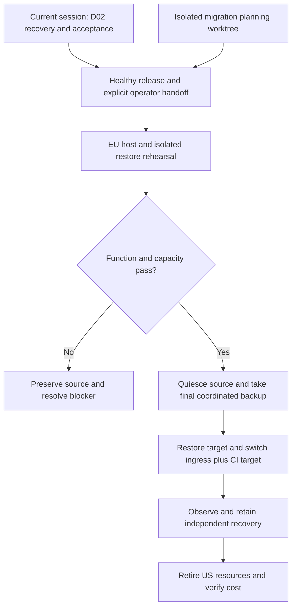
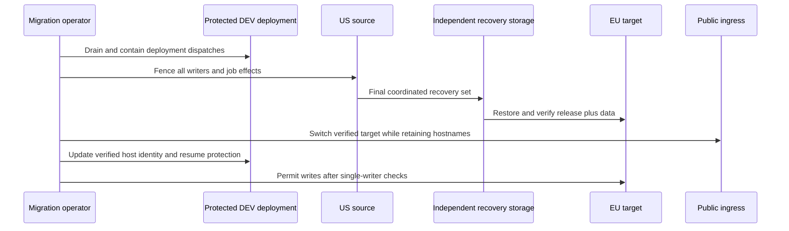
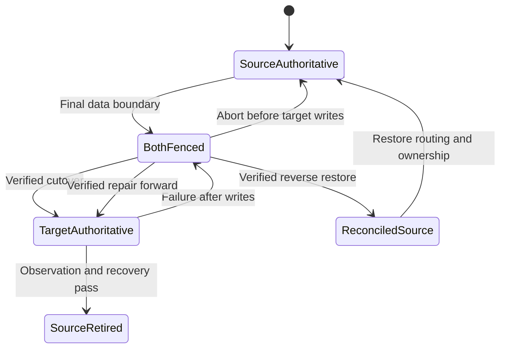

# Reduce OntoKit DEV hosting cost in Europe - Plan

## Goal Capsule

- **Objective:** Damien pays substantially less for a working OntoKit development environment.
- **Means:** Replace the US DEV host with a smaller EU host after a verified restore and capacity rehearsal (KTD1–KTD7).
- **Authority:** Current user instructions and `AGENTS.md`; R1–R8 define this migration. The existing D02 plan owns application recovery and persona acceptance.
- **Execution profile:** This artifact is prepared in parallel with D02; live migration starts only after the ownership and baseline gate in R2. The later migration operator owns both repositories, infrastructure verification, rollback and cost closure.
- **Stop conditions:** Conflicting operator ownership, unverified data recovery, unavailable identity authority, unproven healthy release or failed capacity checks stop dependent mutations. Never bypass deployment protections or delete unbacked state.
- **Delivery:** Commit reviewed deployment changes through each owning repository's normal PR/check process. Keep migration evidence in this repository; progress belongs in a dated receipt and the shared roadmap, not mutable plan status.

---

## Product Contract

### Summary

Move OntoKit DEV to lower-cost EU hosting while retaining its existing development workflows and data. Prepare the migration independently of the active recovery session, then transfer operational ownership before changing servers.

### Problem Frame

The September 20 inventory found `ontokit-dev` on an Ashburn CPX41 with 8 vCPUs, 16 GB RAM and a 240 GB disk. Its current API-listed price is $141.49/month before IPv4. The separate dev-twin host is a much smaller cost, so retiring dev-twin would miss the main saving.

The initial DEV inspection found repeated API/worker restarts and unhealthy Login. Those observations predate the ongoing D02 recovery work and cannot size a healthy deployment. The active session has since recorded verified recovery evidence and an identity-administration blocker; its current receipt is authoritative over this earlier inventory.

### Key Decisions

- **Prefer EU hosting and lower ongoing cost.** (session-settled: user-directed — chosen over retaining US hosting for location: EU is preferred and lower cost is the priority.) Governs R1.
- **Plan alongside the current session, execute after handoff.** (session-settled: user-directed — chosen over competing work in the active checkout/server: the migration must preserve ongoing OntoKit work.) Governs R2/R8.
- **Pursue OntoKit hosting savings before dev-twin retirement.** (session-settled: user-approved — chosen over immediately winding down dev-twin: the larger expense is the OntoKit DEV host.) Governs R1/R8.

### Requirements

**Cost and continuity**

- R1. Run DEV in an EU location at a verified materially lower recurring cost; the initial sizing candidate is CPX32, subject to capacity proof and current availability.
- R2. Preserve the active session's files, branches, deployment and acceptance observations; before any shared live mutation, obtain an explicit operator handoff naming the healthy immutable API/web pair and releasing the relevant deployment/observation ownership.
- R3. Preserve DEV's public hostnames, authentication, editing, save/submit/review/merge, background jobs, object storage, Git data and WebSocket behavior across migration.

**Recovery and operations**

- R4. Establish and restore-test a coordinated recovery set outside the source server before replacement or deletion, including application/identity databases, roles, Git, objects, Redis state, private configuration, credentials and required images.
- R5. Keep exactly one authoritative environment capable of accepting writes and producing external job effects throughout cutover and rollback; preserve every acknowledged write.
- R6. Retain protected deployment controls and production containment while switching DEV host identity, pinned host keys and routing; preserve unrelated services on shared infrastructure.
- R7. Prove representative healthy runtime and build capacity, retain recoverability through observation, and verify the old billable resources have been removed before claiming recurring savings.

**Coordination and evidence**

- R8. Store the plan and sanitized migration receipts in `ontokit-web`; make deployment changes in their owning repository and integrate the migration into the existing roadmap only after coordination. This work does not retire dev-twin or take over D02's application repairs.

### Acceptance Examples

- AE1. Covers R2/R8: if the existing operator is still deploying or observing timed D02 cases, preparation may continue offline but no source-host, CI-target, DNS or proxy mutation occurs.
- AE2. Covers R4/R5: a rehearsal target with copied jobs or credentials cannot run live workers, send notifications or accept ordinary client writes.
- AE3. Covers R3/R5: once an EU write is acknowledged, rollback cannot simply reopen the older US database; the EU changes must be preserved before authority moves back.
- AE4. Covers R7: a cheaper quote, stopped old server or passing static test alone does not establish achieved savings or a usable replacement.

### Scope Boundaries

This is a DEV hosting migration. Production promotion, provider upgrades, new product features, changing identity policy, unrelated Docker cleanup, moving other Hetzner services and dev-twin retirement are outside this plan. D02 remains the owner of recovery and authenticated acceptance; unresolved D02 prerequisites are dependencies, not a second repair backlog here.

---

## Planning Contract

**Artifact home:** `ontokit-web`. Paths marked **API** are relative to `ontokit-api`; all other repository paths are relative to this repository. Do not infer the canonical API checkout from its directory name: the roadmap identifies the current release worktree. Host-side locations are named by operational role.

### Evidence and pricing baseline

Read-only observations on September 20, 2026; revalidate at U1. Prices are current USD catalog rates, not reconciled invoice charges.

| Item | Observed value | Planning implication |
|---|---|---|
| US CPX41 | 8 vCPU / 16 GB / 240 GB; $141.49/month | Current compute reference |
| EU CPX32 | 4 vCPU / 8 GB / 160 GB; $41.99/month; available when checked | Leading candidate; $99.50/month catalog difference |
| EU CPX42 | 8 vCPU / 16 GB / 320 GB; $81.99/month | Comparison only, not an automatic fallback purchase |
| EU CX33/CX43 | $9.99/$18.49; unavailable when checked | Recheck availability, never promise sold-out pricing |
| Network/storage extras | No attached volume or paid server backups on source; outgoing traffic well below allowance | Current base compute dominates |
| Source usage | 71 GiB disk; about 2.9 GiB RAM; prior-day CPU about 2.2% busy | Unhealthy-service measurements cannot prove capacity |
| Docker cache | About 52.75 GB reported reclaimable | Rebuildable artifacts may be omitted; no pruning during D02 |
| Active D02 evidence | Verified recovery receipt committed at web `6117e2970ddcf1d5fee074b483dc9d39ae77bab2` | Read its successor before planning a live operation |

The initial quote implies approximately $42.59/month including one IPv4, before separately priced recovery storage or backups. U1 must reconcile the actual source invoice and include replacement backup/storage costs and temporary overlap before reporting a forecast. Both servers bill concurrently from EU provisioning in U4 through US deletion in U6, including rehearsal, cutover and the 48-hour observation. Forecast that full interval from planned dates, with each server bounded by its monthly cap; the observation period alone is not the overlap estimate.

### Key Technical Decisions

- KTD1. **Create a replacement rather than rescale the old disk.** Hetzner cannot rescale a 240 GB disk to a smaller plan disk even when its files fit. Use a clean x86 Ubuntu host and application-level restore; retain the approved runtime/provider versions. Implements R1/R4. [Hetzner rescaling rules](https://docs.hetzner.com/cloud/servers/faq/).
- KTD2. **Separate Git isolation from infrastructure ownership.** Use separate documentation/implementation worktrees and a unique migration receipt. Before touching shared infrastructure, record the D02 handoff, outstanding timed cases and writer/deployment owners. The existing deployment lock is host-local; a source lock alone cannot exclude a workflow targeting the replacement. Freeze/drain DEV deployment dispatches through supported controls during the target switch, record restoration, and never weaken environment protection. Implements R2/R6/R8.
- KTD3. **Freeze a healthy release and migration head.** Consume D02's final accepted release manifest, image digests, host assets and migration heads. Do not independently upgrade packages, migrate to a new schema or reuse the earlier failing source images. Compare installation with reviewed source because deploy scripts do not install every host asset. Implements R2/R3/R6.
- KTD4. **Restore coordinated data, not live Docker directories.** Extend the established D02 quiescence/restore procedure to encrypted durable storage outside the source server, with keys accessible independently. Preserve its recovery baseline, unmapped Git/object data and retention ownership. Make fresh final backups after fencing writers; earlier rehearsals are not the cutover dataset. Verify database owners/extensions/head sets, Git references and objects, object checksums, identity data/configuration and actual Redis persistence. Implements R4/R5.
- KTD5. **Rehearse in isolation with real capacity evidence.** Restore into target-owned storage with no ordinary ingress, blocked external effects and no live workers. Use isolated identity/test contexts for functional tests and a controlled job queue. After the baseline passes, measure an application workload and an actual deployment build on the candidate hardware; do not project healthy demand from restarting containers. Implements R3/R7.
- KTD6. **Cut over once and preserve writes during rollback.** Keep public names and issuer stable; discover the live ingress topology before selecting DNS/proxy changes. Fence source ingress, consumers, scheduled jobs and identity writers, capture final state, restore and verify the target, then switch ingress and deployment targets. Before target writes, routing can return to the still-consistent source. After target writes, fence both sides and recover those writes through a verified coordinated reverse transfer or repair forward; never reopen the stale source. Implements R3/R5/R6.
- KTD7. **Retire only after observed acceptance and independent recovery.** Proposed operational default: a 48-hour observation period including one protected deployment and representative user/job activity. Keep source application writers fenced throughout. At retirement, preserve D02 artifacts and rollback images according to their recorded owner/retention policy outside the old host, then verify old server/IP/resource disposition and updated cost inventory. Source deletion ends fast server rollback, not recovery. Implements R4/R7.

### Verified deployment details

The API workflow uses `vars.DEV_DEPLOY_HOST` with an old-IP fallback, `DEV_DEPLOY_SSH_KEY`, `DEV_DEPLOY_KNOWN_HOSTS`, strict SSH host checking and the protected `dev-deploy` environment. Set and read back the new target explicitly; inventory both repositories for stale queued dispatches or credentials before release. Preserve the restricted forced-command key and `PROD_ENABLED=false`.

The old runbook prescribes `deploy/traefik/ontokit-dev.yaml`, while the committed D02 recovery receipt records Caddy configuration. The complete current ingress topology is an execution-time discovery gate, not permission to replace Caddy with Traefik. Capture reviewed routing, TLS state and certificate renewal dependencies, and verify published Compose ports cannot bypass the intended firewall/ingress.

### Coordination and execution assumptions

The 48-hour observation period, a short DEV maintenance window, and the following candidate acceptance thresholds are operator defaults, not separately selected user requirements. Record any adjustment before cutover with its rationale: zero OOM kills or unexplained container restarts; at least 20% available memory at measured peaks; at least 25% free disk after a representative build and retained recovery needs; warm request p95 server-side processing time, excluding network RTT, no worse than twice the healthy source baseline captured in U1 with the same request set. Report user-facing latency from the usual client region separately. These are capacity gates, not a substitute for functional acceptance. If the candidate fails, stop sizing approval and present the measured tradeoff rather than silently purchasing a larger plan.

No active application observation may be invalidated to meet these timing assumptions. If D02 retains multi-day cases, the handoff must defer migration or explicitly arrange new acceptance after relocation; never carry old observations forward as proof of the new environment.

### High-Level Technical Design

Ownership and dependency flow:

Data and deployment boundaries:

Rollback states:

### Dependencies and research

- `docs/plans/2026-09-20-0649-requirements-delivery-roadmap.md`: current operator and canonical release references. Do not edit its active checkout from this planning workstream.
- `docs/plans/2026-09-20-1323-chore-dev-recovery-acceptance-plan.md`: authoritative D02 recovery, protected release, identity and observation contracts.
- `docs/releases/d02-recovery-receipt.md` at web commit `6117e2970ddcf1d5fee074b483dc9d39ae77bab2` or its successor: actual restore evidence. The initial application database was empty while Git/object data existed; do not delete those stores or assume today's database is still empty.
- **API** `deploy/RUNBOOK.md`, `deploy/compose.dev.yaml`, `deploy/ontokit-deploy.sh`, `deploy/release-manifest.json`, `.github/workflows/deploy-dev.yml`, `.github/workflows/promote-prod.yml`, `scripts/entrypoint.sh`: deployment and schema behavior; resolve from the approved release, not a stale checkout.
- [Hetzner pricing change](https://docs.hetzner.com/general/infrastructure-and-availability/price-adjustment/), [billing](https://docs.hetzner.com/cloud/billing/faq/) and [snapshot coverage](https://docs.hetzner.com/cloud/servers/backups-snapshots/overview/): stopped servers still cost money; snapshots omit attached Volumes; revalidate prices and capacity at execution.
- D02's cited PostgreSQL17, Docker and Redis recovery documentation remains the recovery authority; this plan adds host independence and relocation, not a new backup format.

---

## Implementation Units

### U1. Accept ownership and freeze the migration baseline

**Goal:** Establish a current, nonconflicting source of truth and cost forecast.

**Requirements:** R1/R2/R7/R8; AE1. **Dependencies:** D02's explicit handoff and healthy baseline for live work.

**Files:** Create `docs/releases/eu-hosting-migration-receipt.md`; read the roadmap, D02 plan and release receipts. Update the roadmap only through a coordinated documentation change after its active owner releases that edit.

**Approach:** Record current operator ownership, outstanding observations, immutable API/web pair, schema heads, installed asset identities, resource inventory and actual recurring charges. Capture the healthy source's warm p95 server-side latency with the request set used in U4. Recheck EU availability and quote the total with recovery storage and the full dual-host interval. Identify the current ingress path, DNS owner, firewall rules, CI host variable/secret locations and host-key source without disclosing values.

**Test scenarios:** An active D02 observation blocks shared mutations; a quote without backup costs remains incomplete; stale SHA or changed schema causes a fresh baseline check.

**Verification:** A cold-starting executor can identify exactly what it owns, what remains held by D02 and which release/data boundary it will relocate.

### U2. Prepare reviewed relocation assets

**Goal:** Make the existing protected deployment portable to the EU host.

**Requirements:** R3/R6/R8. **Dependencies:** U1.

**Files:** Modify **API** `deploy/RUNBOOK.md` and only the host-dependent deployment/firewall/ingress assets identified by U1; inspect **API** `.github/workflows/deploy-dev.yml` and `.github/workflows/promote-prod.yml`. Extend **API** `tests/unit/test_release_workflow.py`, `deploy/tests/ontokit-deploy-test.sh` and `deploy/tests/prod-promotion-test.sh` for changed workflow or deploy behavior; create **API** `tests/unit/test_dev_host_migration_contract.py` only for a distinct uncovered migration contract. Record asset inventory in the migration receipt.

**Approach:** Parameterize verified host dependencies only where needed. Remove the DEV workflow's old-IP fallback and require an explicit deployment target, failing before SSH when it is absent or empty. Preserve full-SHA release pinning, restricted deploy credentials, strict host verification, approval protections and disabled production promotion. Review how existing installed Compose, ingress and deploy scripts are installed on a fresh machine; changes land in their owning repo.

**Patterns:** Existing release-manifest and forced-command deployment conventions; D02 host-asset parity checks.

**Test scenarios:** Absent/empty target, wrong target or wrong host key fails closed; a valid paired release reaches only DEV; the production promotion path stays disabled; unrelated proxy routes survive a destination change.

**Verification:** Reviewed changes and offline configuration checks cover the actual live topology, with no speculative replacement of ingress software.

### U3. Prove recovery independently of the source server

**Goal:** Make host loss and a failed migration recoverable.

**Requirements:** R4/R5; AE2/AE3. **Dependencies:** U1 and D02 recovery ownership.

**Files:** Migration receipt; **API** `deploy/RUNBOOK.md` recovery/retention section. Private archives and keys stay outside repositories.

**Approach:** Apply KTD4 to a fresh coordinated recovery set and transfer it to restricted encrypted storage outside the source. Restore into isolated storage and verify data/config/image identities. Preserve the D02 recovery set and its retained baseline separately; acquire enough capacity before copying.

**Execution note:** Actual restore and cross-store verification are required; mocked backup tests cannot establish recoverability.

**Test scenarios:** Source unavailable but independent recovery and keys accessible; checksum mismatch stops restore; copied queue cannot execute real jobs; restored role/extension/head mismatch blocks progression; unrelated and unmapped stores remain intact.

**Verification:** A sanitized receipt records a successful independent restore, storage owner, key-access method, retention date and checked data boundary without exposing sensitive contents.

### U4. Rehearse the EU candidate and prove capacity

**Goal:** Validate the cheaper machine against a healthy release and real workload.

**Requirements:** R1/R3/R7; AE2. **Dependencies:** U2/U3.

**Files:** Migration receipt; **API** deployment runbook and reviewed provisioning assets as needed. Reuse the approved release's existing API and browser acceptance suites; add tests only for changed deployment behavior under U2.

**Approach:** Provision the selected EU x86 host, secure access and install pinned runtime assets. Restore a rehearsal copy with side effects fenced. Validate the D02 acceptance subset affected by host relocation and measure the KTD5 capacity scenarios. Include a full build because steady-state memory alone misses build peaks. Rehearse post-write recovery using acknowledged test writes on the isolated EU copy: capture its coordinated state, restore it into an isolated source-shaped destination, and verify the writes and cross-store boundary. Record procedure and timing; any repair-forward alternative used by U5 must also have demonstrated recovery evidence.

**Test scenarios:** Sign-in and credential renewal; edit/save/submit/review/merge; object upload/download and Git revision access; WebSocket reconnect; isolated worker execution; cold startup and representative build under measurement; candidate capacity failure leaves the source authoritative; reverse recovery preserves acknowledged rehearsal writes while both copies remain fenced from ordinary clients and external effects.

**Verification:** Report actual peak memory, free disk, restart/OOM counters, server-side latency paired with U1's baseline, separate user-facing regional latency, and build duration against the stated thresholds. A failed test blocks cutover rather than automatically selecting the more expensive comparison plan.

### U5. Transfer write and deployment authority

**Goal:** Serve DEV from the verified EU host without split writes.

**Requirements:** R2–R6; AE1–AE3. **Dependencies:** U4 and current release of all shared operational ownership.

**Files:** Migration receipt; approved host-routing assets from U2; **API** deployment runbook. Record changed CI variable/secret names and host fingerprints, never credential values.

**Approach:** Execute KTD2/KTD6 under the agreed maintenance boundary. Drain in-flight deployment jobs, fence source writers and effects, capture/restore the final coordinated set, verify it, update the actual ingress and protected deployment target, and validate one writer. Keep source data unchanged for the pre-write abort case.

**Test scenarios:** Stale DNS/proxy routes cannot produce US writes; stale queued deployment cannot target the wrong host; failure before target writes returns to the source; failure after an acknowledged EU write follows a rehearsal-proven reverse-transfer or repair-forward path; issuer/callback and WebSocket URLs remain valid.

**Verification:** External probes, data-boundary checks, target host/image fingerprints and authenticated write/readback establish EU authority. Both environments cannot process the same queued external effects.

### U6. Observe, retire and close the cost change

**Goal:** Retire the expensive server with durable recovery and verified savings.

**Requirements:** R4/R6–R8; AE4. **Dependencies:** U5 and the observation/recovery gate in KTD7.

**Files:** Migration receipt; **API** `deploy/RUNBOOK.md`; coordinated update to `docs/plans/2026-09-20-0649-requirements-delivery-roadmap.md` after refreshing its current contents.

**Approach:** Observe the accepted target, prove a normal protected deployment, and retain required recovery artifacts outside the source before deleting it. Inventory attached resources and labels by exact ownership; retire only the old DEV resources. Remove stale deployment destinations and record the new operating/recovery owner.

**Test scenarios:** Expired recovery credentials block retirement; ongoing D02 retention stays honored; stopped-but-existing US server fails cost closure; unrelated twin/family resources remain unchanged; deletion failure is reported as continuing spend.

**Verification:** Record old server deletion, IP/resource disposition, current recurring forecast and later invoice reconciliation. Preserve evidence sufficient to distinguish projected savings from actual billed savings.

---

## Verification Contract

Operational evidence is primary for this migration. Planning does not authorize treating any unrun check as passed.

| Gate | Required proof | Applies to |
|---|---|---|
| Ownership | Current D02 handoff, released observations and verified release pair | U1/U5 |
| Deployment code | API `tests/unit/test_release_workflow.py`, `deploy/tests/ontokit-deploy-test.sh`, `deploy/tests/prod-promotion-test.sh`, manifest validator, any new migration contract test created under U2, and required CI; actual host-key and approval checks | U2 |
| Web changes, if required | Existing `npm run lint`, `npm run type-check`, Vitest run and build appropriate to changed files | U2/U4 |
| Recovery | Independent isolated restore, coordinated data checks, private key access and retention receipt | U3/U6 |
| Functional parity | API `deploy/smoke-release.sh` plus real authenticated D02 scenarios affected by relocation, worker and WebSocket checks on EU | U4/U5 |
| Capacity | Measured healthy workload and build against documented thresholds | U4 |
| Cutover/rollback | Single writer, pinned deployment target, pre-write abort and post-write reconciliation rehearsal | U4/U5 |
| Closure | Observation completed, required recovery independent, old resources absent, invoice reconciliation tracked | U6 |

There is no `release:validate` script in the observed web package; use current owning-repository CI and the deployment gates rather than inventing one. No new product behavior or broad test-foundation project is implied. Any newly introduced automation must receive focused failure-path tests with paths recorded in U2 before implementation.

## Definition of Done

- R1–R8 have dated evidence in the migration receipt, with each U-ID linked to its commit or operational result.
- DEV's unchanged public names reach the accepted EU release; the affected identity, write, job, storage and realtime flows work.
- Recovery survives deletion of the US host, and acknowledged writes are preserved.
- The US server and solely owned unwanted billable resources are deleted; recurring cost reduction is stated separately from temporary overlap and later invoice confirmation.
- The roadmap and operator runbook identify current ownership and the new target without overwriting the active session's work.
- Reviewed changes are committed/published through normal protections. Temporary test fixtures and abandoned migration code are removed, while recovery artifacts retain their documented policy.
- Unresolved application acceptance obligations remain attributed to D02; neither migration success nor a lower bill silently closes them.
