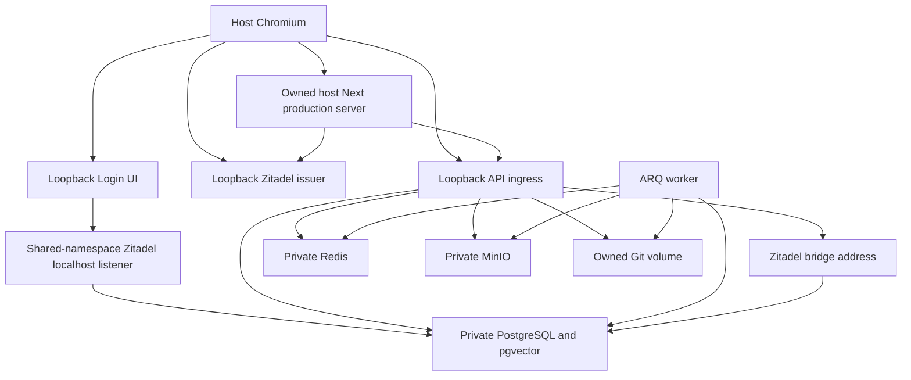
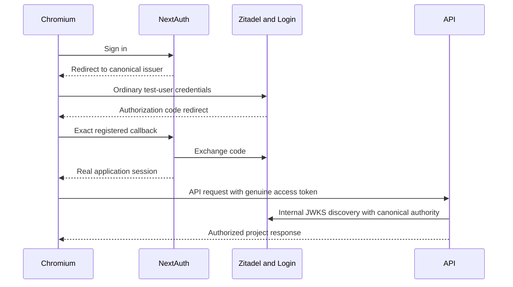
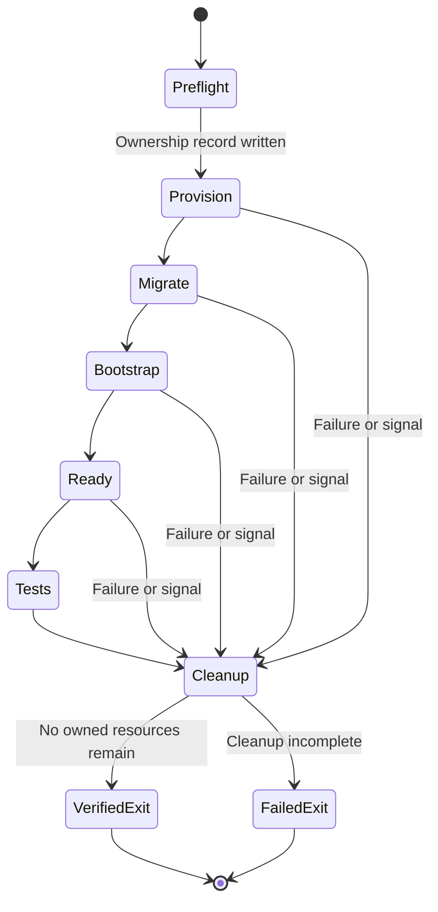
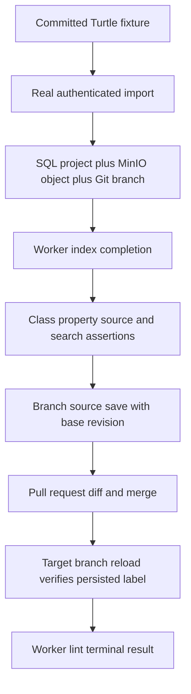

# Isolated Full-Stack Tests - Plan

## Goal Capsule

- **Objective:** Contributors can reproduce failures across OntoKit's API and browser workflows before shipping changes.
- **Means:** A disposable local stack and real Chromium workflows, with deterministic fixtures and verified cleanup (KTD1–KTD8).
- **Authority:** Current user instructions and `AGENTS.md`, then this Product Contract, its Planning Contract, and its implementation units. The catalog owns B10–B13 boundaries.
- **Execution profile:** D06 implements B10 as one coherent deliverable. Establish runtime fidelity before adding domain assertions.
- **Stop conditions:** Stop a run on missing prerequisites, ambiguous resource ownership, failed migration, authentication failure, or failed cleanup. Do not substitute mocks or attach to an existing stack to obtain a pass.
- **Delivery owner:** The executing agent completes implementation, independent review, verification, publication and merge under standing authorization. This test-only deliverable does not activate DEV or satisfy D02.

---

## Product Contract

### Summary

Add repeatable API and browser tests backed by real PostgreSQL, Redis, object storage, Git repositories, workers and disposable identity. Cover the B10 contracts and a browser import/edit/pull-request/merge workflow. Preserve broader authentication, collaboration and CI work as separate deliverables.

### Problem Frame

Existing mocked tests cannot establish that browser requests, authentication, background processing and stored ontology state agree. The historical E2E proposal has no current Playwright implementation, and its fixed ports, example endpoints and developer-stack reuse would make failures difficult to reproduce safely.

### Key Decisions

- **Deliver one bounded plan at a time while retaining the whole backlog** (session-settled: user-directed — chosen over one exhaustive implementation plan: thorough serial delivery must not lose remaining requirements). Governs R10.

### Requirements

**Isolation and execution**

- R1. A documented local invocation provisions fresh real services and test identities without adopting, modifying or deleting another run's or developer's resources.
- R2. The suite hard-fails unmet prerequisites and bounded readiness failures; a missing backend or skipped full-stack test cannot count as success.
- R3. Genuine OIDC authentication supplies the browser session and API credentials used by the tests, without synthetic session injection or a production authentication bypass.

**Workflow coverage**

- R4. API tests prove project creation, reading, updating and deletion, plus ontology import, class/property reads and persisted source changes.
- R5. API tests prove branch creation, revision-aware source saving, pull-request diff and merge, and persisted target-branch content.
- R6. API tests prove project-local lexical search and worker-backed lint completion against the imported ontology.
- R7. API tests prove unauthorized, forbidden, absent-resource and invalid-input contracts, including absence of unintended mutation after a rejected write.
- R8. A Chromium test performs real login, ontology import, editor navigation, branch editing, saving, pull-request review and merge, then verifies the result after reloading.

**Cleanup and evidence**

- R9. Success, setup failure, test failure and catchable interruption remove all run-owned resources and credentials; hard interruption leaves a narrowly scoped recovery record for explicit cleanup.
- R10. Completion evidence maps every B10 obligation to tests and results while retaining B11–B13 and live DEV acceptance as separate unfinished requirements.

### Acceptance Examples

- AE1. Covers R1, R4–R8. With a normal local stack already running, a fresh test run completes its workflows and leaves the existing stack's resource identities and state unchanged.
- AE2. Covers R2, R9. When identity setup or a test fails after resources exist, the invocation returns nonzero, emits useful sanitized diagnostics and removes only its own resources.
- AE3. Covers R3, R7. An unrelated ordinary user cannot mutate the owner's public-readable test project; an independent read confirms the source and revision did not change.
- AE4. Covers R5, R8. After changing an existing class label on a new branch and merging its pull request, reloading the target branch displays the new label and its source contains the change.

### Scope Boundaries

D06 covers all B10 surfaces in the [catalog](../audits/2026-09-20-requirements-backlog.md). The historical plan's API foundation, isolated fixtures, seed/cleanup and essential browser workflow inform this implementation. Its obsolete sample requests and infrastructure are illustrative only.

#### Deferred to Follow-Up Work

- B11: full logout, renewal, expiry and authentication-mode coverage, broader Monaco and suggestion submission/review scenarios. D06's minimum real login and editor workflow are prerequisites, not completion of B11.
- B12: WebSocket presence, acknowledgment, synchronization, reconnect, multi-client and index-notification contracts.
- B13: browser CI, Firefox, broader response-schema enforcement, CI seed reproducibility and trace retention policy.
- B02–B03: hosted DEV deployment and authenticated persona acceptance.
- B14: unrelated policy fixes and schema-mint taxonomy reconciliation. A defect that blocks D06 must be recorded and repaired with its own regression coverage rather than bypassed in fixtures.

The local harness does not integrate external LLM providers, GitHub repositories or production credentials.

---

## Planning Contract

**Target repository:** `ontokit-web`. API source is an explicitly selected `ontokit-api` checkout; API paths below are prefixed `ontokit-api:` to identify that repository and remain relative to its root.

**Research baseline:** web `ab903e145e2a6ad30aefd915a83cb0bafbaa0678`; API `c95991c720e49d1a36abc16803cbb5a1f052e2fe`. Record the actual pair tested if either advances, plus dirty-state fingerprints when verifying uncommitted implementation.

### Assumptions

The initial supported execution environment is the current Linux workstation with Docker Compose, a supported Node release and Playwright Chromium dependencies. Cross-platform portability and parallel workers are unvalidated follow-up bets, not acceptance claims. A small fixture with existing-entity label edits is sufficient for B10's foundational workflow without paid embedding or external review calls.

### Key Technical Decisions

- KTD1. **Use a fresh Compose project per run.** For R1/R9, create project-scoped networks and named volumes with no fixed container names, external resources or developer bind mounts. Record exact resource ownership before mutation. Publish only API, identity and Login ports to IPv4 loopback; do not publish PostgreSQL, Redis or MinIO. Use a private data network and a narrow ingress network. [Compose project isolation](https://docs.docker.com/compose/how-tos/project-name/) and [port publishing](https://docs.docker.com/engine/network/port-publishing/) govern this boundary.
- KTD2. **Keep the Next production runtime and Chromium on the host.** Both use the same canonical `http://localhost:<identity-port>` issuer. API keeps that expected issuer but uses existing `ZITADEL_INTERNAL_URL` for bridge discovery/JWKS. Login shares Zitadel's network namespace and uses its internal API listener; publish its distinct listener through the Zitadel service. Set Zitadel's internal listener port equal to its reserved external port so Login's localhost authority matches the instance. The supported `ZITADEL_PORT` and `ZITADEL_EXTERNALPORT`, published mapping, Login/API transport URLs and readiness probe derive from that one manifest value. Login declares no separate networks; its UI binds a container-reachable interface while host publication stays loopback. See [Zitadel configuration](https://github.com/zitadel/zitadel/blob/main/cmd/defaults.yaml) and [shared namespaces](https://docs.docker.com/reference/compose-file/services/#network_mode). Build Next in a run-owned sanitized source copy, bind its server to loopback, and track its process identity. This avoids host-file/DNS changes, host networking and container-to-host loopback routing. The ordinary developer-server script is not invoked because the harness runs an owned production server, not a background development server.
- KTD3. **Bootstrap only fresh identity state.** Reuse the reviewed Zitadel digest `sha256:f3738fd984131d3f02e386d37fa480d1a30e42b7d4202e2b322f12f7cf556b64` and Login digest `sha256:7c210b79ae78ae74d76092154fa664601852ce79675a747a1085c2656b195648`. Generate setup service-account PATs with run-relative future expiry and the pinned Login wrapper's token-file read. Create a Web OIDC client using supported APIs for that pinned server, exact callback/post-logout URLs, and local HTTP development mode. Prefer supported V2 operations; document any pinned-version need for a deprecated equivalent. Provision ordinary verified-email humans separately from bootstrap administration. [Zitadel application types](https://zitadel.com/docs/guides/manage/console/applications-overview), [OIDC flow](https://zitadel.com/docs/guides/integrate/login/oidc/login-users), and [V2 APIs](https://zitadel.com/docs/apis/v2) shape R3.
- KTD4. **Run migrations once, then start API and worker.** For R2/R4–R6, use PostgreSQL 17 with pgvector and distinct application/identity database ownership, plus Redis, MinIO and a shared Git volume. An explicit migration job must finish at repository heads before API and ARQ start with automatic migrations disabled. Health includes actual dependency checks, expected discovery issuer, rendered Login form and successful worker-backed operations; API `/health` alone is insufficient.
- KTD5. **Use Playwright's normal authentication and request contexts.** Pin `@playwright/test` and its matching Chromium; research identified 1.63.0, to be verified against package availability at installation. Use one worker and dependency setup/teardown projects with a stable run manifest supplied by the outer launcher. Obtain ordinary users' API access tokens from genuine completed application sessions. Use independent request contexts for each identity and anonymous tests; dispose them after use. [Authentication](https://playwright.dev/docs/auth), [project dependencies](https://playwright.dev/docs/test-global-setup-teardown), and [request isolation](https://playwright.dev/docs/api-testing) govern R3/R7/R8.
- KTD6. **Seed through real import and verify persistence.** For R4–R8, import a committed tiny Turtle fixture through the application/API, capture returned IDs, and assert branch/source availability because import can succeed despite Git initialization failure. Wait on bounded observable index/lint state rather than sleeps. Derive request paths from current clients/routes, not historical plan snippets. Keep external integrations empty and use ordinary project policy for merge authorization.
- KTD7. **Make the outer launcher own cleanup and private artifacts.** Install cleanup before resource creation; it runs on normal exit, failure, INT and TERM, independently of Playwright teardown. Match both the recorded run identity and Docker ownership labels before deletion; verify host process identity before signaling to avoid PID reuse. Remove run-owned volumes, networks, process groups including build/install/browser children, image tags created for this run, source/build copies, auth state and secret files. Shared immutable dependency images and caches are not run-owned and must not be pruned. Persist a nonsecret manifest for crash recovery; recover only its exact owned resources. Return failure when cleanup fails. Raw service logs, traces, cookies and session responses remain private and are removed by default; durable evidence contains sanitized status/timing/resource checks only. Explicit diagnostic retention must use restrictive permissions and an expiry, never Git or automatic uploads. [Compose teardown](https://docs.docker.com/reference/cli/docker/compose/down/) and [Playwright auth-state warnings](https://playwright.dev/docs/auth) shape R9.
- KTD8. **Keep B10 assertions independent of broader work.** For R10, maintain a requirement-to-test receipt and a single local entry point. Do not modify hosted deployment workflows or claim B11–B13 completion from foundational coverage.

### High-Level Technical Design

Component routing under KTD1–KTD4:

Authentication protocol under KTD2/KTD3/KTD5:

Run lifecycle and failure transitions under KTD7:

Persistent workflow data under KTD6:

### Alternatives and Risks

Reusing the developer stack would reduce startup time but violate R1 and hide stale state. Disabled authentication and synthetic session cookies cannot prove R3. A bridge-hosted Next runtime needs extra canonical-host routing; the owned host runtime uses existing API internal-issuer support and avoids introducing a proxy. These alternatives are resolved by repository and networking evidence; no unresolved architecture fork warrants a prototype or bake-off.

Provider bootstrap API support and actual Login routing remain execution-time integration checks. Validate them early in U2 and stop with precise failure evidence if the pinned images disagree; do not switch identity versions or relax auth silently. Port reservation can race another process: bind failure must choose a new owned port or abort, never terminate its occupant. Production builds require disk and time, so record duration and check available space before creating large artifacts.

### System-Wide Impact

The harness exercises existing authentication callbacks, CORS, API permissions, migrations, storage and background jobs without changing their public contracts. Login inherits Zitadel's network reachability through the shared namespace; network segmentation does not independently isolate those two processes. Separate sanitized build contexts prevent implicit `.env` loading or Docker context inclusion from importing developer credentials. Existing Vitest discovery remains separate from the E2E suite. Project deletion does not currently remove every MinIO object and can mask Git cleanup errors; teardown therefore verifies resource cleanup through KTD7 rather than treating an HTTP delete as proof of complete erasure.

### Sources and Patterns

- `docs/plans/e2e-testing.md`: original categories, infrastructure and unresolved auth choices; full requirement scope is partitioned through B10–B13 above.
- `auth.ts`: real OIDC flow and session access-token exposure; `next.config.ts`: build-time public API/WS/auth settings.
- `lib/api/projects.ts`, `lib/api/client.ts`, `lib/api/lint.ts`: current PATCH, source, ontology search and lint contracts.
- `ontokit-api:compose.yaml`, `ontokit-api:deploy/compose.dev.yaml`, `ontokit-api:scripts/setup-zitadel.sh`, `ontokit-api:config/zitadel/steps.yaml`: provisioning patterns only; never run their developer-mutating defaults.
- `ontokit-api:ontokit/core/auth.py`, `ontokit-api:ontokit/core/config.py`, `ontokit-api:scripts/entrypoint.sh`: issuer routing, environment loading and migration controls.
- `ontokit-api:ontokit/services/project_service.py`, `ontokit-api:tests/integration/test_suggestion_submission_recovery.py`: import/storage behavior and owned real-state fixtures.

---

## Implementation Units

### U1. Own the disposable stack lifecycle

**Goal:** Establish an isolated, bounded lifecycle with safe recovery.

**Requirements:** R1, R2, R9; AE1/AE2. **Dependencies:** None.

**Files:** `e2e/compose.yaml`, `scripts/e2e/run.mjs`, `scripts/e2e/ownership.mjs`, `scripts/e2e/runtime.mjs`, `scripts/e2e/cleanup.mjs`, `__tests__/scripts/e2e-ownership.test.ts`, `e2e/lifecycle.spec.ts`, `.gitignore`, `.dockerignore`, `package.json`.

**Approach:** Implement KTD1/KTD2/KTD4/KTD7 around an explicit API source path and sanitized source/runtime copies. Record source revisions and resource identities in a stable run manifest. Prepare the selected source pair with allowlisted environment and an explicit cleanup entry point. U1 proves dependency provisioning, migration and owned process teardown; U2 supplies OIDC configuration before full Next startup and authenticated readiness.

**Execution note:** Prove startup, ownership boundaries and teardown with real Docker before investing in domain assertions.

**Patterns to follow:** API deployment service graph and migration entrypoint, adapted to run-owned resources; existing Vitest script-test conventions.

**Test scenarios:**

1. Covers AE1. Start beside existing containers and occupied ports; only fresh owned resources appear and existing resources are unchanged after teardown.
2. A missing API checkout, Docker prerequisite or insufficient build space fails before resources are created.
3. Inject setup failure after a volume/process exists; cleanup removes both and retains a sanitized nonzero receipt.
4. INT/TERM and repeated cleanup are safe; a stale manifest or reused PID cannot authorize deletion of another resource.
5. A cleanup failure makes the run fail and leaves exact recovery identifiers.
6. Secret-bearing environment files and generated auth state cannot enter build contexts or Git.

**Verification:** Ownership tests and real lifecycle probes establish R1/R2/R9 before workflow tests are enabled.

### U2. Bootstrap fresh identity and genuine sessions

**Goal:** Make the isolated stack usable through the real authentication path.

**Requirements:** R2, R3, R7. **Dependencies:** U1.

**Files:** `scripts/e2e/bootstrap-identity.mjs`, `e2e/stack.setup.ts`, `e2e/stack.teardown.ts`, `e2e/fixtures/auth.ts`, `e2e/fixtures/run.ts`, `playwright.config.ts`, `package.json`, `package-lock.json`, `e2e/auth-foundation.spec.ts`.

**Approach:** Implement KTD3/KTD5 using synthetic run-private credentials. Create an owner and unrelated ordinary user, complete each real browser sign-in, and retain private session state only for this run. Setup reports canonical issuer and nonsecret role assertions before dependent tests begin.

**Patterns to follow:** `auth.ts`; pinned Login wrapper and first-instance verified-email configuration; official Playwright project dependencies.

**Test scenarios:**

1. The configured-port readiness probe, browser navigation, NextAuth discovery/token exchange and API JWKS all agree on issuer and complete an ordinary-user callback.
2. The two users have distinct identities and no application superadmin role.
3. Wrong callback configuration, failed PAT bootstrap or issuer mismatch causes bounded setup failure and U1 cleanup.
4. A fresh second run creates new identity resources rather than reusing session state.
5. Anonymous request contexts receive no browser cookies or authorization headers.

**Verification:** Real login and a protected API request succeed, while an unauthenticated protected request fails. No mock, bypass or local credential is used.

### U3. Prove project and ontology API persistence

**Goal:** Cover project and ontology contracts against real stores.

**Requirements:** R4, R7. **Dependencies:** U2.

**Files:** `e2e/fixtures/tiny-ontology.ttl`, `e2e/fixtures/projects.ts`, `e2e/api/projects.spec.ts`, `e2e/api/ontology.spec.ts`, `e2e/api/errors.spec.ts`.

**Approach:** Implement KTD6 with distinct project fixtures per mutation scenario. Derive request payloads from current API schemas and validate response fields consumed by the frontend. Capture exact IDs for teardown rather than searching by prefix.

**Patterns to follow:** Current project import clients, class/property APIs and `ProjectService.create_from_import`.

**Test scenarios:**

1. Create, list/read, PATCH and delete a project; subsequent reads show the intended state or absent-resource response.
2. Import the tiny Turtle fixture and verify class/property labels, readable source and an initialized branch.
3. Malformed import payload/Turtle returns its endpoint-specific validation contract without leaving a usable partial project; invalid imports may return 400, while malformed source and schema-invalid payloads establish 422 coverage.
4. Covers AE3. Missing authentication, unrelated-user writes, absent IDs and invalid payloads produce the intended 401/403/404/422 contracts and stable error fields.
5. Rejected writes leave source/revision unchanged when read independently by the owner.

**Verification:** R4/R7 assertions run through HTTP without intercepted routes and include persistence checks beyond response status.

### U4. Prove branches, pull requests, search and lint

**Goal:** Cover the remaining B10 API surfaces and asynchronous completion.

**Requirements:** R5, R6, R7. **Dependencies:** U3.

**Files:** `e2e/api/branches.spec.ts`, `e2e/api/pull-requests.spec.ts`, `e2e/api/search-lint.spec.ts`, `e2e/fixtures/polling.ts`.

**Approach:** Extend KTD6's fixture lifecycle with revision-aware edits and ordinary project merge policy. Poll actual task/index terminal conditions under explicit deadlines. Assert exact fixture IRIs and labels rather than merely a nonempty response.

**Patterns to follow:** `lib/api/revisions.ts`, current branch/pull-request clients, `lib/api/lint.ts`, and API route schemas.

**Test scenarios:**

1. Create a branch, read its base revision, change a known label and verify branch source persistence.
2. A stale base revision is rejected under the existing conflict contract without overwriting the newer source.
3. Covers AE4. Create a pull request, inspect the expected diff, merge with an authorized ordinary project actor, and verify PR state and target source.
4. After target reindex completion, lexical search for the distinctive changed label returns the exact known IRI and excludes a nonmatching fixture term.
5. Lint on a fresh fixture produces a new persisted run after enqueue and reaches terminal success with a deterministic rule result; a previous run cannot satisfy the assertion, and worker unavailability or terminal failure fails within the deadline.

**Verification:** Every B10 API category has a passing real-state assertion; no arbitrary sleeps or skipped-service substitutions remain.

### U5. Prove the browser write and merge journey

**Goal:** Show that the user interface drives the same persisted lifecycle.

**Requirements:** R3, R8; AE4. **Dependencies:** U4.

**Files:** `e2e/browser/ontology-workflow.spec.ts`, `e2e/fixtures/editor.ts`.

**Approach:** Begin with a fresh browser context without stored session state and perform real UI sign-in using the ordinary owner provisioned in U2. Use a fresh browser-owned project and accessible locators. Import through the UI, navigate the class tree, create a branch, edit its existing label through the editor, complete the visible save commit-message dialog, review the pull-request diff and merge. Helpers may operate Monaco's user-facing editor affordances but cannot replace application actions with direct backend writes.

**Patterns to follow:** `app/projects/[id]/editor/page.tsx`, `components/editor/TurtleEditor.tsx`, `components/pr/`, and existing editor interaction tests.

**Test scenarios:**

1. Covers AE4. Sign in from the fresh context, complete the UI journey, explicitly select the target branch and reload it; the new label and source remain visible.
2. Save completion and merge completion are observed before navigating; delayed responses cannot produce an early pass.
3. Failed UI assertions retain private diagnostics long enough for sanitized failure reporting, then execute U1 cleanup.

**Verification:** The recorded workflow includes real browser actions and persisted post-reload assertions with no route mocking or API shortcut for the steps under test.

### U6. Publish repeatability and coverage evidence

**Goal:** Make the suite reproducible and its completion claim auditable.

**Requirements:** R1, R2, R9, R10. **Dependencies:** U5.

**Files:** `e2e/README.md`, `docs/releases/d06-full-stack-readiness.md`, `docs/plans/2026-09-20-0649-requirements-delivery-roadmap.md`, `package.json`, `e2e/lifecycle.spec.ts`.

**Approach:** Document prerequisites, the canonical invocation, explicit API source selection, cleanup/recovery and private diagnostics. Map B10 contracts to test names and preserve B11–B13 dispositions per KTD8. Record actual tested revisions, image digests, migration heads, test counts and cleanup evidence.

**Test scenarios:**

1. Run the complete suite twice from fresh state; each passes without retained identity, storage or build state.
2. Exercise setup failure, test failure and catchable interruption; verify nonzero outcomes and zero remaining owned resources.
3. Recover an intentionally interrupted owned run from its manifest without affecting a neighboring run or developer stack.
4. Missing prerequisites produce actionable failure rather than a skipped green report.

**Verification:** Another contributor can follow the run documentation, reproduce the proof and understand exactly which backlog items remain open.

---

## Verification Contract

| Gate | Applicability | Required evidence |
|---|---|---|
| `npm run lint` and `npm run type-check` | All changed web/harness code | No new errors; E2E typing is included deliberately |
| `npm run test` | Existing and new unit coverage | Existing Vitest suite remains green with separate E2E discovery |
| `npm run build` | Sanitized run-owned web build | Correct browser-facing public configuration and no developer secrets |
| Proposed `npm run test:e2e` | U1–U6 | All mandatory API and Chromium assertions pass with zero skips |
| Lifecycle failure probes | U1/U6 | Setup failure, test failure, signals and explicit recovery remove only owned state |
| Independent change review | Complete diff | Actionable findings resolved before publication |
| B10 receipt | U6 | Two fresh runs, source pair, image/migration evidence and requirement-to-test map |

If execution requires a production bug fix, add the relevant repository's regression/static checks and document the expanded diff. `release:validate` is not a known script in the current web package; do not invent a passing release gate. Existing CI required checks still govern merging. No hosted deployment acceptance is claimed.

---

## Definition of Done

Each unit's verification is satisfied and R1–R10 map to concrete evidence. B10 is accepted only after the full API category set and browser workflow pass, including cleanup and repeatability. Review findings are resolved, abandoned experiments are removed, no credentials or private traces are committed, and all owned runtime resources are gone or a failed-cleanup blocker is explicitly recorded. The focused implementation is published and merged after required checks; the roadmap identifies the next unfinished deliverable and preserves all 75 requirement IDs.
