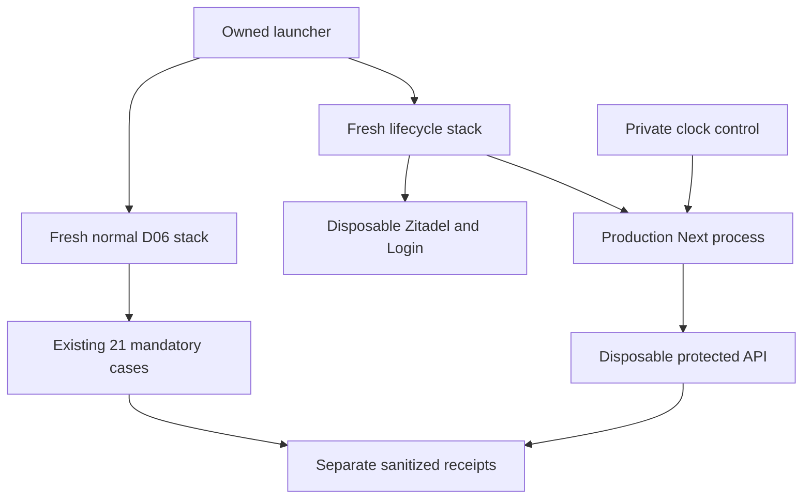
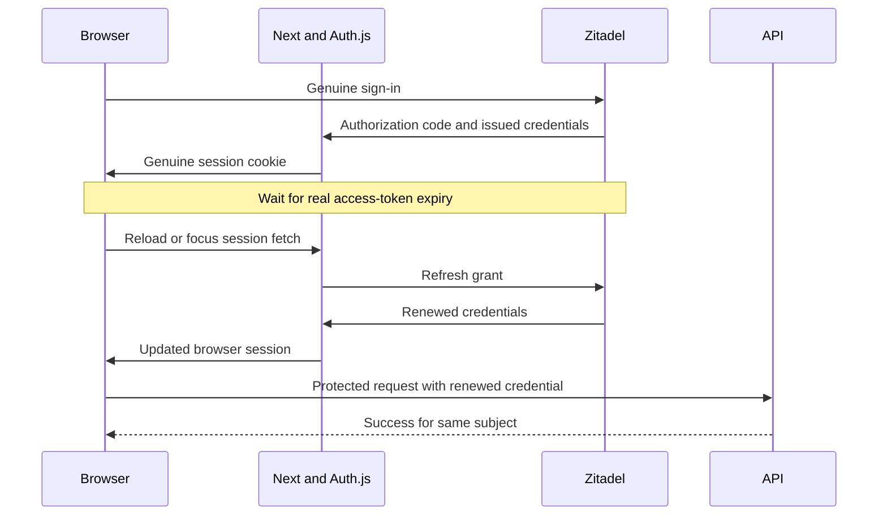
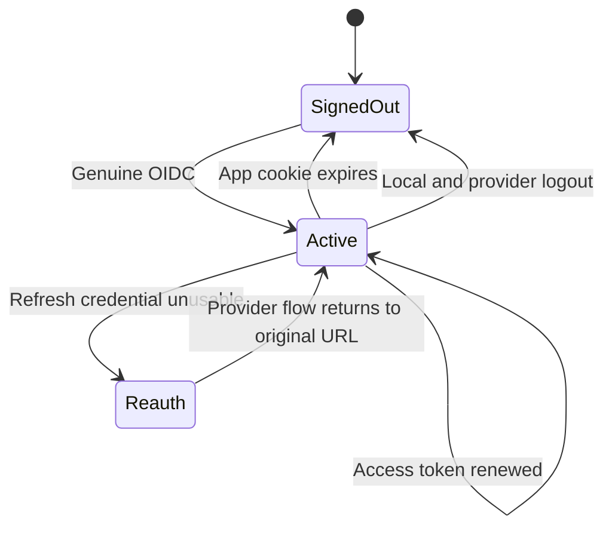

# Required Authentication Lifecycle - Plan

## Goal Capsule

- **Objective:** Developers can detect regressions that leave OntoKit users unable to sign out, renew credentials, or recover from an expired session.
- **Means:** Extend the D06 isolated full-stack foundation with required-mode lifecycle proof and focused repairs for reproduced defects (KTD1–KTD5).
- **Authority:** Current user instructions and repository instructions govern; this plan implements the authentication lifecycle portion of B11 in `docs/plans/2026-09-20-0649-requirements-delivery-roadmap.md`.
- **Execution:** Characterize failures before production edits. The executor owns implementation, local verification, independent review and normal PR delivery. Shared infrastructure changes are outside this deliverable.
- **Stop conditions:** Unsupported pinned-provider behavior, failed ownership checks, credential leakage, or inability to prove the actual Next runtime observed the controlled expiry blocks acceptance. Preserve evidence and record the failed prerequisite rather than skipping a case.

---

## Product Contract

### Summary

Prove genuine required-mode login/logout and credential renewal against disposable Zitadel, distinguish refresh failure from application-session expiry, and repair lifecycle defects demonstrated by those checks.

### Problem Frame

D06 already exercises genuine OIDC login and an import/Monaco/save/PR diff/merge/reload journey. Its protected API fixtures cache initial credentials. Existing auth integration tests use synthetic cookies and mocked issuer responses, so a passing suite does not establish that a browser renews credentials or loses access at the correct account boundary.

### Requirements

**Authentication behavior**

- R1. A fresh ordinary user can log in through real OIDC, sign out through the application UI, and end both the application and provider sessions; subsequent sign-in cannot silently reuse that logged-out provider session.
- R2. Expired access credentials renew through the real provider and the browser subsequently completes a protected operation as the same subject without interactive login.
- R3. An unusable refresh credential leads to reauthentication and recovery to the original same-origin URL, including its query state, with a valid session and protected API access.
- R4. An expired application-session cookie is rejected even if the provider session remains valid; the UI becomes signed out and explicit sign-in recovers access.
- R5. Demonstrated application lifecycle defects are repaired with regression coverage; suspected edges are not treated as confirmed merely because source code looks concerning.

**Evidence and isolation**

- R6. All 21 existing D06 mandatory tests remain mandatory, and all new lifecycle cases must pass without skips, retries or fabricated authentication evidence.
- R7. Lifecycle setup and cleanup affect only the current run's owned services, users and private files; credentials, cookies and raw logs never enter committed evidence.
- R8. Acceptance records separate real elapsed-time provider expiry, controlled-clock application expiry, local verification and hosted acceptance.

### Scope Boundaries

This is local required-mode regression coverage. No hosted credentials, production lifetime changes, database migration, EU cutover, browser CI platform or new identity provider is required.

#### Deferred to Follow-Up Work

B11 optional/configured, optional/unconfigured and disabled mode matrix remains open. The contributor suggestion submit/review chain remains distinct from D06's owner PR diff/merge proof. B02/B03 hosted persona acceptance, B12 WebSocket lifecycle and B13 cross-browser/CI coverage remain open. Multi-tab refresh locking and broader background session polling are not silently added; a reproduced blocker must be scoped explicitly.

---

## Planning Contract

### Key Technical Decisions

- KTD1. **Separate normal and lifecycle profiles on fresh disposable stacks.** Preserve the normal D06 profile and add a required-lifecycle profile to the same ownership infrastructure. Zitadel lifetime settings are instance-wide, so shortening them inside the baseline run would invalidate cached owner/unrelated credentials. Governs R6–R8.
- KTD2. **Use supported provider lifetime settings with real elapsed time.** Configure all four OIDC durations through the pinned provider's Admin API, read back the effective settings, and issue lifecycle credentials afterward. Bound each wait by observed expiry plus a documented grace budget; unavailable settings fail setup. Governs R2, R3, R7.
- KTD3. **Control only the disposable Next process clock for application expiry.** Use a harness-only runtime preload, initially at zero offset, against the untouched cookie issued by a genuine login. Advance beyond the latest observed application expiry plus the pinned JWT verifier's tolerance. Keep host, browser, API and provider clocks unchanged; return to zero offset before another OIDC exchange. No production source patch, reduced production lifetime or generated cookie supplies this proof. Governs R4, R7, R8.
- KTD4. **Observe the browser's state transitions.** Use a real reload or focus transition to make SessionProvider fetch current credentials, followed by a protected browser operation. Playwright request-client calls and cached bearer fixtures are supplementary observations only. Recovery interaction helpers must let SessionGuard initiate the flow and must tolerate legitimate provider SSO. Governs R1–R4.
- KTD5. **Keep repairs local to demonstrated lifecycle failures.** Start with the existing Auth.js integration tests. Candidate cases are a successful retry retaining `RefreshAccessTokenError`, an expired token without a refresh credential, sensitive issuer errors reaching console logs, and the actual logout case exposing incomplete public client-ID wiring. Preserve inactive-mode behavior and account subject mapping. Governs R5, R7.

### Assumptions

A dedicated second profile is the default implementation choice for avoiding baseline contamination, at the cost of another disposable stack run. The process-clock preload is a planned test instrument, not previously verified behavior; U1 must prove it reaches the actual production Next process and pinned Auth.js/Jose before R4 can pass. Exact short lifetime values remain implementation tuning within bounded test budgets, not new product defaults.

### High-Level Technical Design

The profiles have separate run identities, private directories and receipt inventories. The existing Docker ownership boundaries apply to both.

### Sources and Research

- `docs/audits/2026-09-21-d08-auth-lifecycle-research.md` maps existing proof and suspected gaps against Web `83eaf957` and the root checkout's current roadmap.
- `scripts/e2e/README.md`, `scripts/e2e/ownership.mjs`, `scripts/e2e/runtime.mjs` and `scripts/e2e/evidence.mjs` own confinement, cleanup and sanitized acceptance contracts.
- `auth.ts`, `app/providers.tsx`, `components/auth/SessionGuard.tsx`, `components/auth/user-menu.tsx` and `e2e/fixtures/auth.ts` define the observed lifecycle. SessionProvider currently has no periodic polling interval.
- [Zitadel lifetime configuration](https://help.zitadel.com/configure-oidc-token-lifetimes-in-zitadel) establishes instance-wide settings, seconds-based durations, all-four-field updates and readback; it motivates KTD1/KTD2.
- [Auth.js refresh guidance](https://authjs.dev/guides/refresh-token-rotation) identifies refresh rotation races; serialize the planned proof and leave concurrency hardening separate unless reproduced as a blocker.
- [Zitadel OAuth endpoints](https://zitadel.com/docs/apis/openidoauth/endpoints) distinguish refresh/revocation from browser end-session behavior. Logout is not asserted to immediately invalidate every previously issued bearer token.

---

## Implementation Units

### U1. Add an isolated lifecycle profile and validated clock control

**Goal:** Supply real, bounded lifecycle conditions without changing the baseline suite or production auth configuration.

**Requirements:** R6–R8; KTD1–KTD3. **Dependencies:** None.

**Files:** `scripts/e2e/run.mjs`, `scripts/e2e/full-stack.mjs`, `scripts/e2e/bootstrap-identity.mjs`, `scripts/e2e/identity.test.mjs`, `e2e/fixtures/run.ts`, `playwright.config.ts`, new `scripts/e2e/auth-clock.cjs`, new `scripts/e2e/auth-clock.test.mjs`, new `scripts/e2e/auth-lifecycle.test.mjs`.

**Approach:**

1. Add an explicit profile selector that preserves the current default and creates a fresh ordinary lifecycle persona. Keep required-auth and empty-superadmin validation.
2. Apply KTD2 before persona login; bootstrap administration remains private and is never the test persona. Use short refresh expiry to provoke the real failure path without exposing refresh tokens to Playwright.
3. Bind the KTD3 control to the private run directory and matching ownership marker. Reject foreign/symlinked or malformed controls and non-finite/out-of-range offsets. Restrict runtime preload to the owned Next process; setup/build/provider/API processes receive no clock override.
4. Prove actual worker clock reachability and normal-clock restoration with a bounded preflight. Capture one genuine cookie privately and test that same unchanged specimen at offsets just before and after its observed expiry plus verifier tolerance. The pre-boundary response must still contain an application session (a refresh error is separate); only the post-boundary response may become null and clear cookies. Do not substitute a renewed response cookie for the specimen. This distinguishes expiry from instrumentation or generic decode failure. Failed preflight prevents browser acceptance. Restore the clock in failure cleanup even when the browser case fails.

**Patterns:** Existing ownedCommand cancellation, private run configuration validation and bootstrap readback.

**Test scenarios:**

- Default profile retains unchanged baseline discovery and normal lifetimes.
- Lifecycle profile reads back its effective OIDC durations and creates an ordinary user distinct from setup administration.
- Policy API rejection or wrong readback fails before browser cases and still cleans owned resources.
- Clock control rejects foreign runs, symlinks, malformed data and impossible offsets.
- Offset changes affect the actual Next worker while surrounding service and host times remain normal; reset works after injected failure.

**Verification:** Profile separation and ownership tests pass; a genuine issued-cookie preflight reaches the expected verifier behavior before R4 is claimed.

### U2. Characterize and repair demonstrated auth callback failures

**Goal:** Keep expired or recovered credentials from leaving a misleading authenticated session.

**Requirements:** R5, R7; KTD5. **Dependencies:** None; integrate before U3 acceptance.

**Files:** `auth.ts`, `__tests__/config/auth-session.integration.test.ts`, `__tests__/config/auth-bootstrap.test.ts`; `components/auth/user-menu.tsx`, its existing component test and `next.config.ts` only if the real logout case reproduces a configuration or end-session defect; `components/auth/SessionGuard.tsx` and `__tests__/components/auth/SessionGuard.test.tsx` only if a reproduced guard defect requires repair.

**Approach:** Reproduce failure-then-success across real Auth.js cookie transitions, characterize the no-refresh expired-token branch, and inspect provider-error logging. Change only behavior supported by a failing regression and lifecycle evidence; record a non-reproduction instead of making a speculative production edit.

**Execution note:** Establish failing characterization before changing a currently asserted behavior. Browser failures can return from U3 to U2 for characterization and bounded repair before U3 acceptance. The user menu already implements federated logout, but its public client ID is absent from the inspected isolated build wiring; reproduce provider behavior before selecting a repair.

**Test scenarios:**

- A refresh failure followed by successful retry clears stale failure state and exposes valid application session fields.
- Expired credentials without a refresh token cannot masquerade as usable protected access; inactive auth modes do not attempt a provider refresh.
- Initial sign-in retains the verified provider subject; token rotation and omitted replacement refresh tokens preserve the correct credential.
- Provider rejection, network error and malformed response do not reveal credential values through logs or session fields.

**Verification:** Existing auth tests and added regressions pass; any production diff has a reproduced failure and bounded rationale.

### U3. Prove four browser lifecycle boundaries

**Goal:** Exercise logout, successful renewal, refresh recovery and application expiry through actual browser-visible state.

**Requirements:** R1–R4, R7, R8; KTD2–KTD4. **Dependencies:** U1, U2 disposition.

**Files:** New `e2e/browser/auth-lifecycle.spec.ts`, `e2e/fixtures/auth.ts`, new `e2e/fixtures/auth-lifecycle.ts`, `e2e/stack.setup.ts`, `e2e/stack.teardown.ts`, `components/auth/user-menu.tsx` only if an accessible control name is needed, and `__tests__/components/auth/user-menu.test.tsx` for that change.

**Approach:** Split initiating OIDC from interacting with provider credential screens. Each case obtains its own fresh browser session. Use existing real protected project/user operations and clean only resources tracked by that case. Compare token changes as booleans in memory and avoid assertion payloads containing credentials.

**Test scenarios:**

1. Real login reaches verified subject; UI sign-out clears the app session, completes provider end-session and requires identity interaction before the next login.
2. An observed real access-token expiry triggers KTD4; a renewed current browser credential performs a protected operation and retains subject without interactive login.
3. Real refresh expiry yields the SessionGuard flow from a non-root same-origin URL with query state. Recover through the provider and verify the original URL and successful protected operation. Valid provider SSO is permitted.
4. The same genuinely issued application cookie authenticates under the just-before-boundary controlled clock, then fails after KTD3 advances beyond its observed expiry and verifier tolerance. Preserve the original specimen privately rather than replacing it with a cookie renewed by the positive control; generic decode failures on both sides fail the test. Session becomes null, authentication cookies are cleared and signed-out UI appears. Restore normal time before explicit login; provider SSO may still be valid.
5. Cancellation or assertion failure during every waiting/clock phase restores controls and tears down owned resources. No case obtains acceptance through skip or mocked provider interception.

**Verification:** All four boundary cases pass on real disposable services, with clear evidence identifying the clock-controlled case. Request-client checks alone never satisfy browser recovery.

### U4. Make lifecycle evidence mandatory and preserve program boundaries

**Goal:** Ensure a green receipt cannot hide missing lifecycle proof or replace baseline acceptance.

**Requirements:** R6–R8. **Dependencies:** U1–U3.

**Files:** `scripts/e2e/evidence.mjs`, `scripts/e2e/evidence.test.mjs`, `scripts/e2e/README.md`, `e2e/README.md`, new `docs/releases/d08-auth-lifecycle-readiness.md`; update `docs/plans/2026-09-20-0649-requirements-delivery-roadmap.md` only in coordination with its current owner.

**Approach:** Define fixed mandatory inventories per profile and record profile identity in sanitized receipts. Reject unknown/mixed profiles. Preserve the baseline inventory exactly and document actual source fingerprints and selected API revision. Carry uncovered B11 obligations forward explicitly.

**Test scenarios:**

- Removing any required lifecycle case fails even when total passed counts are inflated.
- Wrong profile, duplicate case, skip, retry, expected failure or global runner error prevents acceptance.
- Baseline acceptance still requires its 21 named cases; lifecycle acceptance cannot substitute for it.
- Failed cleanup prevents acceptance; receipts drop unknown/private fields and distinguish controlled-clock proof.

**Verification:** Evidence validator negative cases pass and both profiles produce complete sanitized receipts after fresh successful runs.

---

## Verification Contract

Use the repository's `npm run type-check`, `npm run lint`, targeted Vitest auth tests, and the affected Node harness tests. `npm run test:e2e:ownership`, `npm run test:e2e:identity` and `npm run test:e2e:evidence` remain relevant gates. Production build fidelity is exercised by each full-stack run. No `release:validate` script exists in the inspected package.

Select an explicit API checkout containing merged D07 `13ad2f35d55196274c5fec313bfb254a7cc80226` or a reviewed descendant; the original D06 README's older API recommendation is not the target baseline. Record copied-byte fingerprints for both repositories, package/browser versions and pinned service image IDs.

Run each profile twice from fresh resources with identical source fingerprints. Every run must satisfy its mandatory inventory and cleanup gate. Compare neighboring Docker resource identities before and after. Because U1 changes process instrumentation, repeat startup failure, late failure, INT/TERM and explicit hard-kill recovery with the instrumented Next process running. Preserve only sanitized receipts and explain any failed attempt.

---

## Definition of Done

R1–R8 have explicit evidence; U1–U4 verification outcomes pass and any suspected production bug has a clear reproduced/fixed or not-reproduced disposition. Abandoned instrumentation and exploratory code are removed. Independent review covers auth behavior, test evidence validity and cleanup. The readiness receipt records local acceptance only, review results and publication state. The roadmap links the delivered evidence and retains auth modes, suggestion review, B02/B03, B12 and B13 as unfinished where applicable.

## Planning Review

See `docs/audits/2026-09-21-d08-auth-lifecycle-plan-review.md` for review methods, applied corrections and source-grounded dispositions. The reviewed plan is ready for implementation; no implementation acceptance is claimed.
