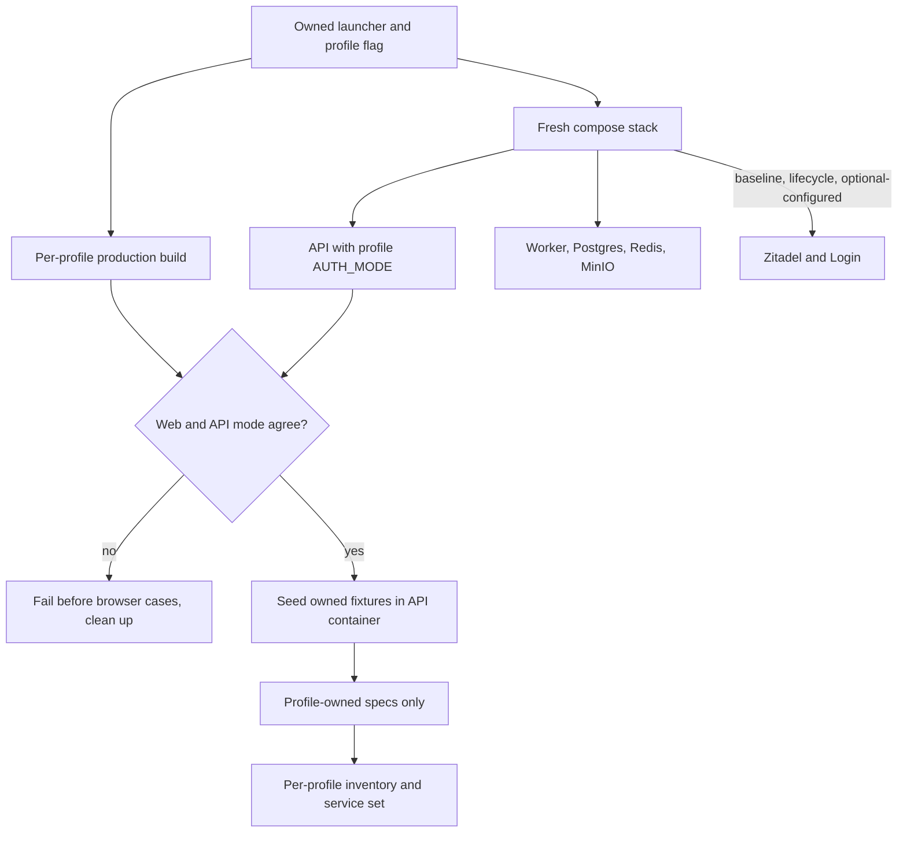
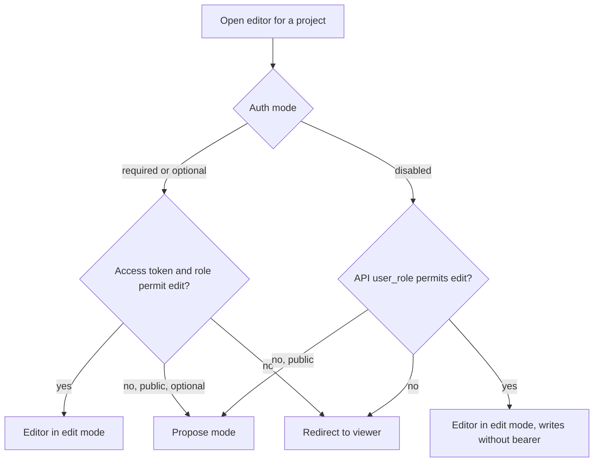

# Authentication Mode Matrix - Plan

## Goal Capsule

- **Objective:** Operators who run OntoKit with optional sign-in, with no identity provider, or with authentication disabled get an application whose visible behavior matches what the API actually permits. At delivery, local regression runs on fresh stacks prove each of those modes. Recurring CI enforcement is a deferred B13 follow-up (see Scope Boundaries).
- **Means:** Add three fresh disposable full-stack profiles to the D06/D08 harness with checked web/API mode agreement (KTD1–KTD4), repair provider-less dead-end sign-in affordances (KTD5), and align disabled-mode project creation, save paths and routing with the API-granted role (KTD6, provisional).
- **Authority:** Current user instructions and repository instructions govern. This plan implements the auth-mode matrix portion of B11 and the auth-disabled routing seam of B14 in `docs/plans/2026-09-20-0649-requirements-delivery-roadmap.md`. Required mode is already proven by D06 and D08 (`docs/releases/d08-auth-lifecycle-readiness.md`) and is not re-planned here.
- **Execution:** Characterize before editing production code. The executor owns implementation, local verification, independent review and normal PR delivery under the standing authorization. Shared infrastructure and hosted environments are outside this deliverable.
- **Stop conditions:** A web/API mode mismatch that the harness cannot detect, an unexplained tier for a denial, credential leakage into receipts, or a baseline/lifecycle inventory change blocks acceptance. If Damien answers the disabled-mode question with anything other than the provisional choice, stop U4 and U5 case 10 and re-plan only that slice. Reverting U4's single commit undoes the disabled-mode create page, the disabled-mode save gates, the `derivePermissions` change and the editor redirect change; U3's new-project unavailability copy then applies to disabled mode as well.

---

## Product Contract

### Summary

Prove the optional/configured, optional/unconfigured and disabled authentication modes end to end with a real browser, a real API and, where a provider exists, real Zitadel. Remove sign-in controls that lead nowhere when no provider is active. In disabled mode, let the web follow the role the API already grants, provisionally treating disabled mode as a single-user workspace.

### Problem Frame

The web supports three authentication modes (`lib/auth-mode.ts`), but only required mode has browser-level proof. CI's `scripts/verify-auth-image.sh` smokes optional images without a real API or provider and refuses disabled mode. Nothing drives a browser against a real API in optional or disabled mode, and nothing checks that the web build and the API agree on the mode.

DEV runs optional mode with a provider. The published GHCR image is optional mode without a provider, which is what external operators get. In both provider-less modes the header correctly hides sign-in, but several pages still offer "Sign In" buttons or links that cannot succeed (`app/page.tsx`, `app/projects/[id]/page.tsx`, `app/projects/new/page.tsx`, `app/auth/signin/page.tsx`).

In disabled mode the API treats every caller as `ANONYMOUS_USER` and lets them create projects, while the web is keyed on an access token that never exists: the new-project page shows its form only when `status === "authenticated"` and its submit handlers throw without `session.accessToken`; permission derivation (`lib/hooks/useProject.ts`) and editor routing (`app/projects/[id]/editor/page.tsx`) require a token; and every editor write path gates on `session?.accessToken`. The result, as inferred from source, is that a disabled-mode user cannot create a project from the browser, and one created through the API is redirected away from its editor (audit finding F1 in `docs/audits/2026-09-05-pr-party-dev-parity-ledger.md`, repeated in `docs/releases/d01-release-readiness.md`).

### Requirements

**Mode agreement and harness integrity**

- R1. Each new mode runs on its own fresh stack, and the harness fails before any browser case unless the compiled web build and the running API report the same authentication mode and provider configuration.
- R2. The D06 baseline and D08 lifecycle profiles keep their exact mandatory inventories and acceptance rules, and no new spec is discovered by either.
- R3. Each new profile has a fixed mandatory inventory, and acceptance requires that profile's own service set, complete cleanup and sanitized receipts with no skips, retries or fabricated evidence.

**Optional mode with a provider**

- R4. An anonymous visitor sees sign-in in the header, browses public projects and can start a proposal on a public project; a private project shows a denial whose Sign In completes real OIDC and returns to the original URL. A private project owned by another user stays denied both before and after sign-in.
- R5. After real sign-in the user sees their own private project and can create a project; signing out returns the application to the anonymous state.

**Optional mode without a provider**

- R6. No sign-in control appears anywhere, including the former dead ends, as enforced by a repository inventory of sign-in call sites; the provider list is empty, and `/auth/signin` and `/projects/new` explain that sign-in is unavailable in this configuration.
- R7. An anonymous visitor browses public projects and runs a proposal session against the real API; a private project shows a denial with no sign-in control; a direct API project create is rejected with 401.

**Disabled mode**

- R8. No authentication UI appears; public browsing and proposal work; PR create and duplicate check are rejected by the API with 403, proven by direct API probes; PR Party is absent from both the API and the web navigation, so the web offers no PR entry point to refuse.
- R9. A project created in the browser through the Create-Empty form in disabled mode opens in the editor for editing, and an edit saves through the real API. Import-from-file and clone-from-GitHub are out of scope in disabled mode.

**Repairs**

- R10. Each repaired affordance has Vitest coverage for provider-less modes, and required and optional/configured behavior is unchanged.

**Product Contract preservation:** R4, R5, R6, R8 and R9 were clarified by the 2026-09-26 document review (deterministic ownership fixtures, sign-in inventory, API-probe proof for PR refusal, Create-Empty-only disabled creation); their intent is unchanged.

### Key Decisions

- **Disabled mode is a single-user workspace in which create and edit are allowed (provisional).** The web follows the role the API already grants in disabled mode; this needs no API change. It is filed as ask `ontokit-web-2026-09-26-0221-d09-disabled-mode-meaning`, qid `disabled-mode-meaning`, and recorded provisionally pending Damien's answer. The alternatives "Read and suggest only" (requires an API change) and "Drop disabled mode" would change only R9, U4 and the disabled editing case in U5. Governs R9.
- **Unavailable sign-in is explained, not offered.** Provider-less pages replace dead-end sign-in controls with honest copy, consistent with the header's existing `shouldShowAuthUI` gate. Governs R6, R7, R10.

### Scope Boundaries

This is delivery-time local regression proof plus two bounded web repairs. No hosted DEV acceptance, API behavior change, production mode change, new identity provider or CI browser platform is required.

- A fourth build that injects stale provider variables into a disabled build is covered by unit tests on the mode predicates and env guard, not by a browser profile.
- Required mode is not re-proven beyond keeping D06 and D08 accepted.
- In disabled mode, only the Create-Empty tab creates projects. Import-from-file and clone-from-GitHub depend on authenticated flows and show honest copy there instead.
- Disabled mode gives every caller who can reach the API create and edit rights as the shared anonymous owner. It is supported only for a single-user deployment that is not network-exposed; this plan documents that boundary and does not enforce it.

#### Deferred to Follow-Up Work

B02/B03 hosted persona acceptance, multi-tab refresh locking, B12 WebSocket lifecycle and B13 cross-browser/CI coverage remain open. Recurring CI enforcement of these profiles belongs to B13. A runtime warning when disabled mode starts on a non-loopback bind is a possible follow-up, not in scope. The contributor suggestion submit/review chain stays separate. If Damien chooses "Read and suggest only", the API change it requires becomes its own deliverable. The remaining B14 seams (namespace/untyped policy, historical branches, review/self-merge, deployment drift) are untouched.

### Outstanding Questions

- Disabled-mode meaning (ask stem above). Non-blocking: work proceeds on the provisional answer, with the disabled create/edit slice at a clean revert boundary.

---

## Planning Contract

### Key Technical Decisions

- KTD1. **One fresh disposable stack and one production build per mode.** Add profiles `optional-configured`, `optional-anonymous` and `disabled` beside `baseline` and `lifecycle`. `next.config.ts` inlines the mode and provider flags at build time and `lib/env.ts` rejects runtime drift, so each profile builds its own copy and cannot share a server with another. Governs R1–R3.
- KTD2. **Gate on observed mode agreement, not on configuration intent.** Parameterize the API `AUTH_MODE` per profile instead of the fixed `required` in `e2e/compose.yaml`, and replace the hard-coded `AUTH_MODE: 'required'` in `scripts/e2e/full-stack.mjs`. Before any browser case, read the web mode and provider flags from the built `.next/required-server-files.json` and the API mode from its runtime settings inside the container. Record both in the private manifest and fail unless they match the profile. Readiness on `/auth/signin` returns 200 in every mode, so it remains a liveness check and never counts as mode evidence. Governs R1.
- KTD3. **Per-profile service sets.** `baseline`, `lifecycle` and `optional-configured` boot Zitadel and Login and run `bootstrap-identity.mjs`; `optional-anonymous` and `disabled` start no identity services and pass no issuer or client values to the web build. `acceptedRun` in `scripts/e2e/evidence.mjs` currently requires `zitadel` and `login` images for every profile, so the required service set becomes a per-profile table. Governs R3.
- KTD4. **Seed ownership fixtures inside the API container.** Provider-less profiles have no bearer tokens. Seed owned fixtures by running Python in the `api` container with the project service and a synthetic current user, tagged with the run identity so cleanup removes only them. Every new profile gets a public project and a "foreign" private project owned by a synthetic non-anonymous user. `optional-configured` additionally gets a private project owned by the bootstrapped test persona (seeded with the persona's subject from identity bootstrap), so R4 and R5 have a deterministic allowed-and-denied pair. Disabled-mode user-created projects come from the browser's Create-Empty form (U4). Governs R4, R5, R7, R8.
- KTD5. **Gate every sign-in affordance on the same client predicate.** Use `shouldShowAuthUI` for the home tab, project denial, "Sign in to edit" and new-project prompts, and render explanatory copy when it is false. The `/auth/signin` page explains unavailability instead of rendering a provider button. The editor's gate moves from `zitadelConfigured` alone to the same predicate, so disabled mode with stale provider flags cannot show sign-in. The new-project unavailability copy applies to optional/unconfigured, and to disabled only if U4 is reverted. A repository inventory test fixes the set of sign-in call sites so a new ungated one fails. Required and optional/configured renders stay byte-for-byte equivalent in their existing tests. Governs R6, R7, R10.
- KTD6. **In disabled mode the web trusts the API-returned `user_role` and writes without a bearer.** Add a client-safe disabled-mode predicate in `lib/auth-mode.ts`. In disabled mode only: `derivePermissions` treats the returned role as authoritative without an access token and the editor redirect honors it; the new-project Create-Empty form renders and submits without a token; and the editor write paths proceed and call the API without a bearer. The write paths are `handleSaveSource`, `handleCommitConfirm`, `handleUpdateClass`, `handleUpdateProperty`, `handleUpdateIndividual`, `handleDeleteConfirm` and `handleEntityConfirm`'s source fetch in `app/projects/[id]/editor/page.tsx`, `saveSource` in `lib/hooks/useSourceRevisionGuard.ts`, and branch create/switch/delete in `lib/context/BranchContext.tsx`. The API client methods these reach (`projectApi.create` in `lib/api/projects.ts`, `projectOntologyApi.saveSource` in `lib/api/client.ts`, `branchesApi` create/switch/delete in `lib/api/revisions.ts`) take an optional token and omit the `Authorization` header when it is absent, following the existing `token ? {...} : undefined` pattern; `request()` in `lib/api/client.ts` sends only the headers given. Required and optional keep every token guard. Characterize the exact `user_role` the API returns for an anonymous-owned project before editing. This implements the provisional Key Decision and lands as one commit so it can be reverted alone. Governs R9.
- KTD7. **Profile-owned spec allowlists.** One registry maps each profile to its spec files. `playwright.config.ts` builds each profile's project from it, and the baseline project ignores every spec owned by another profile rather than only the lifecycle spec. `scripts/e2e/evidence.mjs` replaces its binary baseline/lifecycle mixed-run check with the same registry. New profiles use the lifecycle's exact-count rule. Governs R2, R3.
- KTD8. **Absence assertions wait for a resolved session.** `UserMenu` shows a skeleton while the session loads, so "no sign-in" is asserted only after a positive resolved-state landmark and after `/api/auth/session` has answered. Provider-less profiles also assert `/api/auth/providers` returns an empty object. Governs R6, R8.
- KTD9. **Every denial names its tier.** Browser cases that expect a refusal capture the API response for the named endpoint (status and path) alongside the UI state, so a web-only redirect cannot pass as an API denial, or the reverse. Where the UI has no entry point for an action (disabled-mode PR create and duplicate check), the refusal is proven by a direct API probe recording endpoint, path and status, and the missing entry point by a browser absence check. Governs R7, R8.

### Assumptions

- Runs follow the D06 harness conventions and are executed by Codex or Opus workers from an explicit API checkout at `a2d48362` or a reviewed descendant.
- An anonymous proposal session may need the API worker service to complete; U5 characterizes this and the service set includes the worker in all three profiles.
- `signIn("zitadel")` without an explicit callback returns to the current page; U5 characterizes this in optional/configured before any repair.
- The anonymous-owned `user_role` value is unverified; U4 records the observed value before KTD6 is implemented.
- The API accepts disabled-mode project create and `PUT /source` without an `Authorization` header; U4 characterizes both before editing.

### Risks

- **Disabled mode is an open workspace.** Every caller who can reach the API has create and edit rights as the shared anonymous owner. Mitigation: the readiness receipt and both harness READMEs state that disabled mode is supported only for a single-user deployment that is not network-exposed; a non-loopback startup warning is deferred.
- **Token-optional writes leak into other modes.** Relaxing token guards could let required or optional mode attempt unauthenticated writes. Mitigation: the relaxation is keyed on the disabled-mode predicate only, and U4 tests assert every guard still holds in required and optional modes.
- **Provisional decision reversal.** Mitigation: U4 is one revertable commit and U5 case 10 is an isolated `describe`.

### High-Level Technical Design

The matrix below is the behavior each profile must prove. It is a projection of R4–R9. `baseline` and `lifecycle` (required mode) also run Zitadel and Login and are unchanged.

| Behavior | optional-configured | optional-anonymous | disabled |
|---|---|---|---|
| Identity services | Zitadel + Login | none | none |
| Seeded fixtures | public, foreign private, persona-owned private | public, foreign private | public, foreign private |
| Header sign-in | shown | hidden | hidden |
| `/api/auth/providers` | `zitadel` | `{}` | `{}` |
| Foreign private project | 403 anonymous and after sign-in | 403, no sign-in control | 403, no sign-in control |
| Persona-owned private project | 403 + working Sign In, visible after sign-in | n/a | n/a |
| Anonymous proposal on public project | yes | yes | yes |
| API project create, anonymous | 401 | 401 | allowed, owner `anonymous` |
| Browser project create | after real sign-in | unavailability copy | Create-Empty only, no bearer (provisional); import/GitHub show copy |
| PR create / duplicate check | authenticated only | 401 | 403 by direct API probe; no UI entry point |
| Own-project editing | after real sign-in | not available | allowed, writes without bearer (provisional) |

### Sources and Research

- `lib/auth-mode.ts`, `next.config.ts` and `lib/env.ts` define mode resolution, build-time inlining and the runtime parity guard behind KTD1.
- `app/page.tsx`, `app/projects/[id]/page.tsx`, `app/projects/new/page.tsx`, `app/auth/signin/page.tsx` and `app/projects/[id]/editor/page.tsx` hold the ungated sign-in affordances and the `zitadelConfigured`-only editor gate behind KTD5. Other sign-in call sites for the inventory include `app/pr-party/settings/page.tsx`, `app/auth/error/page.tsx`, `components/pr-party/PRPartyQueueView.tsx`, `components/auth/SessionGuard.tsx` and `components/auth/user-menu.tsx`.
- `app/projects/new/page.tsx` renders the form only when `status === "authenticated"`, and its create, import and GitHub handlers throw without `session.accessToken`; `projectApi.create` in `lib/api/projects.ts` requires a token.
- `lib/hooks/useProject.ts` (`derivePermissions`), the editor's `canPropose`, redirect and write handlers, `lib/hooks/useSourceRevisionGuard.ts` (`saveSource`) and `lib/context/BranchContext.tsx` are the KTD6 seam.
- In the API checkout, `core/config.py` (`auth_mode`, default required), `core/auth.py` (`ANONYMOUS_USER`, `require_authenticated_identity`) and `anonymous_suggestions.py` establish the per-mode API behavior in the matrix above.
- `scripts/e2e/bootstrap-identity.mjs` (`PROFILES`, `assertProfile`, required-mode assertion), `scripts/e2e/run.mjs`, `scripts/e2e/full-stack.mjs`, `e2e/fixtures/run.ts` (`loadRunConfig` requires issuer and login URLs), `playwright.config.ts` and `scripts/e2e/evidence.mjs` (`PROFILE_INVENTORIES`, mixed-run check, `acceptedRun`) are the harness extension points.
- `.github/workflows/release.yml` and `scripts/verify-auth-image.sh` are the existing image-level coverage this work complements, not replaces.

---

## Implementation Units

### U1. Add three mode profiles with checked web/API agreement

**Goal:** Launch each new mode on a fresh stack that proves the web and API agree on the mode before any case runs.

**Requirements:** R1–R3; KTD1–KTD3, KTD7. **Dependencies:** None.

**Files:** `scripts/e2e/run.mjs`, `scripts/e2e/full-stack.mjs`, `scripts/e2e/bootstrap-identity.mjs`, `e2e/compose.yaml`, `e2e/fixtures/run.ts`, `playwright.config.ts`, new `scripts/e2e/auth-modes.mjs`, new `scripts/e2e/auth-modes.test.mjs`, `scripts/e2e/identity.test.mjs`, `package.json` (script entries only).

**Approach:**

1. Extend the profile registry with the three modes, their API mode, their web build env and whether identity services start (baseline, lifecycle and optional-configured yes; optional-anonymous and disabled no).
2. Pass the profile's API mode into compose and skip Zitadel, Login and identity bootstrap for provider-less profiles. Keep the required-mode assertion in `bootstrap-identity.mjs` for baseline and lifecycle, and assert optional mode for `optional-configured`.
3. Build the web copy with the profile's env, then run the KTD2 agreement check before Playwright starts.
4. Make `loadRunConfig` a discriminated shape: identity URLs are required for provider profiles and forbidden for provider-less ones.
5. Build Playwright projects from the KTD7 registry.

**Patterns:** D08's lifecycle profile branch in `full-stack.mjs` and `run.mjs`, existing `ownedCommand` cancellation and private run-directory validation.

**Test scenarios:**

- Default invocation still selects `baseline`, and baseline Playwright discovery lists exactly its existing specs.
- Each new profile yields the expected API mode, web env and identity-service decision; an unknown profile or combination is rejected.
- A provider-less run config containing issuer or login URLs is rejected, and a provider run config missing them is rejected.
- The agreement check fails when the compiled web mode differs from the API mode, when provider flags differ from the profile, and when the compiled env file is missing or malformed.
- Agreement failure happens before any browser case and still cleans up all owned resources.

**Verification:** Harness unit tests pass, and a deliberately mismatched run for each new profile stops at the agreement gate with complete cleanup.

### U2. Seed ownership fixtures for all three profiles

**Goal:** Give all three new profiles the public and private projects their cases need: provider-less profiles without bearer tokens, and `optional-configured` with a foreign private project and a persona-owned private project for deterministic authorization checks.

**Requirements:** R4, R5, R7, R8, R3; KTD4. **Dependencies:** U1.

**Files:** new `scripts/e2e/seed-fixtures.mjs`, new `scripts/e2e/seed-fixtures.test.mjs`, `e2e/fixtures/projects.ts`, `scripts/e2e/cleanup.mjs`.

**Approach:** Run a fixed, parameterized Python entry in the `api` container that creates run-tagged projects and returns only their IDs. Every new profile gets one public project and one foreign private project owned by a synthetic non-anonymous user. `optional-configured` also gets a private project owned by the bootstrapped test persona, seeded with the persona's subject from identity bootstrap. Cleanup removes only run-tagged rows.

**Execution note:** Confirm the project service accepts a synthetic current user in each mode, including the persona's subject in `optional-configured`, before relying on it; fall back to direct SQL only if the service path is unusable, and record why.

**Test scenarios:**

- Provider-less seeding returns IDs for one public and one foreign private project and nothing else.
- `optional-configured` seeding also returns a persona-owned private project whose owner matches the bootstrapped persona subject, and a foreign private project whose owner does not.
- The seed input is validated; foreign run identities, a missing persona subject in `optional-configured` and malformed values are rejected.
- Cleanup deletes seeded projects for the current run and leaves any other run's rows untouched.
- A seed failure fails setup before browser cases and still cleans up.

**Verification:** Seed and cleanup tests pass, and each new profile shows its fixtures through the API before browser cases start.

### U3. Replace dead-end sign-in affordances when no provider is active

**Goal:** Provider-less pages never offer a sign-in that cannot succeed, and a new ungated sign-in call site cannot land unnoticed.

**Requirements:** R6, R7, R10; KTD5. **Dependencies:** None.

**Files:** `app/page.tsx`, `app/projects/[id]/page.tsx`, `app/projects/new/page.tsx` (unauthenticated branch only), `app/auth/signin/page.tsx`, `app/projects/[id]/editor/page.tsx` (sign-in gate only), `__tests__/app/home-page.test.tsx`, `__tests__/app/project-viewer.integration.test.tsx`, `__tests__/app/new-project.integration.test.tsx`, `__tests__/app/auth-pages.integration.test.tsx`, `__tests__/app/editor-page.integration.test.tsx`, `__tests__/lib/auth-mode.test.ts`, new `__tests__/app/sign-in-inventory.test.ts`.

**Approach:**

1. For each affordance, render the existing control when `shouldShowAuthUI` is true and explanatory copy otherwise.
2. `/auth/signin` shows an unavailability message and a link home when no provider is active.
3. `/projects/new` shows new-project unavailability copy in optional/unconfigured. It also shows that copy in disabled mode at this commit; U4 replaces it with the Create-Empty form in disabled mode, and reverting U4 restores the copy.
4. The editor's sign-in prompts use the same predicate instead of `zitadelConfigured` alone.
5. Add a sign-in inventory test that scans `app/` and `components/` for `signIn(` calls, `/auth/signin` links or navigations, and provider buttons, and compares them with a checked-in inventory. Each entry records its file, whether it is gated by `shouldShowAuthUI` (or only reachable when a provider is active), and its browser route where one exists. The test fails when a call site appears that is not in the inventory.

**Execution note:** Add characterization tests for current provider-less rendering first, so each repair shows a failing assertion turning green.

**Test scenarios:**

- In optional/unconfigured and disabled modes, the home private tab, private-project denial, "Sign in to edit" and `/auth/signin` render no sign-in control and show the explanatory copy.
- In optional/unconfigured mode, `/projects/new` shows the unavailability copy and no sign-in link; in disabled mode it does so at this commit (the assertion U4 updates).
- In required and optional/configured modes, the same pages render the existing sign-in controls unchanged.
- Disabled mode with stale provider flags present shows no sign-in control (predicate test).
- Clicking the former controls in required mode still calls `signIn` with the same arguments as before.
- The inventory test passes on the current tree and fails when a fixture file adds an uninventoried `signIn(` call or `/auth/signin` link.

**Verification:** Targeted Vitest files pass, and existing assertions for required and optional/configured rendering are untouched.

### U4. Align disabled-mode creation, saving and routing with the API role

**Goal:** In disabled mode a user can create a project through the Create-Empty form, it opens in the editor for editing, and edits save through the API without a bearer.

**Requirements:** R9; KTD6 (provisional). **Dependencies:** U1, U2 for characterization; U3 for the new-project page gate.

**Files:** `lib/auth-mode.ts`, `lib/hooks/useProject.ts`, `app/projects/new/page.tsx`, `app/projects/[id]/editor/page.tsx`, `lib/hooks/useSourceRevisionGuard.ts`, `lib/context/BranchContext.tsx`, `lib/api/projects.ts`, `lib/api/client.ts`, `lib/api/revisions.ts`, `__tests__/lib/auth-mode.test.ts`, `__tests__/lib/hooks/useProject.test.ts`, `__tests__/lib/hooks/useSourceRevisionGuard.test.ts`, `__tests__/lib/context/BranchContext.test.tsx`, `__tests__/lib/api/projects.test.ts`, `__tests__/lib/api/client.test.ts`, `__tests__/lib/api/revisions.test.ts`, `__tests__/app/new-project.integration.test.tsx`, `__tests__/app/editor-page.integration.test.tsx`.

**Approach:**

1. Record the `user_role` the real API returns for an anonymous-created project and for a seeded foreign project in disabled mode, and confirm that project create and `PUT /source` succeed without an `Authorization` header.
2. Add a client-safe disabled-mode predicate in `lib/auth-mode.ts`.
3. New-project page: in disabled mode render the create form for the Create-Empty tab and submit without a token; `projectApi.create` takes an optional token. The Import-from-file and Clone-from-GitHub tabs show honest copy that those paths are unavailable in this configuration.
4. Let `derivePermissions` honor the returned role in disabled mode without an access token, and let the editor redirect honor the derived permission.
5. In disabled mode, let the KTD6 write paths proceed and call the API without a bearer; the affected API client methods take an optional token and omit the header when absent. Required and optional keep every token guard and derivation unchanged.

**Execution note:** Characterize first against a live disabled stack; if the API returns no edit-capable role or rejects tokenless create or save, stop and report, because the provisional decision assumed it does not. Land this unit as a single commit so it can be reverted alone if the product decision changes. Reverting it undoes the disabled-mode create page, the disabled-mode save gates, the `derivePermissions` change and the editor redirect change, and restores U3's copy on `/projects/new` in disabled mode.

**Test scenarios:**

- Disabled mode with owner role and no access token yields edit permission and the editor stays in edit mode.
- Disabled mode with viewer or no role on a public project yields propose mode, and on a private project the viewer redirect.
- Required and optional modes without an access token still yield no edit permission even when a role is present.
- An unexpected role string in disabled mode yields no edit permission.
- Disabled mode: the new-project page renders the Create-Empty form while unauthenticated, and submitting it calls `POST /api/v1/projects` with no `Authorization` header.
- Disabled mode: the Import-from-file and Clone-from-GitHub tabs show the unavailability copy and no submit control.
- Disabled mode: a form edit through `handleUpdateClass` reaches `PUT /source` with no `Authorization` header; source save, commit confirm, property and individual updates, delete, and branch create/switch/delete likewise proceed without a token.
- Required and optional modes without an access token: the new-project page still shows its unauthenticated state, and every write path still throws "Not authenticated" (or the page's existing message) without calling the API.
- API client methods called without a token send no `Authorization` header; called with one, they send the same header as before.

**Verification:** Unit and integration tests pass, and the characterized role values and tokenless create/save results are recorded in the readiness receipt.

### U5. Prove each mode in a real browser

**Goal:** Exercise R4–R9 through browser-visible state against the real API and, for optional/configured, real Zitadel.

**Requirements:** R4–R9; KTD8, KTD9. **Dependencies:** U1, U2, U3; U4 for the disabled create/edit case only.

**Files:** new `e2e/browser/auth-mode-optional-configured.spec.ts`, new `e2e/browser/auth-mode-optional-anonymous.spec.ts`, new `e2e/browser/auth-mode-disabled.spec.ts`, new `e2e/fixtures/auth-mode.ts`, `e2e/fixtures/auth.ts`, `e2e/stack.setup.ts`, `e2e/stack.teardown.ts`.

**Approach:** Each spec runs only in its own profile. Shared helpers wait for resolved session state (KTD8), capture named API responses for denials, and run direct API probes that record endpoint, path and status where the UI has no entry point (KTD9). Provider-less specs visit every browser route in the U3 sign-in inventory that is reachable in that profile. Keep the disabled create/edit case in its own `describe` so it can be removed with U4.

**Test scenarios:**

1. Optional/configured: an anonymous visitor sees header sign-in and the public list, and sees neither private fixture.
2. Optional/configured: the persona-owned private project shows a 403 state; its Sign In completes real OIDC as the test persona and returns to the same URL, which then shows the project.
3. Optional/configured: the foreign private project shows a denial to the anonymous visitor and, after sign-in, to the test persona, with the API status recorded for both.
4. Optional/configured: an anonymous visitor starts a proposal on a public project and the API accepts the session.
5. Optional/configured: after sign-in, the persona-owned private project appears in the list, the foreign one does not, and a project create succeeds; sign-out returns to the anonymous header and list.
6. Optional/anonymous: providers are empty; home, project denial, editor, `/projects/new`, `/auth/signin` and every other reachable inventoried route show no sign-in control, and the repaired pages show the unavailability copy.
7. Optional/anonymous: public list and viewer work, an anonymous proposal session is accepted by the API, the foreign private fixture's denial has no sign-in control, and a direct API project create returns 401.
8. Disabled: providers are empty and no authentication UI appears on any page from case 6 or any other reachable inventoried route.
9. Disabled: public browsing and an anonymous proposal work; direct API probes show PR create and duplicate check return 403, recording endpoint, path and status; PR Party endpoints are not served; browser absence checks show no PR Party or PR-create entry point in navigation, the project viewer or the editor.
10. Disabled (provisional, U4): a project created through the Create-Empty form is posted with no `Authorization` header and opens in the editor in edit mode; the Import and GitHub tabs show unavailability copy; a form edit reaches `PUT /source` with no `Authorization` header and succeeds; a reload shows the saved content from the API.

**Verification:** All cases pass on fresh stacks with no skips or mocked API responses; each denial names its endpoint and status.

### U6. Make mode evidence mandatory and record readiness

**Goal:** A green receipt for a mode cannot hide a missing case, a wrong service set or a mode mismatch, and cannot stand in for baseline or lifecycle acceptance.

**Requirements:** R2, R3, R1; KTD3, KTD7. **Dependencies:** U1–U5.

**Files:** `scripts/e2e/evidence.mjs`, `scripts/e2e/evidence.test.mjs`, `scripts/e2e/README.md`, `e2e/README.md`, new `docs/releases/d09-auth-mode-matrix-readiness.md`, `docs/plans/2026-09-20-0649-requirements-delivery-roadmap.md`.

**Approach:**

1. Add fixed inventories for the three profiles with the exact-count rule, keyed by the KTD7 registry.
2. Replace the binary mixed-run check with per-profile spec allowlists.
3. Make the `acceptedRun` service requirement per profile (Zitadel and Login for baseline, lifecycle and optional-configured; neither for optional-anonymous and disabled), and include the recorded web and API modes in the sanitized receipt.
4. State in both harness READMEs and in the readiness receipt that disabled mode gives every caller who can reach the API create and edit rights as the shared anonymous owner, and is supported only for a single-user deployment that is not network-exposed.
5. Write the readiness receipt and update the roadmap: B11 mode matrix and the B14 disabled-routing seam become locally verified, with the provisional decision, the deferred B13 CI enforcement, the deferred non-loopback warning and remaining B11/B14 work carried forward.

**Test scenarios:**

- Removing any mandatory case from a new profile fails even if the passed count is inflated.
- A spec from another profile in a report, a duplicate, a skip, a retry or a runner error prevents acceptance.
- A provider-less receipt is accepted without Zitadel and Login images; an optional-configured, baseline or lifecycle receipt without them is rejected.
- A receipt whose recorded web and API modes differ, or differ from the profile, is rejected.
- Baseline still requires its 21 named cases and lifecycle its fixed set; neither accepts a new profile's report.

**Verification:** Evidence tests pass, each new profile produces a complete sanitized receipt after fresh successful runs, and the disabled-mode trust boundary appears in both READMEs and the receipt.

---

## Verification Contract

| Gate | Applies to | Signal |
|---|---|---|
| `npm run type-check`, `npm run lint` | All units | Clean |
| Targeted Vitest (`npm run test` on the U3/U4 test files, including the sign-in inventory test) | U3, U4 | Pass; existing required/optional assertions unchanged |
| `npm run test:e2e:ownership`, `npm run test:e2e:identity`, `npm run test:e2e:evidence`, `npm run test:e2e:profiles` plus the new harness and seed tests | U1, U2, U6 | Pass |
| Each new profile, two fresh runs | U1–U6 | Full inventory, identical source fingerprints, complete cleanup |
| Disabled-profile direct API probes | R8 | PR create and duplicate check 403 with endpoint, path and status recorded |
| Disabled-profile create/edit case | R9 | Create and `PUT /source` observed without `Authorization`, saved content reloads |
| Baseline and lifecycle, one fresh run each | R2 | Still accepted with unchanged inventories |
| One mismatched-mode failure probe per new profile | R1 | Stops at agreement gate, no browser cases, complete cleanup |

Use an explicit API checkout at `a2d48362` or a reviewed descendant. Record copied-byte fingerprints for both repositories, package and browser versions, pinned service image IDs and the recorded web and API modes. Compare neighboring Docker resource identities before and after each run. Receipts record delivery-time local verification only; they claim no hosted or deployed acceptance and no recurring CI enforcement.

---

## Definition of Done

- R1–R10 have explicit evidence, with R9 marked as resting on the provisional disabled-mode decision.
- U1–U6 verification outcomes pass; the characterized anonymous-owned `user_role`, tokenless create/save results and anonymous proposal dependencies are recorded.
- Baseline and lifecycle profiles remain accepted with unchanged inventories.
- Abandoned instrumentation, exploratory specs and unused seed paths are removed from the diff.
- Independent review covers the web repairs, the sign-in inventory, the disabled create/save/routing change, evidence validity and cleanup.
- `docs/releases/d09-auth-mode-matrix-readiness.md` records local acceptance, review results, publication state and the disabled-mode trust boundary, and the roadmap carries forward B02/B03, B12, B13 (including recurring CI enforcement), the remaining B14 seams, the deferred non-loopback warning and the open disabled-mode question.
