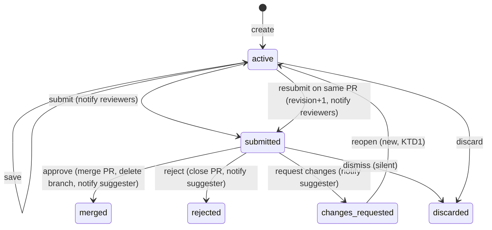

# Suggestion Review Chain - Plan

**Target repos:** ontokit-web (this repository) and ontokit-api. API paths below are prefixed `ontokit-api:`.

## Goal Capsule

- **Objective:** A contributor who is not an editor can propose an ontology change, a reviewer can accept, reject or send it back, and each person sees the outcome. A local regression run on a fresh stack proves the whole chain works at delivery.
- **Means:** Repair the lifecycle defects that break the chain today (KTD1–KTD4), then add a `suggestions` profile to the D06/D08/D09 isolated harness with real personas and API-tier refusal probes (KTD5–KTD7).
- **Authority:** Current user instructions and repository instructions govern. This plan closes B11's suggestion submit/review/merge remainder in `docs/plans/2026-09-20-0649-requirements-delivery-roadmap.md`. It does not re-prove B11's login, lifecycle or mode matrix (D06, D08, D09).
- **Execution:** Characterize before repairing. Codex workers author units; the orchestrator verifies, commits, reviews and ships under the standing authorization. API and web changes ship as paired PRs and deploy together to DEV.
- **Stop conditions:** A chain case that passes only because of a fixture shortcut, a refusal whose tier is not recorded, a baseline/lifecycle/mode inventory change other than the one planned case, or credential material in a receipt blocks acceptance. If Damien answers either open permission question against the provisional choice, revert only that unit's commit and its cases.

---

## Product Contract

### Summary

Make the suggestion workflow complete and truthful end to end: resuming a sent-back suggestion works, reviewers' decisions reach the suggester, rejected suggestions do not leave pull requests open, and nobody approves their own suggestion. Then prove the chain with real personas in a real browser.

### Problem Frame

Suggestions are how non-editors contribute. Today no end-to-end run proves them, and research found the chain breaks in two places a user would hit: a "changes requested" suggestion cannot be edited again (the API refuses every save), and the suggester never learns a decision because the API emits no decision notifications even though the web app renders them. Two permission seams also disagree between tiers (editor approval; signed-in non-members on public projects).

### Requirements

**Lifecycle**

- R1. A suggester can create a session, edit an existing class, save and submit; the submission reaches reviewers' triage queue and notifies them.
- R2. A reviewer who is an owner or admin can approve a submitted suggestion; the change merges into the default branch, the session branch is removed, and the new content reloads from the API.
- R3. A reviewer can request changes; the suggester can reopen that suggestion, edit and save it, and resubmit it on the same pull request with an incremented revision, which notifies reviewers again.
- R4. A reviewer can reject a submitted suggestion; its pull request is closed.
- R5. The suggester is notified of each approve, reject and request-changes decision. Dismiss stays silent.

**Refusals (API tier)**

- R6. A suggester cannot approve, reject or request changes (403); no one can approve their own suggestion (403).
- R7. Reviewer actions on a session that is not submitted, and saves on a session that is not active, are refused (400), never a server error.
- R8. A non-member cannot start a suggestion on a private project (403); an untrusted suggester cannot mint new entities (403).

**Provisional permissions**

- R9. An editor can approve a suggestion and the approval merges it (provisional, see Key Decisions).
- R10. A signed-in non-member can suggest on a public project at the untrusted tier, and the capabilities endpoint agrees with session creation (provisional, see Key Decisions).

**Anonymous path**

- R11. In optional mode an anonymous proposal on a public project can be submitted and appears in the owner's triage queue.

**Harness integrity**

- R12. The new profile runs on its own fresh stack with a fixed mandatory inventory, exact service set, sanitized receipts, complete cleanup and unchanged neighbours; baseline, lifecycle and the three D09 mode profiles keep their inventories except R11's one added optional-configured case.

### Key Decisions

- **Editors can approve suggestions (provisional).** Editors can already change the ontology directly, so accepting a suggestion adds no power. Filed as ask `ontokit-web-2026-09-27-2224-d10-suggestion-permissions`, qid `editor-approves-suggestions`; provisional mark recorded. Governs R9.
- **Signed-in non-members may suggest on public projects (provisional).** Anonymous visitors already can; refusing a signed-in person is backwards. Same ask, qid `nonmember-suggestions`. Governs R10.

### Scope Boundaries

- Hosted DEV persona acceptance (B02/B03) is a separate deliverable, now authorized and pending an admin token.
- Auto-submit (needs a controllable clock), auto-accept sweep, bulk review, beacon unload-flush, and the Redis-absent 503 path are excluded from browser proof; unit tests remain their evidence.
- Multi-tab refresh locking and B12 WebSocket behaviour are out of scope.

#### Deferred to Follow-Up Work

- Anonymous beacon wiring on the web (`lib/api/suggestions.ts` notes it is not called).
- A distinct `suggestion_resubmitted` notification type (resubmit reuses the submitted type with resubmission wording).

---

## Planning Contract

### Key Technical Decisions

- KTD1. **Reopen is an explicit transition.** Add `POST /projects/{id}/suggestions/sessions/{sid}/reopen` (session owner only) moving `changes-requested` → `active`, refreshing `last_activity` and returning a fresh beacon token; it is refused with 409 while the owner has another active session in the project, preserving the single-active-session invariant `create_session` relies on. Save keeps its single "active only" rule. An `active` session that already has a pull request is a reopened revision: `resubmit`, `submit` and the auto-submit sweep all send it through resubmission semantics (same pull request, re-run `_validate_submission_content` under the submit locks, revision+1, reviewer notification with resubmission wording) rather than the create/re-bind path. Discarding a reopened session closes its pull request. Chosen over allowing saves in `changes-requested`, which would split save's invariant. Governs R3.
- KTD2. **Decision notifications go to the suggester's account.** Approve, reject and request-changes each create one notification (`suggestion_approved`, `suggestion_rejected`, `suggestion_changes_requested`, the types `lib/api/notifications.ts` already declares) for the session's authenticated creator; anonymous sessions notify no one. Governs R5.
- KTD3. **Reject closes the pull request through a reviewer-authorized close seam.** The interactive `close_pull_request` allows only the author or owner/admin, and suggestion PRs are authored by the suggester, so the suggestion service closes the PR through an internal pull-request-service seam whose authority is `_can_review` (parallel to U2's merge seam); the direct close endpoint keeps its rule. Order: close the PR locally first (a refused close changes nothing), then set `rejected`, record the outcome and commit; a GitHub sync failure after the local close is non-fatal, matching the close service's "local transition is authoritative" rule. Governs R4.
- KTD4. **Self-approval is refused in `_approve_unchecked`**, the path both `approve` and `bulk_review` use, comparing the acting user with `session.user_id` before any merge; the reserved system auto-accept actor passes. Governs R6.
- KTD5. **A dedicated `suggestions` profile.** Required mode with identity services and personas `owner`, `suggester`, `editor` and `unrelated`. The owner is a bootstrapped non-superadmin persona, so role refusals are real. Memberships are added over HTTP by the owner (`POST /projects/{id}/members`) in the spec's setup against run-tagged fixtures, exercising the product path rather than seeding roles in the database. Governs R12.
- KTD6. **Probes record tier and status.** Reuse D09's `directProbe`/`recordProbe` evidence shape with a new `SUGGESTION_CASES` table in `scripts/e2e/evidence.mjs`, exact-count like the mode profiles. Governs R6–R8, R12.
- KTD7. **Poll, never sleep.** Notification assertions reload or `expect.poll` within a bounded budget because the bell polls every 30 s; merge assertions poll the API for the new label because the index refresh is queued after the commit. Governs R2, R5.
- KTD8. **Provisional decisions land as separate commits with standalone cases.** R9 (editor approval merges through the suggestion approve path without widening direct PR merge) and R10 (non-member create on public projects) each land alone, and each is proven by its own inventory case, so reverting one removes exactly that commit and that case while R1–R8 evidence stays intact.

### Assumptions

- The verification provider stays `none` in e2e and Redis runs, so untrusted-tier submit is gated only by the daily limiter, whose allowance a fresh stack does not exhaust.
- Anonymous session creation allows five per IP per hour; the profile makes exactly one anonymous create per stack.
- Minting requires the trusted tier, so suggestions edit an existing class label.
- API work starts from API `dev` after the in-flight cleanups (#58, #59) merge.

### Risks

- **Container-shared IP for anonymous limits.** Mitigation: one anonymous create per stack (R11 lives in optional-configured, which creates none today).
- **Merge deletes the session branch while the suggester's tab is open.** Mitigation: the suggester context asserts the terminal state and never saves after approval.
- **Provisional reversal.** Mitigation: KTD8.

### High-Level Technical Design

### Sources and Research

- `ontokit-api:ontokit/services/suggestion_service.py`: save requires `active` (~687, 704); submit and PR creation (~760–1112); approve (~1575–1673); reject/request-changes/dismiss (~1687–1789); resubmit (~1791–1823); role checks (~224–228, 1423–1427); capabilities (~1318–1325); anonymous submit (~2177–2229).
- `ontokit-api:ontokit/services/pull_request_service.py` merge role check (~1007–1026).
- Web: `lib/hooks/useSuggestionSession.ts` resume (~282–295); `app/projects/[id]/editor/page.tsx` submit/resubmit (~1351–1363); `app/projects/[id]/suggestions/review/page.tsx`; `components/layout/notification-bell.tsx`; `lib/hooks/useProject.ts` `derivePermissions`.
- Harness: `scripts/e2e/auth-modes.mjs` `PROFILE_REGISTRY`; `scripts/e2e/bootstrap-identity.mjs` personas; `scripts/e2e/evidence.mjs` inventories and `MODE_CASES`; `e2e/fixtures/run.ts`, `e2e/fixtures/auth.ts`, `e2e/fixtures/auth-mode.ts`.
- Pattern plan: `docs/plans/2026-09-25-2130-test-auth-mode-matrix-plan.md`; receipts `docs/releases/d09-auth-mode-matrix-readiness.md`.

---

## Implementation Units

### U1. Repair the suggestion lifecycle in the API

**Goal:** Reopen, resubmit on the same pull request, decision notifications, reject closing its pull request, and the self-approval guard work as R1–R8 describe.

**Requirements:** R3–R8; KTD1–KTD4. **Dependencies:** none.

**Files:** `ontokit-api:ontokit/services/suggestion_service.py`, `ontokit-api:ontokit/api/routes/suggestions.py`, `ontokit-api:ontokit/schemas/suggestion.py` (or the module holding suggestion schemas), `ontokit-api:tests/unit/test_suggestion_service.py`, `ontokit-api:tests/unit/test_suggestions_routes.py` (create if absent), `ontokit-api:tests/unit/test_auth_disabled_routes.py` (the new mutating route must be covered by the disabled-mode inventory).

**Approach:**

1. Characterize current behaviour first: save on `changes-requested` returns 400; resubmit on `active` returns 400; reject leaves the PR open; approve by the session creator succeeds; no decision notifications exist.
2. Add the reopen route and service method (KTD1).
3. Route every submission of a reopened revision (resubmit, submit, auto-submit sweep) through resubmission semantics (KTD1); close the PR when a reopened session is discarded.
4. Emit decision notifications (KTD2) and close the PR on reject through the reviewer-authorized seam (KTD3).
5. Refuse self-approval in `_approve_unchecked` (KTD4).

**Execution note:** Start with failing tests that pin each defect before changing the service.

**Test scenarios:**

- Reopen by the session owner moves `changes-requested` → `active` and returns a beacon token; reopen by anyone else is 403; reopen from any other status is 400; reopen while the owner has another active session is 409, and `create_session` still finds exactly one active session afterwards.
- Save after reopen succeeds and commits to the same branch.
- Resubmit after reopen keeps the pull request number, increments revision and creates one reviewer notification; resubmit with no pull request is 400.
- Content saved after reopen that fails a submission gate (e.g. invalid Turtle) is refused at resubmit.
- `submit` on a reopened session behaves as resubmit; a stale reopened trusted session swept by `auto_submit_stale_sessions` is resubmitted (revision+1, notification), not silently re-bound.
- Discarding a reopened session closes its pull request and deletes its branch.
- Approve, reject and request-changes each create exactly one notification for the authenticated creator; an anonymous session's decision creates none; dismiss creates none.
- Owner and editor rejections each close the session's pull request and notify the suggester; a refused local close leaves the session `submitted`; a direct PR close by a non-author editor is still refused.
- Approve by the session creator is 403 with no merge attempted; bulk-accepting one's own suggestion reports that item failed with no merge; approve by another reviewer succeeds.
- Reviewer actions on `active` or `merged` sessions are 400, not 500.

**Verification:** Targeted and full API unit suites pass; the disabled-mode write inventory covers the reopen route.

### U2. Let editors approve suggestions (provisional)

**Goal:** An editor's approval of a suggestion merges it (R9), without letting editors merge ordinary pull requests.

**Requirements:** R9; KTD8. **Dependencies:** U1.

**Files:** `ontokit-api:ontokit/services/suggestion_service.py`, `ontokit-api:ontokit/services/pull_request_service.py`, `ontokit-api:tests/unit/test_suggestion_service.py`, `ontokit-api:tests/unit/test_pull_request_service*.py`.

**Approach:** The suggestion approve path performs the merge through a reviewer-authorized merge seam that replaces only the owner/admin role check with `_can_review` and keeps enforcing `project.pr_approval_required`; the direct PR merge endpoint keeps its owner/admin rule. Land as one commit.

**Test scenarios:**

- An editor approves a submitted suggestion: merged, branch deleted, suggester notified.
- An editor calling the direct PR merge endpoint is still refused.
- An editor cannot approve their own suggestion (U1's guard still applies).
- With `pr_approval_required` ≥ 1 and no recorded approvals, an editor's suggestion approve is refused and nothing merges.

**Verification:** API unit tests pass; U6's editor case passes.

### U3. Let signed-in non-members suggest on public projects (provisional)

**Goal:** A signed-in non-member can create and submit a suggestion on a public project at the untrusted tier, and capabilities agree with creation (R10).

**Requirements:** R10, R8; KTD8. **Dependencies:** U1.

**Files:** `ontokit-api:ontokit/services/suggestion_service.py`, `ontokit-api:tests/unit/test_suggestion_service.py`, `ontokit-api:tests/unit/test_suggestion_trust_integration.py`.

**Approach:** Extend the suggest permission to authenticated non-members on public projects only, treated as untrusted with the existing limiter; private projects still require membership. Land as one commit.

**Test scenarios:**

- Non-member on a public project: capabilities `can_suggest` true, create succeeds, submit succeeds as untrusted.
- Non-member on a private project: capabilities false, create 403.
- Non-member cannot mint new entities (403).

**Verification:** API unit tests pass; U6's non-member case passes.

### U4. Make the web resume flow and decision notifications work

**Goal:** Resuming a sent-back suggestion reopens it, restores its change count and beacon token, lets the user save and resubmit; decision notifications route to the right page.

**Requirements:** R3, R5. **Dependencies:** U1 (API contract).

**Files:** `lib/api/suggestions.ts`, `lib/hooks/useSuggestionSession.ts`, `app/projects/[id]/editor/page.tsx`, `app/projects/[id]/suggestions/page.tsx`, `components/layout/notification-bell.tsx`, `__tests__/lib/hooks/useSuggestionSession.test.ts` (and its integration test), `__tests__/app/suggestion-history.integration.test.tsx`, `__tests__/components/layout/notification-bell*.test.tsx`.

**Approach:**

1. Add a `reopen` client method; resume calls it and adopts the returned status and beacon token.
2. Restore the resubmit control after new saves (change count from the session, not a hard-coded 0).
3. Confirm the bell's routing for the three decision types matches R5 and the history page's resume link.

**Execution note:** Pin the broken resume path with a failing hook test first.

**Test scenarios:**

- Resume on a `changes-requested` session calls reopen, then saves succeed and Resubmit appears after the first save.
- Resume on a session whose reopen fails shows an error and keeps the editor read-only.
- The beacon is enabled after resume (token present).
- Bell entries for approved/rejected/changes-requested link to the suggestion history page; submitted links to review.

**Verification:** Vitest, type-check and lint pass.

### U5. Add the `suggestions` harness profile

**Goal:** A fresh-stack profile with personas `owner`, `suggester`, `editor`, `unrelated`, an exact inventory, evidence table and receipts (R12).

**Requirements:** R12; KTD5, KTD6. **Dependencies:** none (specs in U6).

**Files:** `scripts/e2e/auth-modes.mjs`, `scripts/e2e/bootstrap-identity.mjs`, `scripts/e2e/evidence.mjs`, `scripts/e2e/evidence.test.mjs`, `scripts/e2e/auth-modes.test.mjs`, `e2e/fixtures/run.ts`, `e2e/fixtures/auth.ts`, `e2e/stack.setup.ts`, new `e2e/fixtures/suggestions.ts`, `playwright.config.ts`, `package.json` (script `test:e2e:suggestions`), `scripts/e2e/README.md`, `e2e/README.md`.

**Approach:** Mirror the D09 profile registration: registry entry, personas bootstrapped by identity, authenticated API contexts per persona, a membership helper that adds `suggester` and `editor` roles through the owner's API, `SUGGESTION_CASES` with exact counts, and FAIL_POINTS parity with other profiles. Baseline, lifecycle and mode inventories stay unchanged (R11's case is added in U6).

**Test scenarios:**

- Registry: the profile owns exactly its spec; baseline does not discover it.
- Evidence: a missing, duplicated, skipped or retried case, a probe with the wrong tier/status, or a report from another profile is rejected.
- Personas: the profile bootstraps exactly four users and none is a superadmin.

**Verification:** `test:e2e:profiles`, `test:e2e:evidence`, `test:e2e:identity` pass.

### U6. Prove the chain in a real browser

**Goal:** Browser cases and API probes prove R1–R11 on fresh stacks.

**Requirements:** R1–R11; KTD6, KTD7. **Dependencies:** U1–U5.

**Files:** new `e2e/browser/suggestions.spec.ts`, `e2e/browser/auth-mode-optional-configured.spec.ts` (one added case), `scripts/e2e/evidence.mjs` (optional-configured inventory +1), `scripts/e2e/seed-fixtures.mjs` and `scripts/e2e/seed-fixtures.test.mjs` (an owner-persona-owned public fixture for optional-configured, the one fixture change R12 permits), `e2e/fixtures/suggestions.ts`.

**Test scenarios (the mandatory inventory):**

1. Suggester edits an existing class label, saves and submits; the owner's triage tab lists it; probes: save on the submitted session 400, suggester approve 403. (R1, R6, R7)
2. Owner approves from triage; the label reloads on main from the API; the session branch is gone; the suggester's bell shows the approval. Probe: approve again on the merged session 400; creator self-approval 403 using an owner-created suggestion. (R2, R5, R6, R7)
3. The owner requests changes on a second suggestion; the suggester sees the notification, resumes, edits, saves and resubmits on the same pull request with revision 2; the owner approves the revision and it merges. (R3, R5)
4. The editor rejects a third suggestion; its pull request is closed and the suggester sees the rejection. (R4, R5)
5. Refusals: non-member create on a private fixture 403; untrusted mint 403. (R8)
6. Provisional R9 (standalone): the editor approves a fourth suggestion and it merges. (R9)
7. Provisional R10 (standalone): capabilities agree with create for a non-member on a public fixture, and that non-member submits successfully. (R10)
8. Optional-configured (added case): an anonymous visitor submits a proposal on the owner-persona-owned public fixture and the signed-in owner sees it in triage. (R11)

**Verification:** The `suggestions` profile passes twice on fresh stacks and optional-configured passes twice with its new count; baseline and lifecycle pass once each unchanged; every probe records endpoint, tier and status; cleanup and neighbours as in D09.

---

## Verification Contract

| Gate | Applies to | Signal |
|---|---|---|
| API `ruff check`, `ruff format --check` (changed files), `mypy --python-version 3.13`, full `pytest tests/` with local test Postgres/Redis | U1–U3 | Clean / pass |
| Web `npm run type-check`, `npm run lint`, `npx vitest run` | U4–U6 | Clean / pass |
| `npm run test:e2e:profiles`, `test:e2e:evidence`, `test:e2e:identity`, `test:e2e:ownership` (umask 022) | U5, U6 | Pass |
| `suggestions` profile, two fresh runs | U6 | Full inventory, identical source fingerprints, complete cleanup |
| optional-configured, two fresh runs | U6 | 6/6 each |
| baseline, lifecycle, optional-anonymous and disabled, one fresh run each | R12 | 21/21, 4/4, 2/2 and 3/3 unchanged |
| Neighbour Docker resources before/after | R12 | Unchanged |

Use an explicit API checkout at the reviewed API revision. Receipts claim local verification only.

---

## Definition of Done

- R1–R12 have explicit evidence; R9 and R10 are marked provisional until Damien answers the filed ask.
- API and web PRs are reviewed (ce-code-review, full depth where the gate selects it, with an independent cross-model pass), merged and deployed to DEV together; DEV smoke passes.
- `docs/releases/d10-suggestion-chain-readiness.md` and sanitized `docs/releases/d10-run-<id>.json` receipts are committed; the roadmap D10 row, B11 ledger and "Resume here" are updated (next: B12).
- Abandoned instrumentation and exploratory specs are removed from the diff.
